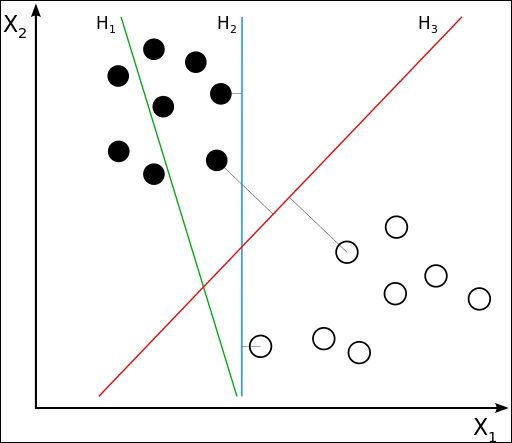
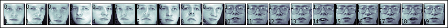
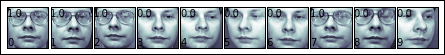
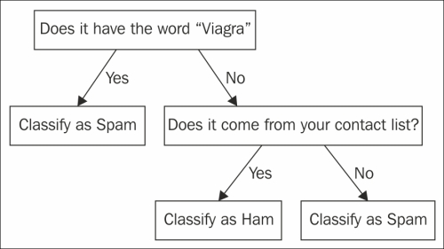
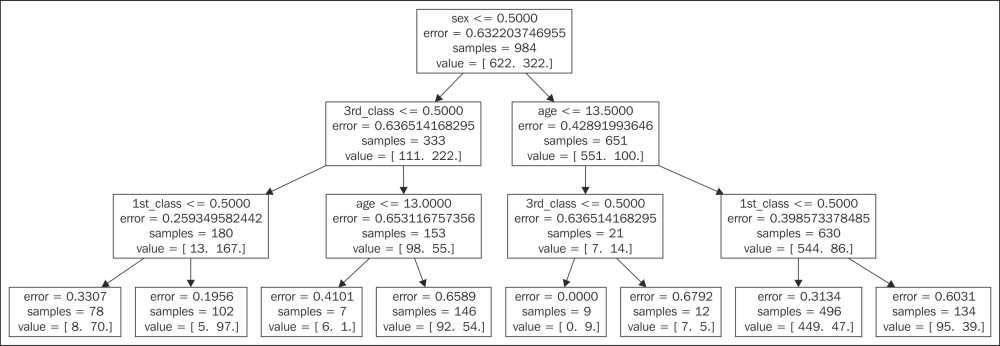
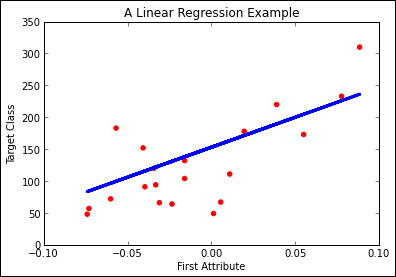

# 二、监督学习

在第一章“机器学习 - 温和介绍”中，我们概述了监督学习算法的一般概念。 我们有训练数据，其中每个实例都有一个输入（一组属性）和一个所需的输出（一个目标类）。然后我们使用这些数据来训练一个模型，该模型将新的未见实例预测为相同的目标类。

监督学习方法如今已成为各种学科的标准工具，从医学诊断到自然语言处理，图像识别，以及在**大型强子对撞机**（**LHC**）中搜索新粒子。在本章中，我们将通过使用 **scikit-learn** 中实现的许多算法中的一些，实现几种实际示例。本章不打算替换 scikit-learn 参考，而是介绍主要的监督学习技巧，并展示如何使用它们来解决实际问题。

## 支持向量机和图像识别

想象一下，数据集中的实例是多维空间中的点；我们可以假设我们的分类器构建的模型可以是表面，也可以使用线性代数术语，即将一个类的实例（点）与其余类别分开的超平面。**支持向量机**（**SVM**）是监督学习方法，试图以最佳方式获得这些超平面，通过选择那些通过不同类的实例之间最宽的间距。新实例将根据它们在表面的哪一侧，被归类为属于某个类别。

下图显示了具有两个特征（`X1`和`X2`）和两个类别（黑色和白色）的二维空间示例：



我们可以观察到，绿色超平面不会将两个类分开，从而产生一些分类错误。蓝色和红色超平面将两个类分开，没有错误。但是，红色表面以最大边距分隔两个类别；它是距离两个类别的最近实例的最远超平面。这种方法的主要优点是它可能会降低泛化误差，使得该模型能够抵抗过拟合，这实际上已在几个不同的分类任务中得到验证。

这种方法不仅可以在二维中构造超平面，而且可以推广到高维或无限维空间中。更重要的是，我们可以使用非线性曲面，例如多项式或径向基函数，通过使用所谓的核技巧，隐式地将输入映射到高维特征空间。

SVM 已成为许多任务中最先进的机器学习模型之一，在许多实际应用中具有出色的结果。SVM 的最大优势之一是它们在高维空间上工作时非常有效，即在具有许多要学习的特征的问题上。当数据稀疏时，它们也非常有效（考虑具有极少数实例的高维空间）。此外，它们在存储空间方面非常有效，因为学习空间中仅有一部分点用于表示决策表面。

提到一些缺点，SVM 模型在训练模型时可能非常耗费计算量，并且它们不会返回数字指标，表明它们对预测的置信度。但是，我们可以使用一些技术，如 K 折交叉验证来避免这种情况，代价是增加计算成本。

> 译者注：其实任何线性模型中，实例到决策超平面的距离都是（没有归一的）置信度。

我们将 SVM 应用于图像识别，这是一个具有非常大的维度空间的经典问题（图像的每个像素的值被视为一个特征）。我们将尝试做的是，给出一个人脸的图像，预测它可能属于列表中的哪些人（例如，在社交网络应用中使用这种方法来自动标记照片中的人物）。我们的学习集将是一组人脸的带标记图像，我们将尝试学习一种模型，可以预测没见过的实例的标签。第一种直观的方法是将图像像素用作学习算法的特征，因此像素值将是我们的学习属性，而个体的标签将是我们的目标类。

我们的数据集在 scikit-learn 中提供，所以让我们从导入开始并打印其描述。

```py
>>> import sklearn as sk
>>> import numpy as np
>>> import matplotlib.pyplot as plt
>>> from sklearn.datasets import fetch_olivetti_faces
>>> faces = fetch_olivetti_faces()
>>> print faces.DESCR
```

该数据集包含 40 个不同人脸的 400 张图像。拍摄的照片采用不同的光线条件和面部表情（包括睁眼/闭眼，微笑/不笑，戴眼镜/不戴眼镜）。有关数据集的其他信息，请参阅[这个页面](http://www.cl.cam.ac.uk/research/dtg/attarchive/facedatabase.html)。

查看`faces`对象的内容，我们得到以下属性：`images`，`data`和`target`。图像包含表示为`64 x 64`像素矩阵的 400 个图像。 `data`包含相同的 400 个图像，但是作为 4096 个像素的数组。正如预期的那样，`target`是一个具有目标类的数组，范围从 0 到 39。

```py
>>> print faces.keys()
['images', 'data', 'target', 'DESCR']
>>> print faces.images.shape
(400, 64, 64)
>>> print faces.data.shape
(400, 4096)
>>> print faces.target.shape
(400,)
```

正如我们在前一章中看到的那样，规范化数据非常重要。对于 SVM 的应用来说，获得良好结果也很重要。在我们的特定情况下，我们可以通过运行以下代码段，来验证我们的图像已经成为 0 到 1 之间的非常均匀范围内的值（像素值）：

```py
>>> print np.max(faces.data)
1.0
>>> print np.min(faces.data)
0.0
>>> print np.mean(faces.data)
0.547046432495
```

因此，我们没有规范化数据。在学习之前，让我们绘制一些人脸。我们将定义以下`helper`函数：

```py
>>> def print_faces(images, target, top_n):
>>>     # set up the figure size in inches
>>>     fig = plt.figure(figsize=(12, 12))
>>>     fig.subplots_adjust(left=0, right=1, bottom=0, top=1, 
        hspace=0.05, wspace=0.05)
>>>     for i in range(top_n):
>>>         # plot the images in a matrix of 20x20
>>>         p = fig.add_subplot(20, 20, i + 1, xticks=[], 
            yticks=[])
>>>         p.imshow(images[i], cmap=plt.cm.bone)
>>>         
>>>         # label the image with the target value
>>>         p.text(0, 14, str(target[i]))
>>>         p.text(0, 60, str(i))
```

如果我们打印前 20 张图像，我们可以看到两个人脸。

```py
>>> print_faces(faces.images, faces.target, 20)
```



### 训练支持向量机

要在 scikit-learn 中使用 SVM 来解决我们的任务，我们将从`sklearn.svm`模块导入`SVC`类：

```py
>>> from sklearn.svm import SVC
```

**支持向量分类器**（**SVC**）将用于分类。在本章的最后一节中，我们将使用 SVM 进行回归任务。

SVC 实现具有不同的重要参数；可能最相关的是`kernel`，它定义了在我们的分类器中使用的核函数（将核函数看作实例之间的不同相似性度量）。默认情况下，`SVC`类使用`rbf`核，这允许我们模拟非线性问题。首先，我们将使用最简单的核，即`linear`。

```py
>>> svc_1 = SVC(kernel='linear')
```

在继续之前，我们将把数据集分成训练和测试数据集。

```py
>>> from sklearn.cross_validation import train_test_split
>>> X_train, X_test, y_train, y_test = train_test_split(
    faces.data, faces.target, test_size=0.25, random_state=0)
```

我们将定义函数来评估 K 折交叉验证。

```py
>>> from sklearn.cross_validation import cross_val_score, KFold
>>> from scipy.stats import sem
>>>
>>> def evaluate_cross_validation(clf, X, y, K):
>>>     # create a k-fold croos validation iterator
>>>     cv = KFold(len(y), K, shuffle=True, random_state=0)
>>>     # by default the score used is the one returned by score 
     method of the estimator (accuracy)
>>>     scores = cross_val_score(clf, X, y, cv=cv)
>>>     print scores
>>>     print ("Mean score: {0:.3f} (+/-{1:.3f})").format(
        np.mean(scores), sem(scores))

>>> evaluate_cross_validation(svc_1, X_train, y_train, 5)
[ 0.93333333  0.91666667  0.95        0.95        0.91666667]
Mean score: 0.933 (+/-0.007)
```

交叉验证五次，获得了相当不错的结果（准确率为 0.933）。在几个步骤中，我们获得了人脸分类器。

我们还将定义一个函数来对训练集进行训练并评估测试集上的表现。

```py
>>> from sklearn import metrics
>>>
>>> def train_and_evaluate(clf, X_train, X_test, y_train, y_test):
>>>     
>>>     clf.fit(X_train, y_train)
>>>     
>>>     print "Accuracy on training set:"
>>>     print clf.score(X_train, y_train)
>>>     print "Accuracy on testing set:"
>>>     print clf.score(X_test, y_test)
>>>     
>>>     y_pred = clf.predict(X_test)
>>>     
>>>     print "Classification Report:"
>>>     print metrics.classification_report(y_test, y_pred)
>>>     print "Confusion Matrix:"
>>>     print metrics.confusion_matrix(y_test, y_pred)
```

如果我们训练和评估，分类器执行操作并几乎没有错误。

```py
>>> train_and_evaluate(svc_1, X_train, X_test, y_train, y_test)
Accuracy on training set:
1.0
Accuracy on testing set:
0.99
```

让我们多做一点，为什么不尝试将人脸分类为有眼镜和没有眼镜的人？我们这样做。

首先要做的是定义图像范围，它显示戴眼镜的人脸。以下列表显示了这些图像的索引：

```py
>>> # the index ranges of images of people with glasses
>>> glasses = [
   (10, 19), (30, 32), (37, 38), (50, 59), (63, 64),
   (69, 69), (120, 121), (124, 129), (130, 139), (160, 161),
   (164, 169), (180, 182), (185, 185), (189, 189), (190, 192),
   (194, 194), (196, 199), (260, 269), (270, 279), (300, 309),
   (330, 339), (358, 359), (360, 369)
]
```

您可以使用之前定义的`print_faces`函数检查这些值，绘制 400 个人脸并查看左下角的索引。

然后我们将定义一个函数，从这些片段返回一个新的目标数组，用`1`标记带有眼镜的人脸，而`0`用于没有眼镜的人脸（我们的新目标类）：

```py
>>> def create_target(segments):
>>>     # create a new y array of target size initialized with 
     zeros
>>>     y = np.zeros(faces.target.shape[0])
>>>     # put 1 in the specified segments
>>>     for (start, end) in segments:
>>>         y[start:end + 1] = 1
>>>     return y
>>> target_glasses = create_target(glasses)
```

所以我们必须再次进行训练/测试。

```py
>>> X_train, X_test, y_train, y_test = train_test_split(
        faces.data, target_glasses, test_size=0.25, random_state=0)
```

现在让我们创建一个新的 SVC 分类器，并使用以下命令使用新的目标向量训练它：

```py
>>> svc_2 = SVC(kernel='linear')
```

如果我们通过以下代码检查交叉验证的表现：

```py
>>> evaluate_cross_validation(svc_2, X_train, y_train, 5)
[ 0.98333333  0.98333333  0.93333333  0.96666667  0.96666667]
Mean score: 0.967 (+/-0.009)
```

如果我们在测试集上进行评估，我们使用交叉验证获得 0.967 的平均准确率。

```py
>>> train_and_evaluate(svc_2, X_train, X_test, y_train, y_test)
Accuracy on training set:
1.0
Accuracy on testing set:
0.99
Classification Report:
             precision    recall  f1-score   support

          0       1.00      0.99      0.99        67
          1       0.97      1.00      0.99        33

avg / total       0.99      0.99      0.99       100

Confusion Matrix:
[[66  1]
 [ 0 33]]
```

我们的分类器是否可能学会识别有眼镜和没有眼镜的人脸？我们怎么能确定这种情况没有发生呢？如果我们得到新的没见过的人脸，它会按预期工作吗？让我们分离同一个人的所有图像，有时戴眼镜，有时不戴眼镜。我们还将同一个人的所有图像，索引从 30 到 39 的图像分离，通过使用剩余的实例进行训练，并评估我们新的 10 个实例集。通过这个实验，我们将尝试排除一个事实，它记住人脸，而不是眼镜相关的特征。

```py
>>> X_test = faces.data[30:40]
>>> y_test = target_glasses[30:40]
>>> print y_test.shape[0]
10
>>> select = np.ones(target_glasses.shape[0])
>>> select[30:40] = 0
>>> X_train = faces.data[select == 1]
>>> y_train = target_glasses[select == 1]
>>> print y_train.shape[0]
390
>>> svc_3 = SVC(kernel='linear')
>>> train_and_evaluate(svc_3, X_train, X_test, y_train, y_test)
Accuracy on training set:
1.0
Accuracy on testing set:
0.9
Classification Report:
             precision    recall  f1-score   support

          0       0.83      1.00      0.91         5
          1       1.00      0.80      0.89         5

avg / total       0.92      0.90      0.90        10

Confusion Matrix:
[[5 0]
 [1 4]]
```

10 张图片中，只有一个错误，  仍然是非常好的结果，让我们看看哪一个被错误分类。首先，我们必须将数据从数组重新整形为`64 x 64`矩阵：

```py
>>> y_pred = svc_3.predict(X_test)
>>> eval_faces = [np.reshape(a, (64, 64)) for a in X_eval]
```

然后使用我们的`print_faces`函数绘图：

```py
>>> print_faces(eval_faces, y_pred, 10)
```



上图中的图像编号**8**带有眼镜，并且被分类为无眼镜。如果我们看一下这个例子，我们可以看到它与其他带眼镜的图像不同（眼镜的边框看不清楚，人闭着眼睛），这可能就是它误判的原因。

通过几行，我们创建了一个带有线性 SVM 模型的人脸分类器。通常我们在第一次试验中不会得到如此好的结果。在这些情况下（除了查看不同的特征），我们可以开始调整算法的超参数。在 SVM 的特定情况下，我们可以尝试不同的核函数；如果线性没有给出好的结果，我们可以尝试使用多项式或 RBF 核。此外，`C`和`gamma`参数可能会影响结果。有关参数及其值的说明，请参阅 scikit-learn 文档。

## 朴素贝叶斯和文本分类

**朴素贝叶斯**是一个简单但强大的分类器，它基于贝叶斯定理推导出的概率模型。基本上，它基于每个特征值概率，确定实例属于类的概率。朴素的术语来自于它假定每个特征独立于其余特征，即特征的值与另一个特征的值无关。

尽管非常简单，但它已在许多领域中使用，并且具有非常好的结果。独立性假设虽然是一种朴素而强烈的简化，但却是使该模型在实际应用中有用的特性之一。训练模型被简化为所涉及的条件概率的计算，它可以通过计算特征值和类值之间的相关性频率来估计。

朴素贝叶斯最成功的应用之一是**自然语言处理**（**NLP**）。NLP 是一个与机器学习密切相关的领域，因为它的许多问题可以被表述为分类任务。通常，NLP 问题有用文本文档的形式的大量标记数据。该数据可用作机器学习算法的训练数据集。

在本节中，我们将使用朴素贝叶斯进行文本分类；我们将有一组带有相应类别的文本文档，我们将训练一个朴素贝叶斯算法，来学习预测新的没见过的实例的类别。这项简单的任务有许多实际应用；可能是最知名和广泛使用的**垃圾邮件过滤**。在本节中，我们将尝试使用可以从 scikit-learn 中检索的数据集，对新闻组消息进行分类。该数据集包括来自 20 个不同主题的大约 19,000 条新闻组信息，从政治和宗教到体育和科学。

像往常一样，我们首先导入我们的`pylab`环境：

```py
>>> %pylab inline
```

我们的数据集可以通过从`sklearn.datasets`模块导入`fetch_20newgroups`函数来获得。我们必须指定我们是否要导入部分或全部实例（我们将导入所有实例）。

```py
>>> from sklearn.datasets import fetch_20newsgroups
>>> news = fetch_20newsgroups(subset='all')
```

如果我们查看数据集的属性，我们会发现我们有通常的那些：`DESCR`，`data`，`target`和`target_names`。现在的区别是数据包含文本内容列表，而不是`numpy`矩阵：

```py
>>> print type(news.data), type(news.target), type(news.target_names)
<type 'list'> <type 'numpy.ndarray'> <type 'list'>
>>> print news.target_names
['alt.atheism', 'comp.graphics', 'comp.os.ms-windows.misc', 'comp.sys.ibm.pc.hardware', 'comp.sys.mac.hardware', 'comp.windows.x', 'misc.forsale', 'rec.autos', 'rec.motorcycles', 'rec.sport.baseball', 'rec.sport.hockey', 'sci.crypt', 'sci.electronics', 'sci.med', 'sci.space', 'soc.religion.christian', 'talk.politics.guns', 'talk.politics.mideast', 'talk.politics.misc', 'talk.religion.misc']
>>> print len(news.data)
18846
>>> print len(news.target)
18846
```

如果您查看第一个实例，您将看到新闻组消息的内容，您可以获得相应的类别：

```py
>>> print news.data[0]
>>> print news.target[0], news.target_names[news.target[0]]
```

### 预处理数据

我们的机器学习算法只能用于数字数据，因此我们的下一步是将基于文本的数据集转换为数字数据集。目前我们只有一个特征，即消息的文本内容；我们需要一些函数，将文本转换为一组有意义的数字特征。直观地，我们可以尝试查看每个文本类别中使用的单词（或更确切地说，标记，包括数字或标点符号），并尝试表示每个类别中每个单词的频率分布。`sklearn.feature_extraction.text`模块具有一些有用的工具，可以从文本文档构建数字特征向量。

在开始转换之前，我们必须将数据划分为训练和测试集。加载的数据已经是随机顺序，因此我们只需要将数据分成例如 75% 用于训练，其余 25% 用于测试：

```py
>>> SPLIT_PERC = 0.75
>>> split_size = int(len(news.data)*SPLIT_PERC)
>>> X_train = news.data[:split_size]
>>> X_test = news.data[split_size:]
>>> y_train = news.target[:split_size]
>>> y_test = news.target[split_size:]
```

如果您查看`sklearn.feature_extraction.text`模块，您会发现三个不同的类可以将文本转换为数字特征：`CountVectorizer`，`HashingVectorizer`和`TfidfVectorizer`。它们之间的区别在于它们为获得数字特征而执行的计算。 `CountVectorizer`基本上从文本语料库中创建单词词典。然后，将每个实例转换为数字特征的向量，其中每个元素将是特定单词在文档中出现的次数的计数。

`HashingVectorizer`在内存中限制并维护字典，实现了将标记映射到特征索引的散列函数，然后计算`CountVectorizer`中的计数。

`TfidfVectorizer`的工作方式与`CountVectorizer`类似，但更高级的计算称为**单词频率逆文档频率**（**TF-IDF**）。这是用于测量在文档或语料库中单词的重要性的统计量。直观地说，它在当前文档中查找中更频繁的单词，与它们在整个文档集中的频率的比值。您可以将此视为一种方法，标准化结果并避免单词过于频繁而无法用于表征实例。

### 训练朴素贝叶斯分类器

我们将创建一个朴素贝叶斯分类器，它由一个特征向量化器和实际的贝叶斯分类器组成。我们将使用`sklearn.naive_bayes`模块中的`MultinomialNB`类。为了用向量化器组成分类器，正如我们在第一章中看到的那样，scikit-learn 在`sklearn.pipeline`模块中有一个非常有用的类，称为`Pipeline`，可以简化复合分类器的构建，该分类器由几个向量化器和分类器组成。

我们将通过将`MultinomialNB`与刚刚提到的三个不同的文本向量化器相结合来创建三个不同的分类器，并使用默认参数比较哪个分类器更好：

```py
>>> from sklearn.naive_bayes import MultinomialNB
>>> from sklearn.pipeline import Pipeline
>>> from sklearn.feature_extraction.text import TfidfVectorizer, >>> HashingVectorizer, CountVectorizer
>>>
>>> clf_1 = Pipeline([
>>>     ('vect', CountVectorizer()),
>>>     ('clf', MultinomialNB()),
>>> ])
>>> clf_2 = Pipeline([
>>>     ('vect', HashingVectorizer(non_negative=True)),
>>>     ('clf', MultinomialNB()),
>>> ])
>>> clf_3 = Pipeline([
>>>     ('vect', TfidfVectorizer()),
>>>     ('clf', MultinomialNB()),
>>> ])
```

我们将定义一个函数，该函数接受分类器，并对指定的`X`和`y`值执行`K`折交叉验证：

```py
>>> from sklearn.cross_validation import cross_val_score, KFold
>>> from scipy.stats import sem
>>>
>>> def evaluate_cross_validation(clf, X, y, K):
>>>     # create a k-fold croos validation iterator of k=5 folds
>>>     cv = KFold(len(y), K, shuffle=True, random_state=0)
>>>     # by default the score used is the one returned by score >>>     method of the estimator (accuracy)
>>>     scores = cross_val_score(clf, X, y, cv=cv)
>>>     print scores
>>>     print ("Mean score: {0:.3f} (+/-{1:.3f})").format(
>>>         np.mean(scores), sem(scores))
```

然后我们将使用每个分类器执行五折交叉验证。

```py
>>> clfs = [clf_1, clf_2, clf_3]
>>> for clf in clfs:
>>>     evaluate_cross_validation(clf, news.data, news.target, 5)
```

这些计算可能需要一些时间；结果如下：

```py
[ 0.86813478  0.86415495  0.86893075  0.85831786  0.8729443 ]
Mean score: 0.866 (+/-0.002)
[ 0.76359777  0.77182276  0.77765986  0.76147519  0.78222812]
Mean score: 0.771 (+/-0.004)
[ 0.86282834  0.85195012  0.86282834  0.85619528  0.87612732]
Mean score: 0.862 (+/-0.004)
```

正如您所见，`CountVectorizer`和`TfidfVectorizer`具有相似的表现，并且比`HashingVectorizer`好得多。

让我们继续`TfidfVectorizer`；我们可以通过尝试使用不同正则表达式将文本文档解析为标记来改进结果。

```py
>>> clf_4 = Pipeline([
>>>     ('vect', TfidfVectorizer(
>>>        token_pattern=ur"\b[a-z0-9_\-\.]+[a-z][a-z0->>> 9_\- 
>>>        \.]+\b",
>>>     )),
>>>     ('clf', MultinomialNB()),
>>> ])
```

默认正则表达式：`ur"\b\w\w+\b"`考虑字母数字字符和下划线。也许还考虑斜线和点可以改善分词，并开始将标记视为`Wi-Fi`和`site.com`。新的正则表达式可能是：`ur"\b[a-z0-9_\-\.]+[a-z][a-z0-9_\-\.]+\b"`。如果您对如何定义正则表达式有疑问，请参考 Python `re`模块文档。让我们尝试新的分类器：

```py
>>> evaluate_cross_validation(clf_4, news.data, news.target, 5)
[ 0.87078801  0.86309366  0.87689042  0.86574688  0.8795756 ]
Mean score: 0.871 (+/-0.003)
```

我们稍微改善了，从 0.86 到 0.87。

我们可以使用的另一个参数是`stop_words`：这个参数允许我们传递一个我们不想考虑的单词列表，例如过于频繁的单词，或者一些单词，我们不希望它们事先提供有关特定话题的信息。

我们将定义一个函数来加载文本文件中的停止词，如下所示：

```py
>>> def get_stop_words():
>>>     result = set()
>>>     for line in open('stopwords_en.txt', 'r').readlines():
>>>         result.add(line.strip())
>>>     return result
```

并使用以下新参数创建一个新的分类器：

```py
>>> clf_5 = Pipeline([
>>>     ('vect', TfidfVectorizer(
>>>                 stop_words= get_stop_words(),
>>>                 token_pattern=ur"\b[a-z0-9_\-\.]+[a-z][a-z0->>>                 9_\-\.]+\b",    
>>>     )),
>>>     ('clf', MultinomialNB()),
>>> ])

>>> evaluate_cross_validation(clf_5, news.data, news.target, 5)
[ 0.88989122  0.8837888   0.89042186  0.88325816  0.89655172]
Mean score: 0.889 (+/-0.002)
```

前面的代码显示了从 0.87 到 0.89 的另一个改进。

让我们保留这个向量化器并开始查看`MultinomialNB`参数。这个分类器几乎没有可调的参数；最重要的是`alpha`参数，它是一个平滑参数。我们将其设置为较低的值；不将`alpha`设置为`1.0`（默认值），我们将其设置为`0.01`：

```py
>>> clf_7 = Pipeline([
>>>     ('vect', TfidfVectorizer(
>>>                 stop_words=stop_words,
>>>                 token_pattern=ur"\b[a-z0-9_\-\.]+[a-z][a-z0->>>                 9_\-\.]+\b",         
>>>     )),
>>>     ('clf', MultinomialNB(alpha=0.01)),
>>> ])

>>> evaluate_cross_validation(clf_7, news.data, news.target, 5)
[ 0.92305651  0.91377023  0.92066861  0.91907668  0.92281167]
Mean score: 0.920 (+/-0.002)
```

结果从 0.89 升至 0.92，非常好。此时，我们可以通过使用不同的`alpha`值或对向量化器进行新的修改来继续进行试验。在第四章“高级功能”中，我们将向您展示尝试多种工具，尝试不同配置并保持最佳配置。但就目前而言，让我们再看看朴素贝叶斯模型。

### 评估表现

如果我们确定在我们的模型中做了足够的改进，我们就可以在测试集上评估其表现。

我们将定义一个辅助函数，该函数将在整个训练集中训练模型，并评估训练和测试集中的准确率。它还将打印分类报告（每个类的精确率和召回率）和相应的混淆矩阵：

```py
>>> from sklearn import metrics
>>>
>>> def train_and_evaluate(clf, X_train, X_test, y_train, y_test):
>>>     
>>>     clf.fit(X_train, y_train)
>>>     
>>>     print "Accuracy on training set:"
>>>     print clf.score(X_train, y_train)
>>>     print "Accuracy on testing set:"
>>>     print clf.score(X_test, y_test)    
>>>     y_pred = clf.predict(X_test)
>>>     
>>>     print "Classification Report:"
>>>     print metrics.classification_report(y_test, y_pred)
>>>     print "Confusion Matrix:"
>>>     print metrics.confusion_matrix(y_test, y_pred)
```

我们将评估我们的最佳分类器。

```py
>>> train_and_evaluate(clf_7, X_train, X_test, y_train, y_test)
Accuracy on training set:
0.99398613273
Accuracy on testing set:
0.913837011885
```

正如我们所看到的，我们获得了非常好的结果，正如我们所期望的那样，训练集的准确率比测试集中的准确率要好。在新的没见过的实例中，我们可能会预计，准确率约为 0.91。

如果我们查看向量化器，我们可以看到哪些标记已用于创建我们的字典：

```py
>>> print len(clf_7.named_steps['vect'].get_feature_names())
61236
```

这表明该词典由 61236 个标记组成。让我们打印特征名称。

```py
>>> clf_7.named_steps['vect'].get_feature_names()
```

下表显示了结果的摘录：

| 向量化器获得的特征 |
| --- |
| `u''sanctuaries''`，`u''sanctuary''`，`u''sanctum''`，`u''sand''`，`u''sandals''`，`u''sandbags''`，`u''sandberg''`，`u''sandblasting''`，`u''sanders''`， | `u''sanderson''`，`u''sandia''`，`u''sandiego.ncr.com''`，`u''sanding''`，`u''sandlak''`，`u''sandman.caltech.edu''`，`u''sandman.ece.clarkson.edu''`，`u''sandra''`，`u''sandro''`，`u''sands''` |

你可以看到一些词在语义上非常相似，例如`sand`和`sands`，`sanctuary`和`sanctuaries`。也许如果将复数和单数计算在同一个桶中，我们能最好地表示文档。这是一个非常常见的任务，可以使用词干提取来解决，词干提取是一种技术，关联具有相同词汇词根的两个词。

## 使用决策树解释泰坦尼克号假设

针对线性分类器和针对统计学习方法的一个常见观点是，难以解释构建的模型如何决定其对目标类的预测。如果你有一个高维度的 SVM，那么人类甚至无法想象超平面的构建方式。 朴素贝叶斯分类器会告诉你类似的事情：“这个类是最可能的，假设它来自与训练数据类似的分布，并做出一些假设”，一些不太有用的东西，例如，我们想知道为什么这个或那个邮件应该被视为垃圾邮件。

**决策树**是非常简单而强大的监督学习方法，它构建了一个决策树模型，用于进行预测。下图显示了一个非常简单的决策树，用于确定是否应将电子邮件视为垃圾邮件：



它首先询问电子邮件是否包含单词`Viagra`；如果答案是肯定的，它会将其归类为垃圾邮件；如果答案是否定的，它会进一步询问，它是否来自您的联系人列表中的某个人；这次，如果答案是肯定的，它会将电子邮件归类为正常；如果答案是否定的，则将其归类为垃圾邮件。该模型的主要优点是，人类可以轻松地理解和再现决策序列（特别是如果属性的数量很小），来预测新实例的目标类。这对于医疗诊断或信用审批等任务非常重要，我们希望在这些任务中显示决策的原因，而不是仅仅说，这是训练数据所表明的内容（根据定义，这是每种监督学习方法的作用） 。在本节中，我们将通过一个工作示例向您展示决策树的外观，它们是如何构建的，以及它们如何用于预测。

我们想要解决的问题是，确定泰坦尼克号的乘客是否会幸存下来，考虑到年龄，乘客等级和性别。我们将使用[泰坦尼克数据集](http://biostat.mc.vanderbilt.edu/wiki/pub/Main/DataSets/titanic.txt)。与本章中的其他所有示例一样，我们从数据集开始，包含泰坦尼克号乘客列表，以及表明他们是否幸存的特征。数据集中的每个实例都具有以下形式：

```py
"1","1st",1,"Allen, Miss Elisabeth Walton",29.0000,"Southampton","St Louis, MO","B-5","24160 L221","2","female"
```

属性列表为：`Ordinal`（序号），`Class`（等级），`Survived`（是否幸存，`0=no`，`1=yes`），`Name`（名称），`Age`（年龄），`Port of Embarkation`（登船港口），`Home/Destination`（家/目的地），`Room`（房间），`Ticket`（票号），`Boat`（救生艇）和`Sex`（性别）。我们将首先将数据集加载到`numpy`数组中。

```py
>>> import csv
>>> import numpy as np
>>> with open('data/titanic.csv', 'rb') as csvfile:
>>>     titanic_reader = csv.reader(csvfile, delimiter=',',
>>>     quotechar='"')
>>>     
>>>     # Header contains feature names
>>>     row = titanic_reader.next()
>>>     feature_names = np.array(row)
>>>    
>>>     # Load dataset, and target classes
>>>     titanic_X, titanic_y = [], []
>>>     for row in titanic_reader:  
>>>         titanic_X.append(row)
>>>         titanic_y.append(row[2]) # The target value is
            "survived"
>>>    
>>>     titanic_X = np.array(titanic_X)
>>>     titanic_y = np.array(titanic_y)
```

显示的代码使用 Python `csv`模块加载数据。

```py
>>> print feature_names
['row.names' 'pclass' 'survived' 'name' 'age' 'embarked' 'home.dest' 'room' 'ticket' 'boat' 'sex'] 

>>> print titanic_X[0], titanic_y[0]
['1' '1st' '1' 'Allen, Miss Elisabeth Walton' '29.0000' 'Southampton' 'St Louis, MO' 'B-5' '24160 L221' '2' 'female'] 1
```

### 预处理数据

我们必须采取的第一步是选择我们将用于学习的属性：

```py
>>> # we keep class, age and sex
>>> titanic_X = titanic_X[:, [1, 4, 10]]
>>> feature_names = feature_names[[1, 4, 10]]
```

基于其余属性对乘客生存没有影响的假设，我们选择了特征`1`，`4`和`10`，即等级，年龄和性别。在创建机器学习解决方案时，特征选择是非常重要的一步。如果算法没有良好的特征作为输入，它将没有足够的材料可供学习，结果将不会很好，即使我们拥有有史以来最佳设计的机器学习算法。

有时，根据我们对问题域的了解，以及我们计划使用的机器学习方法，手动进行特征选择。有时可以通过使用自动工具，来评估和选择最有希望的特征来完成特征选择。在第四章“高级功能”中，我们将讨论这些技术，但是现在，我们将手动选择我们的属性。非常具体的属性（例如我们案例中的`Name`）可能导致过拟合（考虑一个树，只询问名称是否为`X`，就判定她幸存下来）；每个值都有少量实例的属性，存在类似问题（它们可能对泛化无用）。我们将使用等级，年龄和性别，因为先验，我们期望它们影响乘客的生存。

现在，我们的学习数据如下：

```py
>>> print feature_names
['pclass' 'age' 'sex']

>>> print titanic_X[12],titanic_y[12]
['1st' 'NA' 'female'] 1
```

我们已经显示了实例编号`12`，因为它提出了一个需要解决的问题；其中一个特征（年龄）不可用。我们有**缺失值**，这是数据集的常见问题。在这种情况下，我们决定用训练数据中的平均年龄替换缺失值。我们可以采用不同的方法，例如，使用训练数据中最常见的值或中值。当我们替换缺失值时，我们必须理解我们正在修改原始问题，因此我们必须非常小心我们正在做的事情。这是机器学习的一般规则；当我们改变数据时，我们应该清楚地知道我们正在改变什么，以避免扭曲最终结果。

```py
>>> # We have missing values for age
>>> # Assign the mean value
>>> ages = titanic_X[:, 1]
>>> mean_age = np.mean(titanic_X[ages != 'NA', 
    1].astype(np.float))
>>> titanic_X[titanic_X[:, 1] == 'NA', 1] = mean_age
```

scikit-learn 中的决策树的实现，期望实值特征列表作为输入，并且模型的决策规则将具有以下形式：

```py
Feature <= value 
```

例如，`age <= 20.0`。我们的属性（年龄除外）是绝对的；也就是说，它们对应于从离散集合中获取的值，诸如男性和女性。因此，我们必须将分类数据转换为实际值。让我们从性别特征开始吧。scikit-learn 的预处理模块包括`LabelEncoder`类，其`fit`方法允许将类别集合转换为`0..K-1`的整数，其中`K`是集合中不同类的数量（对于性别，只有 0 或 1）：

```py
>>> # Encode sex 
>>> from sklearn.preprocessing import LabelEncoder
>>> enc = LabelEncoder()
>>> label_encoder = enc.fit(titanic_X[:, 2])
>>> print "Categorical classes:", label_encoder.classes_
Categorical classes: ['female' 'male']

>>> integer_classes = 
    label_encoder.transform(label_encoder.classes_)
>>> print "Integer classes:", integer_classes
Integer classes: [0 1]

>>> t = label_encoder.transform(titanic_X[:, 2])
>>> titanic_X[:, 2] = t 
```

最后两行将的性别属性值转换为`0-1`值，并修改训练集。

```py
print feature_names
['pclass' 'age' 'sex']

print titanic_X[12], titanic_y[12] 
['1st' '31.1941810427' '0'] 1
```

我们仍然有一个分类属性：`class`。我们可以使用相同的方法并将其三个类转换为 0, 1 和 2。这种转换隐式地引入了类之间的顺序，这在我们的问题中不是问题。但是，我们将尝试一种不假设顺序的更通用的方法，并且它被广泛用于将类别转换为实值属性。我们将引入一个额外的编码器，并将类属性转换为三个新的二元特征，每个特征表明实例是否属于特征值`(1)`或`(0)`。这被称为**单热编码**，它是一种非常常见的方式，为基于实值的方法管理类别属性：

```py
>>> from sklearn.preprocessing import OneHotEncoder
>>>
>>> enc = LabelEncoder()
>>> label_encoder = enc.fit(titanic_X[:, 0])
>>> print "Categorical classes:", label_encoder.classes_
Categorical classes: ['1st' '2nd' '3rd']

>>> integer_classes = 
    label_encoder.transform(label_encoder.classes_).reshape(3, 1)
>>> print "Integer classes:", integer_classes
Integer classes: [[0] [1] [2]]

>>> enc = OneHotEncoder()
>>> one_hot_encoder = enc.fit(integer_classes)
>>> # First, convert classes to 0-(N-1) integers using 
    label_encoder
>>> num_of_rows = titanic_X.shape[0]
>>> t = label_encoder.transform(titanic_X[:,  
    0]).reshape(num_of_rows, 1)
>>> # Second, create a sparse matrix with three columns, each one 
    indicating if the instance belongs to the class
>>> new_features = one_hot_encoder.transform(t)
>>> # Add the new features to titanix_X
>>> titanic_X = np.concatenate([titanic_X, 
    new_features.toarray()], axis = 1)
>>> #Eliminate converted columns
>>> titanic_X = np.delete(titanic_X, [0], 1)
>>> # Update feature names
>>> feature_names = ['age', 'sex', 'first_class', 'second_class', 
    'third_class']
>>> # Convert to numerical values
>>> titanic_X = titanic_X.astype(float)
>>> titanic_y = titanic_y.astype(float)
```

前面的代码首先将类转换为整数，然后使用`OneHotEncoder`类创建添加到特征数组的三个新属性。它最终从训练数据中消除了原始的`class`特征。

```py
>>> print feature_names
['age', 'sex', 'first_class', 'second_class', 'third_class']

>>> print titanic_X[0], titanic_y[0] 
[29\.   0\.   1\.   0\.   0.] 1.0
```

我们现在有一个适合 scikit-learn 的学习集来学习决策树。此外，标准化不是决策树的问题，因为特征的相对大小不会影响分类器表现。

预处理步骤在机器学习方法中通常被低估，但我们在这个非常简单的例子中看到，可能需要一些时间，来使数据看起来像我们的方法的预期。它在整个机器学习过程中也非常重要；如果我们在此步骤中失败（例如，错误地编码属性或选择错误的特征），则无论我们用于学习的方法有多好，以下步骤都将失败。

### 训练决策树分类器

现在到了有趣的部分；让我们根据训练数据建立一个决策树。像往常一样，我们将首先分开训练和测试数据。

```py
>>> from sklearn.cross_validation import train_test_split
>>> X_train, X_test, y_train, y_test = train_test_split(titanic_X, >>> titanic_y, test_size=0.25, random_state=33)
```

现在，我们可以创建一个新的`DecisionTreeClassifier`并使用分类器的`fit`方法来完成学习工作。

```py
>>> from sklearn import tree
>>> clf = tree.DecisionTreeClassifier(criterion='entropy', 
    max_depth=3,min_samples_leaf=5)
>>> clf = clf.fit(X_train,y_train)
```

`DecisionTreeClassifier`接受控制其行为的几个超参数（像大多数学习方法一样）。在这种情况下，我们使用**信息增益**（**IG**）标准来分割学习数据，告诉方法最多构建三层的树，并且如果节点包括至少五个训练实例，则接受该节点作为叶子。为了解释这一点并展示决策树如何工作，让我们可视化建立的模型。以下代码假定您使用的是 IPython，并且您的 Python 发行版包含`pydot`模块。此外，它允许从树生成 **Graphviz** 代码，并假设安装了 Graphviz 本身。有关 Graphviz 的更多信息，请参阅[这里](http://www.graphviz.org/)。

```py
>>> import pydot,StringIO
>>> dot_data = StringIO.StringIO() 
>>> tree.export_graphviz(clf, out_file=dot_data, 
    feature_names=['age','sex','1st_class','2nd_class'
    '3rd_class']) 
>>> graph = pydot.graph_from_dot_data(dot_data.getvalue()) 
>>> graph.write_png('titanic.png') 
>>> from IPython.core.display import Image 
>>> Image(filename='titanic.png')
```



我们构建的决策树代表了一系列基于训练数据的决策。要对实例进行分类，我们应该回答每个节点的问题。例如，在我们的根节点，问题是：性别`<= 0.5`嘛？（我们在谈论一个女人吗？）如果答案是肯定的，则转到树中的左子节点；否则访问右子节点。你一直在回答问题（她是在三等舱吗？她是在头等舱吗？她是 13 岁以下吗？），直到你到达了叶子。当你在那里时，预测具有大多数实例的目标类（即，如果答案被给予先前的问题）。在我们的案例中，如果她是二等舱的女性，那么答案就是 1（即她活了下来），依此类推。

您可能会问，我们的方法如何决定每一步在中应该询问哪些问题。答案是**信息增益**（ **IG**，或基尼指数，这是一种 scikit-learn 使用的类似的无序度量）。如果我们回答这个问题，IG 会测量我们失去多少熵，或者在回答问题之后，我们确定了多少熵。**熵**是分组中的无序度量，如果我们熵为零，则意味着所有值都相同（在我们的例子中，所有实例的目标类都是相同的） ，当每个类的实例数相等时达到最大值（在我们的例子中，当一半实例对应幸存者而另一半对应于非幸存者）。在每个节点，我们有一定数量的实例（从整个数据集开始），我们测量它的熵。当我们仅考虑那些实例时，其中问题答案为是或否，即当回答问题后的熵减少时，我们的方法将选择产生更均匀分区（具有最低熵）的问题。

### 解释决策树

正如您在树中看到的那样，在决策树生长过程的开始处，您在训练集中有 984 个实例，其中 662 个对应于类`0`（死亡），以及 322 个对应于类`1`（幸存者）。该初始组的熵测量值约为 0.632。从我们可以提出的问题清单中，产生最大信息增益的问题是：她是女性吗？（记住，女性类别被编码为`0`）。如果答案是肯定的，那么熵几乎是相同的，但如果答案是否定的，那么它就会大大减少（死亡者比例远远大于幸存者比例）。从这个意义上讲，女性的问题似乎是最好的问题。之后，该过程继续，在每个节点中，仅仅使用这些实例，它们的特征值与节点路径中的问题对应。

如果你看一下树，我们在每个节点中都有：问题，初始香农熵，我们正在考虑的实例数，以及它们相对于目标类的分布。在每个步骤中，实例的数量减少到对该节点提出的问题回答是（左分支）和否（右分支）的实例数。该过程一直持续到满足某个停止标准（在我们的例子中，直到我们有第四级节点，或者所考虑的样本数低于 5）。

在预测时，我们选取一个实例并开始遍历树，根据实例特征回答问题，直到我们到达一个叶子。此时，我们将查看训练集中每个类的实例数，并选择大多数实例所属的类。

例如，考虑确定一个 10 岁女孩是否能够幸存下来的问题。第一个问题的答案（她是女性吗？）是肯定的，所以我们走树的左分支。在接下来的两个问题中答案是否（她来自三等舱？）和是（她来自头等舱？），所以我们分别走左右分支。这时，我们已经到了一片叶子。在训练集中，我们有 102 人具有这些属性，其中 97 人是幸存者。所以，我们的答案是幸存。

一般来说，我们找到了合理的结果：死亡人数较多的群体（496 人中有 449 人）对应二等或三等舱的成年男子，因为您可以在树上查看。大多数来自头等舱的女孩幸存下来。让我们在训练集中测量方法的准确率（我们将首先定义辅助函数来测量分类器的表现）：

```py
>>> from sklearn import metrics
>>> def measure_performance(X,y,clf, show_accuracy=True, 
    show_classification_report=True, show_confussion_matrix=True):
>>>     y_pred=clf.predict(X)   
>>>     if show_accuracy:
>>>         print "Accuracy:{0:.3f}".format(
>>>             metrics.accuracy_score(y, y_pred)
>>>         ),"\n"
>>>
>>>     if show_classification_report:
>>>         print "Classification report"
>>>         print metrics.classification_report(y,y_pred),"\n"
>>>         
>>>     if show_confussion_matrix:
>>>       print "Confussion matrix"
>>>       print metrics.confusion_matrix(y,y_pred),"\n"

>>> measure_performance(X_train,y_train,clf, 
    show_classification=False, show_confusion_matrix=False))
Accuracy:0.838
```

我们的树在训练集上的准确率为 0.838。但请记住，这不是一个好的指标。对于决策树尤其如此，因为该方法非常容易过拟合。由于我们没有将评估集分开，因此我们应该应用交叉验证。对于这个例子，我们将使用交叉验证的极端情况，命名为**留一交叉验证**。对于训练样本中的每个实例，我们对样本的其余部分进行训练，并仅在留出的实例上评估构建的模型。在执行与训练实例一样多的分类之后，我们将准确率简单地计算为，我们的方法正确预测剩余实例的类的次数的比例，并且发现它稍低（如我们所预期的），而不是训练集上的重新计算的准确率。

```py
>>> from sklearn.cross_validation import cross_val_score, LeaveOneOut
>>> from scipy.stats import sem
>>>
>>> def loo_cv(X_train, y_train,clf):
>>>     # Perform Leave-One-Out cross validation
>>>     # We are preforming 1313 classifications!
>>>     loo = LeaveOneOut(X_train[:].shape[0])
>>>     scores = np.zeros(X_train[:].shape[0])
>>>     for train_index, test_index in loo:
>>>         X_train_cv, X_test_cv = X_train[train_index], 
            X_train[test_index]
>>>         y_train_cv, y_test_cv = y_train[train_index], 
            y_train[test_index]
>>>         clf = clf.fit(X_train_cv,y_train_cv)
>>>         y_pred = clf.predict(X_test_cv)    
>>>         scores[test_index] = metrics.accuracy_score(
   y_test_cv.astype(int), y_pred.astype(int))
>>>     print ("Mean score: {0:.3f} (+/-{1:.3f})").format(np.mean(scores), sem(scores))

   >>> loo_cv(X_train, y_train,clf)
Mean score: 0.837 (+/-0.012)
```

留一法交叉验证的主要优点是它允许训练的数据几乎与我们可用的数据一样多，因此它特别适用于数据稀缺的情况。其主要问题是，就计算时间而言，为每个实例训练不同的分类器可能是非常昂贵的。

这里还有一个很大的问题：我们如何为方法实例化选择超参数？这个问题是一般的  ，它被称为模型选择， 我们将在第四章“高级功能”中更详细地解决它。

### 随机森林 - 随机决策

对决策树的一个常见批评是，一旦在回答问题后对训练集进行划分，就不可能重新考虑这个决策。例如，如果我们将男性和女性分开，那么每个后续问题都只涉及男性或女性，而且该方法不能考虑其他类型的问题（例如，年龄不到一岁，不论性别如何）。**随机森林**尝试在每个步骤中引入一定程度的随机化，创建备选树并将它们组合来获得最终预测。考虑几个回答相同问题的分类器的这些类型的算法，被称为**集成方法**。在泰坦尼克号任务中，可能很难看到这个问题，因为我们的特征很少，但考虑到特征数​​量达到数千的情况。

随机森林建议基于训练实例的子集（带放回随机选择）来构建决策树，但是在特征集的每个集合中使用少量随机的特征。这种树生长过程重复几次，产生一组分类器。在预测时，给定一个实例的每个成型的树都会像决策树一样预测其目标类。大多数树所投票的类（即树中预测最多的类）是集成分类器所建议的类。

在 scikit-learn 中，使用随机森林，并按如下方式拟合训练数据，就像从 `sklearn.ensemble`模块导入`RandomForestClassifier`一样简单：

```py
>>> from sklearn.ensemble import RandomForestClassifier
>>> clf = RandomForestClassifier(n_estimators=10, random_state=33)
>>> clf = clf.fit(X_train, y_train)
>>> loo_cv(X_train, y_train, clf)
Mean score: 0.817 (+/-0.012)
```

我们发现随机森林的结果实际上更糟。毕竟，引入随机化似乎不是一个好主意，因为特征数量太少。然而，对于具有更多特征的更大数据集，随机森林是一种非常快速，简单且流行的方法，可以提高准确率，保留决策树的优点。实际上，在下一节中，我们将使用它们进行回归。

### 评估表现

每个监督学习任务的最后一步应该是，在以前没见过的数据上评估我们的最佳分类器，来了解其预测表现。请记住，此步骤不应用于在竞争方法或参数中进行选择。这将是作弊（因为我们再次有过拟合新数据的风险）。因此，在我们的例子中，让我们测量决策树对测试数据的表现。

```py
>>> clf_dt = tree.DecisionTreeClassifier(criterion='entropy', max_depth=3, min_samples_leaf=5)
>>> clf_dt.fit(X_train, y_train)
>>> measure_performance(X_test, y_test, clf_dt)
Accuracy:0.793 
Classification report
             precision    recall  f1-score   support

          0       0.77      0.96      0.85       202
          1       0.88      0.54      0.67       127

avg / total       0.81      0.79      0.78       329
Confusion matrix
[[193   9]
 [ 59  68]]
```

从分类结果和混淆矩阵来看，似乎我们的方法倾向于预测太多人没有幸存。

## 通过回归预测房价

在我们见过的每个例子中，我们已经在第一章“机器学习 - 温和介绍”见过了，我们称之为分类问题：我们打算预测的输出属于离散集。但通常，我们希望预测从真实直线中提取的值。学习模式仍然相同：将模型拟合到训练数据，并评估新数据来获得实数值的目标类。我们的分类器不是从列表中选择一个类，而应该成为一个实值函数，对于每个（可能是无限的）学习特征组合返回一个实数。我们可以将回归视为具有无限目标类别的分类。

根据我们选择作为目标的类，可以将许多问题建模为分类和回归任务。例如，预测血糖水平是回归任务，而预测某人是否患有糖尿病则是分类任务。

在第一个图的示例中，我们使用一条线来拟合学习数据（由唯一属性和目标值组成），也就是说，我们已经执行了线性回归。如果我们想要预测新实例的值，  我们得到它们的实值属性，并通过将推断直线投影到第二个轴来获得预测值。



在本节中，我们将使用相同的数据集比较几种回归方法。我们将尝试根据房屋属性预测价格。作为数据集，我们将使用波士顿房价数据集，其中包括 506 个实例，通过 14 个特征代表波士顿郊区的房屋，[其中一个（自住房屋的中位数）是目标类](http://archive.ics.uci.edu/ml/datasets/Housing)。此数据集中的每个属性都是实值。

数据集包含在标准的 scikit-learn 分布中，所以让我们先加载它：

```py
>>> import numpy as np
>>> import matplotlib.pyplot as plt
>>> from sklearn.datasets import load_boston
>>> boston = load_boston()
>>> print boston.data.shape
(506, 13)
>>> print boston.feature_names
['CRIM' 'ZN' 'INDUS' 'CHAS' 'NOX' 'RM' 'AGE' 'DIS' 'RAD' 'TAX' 'PTRATIO' 'B' 'LSTAT' 'MEDV']
>>> print np.max(boston.target), np.min(boston.target),  
    np.mean(boston.target)
50.0 5.0 22.5328063241
```

您应该尝试打印`boston.DESCR`来了解每个特征的含义。这是一个非常良好的习惯：机器学习不仅仅是数字运算，理解我们面临的问题至关重要，尤其是选择最佳学习模型。

像往常一样，我们开始将学习集分割为训练和测试数据集，并对数据进行规范化：

```py
>>> from sklearn.cross_validation import train_test_split
>>> X_train, X_test, y_train, y_test = 
    train_test_split(boston.data, boston.target, test_size=0.25, 
    random_state=33)
>>> from sklearn.preprocessing import StandardScaler
>>> scalerX = StandardScaler().fit(X_train)
>>> scalery = StandardScaler().fit(y_train)
>>> X_train = scalerX.transform(X_train)
>>> y_train = scalery.transform(y_train)
>>> X_test = scalerX.transform(X_test)
>>> y_test = scalery.transform(y_test)
```

在查看我们的最佳分类器之前，让我们定义如何比较我们的结果。由于我们希望保留用于评估最终分类器表现的测试集，因此我们应该找到一种方法来选择最佳模型，同时避免过拟合。我们已经知道答案：交叉验证。回归带来了另一个问题：我们应该如何评估我们的结果？准确率不是一个好主意，因为我们预测真实值，我们几乎不可能准确预测最终值。有几种措施可以使用（您可以查看`sklearn.metrics`模块下的函数列表）。最常见的是 **R 方**评分，或**测定系数**，用于测量模型解释的结果的变动比例，以及它是 scikit-learn 中回归方法的默认得分函数。当模型完美地预测所有测试目标值时，该分数达到最大值`1`。使用这一度量，我们将建立一个函数，训练模型并使用五重交叉验证和测定系数来评估其表现。

```py
>>> from sklearn.cross_validation import *
>>> def train_and_evaluate(clf, X_train, y_train):
>>>     clf.fit(X_train, y_train)
>>>     print "Coefficient of determination on training 
        set:",clf.score(X_train, y_train)
>>>     # create a k-fold cross validation iterator of k=5 folds
>>>     cv = KFold(X_train.shape[0], 5, shuffle=True, 
        random_state=33)
>>>     scores = cross_val_score(clf, X_train, y_train, cv=cv)
>>>     print "Average coefficient of determination using 5-fold 
        crossvalidation:",np.mean(scores)
```

### 第一个尝试 - 线性模型

线性模型试图回答的问题，是由我们的学习特征（包括目标值）创建的 14 维空间中的超平面，它位于特征附近。在找到该超平面之后，预测简化为计算新点在超平面上的投影，并返回目标值坐标。想想我们在第一章“机器学习 - 温和介绍”中的第一个例子，我们想找到一条分隔训练实例的线。我们可以使用该线来预测第二个学习属性对于第一个学习属性的函数，即线性回归。

但是，我们的意思是什么呢？通常的度量是最小二乘：计算每个实例与超平面的距离，将其平方（以避免符号问题），并对它们求和。总和较小的超平面是最小二乘估计（超平面在二维中只是一条线）。

由于我们不知道我们的数据如何拟合（很难打印 14 维散点图！），我们将从称为`SGDRegressor`的线性模型开始，该模型试图最小化平方损失。

```py
>>> from sklearn import linear_model
>>> clf_sgd = linear_model.SGDRegressor(loss='squared_loss', 
    penalty=None,  random_state=42)
>>> train_and_evaluate(clf_sgd,X_train,y_train)
Coefficient of determination on training set: 0.743303511411
Average coefficient of determination using 5-fold crossvalidation: 0.715166411086
```

我们可以打印我们的方法所计算的超平面系数，如下所示：

```py
>>> print clf_sgd.coef_
[-0.07641527  0.06963738 -0.05935062  0.10878438 -0.06356188  0.37260998 -0.02912886 -0.20180631  0.08463607 -0.05534634 
-0.19521922 0.0653966 -0.36990842]
```

我们在调用方法时可能注意到了`penalty=None`参数。引入线性回归方法的惩罚参数以避免过拟合。它的原理是，惩罚系数太大的超平面，并寻找超平面，其中每个特征对预测值或多或少贡献相同。该参数通常是 L2 范数（系数的平方和）或 L1 范数（即系数的绝对值之和）。如果我们引入 L2 惩罚，让我们看看我们的模型是如何工作的。

```py
>>> clf_sgd1 = linear_model.SGDRegressor(loss='squared_loss', 
    penalty='l2',  random_state=42)
>>> train_and_evaluate(clf_sgd1, X_train, y_train) 
Coefficient of determination on training set: 0.743300616394
Average coefficient of determination using 5-fold crossvalidation: 0.715166962417
```

在这种情况下，我们没有获得改善。

### 第二次尝试 - 支持向量机回归

可以使用 SVM 的回归版本来找到超平面。

```py
>>> from sklearn import svm
>>> clf_svr = svm.SVR(kernel='linear')
>>> train_and_evaluate(clf_svr, X_train, y_train)
Coefficient of determination on training set: 0.71886923342
Average coefficient of determination using 5-fold crossvalidation: 0.694983285734
```

在这里，我们没有任何改善。然而，SVM 的一个主要优点是（使用我们称之为核技巧）我们可以使用非线性函数，例如，多项式函数来近似我们的数据。

```py
>>> clf_svr_poly = svm.SVR(kernel='poly')
>>> train_and_evaluate(clf_svr_poly, X_train, y_train)
Coefficient of determination on training set: 0.904109273301
Average coefficient of determination using 5-fold cross validation: 0.754993478137
```

现在，我们的结果在测定系数方面要好六个点。我们实际上可以通过使用**径向基函数**（**RBF**）核来改善这一点。

```py
>>> clf_svr_rbf = svm.SVR(kernel='rbf')
>>> train_and_evaluate(clf_svr_rbf, X_train, y_train)
Coefficient of determination on training set: 0.900132065979
Average coefficient of determination using 5-fold cross validation: 0.821626135903
```

RBF 核已经在几个问题中使用并且已经证明是非常有效的。实际上，RBF 是 scikit-learn 中 SVM 方法使用的默认内核。

### 第三次尝试 - 回到随机森林

我们可以尝试非常不同的方法，使用**随机森林**进行回归。我们以前使用随机森林进行分类。当用于回归时，树生长过程完全相同，但是在预测时，当我们到达叶子时，我们返回代表性的实际值而不是多数类，例如，目标值的平均值。

实际上，我们将使用 **Extra 树**，在`sklearn.ensemble`模块中的`ExtraTreesRegressor`类中实现。该方法增加了额外的随机化水平。它不仅为每个树选择不同的随机特征子集，而且还为每个决策随机选择阈值。

```py
>>> from sklearn import ensemble
>>> clf_et=ensemble.ExtraTreesRegressor(n_estimators=10, 
    compute_importances=True, random_state=42)
>>> train_and_evaluate(clf_et, X_train, y_train)
Coefficient of determination on training set: 1.0
Average coefficient of determination using 5-fold cross validation: 0.852511952001
```

首先要注意的是，我们不仅完全消除了欠拟合（实现了对训练值的完美预测），而且在使用交叉验证时也提高了三个点的表现。Extra 树的一个有趣特性是，它们允许计算每个特征对于回归任务的重要性。让我们按如下方式计算这个重要性：

```py
>>> print sort(zip(clf_et.feature_importances_, 
    boston.feature_names), axis=0)

[['0.000231085384564' 'AGE']
 ['0.000909210196652' 'B']
 ['0.00162702734638' 'CHAS']
 ['0.00292361527201' 'CRIM']
 ['0.00472492264278' 'DIS']
 ['0.00489022243822' 'INDUS']
 ['0.0067481487587' 'LSTAT']
 ['0.00852353178943' 'NOX']
 ['0.00873406149286' 'PTRATIO']
 ['0.0366902590312' 'RAD']
 ['0.0982265323415' 'RM']
 ['0.385904111089' 'TAX']
 ['0.439867272217' 'ZN']]
```

我们可以看到`ZN`（占地面积超过 25,000 平方英尺的住宅用地比例）和`TAX`（全价值物业税率）是我们最终决策中最具影响力的特征。

### 评价

像往常一样，让我们在测试集上​​评估我们的最佳方法的表现（之前，我们稍微修改了`measure_performance`函数来显示测定系数）：

```py
>>> from sklearn import metrics
>>> def measure_performance(X, y, clf, show_accuracy=True, 
    show_classification_report=True, show_confusion_matrix=True, 
    show_r2_score=False):
>>>     y_pred = clf.predict(X)   
>>>     if show_accuracy:
>>>         print "Accuracy:{0:.3f}".format(
>>>            metrics.accuracy_score(y, y_pred)
>>>         ),"\n"
>>>
>>>     if show_classification_report:
>>>         print "Classification report"
>>>         print metrics.classification_report(y, y_pred),"\n"
>>>         
>>>     if show_confusion_matrix:
>>>         print "Confusion matrix"
>>>         print metrics.confusion_matrix(y, y_pred),"\n"
>>>         
>>>     if show_r2_score:
>>>         print "Coefficient of determination:{0:.3f}".format(
>>>            metrics.r2_score(y, y_pred)
>>>         ),"\n"

>>> measure_performance(X_test, y_test, clf_et, 
    show_accuracy=False, show_classification_report=False,
    show_confusion_matrix=False, show_r2_score=True)
Coefficient of determination:0.793
```

一旦我们选择了最佳方法并使用了所有可用数据，我们就可以在整个训练集上训练我们的最佳方法，但我们无法测量其在未来数据上的表现，仅仅因为我们没有更多可用数据。

## 总结

在本章中，我们回顾了一些最常见的监督学习方法和一些实际应用。我们了解到，监督方法要求实例同时具有输入特征和目标类。在下一章中，我们将回顾无监督的学习方法，这些方法不需要学习目标类别。这些方法对于理解数据的结构非常有用，并且在使用监督学习模型之前也可以用作前一步骤。
