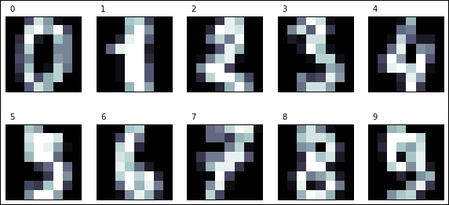
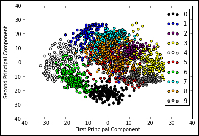
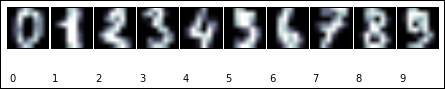
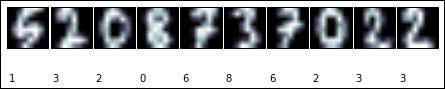
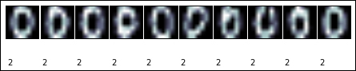
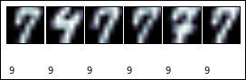
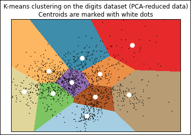
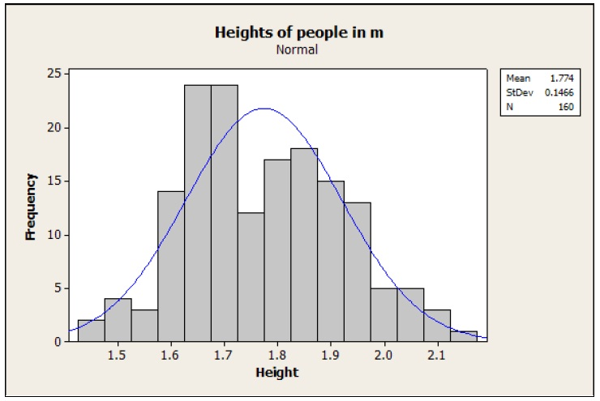

# 三、无监督学习

如今，人们常常断言，互联网上有大量的数据可供学习。如果您阅读前面的章节，您将会看到，即使监督学习方法在根据现有数据预测未来值方面非常强大，但它们有一个明显的缺点：数据必需是整理好的；一个人应该为一定数量的实例标注目标类。这种劳动通常由专家完成（如果你想将正确的物种分配给鸢尾花，你至少需要知道这些花的人）；它可能需要一些时间和金钱才能完成，而且通常不会产生大量数据（至少不会与互联网相比！）。每个监督学习的构建都必须基于尽可能多的整理好的数据。

但是，如果没有带标签的数据，我们可以做一些事情。考虑您想要在婚礼中分配桌席的情况。你想把人聚在一起，把同样的人放在同一张桌子上（新娘的家人，新郎的朋友等等）。任何组织婚礼的人都知道这个任务并不容易，它在机器学习术语中称为**聚类**。有时人们属于不止一个群体，你必须决定不相似的人是否可以在一起（例如，新娘和新郎的父母）。聚类涉及为寻找一些分组，其中相同组中所有元素相似，但不同组中的对象不相似。每个聚类方法必须回答的问题是相似的。另一个关键问题是如何分离簇。当面对二维数据时，人类非常擅长寻找簇（考虑仅根据街道的存在来识别地图中的城市），但随着维度的增长，事情变得更加困难。

在本章中，我们将提出用于聚类的几个近似：**K 均值**（可能是最流行的聚类方法），**亲和传播**，**均值漂移**，基于模型的方法称为**高斯混合模型**。

无监督学习的另一个例子是**降维**。假设我们用大量属性表示学习实例，并希望将它们可视化来识别它们的主要模式。当特征数量超过三个时，这非常困难，原因很简单，因为我们无法想象三个以上的维度。降维方法提供了一种方式，在较低维度空间中表示高维数据集的数据点，保持（至少部分地）其图案结构。这些方法也有助于选择我们应该用于学习的模型。例如，使用线性超平面近似某些监督学习任务是否是合理的，或者我们应该求助于更复杂的模型。

## 主成分分析

**主成分分析**（**PCA**）是正交线性变换，将一组可能相关的变量转化为一组尽可能不相关的新变量。新变量位于新的坐标系中，使得通过在第一坐标中投影数据来获得最大方差，通过在第二坐标中投影来获得第二大方差，等等。这些新坐标称为主成分；我们拥有与原始维度数量一样多的主成分，但我们只保留那些具有高方差的成分。添加到主成分集的每个新主成分必须符合它应与其余主成分正交（即不相关）的限制。 PCA 可以看作是揭示数据内部结构的一种方法;它为用户提供原始对象的低维阴影。如果我们只保留第一个主成分，则数据维度会降低，因此更容易可视化数据结构。例如，如果我们仅保留第一和第二成分，我们可以使用二维散点图检查数据。因此，在构建预测模型之前，PCA 可用于探索性数据分析。

对于我们的学习方法，PCA 将允许我们将高维空间缩小为低维空间，同时保留尽可能多的方差。它是一种无监督的方法，因为它不需要目标类来执行其转换；它只依赖于学习属性的值。这对于两个主要目的非常有用：

*   **可视化**：例如，将高维空间投影到二维，将允许我们将我们的实例映射到二维图形。使用这些图形来可视化，我们可以获得有关实例分布的见解，并查看不同类的可分离实例。在本节中，我们将使用 PCA 转换和可视化数据集。
*   **特征选择**：由于 PCA 可以将实例从高维度转换为低维度，我们可以使用此方法来解决维度诅咒。我们可以使用 PCA 转换实例，然后在新特征空间中应用学习算法，而不是学习原始特征集。

作为一个工作示例，在本节中，我们将使用在`8x8`像素矩阵中的手写数字数据集，因此每个实例最初将包含 64 个属性。我们如何可视化实例的分布？对于人类来说，同时可视化 64 个维度是不可能的，因此我们将使用 PCA 将实例缩减为二维，并在二维散点图中可视化其分布。

我们首先加载我们的数据集（数字数据集是 scikit-learn 提供的示例数据集之一）。

```py
>>> from sklearn.datasets import load_digits
>>> digits = load_digits()
>>> X_digits, y_digits = digits.data, digits.target
```

如果我们打印数字键，我们得到：

```py
>>> print digits.keys()
['images', 'data', 'target_names', 'DESCR', 'target']
```

我们将使用`data`矩阵，每个矩阵是 64 个属性的实例，并且`target`向量具有相应的数字编号。

让我们打印数字来看看实例的显示方式：

```py
>>> import matplotlib.pyplot as plt
>>> n_row, n_col = 2, 5
>>>
>>> def print_digits(images, y, max_n=10):
>>>     # set up the figure size in inches
>>>     fig = plt.figure(figsize=(2\. * n_col, 2.26 * n_row))
>>>     i=0
>>>     while i < max_n and i < images.shape[0]:
>>>         p = fig.add_subplot(n_row, n_col, i + 1, xticks=[],
              yticks=[])
>>>         p.imshow(images[i], cmap=plt.cm.bone, 
              interpolation='nearest')
>>>         # label the image with the target value
>>>         p.text(0, -1, str(y[i]))
>>>         i = i + 1
>>>
>>> print_digits(digits.images, digits.target, max_n=10)
```

这些实例可以在下图中看到：



定义一个函数，该函数将使用从 PCA 变换获得的二维点绘制散点图。我们的数据点也将根据其类别进行着色。回想一下，目标类不会用于执行转换；我们想调查 PCA 之后的分布是否揭示了不同类别的分布，以及它们是否明显可分。我们将为每个数字使用十种不同的颜色，从`0`到`9`。

```py
>>> def plot_pca_scatter():
>>>     colors = ['black', 'blue', 'purple', 'yellow', 'white', 
          'red', 'lime', 'cyan', 'orange', 'gray']
>>>     for i in xrange(len(colors)):
>>>         px = X_pca[:, 0][y_digits == i]
>>>         py = X_pca[:, 1][y_digits == i]
>>>         plt.scatter(px, py, c=colors[i])
>>>     plt.legend(digits.target_names)
>>>     plt.xlabel('First Principal Component')
>>>     plt.ylabel('Second Principal Component')
```

此时，我们已准备好执行 PCA 转换。在 scikit-learn 中，PCA 被实现为变换器对象，通过`fit`方法学习 n 个成分，并且可以用于新数据来将其投影到这些成分上。在 scikit-learn 中，我们有各种实现不同类型的 PCA 分解的类，例如`PCA`，`ProbabilisticPCA`，`RandomizedPCA`和`KernelPCA`。如果您需要每个的详细说明，请参阅 scikit-learn 文档。在我们的例子中，我们将使用`sklearn.decomposition`模块中的`PCA`类。我们可以更改的最重要的参数是`n_components`，它允许我们指定获取的实例的特征数量。在我们的例子中，我们想要将 64 个特征的实例转换为仅两个特征的实例，因此我们将`n_components`设置为`2`。

现在我们执行转换并绘制结果：

```py
>>> from sklearn.decomposition import PCA
>>> estimator = PCA(n_components=10)
>>> X_pca = estimator.fit_transform(X_digits)
>>> plot_pca_scatter()
```

绘制的结果可以在下图中看到：



从上图中，我们可以得出一些有趣的结论：

*   我们可以一眼就看到对应于 10 位数的 10 个不同类别。我们看到，对于大多数类，它们的实例根据其目标类清楚地分组，并且簇相对不同。例外是对应于数字 **5** 的类，其中实例非常稀疏地分布在平面上与其他类重叠。
*   在另一个极端，对应于数字 **0** 的类是最可分离的簇。直观地说，这个类可能是最容易与其他类分开的类；也就是说，如果我们训练一个分类器，它应该是具有最佳评估数字的类。
*   此外，对于拓扑分布，我们可以预测相邻类对应于相似的数字，这意味着它们将是最难分离的。例如，对应于数字 **9** 和 **3** 的簇看起来是相邻的（由于它们的图形表示是相似的，因此可以预计），因此，从 **3** 分离 **9** 可能比从 **3** 分离 **4** 更难，它位于左侧，远离这些簇。

请注意，我们很快就得到了一个图表，让我们对这个问题有了很多了解。可以在训练监督分类器之前使用该技术，以便更好地理解我们可能遇到的困难。有了这些知识，我们可以规划更好的特征预处理，特征选择，选择更合适的学习模型等等。正如我们之前提到的，它也可以用于执行降维以避免维度诅咒，并且还可以允许我们使用更简单的学习方法，例如线性模型。

为了完成，让我们看一下主成分转换。我们将通过访问`components`属性从估计器中获取主成分。它的每个成分都是一个矩阵，用于将向量从原始空间变换到变换空间。在我们之前绘制的散点图中，我们只考虑了前两个成分。

我们将绘制与原始数据（数字）相同形状的所有成分。

```py
>>> def print_pca_components(images, n_col, n_row):
>>>     plt.figure(figsize=(2\. * n_col, 2.26 * n_row))
>>>     for i, comp in enumerate(images):
>>>         plt.subplot(n_row, n_col, i + 1)
>>>         plt.imshow(comp.reshape((8, 8)), 
              interpolation='nearest')
>>>         plt.text(0, -1, str(i + 1) + '-component')
>>>         plt.xticks(())
>>>         plt.yticks(())
```

成分可以看作如下：


通过查看上图中的前两个成分，我们可以得出一些有趣的观察结果：

*   如果查看第二个成分，可以看到它主要突出显示图像的中心区域。受此模式影响最大的`digit`类是 **0**，因为其中心区域为空。通过查看我们之前的散点图来证实这种直觉。如果查看对应于数字 **0** 的簇，您可以看到它是第二个成分具有较低值的簇。
*   关于第一个成分，正如我们在散点图中看到的那样，可用于分离对应于数字 **4**（极左，低值）和 **3** （极右，高值）数字的簇。如果你看到第一个成分图，它证实了这个观察结果。您可以看到区域非常相似于数字 **3** ，而在数字 **4** 的特征区域中，它也拥有颜色。

如果我们使用其他成分，我们将获得更多的特性，以便能够将类在新的维度分离。例如，我们可以添加第三个主成分并尝试在三维散点图中绘制我们的实例。

在下一节中，我们将展示另一组无监督方法：聚类算法。与降维算法一样，聚类不需要知道目标类。但是，聚类方法会尝试对实例进行分组，寻找那些（以某种方式）相似的实例。但是，我们将看到聚类方法（如监督方法）可以使用 PCA 更好地可视化和分析其结果。

## 使用 K 均值聚类手写数字

**K 均值**是最受欢迎的聚类算法，因为它非常简单易行，并且在不同的任务中有着良好的表现。它属于一类聚类算法，它同时将数据点分成称为**簇**的不同组。另一组方法，我们将在本书中不涉及，是层次聚类算法。它们找到一组初始的簇并将它们分开或合并来形成新的簇。

K 均值背后的主要思想是找到数据点的簇，使得簇均值与簇中每个点之间的平方距离最小。请注意，此方法假定您事先知道应将数据分成多少个簇。

我们将在本节中展示 K 均值原理的启发性示例，即手写数字聚类的问题。因此，让我们首先将我们的数据集导入我们的 Python 环境并显示手写数字的外观（我们将使用我们在上一节中介绍的`print_digits` 函数的略有不同版本）。

```py
>>> import numpy as np
>>> import matplotlib.pyplot as plt
>>>
>>> from sklearn.datasets import load_digits
>>> from sklearn.preprocessing import scale
>>> digits = load_digits()
>>> data = scale(digits.data)
>>>
>>> def print_digits(images,y,max_n=10):
>>>     # set up the figure size in inches
>>>     fig = plt.figure(figsize=(12, 12))
>>>     fig.subplots_adjust(left=0, right=1, bottom=0, top=1,
          hspace=0.05, wspace=0.05)
>>>     i = 0
>>>     while i <max_n and i <images.shape[0]:
>>>         # plot the images in a matrix of 20x20
>>>         p = fig.add_subplot(20, 20, i + 1, xticks=[],
              yticks=[])
>>>         p.imshow(images[i], cmap=plt.cm.bone)
>>>         # label the image with the target value
>>>         p.text(0, 14, str(y[i]))
>>>         i = i + 1
>>>
>>> print_digits(digits.images, digits.target, max_n=10)
```

打印数字可以在下面看到：



您可以看到数据集包含与目标类关联的数字，但由于我们是聚类，因此在评估之前不会使用此信息。我们将看看我们是否可以根据它们的相似性对数字进行分组，并形成我们可以预期的十个簇。

像往常一样，我们必须将训练和测试集分开如下：

```py
>>> from sklearn.cross_validation import train_test_split
>>> X_train, X_test, y_train, y_test, images_train, 
   images_test = train_test_split(
        data, digits.target, digits.images,  test_size=0.25, 
          random_state=42)
>>>
>>> n_samples, n_features = X_train.shape
>>> n_digits = len(np.unique(y_train))
>>> labels = y_train
```

一旦我们完成了训练集，我们就可以聚类实例了。 K 均值算法的作用是：

1.  随机选择一组初始簇中心。
2.  找到每个数据点最近的簇中心，并分配最接近该簇的数据点。
3.  计算新的簇中心，平均簇中数据点的值，并重复，直到簇成员稳定为止；也就是说，直到一些数据点在每次迭代后改变它们的簇。

由于 K 均值的原理，它可以收敛到局部最小值，初始的簇中心集可以极大地影响找到的簇。减轻这种情况的常用方法是尝试几个初始集，并选择具有最小值的集合，用于簇中心（或惯性）之间的平方距离之和。 scikit-learn 中 K 均值的实现已经做到了这一点（`n-init`参数允许我们确定，算法将尝试多少不同的质心配置）。它还允许我们指定初始质心将被充分分离，从而产生更好的结果。让我们看看它如何在我们的数据集上运行。

```py
>>> from sklearn import cluster
>>> clf = Cluster.KMeans(init='kmeans++',
    n_clusters=10, random_state=42)
>>> clf.fit(X_train)
```

该过程类似于用于监督学习的过程，但请注意`fit`方法仅将训练数据作为参数。还要注意我们需要指定簇的数量。我们可以感知这个数字，因为我们知道簇所代表的数字。

如果我们打印分类器的`labels_`属性的值，我们将获得与每个训练实例关联的簇编号列表。

```py
>>> print_digits(images_train, clf.labels_, max_n=10)
```

可以在下图中看到该簇：



请注意，簇编号与实数值无关。请记住，我们没有使用类别进行分类；我们只按相似度对图像进行分组。让我们看看我们的算法在测试数据上的表现。

为了预测训练数据的簇，我们使用分类器的常用`predict`方法。

```py
>>> y_pred=clf.predict(X_test)
```

让我们看看簇的外观：

```py
>>> def print_cluster(images, y_pred, cluster_number):
>>>      images = images[y_pred==cluster_number]
>>>      y_pred = y_pred[y_pred==cluster_number]
>>>      print_digits(images, y_pred,max_n=10)
>>> for i in range(10):
>>>      print_cluster(images_test, y_pred, i)
```

此代码显示每个簇的十个图像。有些簇非常清晰，如下图所示：



簇 **2** 对应于零。簇 **7**怎么样？


它不是那么清楚。似乎簇 **7** 类似于绘制的数字，看起来类似于数字九。簇 **9** 只有六个实例，如下图所示：



在阅读之后必须清楚，我们不在这里对图像进行分类（如前一章中的面部示例）。我们分为十组（您可以尝试更改簇的数量，看看会发生什么）。

我们如何评估我们的表现？精确率和所有这些东西都不起作用，因为我们没有可比较的目标类。为了评估，我们需要知道“真正的”簇，无论这意味着什么。我们可以假设，对于我们的示例，每个簇包括特定数字的每个绘图，并且仅包括该数字。知道这一点，我们可以计算我们的簇分布和预期之间的**修正兰德系数**。兰德系数是一个类似的准确率量度，但它考虑到两个分布中的类可以有不同名称的事实。也就是说，如果我们更改类名，索引不会改变。调整兰德系数试图消除偶然发生的结果的巧合。当两个集合中具有完全相同的簇时，兰德系数等于 1，而当没有簇共享数据点时，它等于零。

```py
>>> from sklearn import metrics
>>> print "Adjusted rand score: 
    {:.2}".format(metrics.adjusted_rand_score(y_test, y_pred))
Adjusted rand score:0.57
```

我们还可以打印混淆矩阵如下：

```py
>>> print metrics.confusion_matrix(y_test, y_pred)
[[ 0  0 43  0  0  0  0  0  0  0]
 [20  0  0  7  0  0  0 10  0  0]
 [ 5  0  0 31  0  0  0  1  1  0]
 [ 1  0  0  1  0  1  4  0 39  0]
 [ 1 50  0  0  0  0  1  2  0  1]
 [ 1  0  0  0  1 41  0  0 16  0]
 [ 0  0  1  0 44  0  0  0  0  0]
 [ 0  0  0  0  0  1 34  1  0  5]
 [21  0  0  0  0  3  1  2 11  0]
 [ 0  0  0  0  0  2  3  3 40  0]]
```

观察到测试集中的类`0`（与编号`0`图形一致）完全分配给簇编号`2`。我们在编号`8`时遇到问题：21 个实例被分配了类`0`，而 11 个被分配了类`8`，依此类推。毕竟不太好。

如果我们想以图形方式显示 K 均值簇的外观，我们必须在二维平面上绘制它们。我们在上一节中已经学会了如何做到这一点：主成分分析（PCA）。让我们构造点的**网格**（降维后），计算它们簇，并绘制它们。

#### 注意

这个例子取自[非常好的 scikit-learn 教程](http://scikit-learn.org/)。

```py
>>> from sklearn import decomposition
>>> pca = decomposition.PCA(n_components=2).fit(X_train)
>>> reduced_X_train = pca.transform(X_train)
>>> # Step size of the mesh. 
>>> h = .01     
>>> # point in the mesh [x_min, m_max]x[y_min, y_max].
>>> x_min, x_max = reduced_X_train[:, 0].min() + 1, 
    reduced_X_train[:, 0].max() - 1
>>> y_min, y_max = reduced_X_train[:, 1].min() + 1, 
    reduced_X_train[:, 1].max() - 1
>>> xx, yy = np.meshgrid(np.arange(x_min, x_max, h), 
    np.arange(y_min, y_max, h))
>>> kmeans = cluster.KMeans(init='k-means++', n_clusters=n_digits, 
    n_init=10)
>>> kmeans.fit(reduced_X_train)
>>> Z = kmeans.predict(np.c_[xx.ravel(), yy.ravel()])
>>> # Put the result into a color plot
>>> Z = Z.reshape(xx.shape)
>>> plt.figure(1)
>>> plt.clf()
>>> plt.imshow(Z, interpolation='nearest', 
    extent=(xx.min(), xx.max(), yy.min(), 
    yy.max()), cmap=plt.cm.Paired, aspect='auto', origin='lower')
>>> plt.plot(reduced_X_train[:, 0], reduced_X_train[:, 1], 'k.', 
    markersize=2)
>>> # Plot the centroids as a white X
>>> centroids = kmeans.cluster_centers_
>>> plt.scatter(centroids[:, 0], centroids[:, 1],marker='.', 
    s=169, linewidths=3, color='w', zorder=10)
>>> plt.title('K-means clustering on the digits dataset (PCA 
    reduced data)\nCentroids are marked with white dots')
>>> plt.xlim(x_min, x_max)
>>> plt.ylim(y_min, y_max)
>>> plt.xticks(())
>>> plt.yticks(())
>>> plt.show()
```

数字数据集上的 K 均值聚类可以在下图中看到：



## 备选聚类方法

scikit-learn 工具包包括几种聚类算法，所有聚类算法的方法和参数都与 K 均值中类似。在本节中，我们将简要回顾其中的一些，提出它们的一些优点。

聚类的典型问题是，大多数方法需要我们想要识别的簇数量。解决此问题的一般方法是尝试不同的数字，并让专家使用诸如降维的技术来可视化簇，来确定哪种方法最有效。还有一些方法试图自动计算簇的数量。 Scikit-learn 包括**亲和传播**的实现，该方法查找最具代表性的实例，并使用它们来描述簇。让我们看看它如何用于我们的数字学习问题：

```py
>>> aff = cluster.AffinityPropagation()
>>> aff.fit(X_train)
>>> print aff.cluster_centers_indices_.shape
(112,)
```

亲和传播在我们的训练集中检测到`112`个簇。毕竟，似乎他们之间的数字并不那么相似。您可以尝试使用`print_digits`函数绘制簇，并查看哪些簇似乎已分组。 `cluster_centers_indices_`属性表示亲和传播所发现的内容，作为每个簇的代表元素。

另一种计算簇数的方法是`MeanShift()`。如果我们将它应用于我们的示例，它会检测`18`个簇，如下所示：

```py
>>> ms = cluster.MeanShift()
>>> ms.fit(X_train)
>>> print ms.cluster_centers_.shape
(18, 64)
```

在这种情况下，`cluster_centers_`属性显示超平面的簇质心。前两个示例显示结果可能会有很大差异，具体取决于我们使用的方法。使用哪种聚类方法取决于我们要解决的问题以及我们想要查找的簇的类型。

请注意，对于最后两种方法，我们不能使用兰德分数来评估表现，因为我们没有要与之比较的规范簇集。但是，我们可以测量簇的惯性，因为惯性是从每个数据点到质心的距离之和；我们期待接近零的数字。不幸的是，除了 K 均值方法之外，scikit-learn 中目前还没有办法测量惯性。

最后，我们将使用**高斯混合模型**（**GMM**）尝试概率聚类方法。从程序的角度来看，我们将看到它与 k 均值非常相似，但它们的理论原理却截然不同。 GMM 假设数据来自具有未知参数的有限高斯分布的混合。高斯分布是用于模拟许多现象的，统计学中众所周知的分布函数。它具有以平均值为中心的钟形函数；您之前可能已经看过以下图形：



如果我们选取足够大的男性样本并测量他们的身高，直方图（每个特定身高的男性比例）可能是高斯分布，平均值为 1.774 米，标准差为 0.1466 米。平均值表示最可能的值（与曲线的峰值一致），标准差表示结果的展开程度；也就是说，他们距离平均值有多远。如果我们测量两个特定高度之间曲线下面的区域（即它的积分），我们可以知道，给定一个人，他的高度两个值之间的概率是多少，如果分布是正确的。现在，我们为什么要期望这种分布而不是另一种呢？实际上，并非每个现象具有相同的分布，但是一个称为**大数定律**的定理告诉我们，每当我们重复实验很多次（例如，测量某人的身高），结果的分布可以用高斯近似。

通常，我们有一个多变量（即涉及多个特征）分布，但这个想法是一样的。超平面中的点大多数情况会更接近平均值；当我们离开均值时，在簇中找到一个点的概率会降低。该概率降低都少取决于第二个参数，即方差。正如我们所说，GMM 假设每个簇具有多元正态分布，方法目标是找到 k 个质心（使用称为**期望最大化**（**EM**）的算法，从训练数据估计均值和方差），并将每个点分配给最接近的平均值。让我们看看它如何在我们的例子中起作用。

```py
>>> from sklearn import mixture
>>> gm = mixture.GMM(n_components=n_digits, 
    covariance_type='tied', random_state=42)
>>> gm.fit(X_train)
GMM(covariance_type='tied', init_params='wmc', min_covar=0.001,n_components=10, n_init=1, n_iter=100, params='wmc',random_state=42,thresh=0.01)
```

您可以观察到该过程与我们用于 K 均值的过程完全相同。`covariance_type`是一个方法参数，表示我们对特征的期望；也就是说，每个像素都是相关的。例如，我们可以假设它们是独立的，但我们也可以期望更近的点是相关的，依此类推。目前，我们将使用绑定协方差类型。在下一章中，我们将展示一些在不同参数值之间进行选择的技术。

让我们看看它对我们的测试数据的表现如何：

```py
>>> # Print train clustering and confusion matrix
>>> y_pred = gm.predict(X_test)
>>> print "Adjusted rand 
    score:{:.2}".format(metrics.adjusted_rand_score(y_test,
    y_pred))
Adjusted rand score:0.65

>>> print "Homogeneity score:{:.2} 
    ".format(metrics.homogeneity_score(y_test, y_pred)) 
Homogeneity score:0.74

>>> print "Completeness score: {:.2} 
    ".format(metrics.completeness_score(y_test, y_pred))
Completeness score: 0.79 
```

与 K 均值相比，我们获得了更好的兰德得分（0.65 对 0.59），表明我们更好地将我们的簇与原始数字对齐。我们还包括`sklearn.metrics`中包含的两个有趣的度量。**同质性**是介于 0.0 和 1.0 之间的数字（越大越好）。值 1.0 表示簇仅包含来自单个类的数据点；也就是说，簇有效分组了类似的实例。 另一方面，**完整性**在给定类的每个数据点都在同一个簇内时得到满足（这意味着我们已经对该类的所有可能实例进行了分组，而不是构建几个均匀但较小的簇）。我们可以看到同质性和完整性是精确率和召回率的无监督版本。

## 总结

在本章中，我们介绍了一些最重要的无监督学习方法。我们并不打算向您提供所有可能方法的详尽介绍，而是简要介绍这些技术。我们描述了如何使用无监督算法执行快速数据分析，来理解数据集的行为并执行降维。在应用监督学习方法之前，这两个应用都非常有用。我们还应用无监督学习技术（如 K 均值）来解决问题而不使用目标类 - 这是一种在未标记数据之上创建应用的非常有用的方法。

在第四章“高级功能”中，我们将研究能够让我们在机器学习算法应用中获得更好结果的技术。我们将研究数据预处理和特征选择技术，来获得更好的学习特征。此外，我们将使用网格搜索技术来获取使我们的算法产生最佳表现的参数。