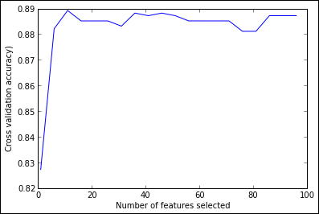
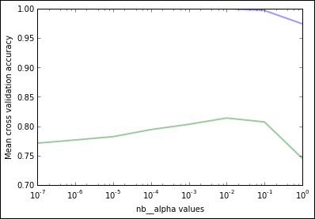
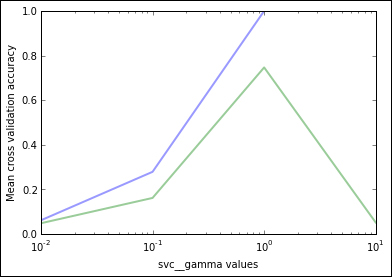

# 四、高级功能

在前面的章节中，我们研究了几种非常不同的算法，从分类和回归到聚类和降维。我们展示了在面对新数据时如何应用这些算法来预测结果。这就是机器学习的全部意义所在。在最后一章中，我们想要展示一些重要的概念和方法，如果你想进行真实的机器学习，你应该考虑这些概念和方法。

*   在实际问题中，通常数据尚未由属性/浮点值对表示，而是通过更复杂的结构或根本非结构化。我们将学习**特征提取**技术，这将允许我们从数据中提取 scikit-learn 特征。
*   从最初的可用特征集中，并非所有特征都可用于我们的算法来学习；事实上，其中一些可能会降低我们的表现。我们将解决选择最合适的特征集的问题，这个过程称为**特征选择**。
*   最后，正如我们在本书的示例中所看到的，许多机器学习算法都有必须设置的参数才能使用它们。为此，我们将回顾**模型选择**技术；也就是说，为我们的算法选择最有希望的超参数的方法。

对于在使用机器学习应用时获得不错的结果，所有这些步骤至关重要。

## 特征提取

学习任务的通常场景，例如本书中介绍的任务，包括实例列表（表示为特征/值对）和特殊特征（目标类），我们想要使用其余特征的值，为将来的实例预测它。但是，源数据通常不会采用这种格式。我们必须提取我们认为可能有用的特征，并将其转换为我们的学习格式。这个过程称为特征提取或特征工程，在大多数现实世界的机器学习任务中，它经常被低估但非常重要且耗时。我们可以在此任务中确定两个不同的步骤：

*   **获取特征**：此步骤涉及处理源数据并提取学习实例，通常采用特征/值对的形式，其中值可以是整数或浮点值，字符串，类别值等。用于提取的方法在很大程度上取决于数据的呈现方式。例如，我们可以拥有一组图片，并为每个像素生成一个整数值特征，指示其颜色级别，就像我们在第二章“监督学习”中的人脸识别示例中所做的那样。由于这是一项非常依赖于任务的工作，我们不会深入研究细节，并假设我们已经为我们的示例设置了此设置。
*   **转换特征**：大多数 scikit-learn 算法接受实例集作为输入，表示为浮点值特征列表。如何获得这些特征将成为本节的主题。

我们可以像第二章“监督学习”那样，构建转换源数据的临时程序。但是，有一些工具可以帮助我们获得合适的表示。例如，Python 包 [Pandas](http://pandas.pydata.org/) 提供了用于数据分析的数据结构和工具。它旨在提供与 R（流行语言和统计计算环境）类似的功能。我们将使用 pandas 导入我们在第二章“监督学习”中提供的泰坦尼克号数据，并将它们转换为 scikit-learn 格式。

让我们首先将原始`titanic.csv`数据导入到 pandas `DataFrame`数据结构中（`DataFrame`本质上是一个二维标记数据结构，其中列可能包含不同的数据类型，每行代表一个实例）。像往常一样，我们事先导入`numpy`和`pyplot`包。

```py
>>> %pylab inline
>>> import pandas as pd
>>> import numpy as np
>>> import matplotlib.pyplot as plt
```

然后我们用 pandas 导入泰坦尼克号数据。

```py
>>> titanic = pd.read_csv('data/titanic.csv')
>>> print titanic
<class 'pandas.core.frame.DataFrame'>
Int64Index: 1313 entries, 0 to 1312
Data columns (total 11 columns):
row.names    1313  non-null values
pclass       1313  non-null values
survived     1313  non-null values
name         1313  non-null values
age          633  non-null values
embarked     821  non-null values
home.dest    754  non-null values
room         77  non-null values
ticket       69  non-null values
boat         347  non-null values
sex          1313  non-null values
dtypes: float64(1), int64(2), object(8)
```

您可以看到每个`csv`列在`DataFrame`中都有相应的特征，并且特征类型是从可用数据推断的。我们可以检查一些特征，看看它们的样子。

```py
>>> print titanic.head()[['pclass', 'survived', 'age', 'embarked', 
    'boat', 'sex']]
pclass  survived      age     embarked   boat     sex
0    1st         1  29.0000  Southampton      2  female
1    1st         0   2.0000  Southampton    NaN  female
2    1st         0  30.0000  Southampton  (135)    male
3    1st         0  25.0000  Southampton    NaN  female
4    1st         1   0.9167  Southampton     11    male
```

我们现在面临的主要困难是 scikit-learn 方法期望实数作为特征值。在第二章“监督学习”中，我们使用`LabelEncoder`和`OneHotEncoder`预处理方法将某些分类特征手动转换为单热值（为每个可能的值生成新特征；如果原始特征具有相应的值则为`1`，否则为`0`）。这一次，我们将使用类似的 scikit-learn 方法`DictVectorizer`，它可以根据不同的原始特征值自动构建这些特征。此外，我们将编写一个方法来在一个独特的步骤中编码一组列。

```py
>>> from sklearn import feature_extraction
>>> def one_hot_dataframe(data, cols, replace=False):
>>>     vec = feature_extraction.DictVectorizer()
>>>     mkdict = lambda row: dict((col, row[col]) for col in cols)
>>>     vecData = pd.DataFrame(vec.fit_transform(
>>>         data[cols].apply(mkdict, axis=1)).toarray())
>>>     vecData.columns = vec.get_feature_names()
>>>     vecData.index = data.index
>>>     if replace:
>>>         data = data.drop(cols, axis=1)
>>>         data = data.join(vecData)
>>>     return (data, vecData)
```

`one_hot_dataframe`方法（基于[这个页面](https://gist.github.com/kljensen/5452382)的脚本）接受 pandas `DataFrame`数据结构和列表的列表，并将每列编码为必要的单热特征。如果`replace`参数为`True`，它也将用新组替换原始列。让我们看看它应用于分类`pclass`，`embarked`和`sex`特征（`titanic_n`仅包含以前创建的列）：

```py
>>> titanic,titanic_n = one_hot_dataframe(titanic, ['pclass', 
    'embarked', 'sex'], replace=True)
>>> titanic.describe()
<class 'pandas.core.frame.DataFrame'>
Index: 8 entries, count to max
Data columns (total 12 columns):
row.names               8  non-null values
survived                8  non-null values
age                     8  non-null values
embarked                8  non-null values
embarked=Cherbourg      8  non-null values
embarked=Queenstown     8  non-null values
embarked=Southampton    8  non-null values
pclass=1st              8  non-null values
pclass=2nd              8  non-null values
pclass=3rd              8  non-null values
sex=female              8  non-null values
sex=male                8  non-null values
dtypes: float64(12)
```

`pclass`属性已被转换为三个`pclass=1st`，`pclass=2nd`，`pclass=3rd`特征，并且类似方式用于其他两个特征。请注意，`embarked`特征没有消失，这是因为原始`embarked`属性包含`NaN`值，表示缺失值；在这些情况下，登船港口的每个特征都将变为`0`，但值为`NaN`的原始特征仍然存在，表明某些情况下缺少该特征。接下来，我们编码剩余的类别属性：

```py
>>> titanic, titanic_n = one_hot_dataframe(titanic, ['home.dest', 
    'room', 'ticket', 'boat'], replace=True)
```

我们还必须处理缺失值，因为我们计划使用的`DecisionTreeClassifier`不会在输入时承认它们。 Pandas 允许我们使用`fillna`方法用固定值替换它们。我们将平均年龄用于`age`特征，以及`0`用于剩余缺失属性。

```py
>>> mean = titanic['age'].mean()
>>> titanic['age'].fillna(mean, inplace=True)
>>> titanic.fillna(0, inplace=True)
```

现在，我们的所有特征（`Name`除外）都采用合适的格式。我们像往常一样准备建立测试和训练集。

```py
>>> from sklearn.cross_validation import train_test_split
>>> titanic_target = titanic['survived']
>>> titanic_data = titanic.drop(['name', 'row.names', 'survived'],
    axis=1)
>>> X_train, X_test, y_train, y_test =  
   train_test_split(titanic_data, titanic_target, test_size=0.25,
   random_state=33)
```

我们决定简单地删除`name`属性，因为我们不期望它提供有关生存状态的信息（我们对每个实例都有一个不同的值，因此我们可以对其进行泛化）。我们还将`survived`特征指定为目标类，并因此将其从训练向量中消除。

让我们看看决策树如何处理当前特征集。

```py
>>> from sklearn import tree
>>> dt = tree.DecisionTreeClassifier(criterion='entropy')
>>> dt = dt.fit(X_train, y_train)
>>> from sklearn import metrics
>>> y_pred = dt.predict(X_test)
>>> print "Accuracy:{0:.3f}".format(metrics.accuracy_score(y_test,
    y_pred)), "\n"
Accuracy:0.839
```

## 特征选择

到目前为止，在训练我们的决策树时，我们使用了学习数据集中的每个可用特征。这看起来非常合理，因为我们希望使用尽可能多的信息来构建我们的模型。但是，有两个主要原因可以限制使用的特征数量：

*   首先，对于某些方法，尤其是减少用于在每个步骤中细化模型的实例数量的那些方法（例如决策树），不相关的特征可能会建议仅偶然出现的特征和目标类之间的相关性。没有正确建模问题。这方面也与过拟合有关;具有某些过度特定的特征可能会导致一般性不佳。此外，某些特征可能高度相关，并且只会添加冗余信息。
*   第二个原因是现实世界。如果没有相应的分类器改进，大量特征可以大大增加计算时间。在使用大数据时，这一点尤其重要，因为大数据的实例和特征的数量很容易增加到数千或更多。此外，关于维度的诅咒，从具有相对于实例数量太多特征的数据集学习可推广模型可能是困难的。

因此，使用较小的特征集可能会产生更好的结果。所以我们想找到一些通过算法找到最佳特征的方法。此任务称为特征选择，当我们的目标是通过机器学习算法获得不错的结果时，这是一个至关重要的步骤。如果我们的特征很差，无论我们的机器学习算法多么复杂，我们的算法都会返回不良结果。

例如，考虑一下我们非常简单的泰坦尼克号示例。我们从 11 个特征开始，但经过 1-K 编码后，它们增长到`581`。

```py
>>> print titanic
<class 'pandas.core.frame.DataFrame'> Int64Index: 1313 entries, 0 to 1312 Columns: 581 entries, row.names to ticket=L15 1s dtypes: float64(578), int64(2), object(1)
```

这不会构成重要的计算问题，但如果如前所述，我们将数据集中的每个文档表示为每个可能单词的出现次数，请考虑会发生什么。另一个问题是决策树遭受过拟合。如果分支基于非常少的实例，则构建模型的预测能力将在未来数据上减少。对此的一个解决方案是调整模型参数（例如最大树深度或叶节点处所需的最小实例数）。但是，在此示例中，我们将采用不同的方法：我们将尝试将特征限制为最相关的特征。

相关的是什么意思？这是一个重要的问题。一般方法是找到正确表征训练数据的最小特征集。如果一个特征总是与目标类重合（也就是说，它是一个完美的预测器），那么表征数据就足够了。另一方面，如果特征总是具有相同的值，则其预测能力将非常低。

特征选择的一般方法是获得某种评估函数，当给定潜在特征时，返回特征的有用程度得分，然后保持具有最高分数的特征。这些方法可能具有不检测特征之间的相关性的缺点。其他方法可能更蛮力：尝试原始特征列表的所有可能子集，在每个组合上训练算法，并保持获得最佳结果的组合。

作为一种评估方法，我们可以使用统计检验来衡量两个随机变量（比如给定特征和目标类）是否独立的可能性;也就是说，它们之间没有相关性。

Scikit-learn 在`feature_selection`模块中提供了几种方法。我们将使用`SelectPercentile`方法，  在进行统计检验时，选择用户指定的具有最高得分的特征百分位数。最流行的统计检验是 χ²（卡方）统计量。让我们看看它如何适用于我们的泰坦尼克号例子;我们将用它来选择 20% 最重要的特征：

```py
>>> from sklearn import feature_selection
>>> fs = feature_selection.SelectPercentile(
        feature_selection.chi2, percentile=20)
>>> X_train_fs = fs.fit_transform(X_train, y_train)
```

`X_train_fs`数组现在具有在统计上更重要的特征。我们现在可以根据这些数据训练决策树。

```py
>>> dt.fit(X_train_fs, y_train)
>>> X_test_fs = fs.transform(X_test)
>>> y_pred_fs = dt.predict(X_test_fs)
>>> print "Accuracy:{0:.3f}".format(metrics.accuracy_score(y_test,
    y_pred_fs)),"\n"
Accuracy:0.845
```

我们可以看到训练集的精确率在训练集上的特征选择后提高了半个点。

是否有可能找到最佳数量的特征？如果最佳我们的意思是训练集上的最佳表现，它实际上是可能的;我们可以简单地使用蛮力方法，尝试使用不同数量的特征，同时使用交叉验证测量他们在训练集上的表现。

```py
>>> from sklearn import cross_validation
>>>
>>> percentiles = range(1, 100, 5)
>>> results = []
>>> for i in range(1,100,5):
>>>     fs = feature_selection.SelectPercentile(
            feature_selection.chi2, percentile=i
        )
>>>     X_train_fs = fs.fit_transform(X_train, y_train)
>>>     scores = cross_validation.cross_val_score(dt, X_train_fs,  
        y_train, cv=5)
>>>     results = np.append(results, scores.mean())
>>> optimal_percentil = np.where(results == results.max())[0]
>>> print "Optimal number of features:{0}".format(
        percentiles[optimal_percentil]), "\n"
Optimal number of features:11
>>> 
>>> # Plot number of features VS. cross-validation scores
>>> import pylab as pl
>>> pl.figure()
>>> pl.xlabel("Number of features selected")
>>> pl.ylabel("Cross-validation accuracy)")
>>> pl.plot(percentiles, results)
```

下图显示了交叉验证精确率如何随特征数量的变化而变化：



我们可以看到，当我们开始添加特征时，准确率会迅速提高，在特征的百分比变为大约 10 之后保持稳定。事实上，当使用 64 个原始 581 特征（11% 百分位数）时，可以获得最佳准确率。让我们看看这是否真的改善了测试集的表现。

```py
>>> fs = feature_selection.SelectPercentile(
             feature_selection.chi2,  
             percentile=percentiles[optimal_percentil])
>>> X_train_fs = fs.fit_transform(X_train, y_train)
>>> dt.fit(X_train_fs, y_train)
>>> X_test_fs = fs.transform(X_test)
>>> y_pred_fs = dt.predict(X_test_fs)
>>> print "Accuracy:{0:.3f}".format(metrics.accuracy_score(y_test,
    y_pred_fs)), "\n"
Accuracy:0.848
```

表现再次略有改善。与我们的初始表现相比，我们最终仅使用 11% 的特征提高了几乎一个精确率点。

读者可能已经注意到，在创建分类器时，我们使用了默认参数，除了分割标准，我们使用了`entropy`。我们可以使用不同的参数改进模型吗？此任务称为模型选择，我们将在下一个部分中使用不同的学习示例详细说明。现在，让我们测试替代方法（`gini`）是否会为我们的示例带来更好的表现。为此，我们将再次使用交叉验证。

```py
>>> dt = tree.DecisionTreeClassifier(criterion='entropy')
>>> scores = cross_validation.cross_val_score(dt, X_train_fs, 
    y_train, cv=5)
>>> print "Entropy criterion accuracy on 
    cv: {0:.3f}".format(scores.mean())
Entropy criterion accuracy on cv: 0.889
>>> dt = tree.DecisionTreeClassifier(criterion='gini')
>>> scores = cross_validation.cross_val_score(dt, X_train_fs, 
    y_train, cv=5)
>>> print "Gini criterion accuracy on 
    cv: {0:.3f}".format(scores.mean())
Gini criterion accuracy on cv: 0.897
```

基尼标准在我们的训练集上表现更好。它在测试集上的表现如何？

```py
>>> dt.fit(X_train_fs, y_train)
>>> X_test_fs = fs.transform(X_test)
>>> y_pred_fs = dt.predict(X_test_fs)
>>> print "Accuracy:  
    {0:.3f}".format(metrics.accuracy_score(y_test,  
    y_pred_fs)),"\n"
Accuracy: 0.848
```

似乎训练集的表现改进不适用于评估集。这总是可行的。事实上，表现可能会降低（召回过拟合）。我们的模型仍然是最好的。如果我们将模型更改为使用测试集中表现最佳的模型，我们就无法测量其表现，因为测试数据集不再被视为“看不见的数据”。

## 模型选择

在上一节中，我们研究了预处理数据的方法，并选择了最有前途的特征。正如我们所说，选择一组好的特征是获得良好结果的关键步骤。现在我们将关注另一个重要步骤：选择算法参数，称为**超参数**，以区别于机器学习算法中调整的参数。许多机器学习算法包括超参数（从现在起我们将简称为参数），它们指导底层方法的某些方面并对结果产生很大影响。在本节中，我们将回顾一些方法来帮助我们获得最佳参数配置，这个过程称为模型选择。

我们将回顾第二章“监督学习”中提到的文本分类问题。在那个例子中，我们将 TF-IDF 向量化合物与多项**朴素贝叶斯**（**NB**）算法一起复合以对一组新闻组进行分类。消息分成若干个类别。`MultinomialNB`算法有一个重要参数，名为`alpha`，用于调整平滑。我们最初使用该类及其默认参数值（`alpha` = `1.0`）并获得`0.89`的准确率。但是当我们将`alpha`设置为`0.01`时，我们对`0.92`的准确率有了明显的提高。显然，`alpha`参数的配置对算法的表现有很大影响。我们如何确定`0.01` 的最佳值？也许如果我们尝试其他可能的值，我们仍然可以获得更好的结果。

让我们从我们的文本分类问题开始，但是现在我们只使用减少数量的实例。我们只会处理 3,000 个实例。我们首先导入`pylab`环境并加载数据。

```py
>>> %pylab inline
>>> from sklearn.datasets import fetch_20newsgroups
>>> news = fetch_20newsgroups(subset='all')
>>> n_samples = 3000
>>> X_train = news.data[:n_samples]
>>> y_train = news.target[:n_samples]
```

之后，我们需要导入类来构造分类器。

```py
>>> from sklearn.naive_bayes import MultinomialNB
>>> from sklearn.pipeline import Pipeline
>>> from sklearn.feature_extraction.text import TfidfVectorizer
```

然后导入一组停止词，并创建一个复合 TF-IDF 向量化器和朴素贝叶斯算法的管道（回想一下，我们有一个带有停止词列表的`stopwords_en.txt`文件）。

```py
>>> def get_stop_words():
>>>     result = set()
>>>     for line in open('stopwords_en.txt', 'r').readlines():
>>>         result.add(line.strip())
>>>     return result
>>> stop_words = get_stop_words()
>>> clf = Pipeline([('vect', TfidfVectorizer(
>>>           stop_words=stop_words,
>>>           token_pattern=ur"\b[a-z0-9_\-\.]+[a-z][a-z0-9_\-
              \.]+\b",        
>>>    )),
>>>    ('nb', MultinomialNB(alpha=0.01)),
>>>])
```

如果我们使用三重交叉验证来评估我们的算法，我们获得的平均分数约为 0.811。

```py
>>> from sklearn.cross_validation import cross_val_score, KFold
>>> from scipy.stats import sem
>>> def evaluate_cross_validation(clf, X, y, K):
>>>     # create a k-fold croos validation iterator of k=5 folds
>>>     cv = KFold(len(y), K, shuffle=True, random_state=0)
>>>     # by default the score used is the one returned by score 
        method of the estimator (accuracy)
>>>     scores = cross_val_score(clf, X, y, cv=cv)
>>>     print scores
>>>     print ("Mean score: {0:.3f} (+/-{1:.3f})").format(
>>>         np.mean(scores), sem(scores))
>>> evaluate_cross_validation(clf, X_train, y_train, 3)
[ 0.814  0.815  0.804]
Mean score: 0.811 (+/-0.004)
```

看起来我们应该使用不同参数值列表训练算法并保持参数值以获得最佳结果。让我们实现一个辅助函数来做到这一点。该函数将使用值列表训练算法，每次获得通过对训练实例执行 K 折交叉验证而计算的准确率分数。之后，绘制训练和测试分数对于参数值的函数。

```py
>>> def calc_params(X, y, clf, param_values, param_name, K):
>>>     # initialize training and testing scores with zeros
>>>     train_scores = np.zeros(len(param_values))
>>>     test_scores = np.zeros(len(param_values))
>>> 
>>>     # iterate over the different parameter values
>>>     for i, param_value in enumerate(param_values):
>>>         print param_name, ' = ', param_value
>>>         # set classifier parameters
>>>         clf.set_params({param_name:param_value})
>>>         # initialize the K scores obtained for each fold
>>>         k_train_scores = np.zeros(K)
>>>         k_test_scores = np.zeros(K)
>>>         # create KFold cross validation
>>>         cv = KFold(n_samples, K, shuffle=True, random_state=0)
>>>         # iterate over the K folds
>>>         for j, (train, test) in enumerate(cv):
>>>             clf.fit([X[k] for k in train], y[train])
>>>             k_train_scores[j] = clf.score([X[k] for k in 
                train], y[train])
>>>             k_test_scores[j] = clf.score([X[k] for k in test], 
                y[test])
>>>         train_scores[i] = np.mean(k_train_scores)
>>>         test_scores[i] = np.mean(k_test_scores)
>>> 
>>>     # plot the training and testing scores in a log scale
>>>     plt.semilogx(param_values, train_scores, alpha=0.4, lw=2, 
        c='b')
>>>     plt.semilogx(param_values, test_scores, alpha=0.4, lw=2, 
        c='g')
>>>     plt.xlabel("Alpha values")
>>>     plt.ylabel("Mean cross-validation accuracy")
>>>     # return the training and testing scores on each parameter 
 value
>>>     return train_scores, test_scores
```

该函数接受六个参数：特征数组，目标数组，要使用的分类器对象，参数值列表，要调整的参数的名称以及交叉验证评估中使用的 K 折数。

我们来调用这个函数;我们将使用 numpy 的`logspace`函数生成一个在对数刻度上均匀间隔的 alpha 值列表。

```py
>>> alphas = np.logspace(-7, 0, 8)
>>> print alphas
[  1.00000000e-07   1.00000000e-06   1.00000000e-05   1.00000000e-04
1.00000000e-03   1.00000000e-02   1.00000000e-01   1.00000000e+00]
```

我们将在管道内设置 NB 分类器的`alpha`参数的值，该参数对应于参数名称`nb__alpha`。我们将使用三个折叠进行交叉验证。

```py
>>> train_scores, test_scores = calc_params(X_train, y_train, clf, alphas, 'nb__alpha', 3)
```

在下图中，顶部的线对应于训练精确率，底部的线对应于测试精确率：



正如所料，训练精确率始终高于测试精确率。我们可以在图中看到，使用`10^-2`和`10^-1`范围内的 alpha 值可以获得最佳测试精确率。低于此范围，分类器显示过拟合的迹象（训练精确率高但测试精确率低于可能的值）。超出此范围，分类器显示欠拟合的迹象（训练集的准确率低于其可能）。

值得一提的是，在点处，可以在`10^-2`和`10^-1`的范围内以更精细的网格执行第二遍，以找到更好的 alpha 值。

让我们打印得分向量来查看实际值。

```py
>>> print 'training scores: ', train_scores
>>> print 'testing scores: ', test_scores
training scores:  [ 1\. 1\. 1\. 1\. 1\. 0.99933333 0.99633333 0.96933333]
testing scores:  [ 0.75 0.75666667 0.76433333 0.77533333 0.78866667 0.811 0.81233333 0.753]
```

使用`0.1` `0.1`值（精确率为 0.812）获得最佳结果。

我们创建了一个非常有用的函数来绘制图并获得分类器的最佳参数值。让我们用它来调整另一个使用**支持向量机**（ **SVM**）而不是`MultinomialNB`的分类器：

```py
>>> from sklearn.svm import SVC
>>>
>>> clf = Pipeline([
>>>     ('vect', TfidfVectorizer(
>>>                 stop_words=stop_words,
>>>                 token_pattern=ur"\b[a-z0-9_\-\.]+[a-z][a-z0-
                    9_\-\.]+\b",         
>>>     )),
>>>     ('svc', SVC()),
>>> ])
```

我们像以前一样创建了一个管道，但现在我们使用 SVC 分类器及其默认值。现在我们将使用`calc_params`函数来调整`gamma`参数。

```py
>>> gammas = np.logspace(-2, 1, 4)
>>> train_scores, test_scores = calc_params(X_train, y_train, clf, gammas,'svc__gamma', 3)
```

对于小于 1 的伽玛值，我们有欠拟合，对于大于 1 的伽马值，我们有过拟合。



因此，最好的结果是`1`的`gamma`值，我们获得的训练精确率为 0.999，测试精确率为 0.760。

如果仔细查看 SVC 类构造器参数，除了 gamma 之外，我们还有其他参数，这些参数也可能影响分类器表现。如果我们只调整伽马值，我们隐含地声明最佳`C`值是`1.0`（我们没有明确设置的默认值）。也许我们可以通过`C`和`gamma`值的新组合获得更好的结果。 这开启了一种新的复杂程度;我们应该尝试所有参数组合并保持更好的参数组合。

## 网格搜索

为了缓解这个问题，我们在`sklearn.grid_search`模块中有一个名为`GridSearchCV`的非常有用的类。我们在`calc_params`函数中所做的是一种网格搜索。使用`GridSearchCV`，我们可以指定要遍历的任意数量的参数和参数值的网格。它将训练每个组合的分类器并获得交叉验证准确率以评估每个组合。

我们用它来同时调整`C`和`gamma`参数。

```py
>>> from sklearn.grid_search import GridSearchCV

>>> parameters = {
>>>     'svc__gamma': np.logspace(-2, 1, 4),
>>>     'svc__C': np.logspace(-1, 1, 3),
>>> }
>>> clf = Pipeline([
>>>     ('vect', TfidfVectorizer(
>>>                stop_words=stop_words,
>>>                token_pattern=ur"\b[a-z0-9_\-\.]+[a-z][a-z0-
                   9_\-\.]+\b",         
>>>     )),
>>>     ('svc', SVC()),
>>> ])
>>> gs = GridSearchCV(clf, parameters, verbose=2, refit=False, cv=3)
```

让我们执行网格搜索并打印最佳参数值和分数。

```py
>>> %time _ = gs.fit(X_train, y_train)
>>> gs.best_params_, gs.best_score_
CPU times: user 304.39 s, sys: 2.55 s, total: 306.94 s
Wall time: 306.56 s
 ({'svc__C': 10.0, 'svc__gamma': 0.10000000000000001}, 0.81166666666666665)
```

通过网格搜索，我们获得了`C`和`gamma`参数的更好组合，分别为`10.0`和`0.10`值，`0.811`的交叉验证精确率为 3 倍，远远优于`0.811`。我们在之前的实验中获得的最佳值（`0.76`）仅通过调整`gamma`并将`C`值保持在`1.0`。

此时，我们可以继续执行实验，不仅要调整 SVC 的其他参数，还要调整`TfidfVectorizer`上的参数，这也是估计器的一部分。注意，这另外增加了复杂性。您可能已经注意到，之前的网格搜索实验大约需要五分钟才能完成。如果我们添加新参数进行调整，则时间将呈指数级增长。结果，这些方法非常资源/时间密集;这也是我们仅使用总实例的一部分的原因。

## 并行网格搜索

网格搜索计算随着每个参数及其想要调整的可能值呈指数增长。如果我们按照并行计算每个组合而不是按顺序计算每个组合，我们可以减少响应时间。在前面的例子中，`gamma`有四个不同的值，`C`有三个不同的值，总结了 12 个参数组合。此外，我们还需要对每个组合进行三次训练（通过三次交叉验证），因此我们总结了 36 次训练和评估。我们可以尝试并行运行这 36 个任务，因为任务是独立的。

大多数现代计算机都有多个核心，可用于并行运行任务。我们在 IPython 中也有一个非常有用的工具，叫做 **IPython 并行**，它允许我们并行运行独立任务，每个任务都在我们不同的核心机。让我们用我们的文本分类器示例来做到这一点。

我们将首先声明一个函数，该函数将持续所有 K 个折叠以用于不同文件中的交叉验证。这些文件将由执行相应折叠的进程加载。为此，我们将使用`joblib`库。

```py
>>> from sklearn.externals import joblib
>>> from sklearn.cross_validation import ShuffleSplit
>>> import os
>>> def persist_cv_splits(X, y, K=3, name='data', 
                          suffix="_cv_%03d.pkl"):
>>>     """Dump K folds to filesystem."""
>>> 
>>>     cv_split_filenames = []
>>> 
>>>     # create KFold cross validation
>>>     cv = KFold(n_samples, K, shuffle=True, random_state=0)
>>> 
>>>     # iterate over the K folds
>>>     for i, (train, test) in enumerate(cv):
>>>         cv_fold = ([X[k] for k in train], y[train], [X[k] for 
                      k in test], y[test])
>>>         cv_split_filename = name + suffix % i
>>>         cv_split_filename = os.path.abspath(cv_split_filename)
>>>         joblib.dump(cv_fold, cv_split_filename)
>>>         cv_split_filenames.append(cv_split_filename)
>>> 
>>>     return cv_split_filenames
>>> cv_filenames = persist_cv_splits(X, y, name='news')
```

以下函数加载特定折叠并使分类器适合指定的参数集，返回测试分数。 每个并行任务都会调用此函数。

```py
>>> def compute_evaluation(cv_split_filename, clf, params):
>>> 
>>>     # All module imports should be executed in the worker 
        namespace
>>>     from sklearn.externals import joblib
>>> 
>>>     # load the fold training and testing partitions from the    
        filesystem
>>>     X_train, y_train, X_test, y_test = joblib.load(
>>>         cv_split_filename, mmap_mode='c')
>>> 
>>>     clf.set_params(**params)
>>>     clf.fit(X_train, y_train)
>>>     test_score = clf.score(X_test, y_test)
>>>     return test_score
```

最后，以下函数在并行任务中执行网格搜索。对于每个参数组合（由`IterGrid`迭代器返回），它迭代 K 次折叠并创建计算评估的任务。它返回任务列表旁边的参数组合。

```py
>>> from sklearn.grid_search import IterGrid
>>> 
>>> def parallel_grid_search(lb_view, clf, cv_split_filenames, param_grid):
>>>     all_tasks = []
>>>     all_parameters = list(IterGrid(param_grid))
>>> 
>>>     # iterate over parameter combinations
>>>     for i, params in enumerate(all_parameters):
>>>         task_for_params = []
>>>         # iterate over the K folds
>>>         for j, cv_split_filename in 
                enumerate(cv_split_filenames):    
>>>             t = lb_view.apply(
>>>                 compute_evaluation, cv_split_filename, clf, 
                    params)
>>>             task_for_params.append(t)
>>> 
>>>         all_tasks.append(task_for_params)
>>> 
>>>     return all_parameters, all_tasks
```

现在我们使用 IPython 并行来获取客户端和负载平衡视图。我们必须首先使用 IPython Notebook 中的`Cluster`选项卡创建 N 个引擎的本地群集（每个核心一个）。然后我们创建客户端和视图，执行我们的`parallel_grid_search`函数。

```py
>>> from sklearn.svm import SVC
>>> from IPython.parallel import Client
>>>
>>> client = Client()
>>> lb_view = client.load_balanced_view()
>>>
>>> all_parameters, all_tasks = parallel_grid_search(
    lb_view, clf, cv_filenames, parameters)
```

IPython 并行将开始并行运行任务。我们可以用它来监控整个任务组的进度。

```py
>>> def print_progress(tasks):
>>>     progress = np.mean([task.ready() for task_group in tasks
                                 for task in task_group])
>>>     print "Tasks completed: {0}%".format(100 * progress)
```

完成所有任务后，使用以下函数：

```py
>>> print_progress(all_tasks)
Tasks completed: 100.0%
```

我们可以定义一个函数来计算已完成任务的平均分数。

```py
>>> def find_bests(all_parameters, all_tasks, n_top=5):
>>>     """Compute the mean score of the completed tasks"""
>>>     mean_scores = []
>>> 
>>>     for param, task_group in zip(all_parameters, all_tasks):
>>>         scores = [t.get() for t in task_group if t.ready()]
>>>         if len(scores) == 0:
>>>             continue
>>>         mean_scores.append((np.mean(scores), param))
>>> 
>>>     return sorted(mean_scores, reverse=True)[:n_top]
>>> print find_bests(all_parameters, all_tasks)

[(0.81733333333333336, {'svc__gamma': 0.10000000000000001, 'svc__C': 10.0}), (0.78733333333333333, {'svc__gamma': 1.0, 'svc__C': 10.0}), (0.76000000000000012, {'svc__gamma': 1.0, 'svc__C': 1.0}), (0.30099999999999999, {'svc__gamma': 0.01, 'svc__C': 10.0}), (0.19933333333333333, {'svc__gamma': 0.10000000000000001, 'svc__C': 1.0})]
```

您可以观察到我们计算的结果与上一节相同，但是在一半的时间内（如果您使用了两个核心）或在四分之一的时间内（如果您使用了四个核心）。

## 总结

在本章中，我们回顾了两种在应用机器学习算法时改进结果的重要方法：特征选择和模型选择。首先，我们使用不同的技术来预处理数据，提取特征，并选择最有希望的特征。然后我们使用技术自动计算最有希望的机器学习算法的超参数，并使用方法来并行化这些计算。

读者必须意识到，本书仅涵盖了主要的机器学习线和一些方法。请记住，除了监督和无监督学习之外，还有很多其他内容。例如：

*   半监督学习方法是有监督和无监督学习之间的中间立场。它们将少量带标签的数据与大量未标记的数据相结合。通常，未标记的数据可以揭示元素的基础分布，并与小的标记数据集结合获得更好的结果。
*   主动学习是半监督方法中的一个特例。同样，当标记数据稀缺或难以获得时，它是有用的。在主动学习中，该算法主动查询人类专家以回答某些未标记实例的标签，从而在减少的标记实例集上学习该概念。
*   强化学习提出了一种方法，即智能体在环境中执行操作后从反馈（奖励或增援）中学习。智能体通过尝试最大化累积奖励来学习执行任务。这些方法在机器人和视频游戏中非常成功。
*   顺序分类（在**自然语言处理**（**NLP**）中非常常用）为一系列项目分配标签序列;例如，句子中单词的词性。

除此之外，还有许多监督学习方法，与我们提出的方法截然不同;例如，神经网络，最大熵模型，基于记忆的模型和基于规则的模型。机器学习是一个非常活跃的研究领域，文献越来越多;读者可以使用许多书籍和课程来深入了解理论和细节。

Scikit-learn 已经实现了许多这些算法，并且缺少其他算法，但期望其积极和热情的贡献者很快就能构建它们。我们鼓励读者成为社区的一员！