# 2.2 监督学习 II

> 原文：[Machine Learning for Humans, Part 2.1: Supervised Learning](https://medium.com/machine-learning-for-humans/supervised-learning-2-5c1c23f3560d)

> 作者：[Vishal Maini](mailto:ml4humans@gmail.com)

> 译者：[飞龙](https://github.com/wizardforcel)

> 协议：[CC BY-NC-SA 4.0](http://creativecommons.org/licenses/by-nc-sa/4.0/)

> 使用对数几率回归（LR）和支持向量机（SVM）的分类。

## 分类：预测标签

这个邮件是不是垃圾邮件？贷款者能否偿还它们的贷款？用户是否会点击广告？你的 Fackbook 照片中那个人是谁？

分类预测离散的目标标签`Y`。分类是一种问题，将新的观测值分配给它们最有可能属于的类，基于从带标签的训练集中构建的模型。

你的分类的准确性取决于所选的算法的有效性，你应用它的方式，以及你有多少有用的训练数据。

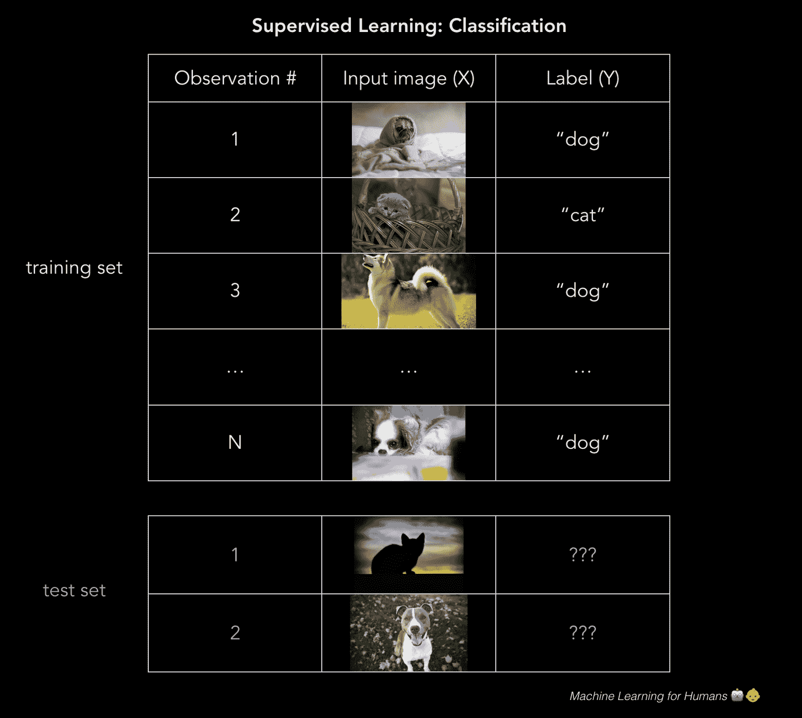

## 对数几率回归：0 还是 1？

> 只要胆子大，LR 打天下（译者注）。

对数几率（logistic）回归是个分类方法：模型输出目标变量`Y`属于某个特定类的概率。

> 分类的一个很好的例子是，判断贷款申请人是不是骗子。

> 最终，出借人想要知道，它们是否应该贷给借款人，以及它们拥有一些容忍度，用于抵抗申请人的确是骗子的风险。这里，对数几率回归的目标就是计算申请人是骗子的概率（0%~100%）。使用这些概率，我们可以设定一些阈值，我们愿意借给高于它的借款人，对于低于它的借款人，我们拒绝他们的贷款申请，或者标记它们以便后续观察。

虽然对数几率回归通常用于二元分类，其中只存在两个类，要注意，分类可以拥有任意数量的类（例如，为手写数字分配 0~9 的标签，或者使用人脸识别来检测 Fackbook 图片中是哪个朋友）。

### 我可以使用普通最小二乘嘛？

不能。如果你在大量样本上训练线性回归模型，其中`Y = 0`或者`1`，你最后可能预测出一些小于 0 或者大于 1 的概率，这毫无意义。反之，我们使用对数几率回归模型（或者对率（logit）模型），它为分配“`Y`属于某个特定类”的概率而设计，范围是 0%~100%。

### 数学原理是什么？

注意：这一节中的数学很有意思，但是更加技术化。如果你对高阶的高年不感兴趣，请尽管跳过它。

对率模型是个线性回归的改良，通过应用 sigmoid 函数，确保输出 0 和 1 之间的概率。如果把它画出来，它就像 S 型的曲线，稍后可以看到。

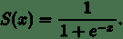

> sigmoid 函数，它将值压缩到 0 和 1 之间。

回忆我们的简单线性回归模型的原始形式，我们现在叫它`g(X)`，因为我们打算在复合函数中使用它。

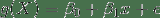

现在，为了解决模型输出小于 0 或者大于 1 的问题，我们打算定义一个新的函数`F(g(X))`，它将现行回归的输出压缩到`[0,1]`区间，来转换`g(X)`。你可以想到一个能这样做的函数吗？

你想到了 sigmoid 函数吗？太棒了，这就对了！

所以我们将`g(x)`插入 sigmoid 函数中，得到了原始函数的一个函数（对，事情变得高阶了），它输出 0 和 1 之间的概率。

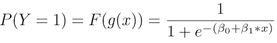

> 换句话说，我们正在计算“训练样本属于特定类”的概率：`P(Y=1)`。

这里我们分离了`p`，它是`Y=1`的概率，在等式左边。如果我们打算求解等式右边的，非常整洁的`β0 + β1x + ϵ `，以便我们能够直接解释我们习得的`beta`参数，我们会得到对数几率比值，简称对率，它在左边。这就是“对率模型”的由来。

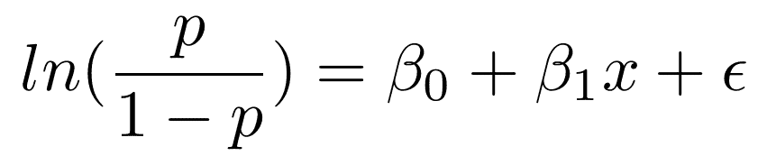

对数几率比值仅仅是概率比值`p/(1-p)`的自然对数，它会出现在我们每天的对话中。

> 在这一季的“权力的游戏”中，你认为小恶魔挂掉的几率有多大？

> 嗯...挂掉的可能性是不挂掉的两倍。几率是 2 比 1。的确，他太重要，不会被杀，但是我们都看到了他们对 Ned Stark 做的事情...

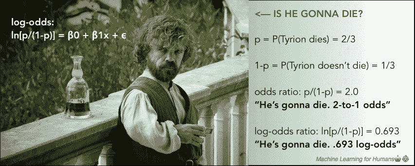

> 要注意在对率模型中，`β1`表示当`X`变化时，对率的变化比例。换句话说，它是对率的斜率，并不是概率的斜率。

对率可能有点不直观，但是值得理解，因为当你解释执行分类任务的神经网络的输出时，它会再次出现。

### 使用对率回归模型的输出来做决策

对率回归模型的输出，就像 S 型曲线，基于`X`的值展示了`P(Y=1)`。

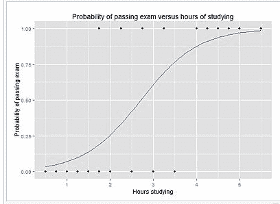

为了预测`Y`标签，是不是垃圾邮件，有没有癌症，是不是骗子，以及其他，你需要（为正的结果）设置一个概率截断值，或者叫阈值（不是）。例如，如果模型认为，邮件是垃圾邮件的概率高于 70%，就将其标为垃圾。否则就不是垃圾。

这个阈值取决于你对假阳性（误报）和假阴性（漏报）的容忍度。如果你在诊断癌症，你对假阴性有极低的容忍度，因为如果病人有极小的几率得癌症，你都需要进一步的测试来确认。所以你需要为正向结果设置一个很低的阈值。

另一方面，在欺诈性贷款申请的例子中，假阳性的容忍度更高，也别是对于小额贷款，因为进一步的审查开销很大，并且小额贷款不值得额外的操作成本，以及对于非欺骗性的申请者来说是个障碍，它们正在等待进一步的处理。

### 对数几率回归的最小损失

就像线性回归的例子那样，我们使用梯度下降来习得使损失最小的`beta`参数。

在对率回归中，成本函数是这样的度量，当真实答案是`0`时，你有多么经常将其预测为 1，或者反过来。下面是正则化的成本函数，就像我们对线性回归所做的那样。

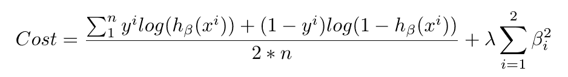

当你看到像这样的长式子时，不要惊慌。将其拆成小部分，并从概念上思考每个部分都是什么。之后就能理解了。

第一个部分是数据损失，也就是，模型预测值和实际值之间有多少差异。第二个部分就是正则损失，也就是，我们以什么程度，惩罚模型的较大参数，它过于看重特定的特征（要记得，这可以阻止过拟合）。

我们使用低度下降，使损失函数最小，就是像上面这样。我们构建了一个对数几率回归模型，来尽可能准确地预测分类。

## 支持向量机

> 我们再次位于一个充满弹球的房间里。为什么我们总是在充满弹球的房间里呢？我可以发誓我已经把它们丢掉了。

SVM 是我们涉及的最后一个参数化模型。它通常与对率回归解决相同的问题，二元分类，并产生相似的效果。它值得理解，因为算法本质上是由几何驱动的，并不是由概率思维驱动的。

SVM 可解决的一些问题示例：

+   这个图片是猫还是狗？
+   这个评论是正面还是负面的？
+   二维图片上的点是红色还是蓝色？

我们使用第三个例子，来展示 SVM 的工作方式。像这样的问题叫做玩具问题，因为它们不是真实的。但是没有东西是真实的，所以也没关系。

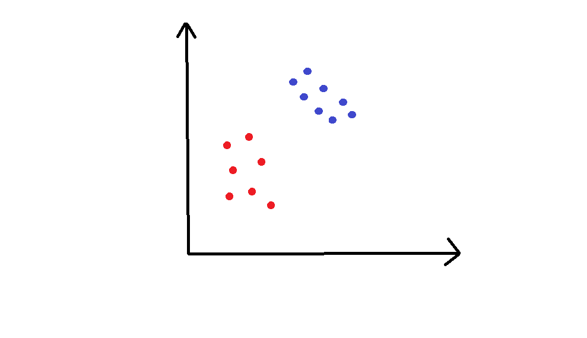

这个例子中，我们的二维空间中有一些点，它们是红色或者蓝色的，并且我们打算将二者干净地分开。

训练集画在了上面的图片中。我们打算在这个平面上划分新的未分类的点。为了实现它，SVM 使用分隔直线（在高维里面是个多维的超平面），将空间分成红色区域和蓝色区域。你可以想象，分隔直线在上面的图里面是什么样。

具体一些，我们如何选取画这条线的位置？

下面是这条直线的两个示例：

> 这些图表使用 MicrosoftPaint 制作，在不可思议的 32 年之后，它在几个星期之前废弃了。R.I.P Paint :(

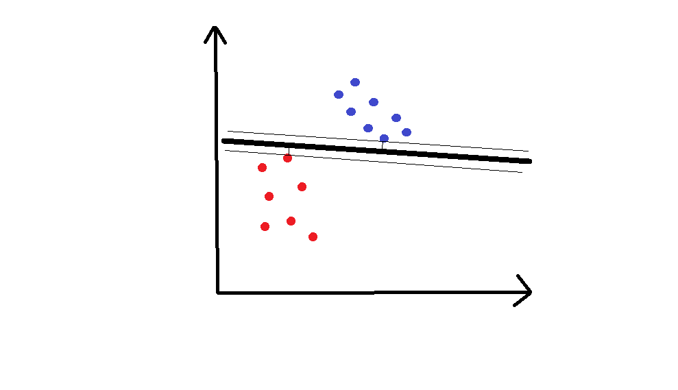

我希望你拥有一种直觉，觉得第一条线更好。直线到每一边的最近的点的距离叫做间距，而 SVM 尝试使间距最大。你可以将其看做安全空间：空间越大，嘈杂的点就越不可能被错误分类。

基于这个简单的解释，一个巨大的问题来了。

(1) 背后的数学原理是什么？

我们打算寻找最优超平面（在我们的二维示例中是直线）。这个超平面需要（1）干净地分隔数据，将蓝色的点分到一边，红色的点分到另一边，以及（2）使间距最大。这是个最优化问题。按照（2）的需求使间距最大的时候，解需要遵循约束（1）。

求解这个问题的人类版本，就是拿一个尺子，尝试不同的直线来分隔所有点，直到你得到了使间距最大的那条。

人们发现，存在求解这个最大化的数学方式，但是它超出了我们的范围。为了进一步解释它，[这里是个视频讲义](https://www.youtube.com/watch?v=_PwhiWxHK8o)，使用[拉格朗日优化](https://en.wikipedia.org/wiki/Lagrange_multiplier)展示了它的工作原理。

你最后求解的超平面的定义，有关它相对于特定`x_i`的位置，它们就叫做支持向量，并且它们通常是最接近超平面的点。

(2) 如果你不能干净地分隔数据，会发生什么？

处理这个问题有两个方式。

2.1 软化“分隔”的定义

我们允许一些错误，也就是我们允许红色区域里面有一些蓝色点，或者蓝色区域里有一些红色点。我们向损失函数中。为错误分类的样本添加成本`C`来实现。基本上我们说，错误分类是可以接受的，只是会产生一些成本。

2.2 将数据放到高维

我们可以创建非线性的分类器，通过增加维数，也就是，包含`x^2`，`x^3`，甚至是`cos(x)`，以及其它。突然，你就有了一个边界，当我们将其带回低维表示时，它看起来有些弯曲。

本质上，这就类似红的和蓝色的弹球都在地面上，它们不能用一条直线分隔。但是如果你让所有红色的弹球离开地面，像右图这样，你就能画一个平面来分隔它们。之后你让他们落回地面，就知道了蓝色和红色的边界。

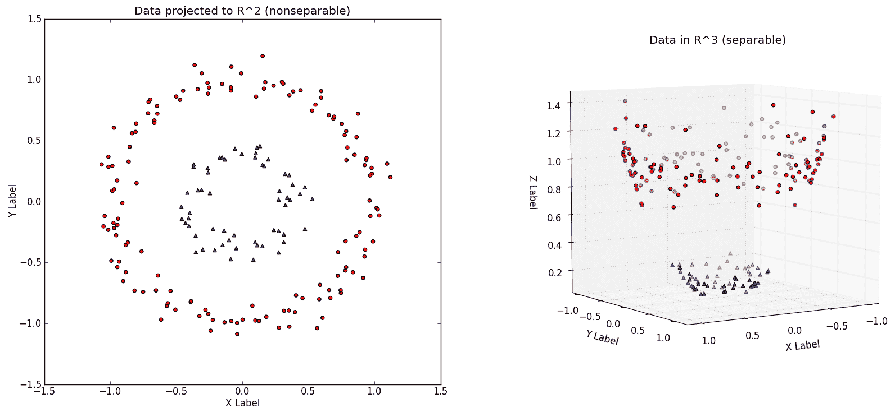

> 二维空间`R^2`中的非线性可分的数据集，以及映射到高维的相同数据集，第三个维度是`x^2+y^2`（来源：<http://www.eric-kim.net/eric-kim-net/posts/1/kernel_trick.html>）

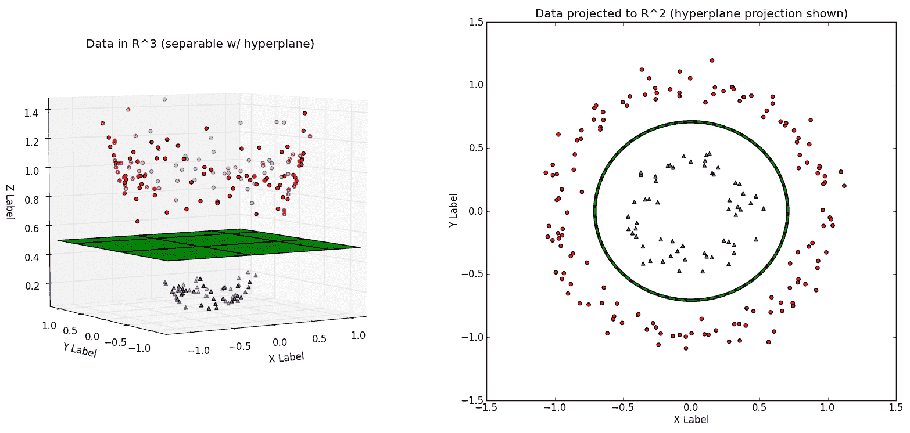

> 决策边界展示为绿色，左边是三维空间，右边是二维空间。与上一张来源相同。

总之，SVM 用于二元分类。它们尝试寻找一个平面，干净地分隔两个类。如果这不可能，我们可以软化“分隔”的定义，或者我们把数据放到高维，以便我们可以干净地分隔数据。

## 好的！

这一节中我们涉及了：

+   监督学习的分类任务
+   两种基础的分类方法：对数几率回归（LR）和支持向量机（SVM）
+   常见概念：sigmoid 函数，对数几率（对率），以及假阳性（误报）和假阴性（漏报）

在“2.3：监督学习 III”中，我们会深入非参数化监督学习，其中算法背后的概念都非常直观，并且对于特定类型的问题，表现都很优秀，但是模型可能难以解释。

## 练习材料和扩展阅读

### 2.2a 对数几率回归

Data School 拥有一个对数几率回归的非常棒的深入指南。我们也继续向你推荐[《An Introduction to Statistical Learning》](https://www-bcf.usc.edu/~gareth/ISL/)。对数几率回归请见第四章，支持向量机请见第九章。

为了解释对数几率回归，我们推荐你处理[这个问题集](https://datahack.analyticsvidhya.com/contest/practice-problem-1/)。你需要注册站点来完成它。很不幸，这就是人生。

### 2.2b 深入 SVM

为了深入 SVM 背后的数学，在 MIT 6.034：人工智能课程中观看 [Patrick Winston 教授的讲义](https://www.youtube.com/watch?v=_PwhiWxHK8o)，并查看[这个教程](https://pythonprogramming.net/svm-in-python-machine-learning-tutorial/)来完成 Python 实现。
