# 9 -- Linear Regression

上节课，我们主要介绍了在有noise的情况下，VC Bound理论仍然是成立的。同时，介绍了不同的error measure方法。本节课介绍机器学习最常见的一种算法：Linear Regression.

### **一、线性回归问题**

在之前的Linear Classification课程中，讲了信用卡发放的例子，利用机器学习来决定是否给用户发放信用卡。本节课仍然引入信用卡的例子，来解决给用户发放信用卡额度的问题，这就是一个线性回归（Linear Regression）问题。

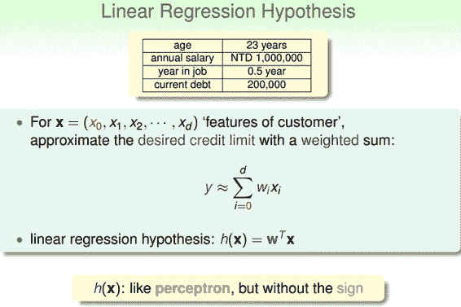

令用户特征集为d维的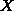，加上常数项，维度为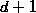，与权重的线性组合即为Hypothesis,记为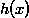。线性回归的预测函数取值在整个实数空间，这跟线性分类不同。

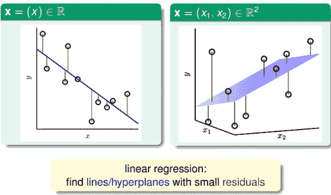

根据上图，在一维或者多维空间里，线性回归的目标是找到一条直线（对应一维）、一个平面（对应二维）或者更高维的超平面，使样本集中的点更接近它，也就是残留误差Residuals最小化。

一般最常用的错误测量方式是基于最小二乘法，其目标是计算误差的最小平方和对应的权重w，即上节课介绍的squared error：

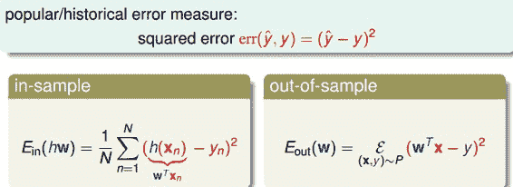

这里提一点，最小二乘法可以解决线性问题和非线性问题。线性最小二乘法的解是closed-form，即，而非线性最小二乘法没有closed-form，通常用迭代法求解。本节课的解就是closed-form的。关于最小二乘法的一些介绍，请参见我的另一篇博文：

[最小二乘法和梯度下降法的一些总结](http://blog.csdn.net/red_stone1/article/details/70306403)

### **二、线性回归算法**

样本数据误差是权重的函数，因为和都是已知的。我们的目标就是找出合适的，使能够最小。那么如何计算呢？

首先，运用矩阵转换的思想，将计算转换为矩阵的形式。

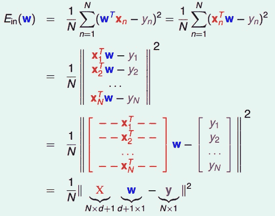

然后，对于此类线性回归问题，一般是个凸函数。凸函数的话，我们只要找到一阶导数等于零的位置，就找到了最优解。那么，我们将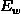对每个求偏导，偏导为零的，即为最优化的权重值分布。

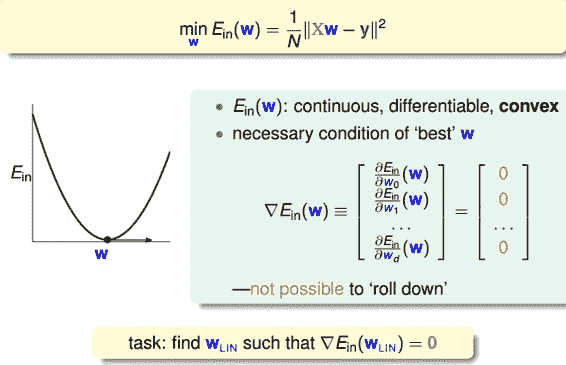

根据梯度的思想，对进行矩阵话求偏导处理：

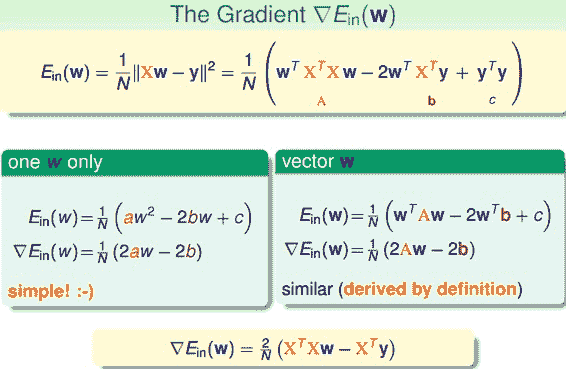

令偏导为零，最终可以计算出权重向量为：

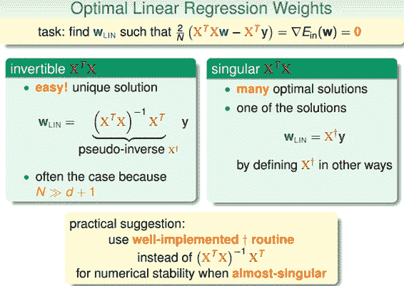

最终，我们推导得到了权重向量，这是上文提到的closed-form解。其中，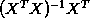又称为伪逆矩阵pseudo-inverse，记为，维度是(d+1)xN。

但是，我们注意到，伪逆矩阵中有逆矩阵的计算，逆矩阵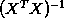是否一定存在？一般情况下，只要满足样本数量N远大于样本特征维度d+1，就能保证矩阵的逆是存在的，称之为非奇异矩阵。但是如果是奇异矩阵，不可逆怎么办呢？其实，大部分的计算逆矩阵的软件程序，都可以处理这个问题，也会计算出一个逆矩阵。所以，一般伪逆矩阵是可解的。

### **三、泛化问题**

现在，可能有这样一个疑问，就是这种求解权重向量的方法是机器学习吗？或者说这种方法满足我们之前推导VC Bound，即是否泛化能力强？

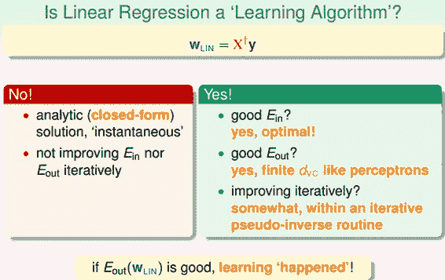

有两种观点：1、这不属于机器学习范畴。因为这种closed-form解的形式跟一般的机器学习算法不一样，而且在计算最小化误差的过程中没有用到迭代。2、这属于机器学习范畴。因为从结果上看，和都实现了最小化，而且实际上在计算逆矩阵的过程中，也用到了迭代。

其实，只从结果来看，这种方法的确实现了机器学习的目的。下面通过介绍一种更简单的方法，证明linear regression问题是可以通过线下最小二乘法方法计算得到好的和的。

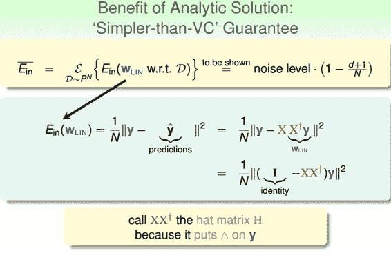

首先，我们根据平均误差的思想，把写成如图的形式，经过变换得到:

我们称为帽子矩阵，用H表示。

下面从几何图形的角度来介绍帽子矩阵H的物理意义。

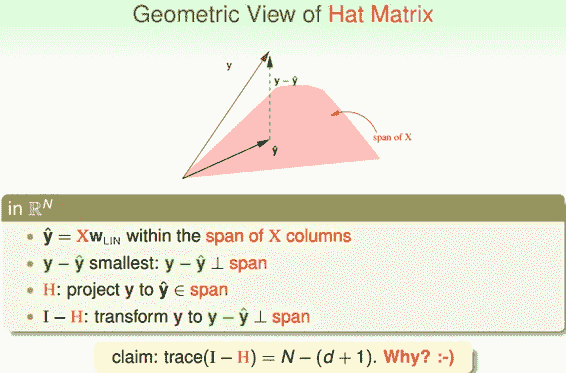

图中，y是N维空间的一个向量，粉色区域表示输入矩阵X乘以不同权值向量w所构成的空间，根据所有w的取值，预测输出都被限定在粉色的空间中。向量就是粉色空间中的一个向量，代表预测的一种。y是实际样本数据输出值。

机器学习的目的是在粉色空间中找到一个，使它最接近真实的y，那么我们只要将y在粉色空间上作垂直投影即可，投影得到的即为在粉色空间内最接近y的向量。这样即使平均误差最小。

从图中可以看出，是y的投影，已知，那么H表示的就是将y投影到的一种操作。图中绿色的箭头是向量y与相减，垂直于粉色区域。已知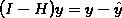那么I-H表示的就是将y投影到即垂直于粉色区域的一种操作。这样的话，我们就赋予了H和I-H不同但又有联系的物理意义。

这里trace(I-H)称为I-H的迹，值为N-(d+1)。这条性质很重要，一个矩阵的 trace等于该矩阵的所有特征值(Eigenvalues)之和。下面给出简单证明：

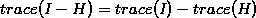
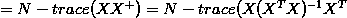
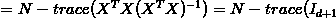
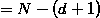

介绍下该I-H这种转换的物理意义：原来有一个有N个自由度的向量y，投影到一个有d+1维的空间x（代表一列的自由度，即单一输入样本的参数，如图中粉色区域），而余数剩余的自由度最大只有N-(d+1)种。

在存在noise的情况下，上图变为：

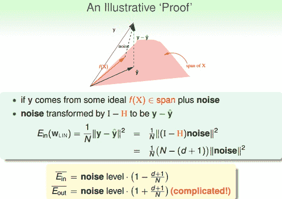

图中，粉色空间的红色箭头是目标函数f(x)，虚线箭头是noise，可见，真实样本输出y由f(x)和noise相加得到。由上面推导，已知向量y经过I-H转换为，而noise与y是线性变换关系，那么根据线性函数知识，我们推导出noise经过I-H也能转换为。则对于样本平均误差，有下列推导成立：

即

同样，对有如下结论：

这个证明有点复杂，但是我们可以这样理解：与形式上只差了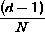项，从哲学上来说，是我们看得到的样本的平均误差，如果有noise，我们把预测往noise那边偏一点，让好看一点点，所以减去项。那么同时，新的样本是我们看不到的，如果noise在反方向，那么就应该加上项。

我们把与画出来，得到学习曲线：

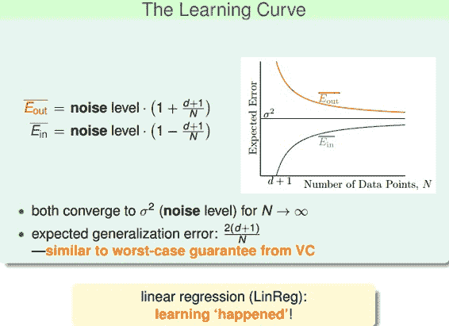

当N足够大时，与逐渐接近，满足，且数值保持在noise level。这就类似VC理论，证明了当N足够大的时候，这种线性最小二乘法是可以进行机器学习的，算法有效！

### **四、Linear Regression方法解决Linear Classification问题**

之前介绍的Linear Classification问题使用的Error Measure方法用的是0/1 error，那么Linear Regression的squared error是否能够应用到Linear Classification问题？

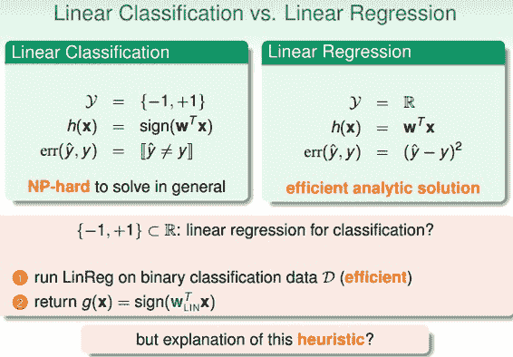

下图展示了两种错误的关系，一般情况下，squared error曲线在0/1 error曲线之上。即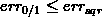.

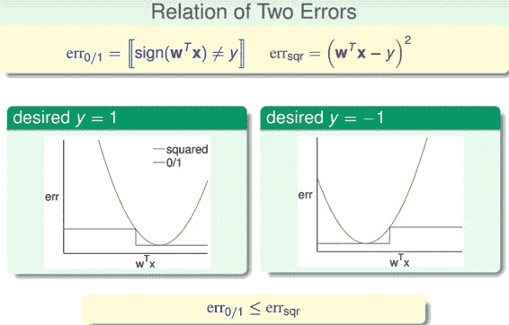

根据之前的VC理论，的上界满足：

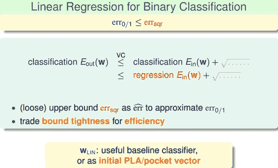

从图中可以看出，用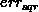代替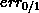，仍然有上界，只不过是上界变得宽松了。也就是说用线性回归方法仍然可以解决线性分类问题，效果不会太差。二元分类问题得到了一个更宽松的上界，但是也是一种更有效率的求解方式。

### **五、总结**

本节课，我们主要介绍了Linear Regression。首先，我们从问题出发，想要找到一条直线拟合实际数据值；然后，我们利用最小二乘法，用解析形式推导了权重w的closed-form解；接着，用图形的形式得到，证明了linear regression是可以进行机器学习的，；最后，我们证明linear regressin这种方法可以用在binary classification上，虽然上界变宽松了，但是仍然能得到不错的学习方法。

**_注明：_**

文章中所有的图片均来自台湾大学林轩田《机器学习基石》课程