# 10 -- Logistic Regression

上一节课，我们介绍了Linear Regression线性回归，以及用平方错误来寻找最佳的权重向量w，获得最好的线性预测。本节课将介绍Logistic Regression逻辑回归问题。

### **一、Logistic Regression Problem**

一个心脏病预测的问题：根据患者的年龄、血压、体重等信息，来预测患者是否会有心脏病。很明显这是一个二分类问题，其输出y只有{-1,1}两种情况。

二元分类，一般情况下，理想的目标函数f(x)&gt;0.5，则判断为正类1；若f(x)&lt;0.5，则判断为负类-1。

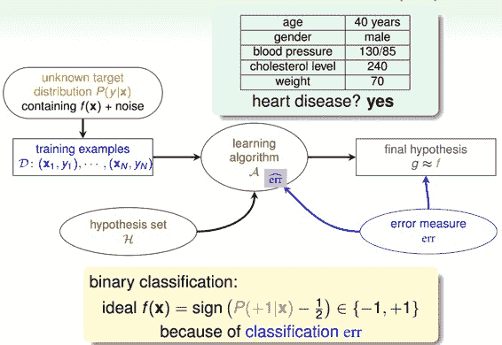

但是，如果我们想知道的不是患者有没有心脏病，而是到底患者有多大的几率是心脏病。这表示，我们更关心的是目标函数的值（分布在0,1之间），表示是正类的概率（正类表示是心脏病）。这跟我们原来讨论的二分类问题不太一样，我们把这个问题称为软性二分类问题（’soft’ binary classification）。这个值越接近1，表示正类的可能性越大；越接近0，表示负类的可能性越大。

对于软性二分类问题，理想的数据是分布在[0,1]之间的具体值，但是实际中的数据只可能是0或者1，我们可以把实际中的数据看成是理想数据加上了噪声的影响。

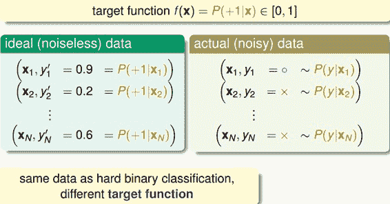

如果目标函数是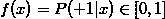的话，我们如何找到一个好的Hypothesis跟这个目标函数很接近呢？

首先，根据我们之前的做法，对所有的特征值进行加权处理。计算的结果s，我们称之为’risk score’：

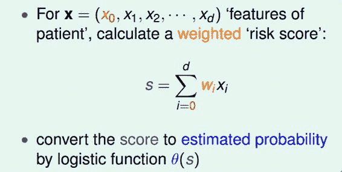

但是特征加权和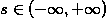，如何将s值限定在[0,1]之间呢？一个方法是使用sigmoid Function，记为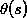。那么我们的目标就是找到一个hypothesis：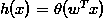。

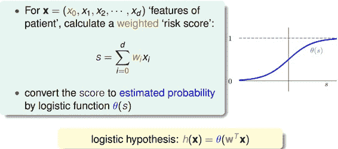

Sigmoid Function函数记为，满足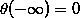，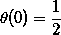，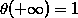。这个函数是平滑的、单调的S型函数。则对于逻辑回归问题，hypothesis就是这样的形式：

那我们的目标就是求出这个预测函数h(x)，使它接近目标函数f(x)。

### **二、Logistic Regression Error**

现在我们将Logistic Regression与之前讲的Linear Classification、Linear Regression做个比较：

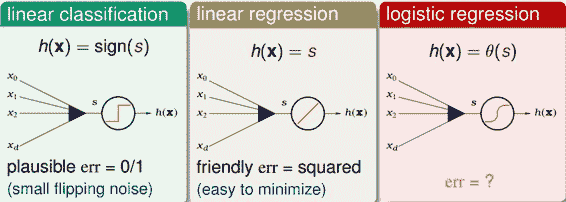

这三个线性模型都会用到线性scoring function 。linear classification的误差使用的是0/1 err；linear regression的误差使用的是squared err。那么logistic regression的误差该如何定义呢？

先介绍一下“似然性”的概念。目标函数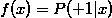，如果我们找到了hypothesis很接近target function。也就是说，在所有的Hypothesis集合中找到一个hypothesis与target function最接近，能产生同样的数据集D，包含y输出label，则称这个hypothesis是最大似然likelihood。

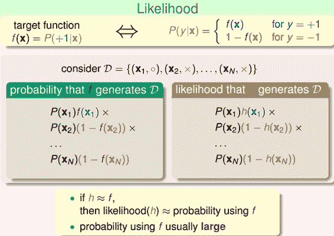

logistic function: 满足一个性质：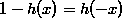。那么，似然性h:

因为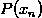对所有的h来说，都是一样的，所以我们可以忽略它。那么我们可以得到logistic h正比于所有的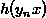乘积。我们的目标就是让乘积值最大化。

如果将w代入的话：

为了把连乘问题简化计算，我们可以引入ln操作，让连乘转化为连加：

接着，我们将maximize问题转化为minimize问题，添加一个负号就行，并引入平均数操作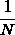：

将logistic function的表达式带入，那么minimize问题就会转化为如下形式：

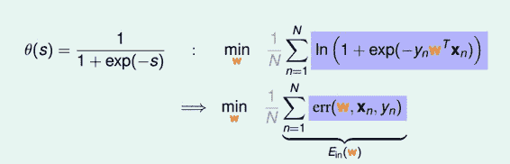

至此，我们得到了logistic regression的err function，称之为cross-entropy error交叉熵误差：

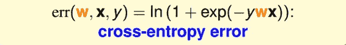

### **三、Gradient of Logistic Regression Error**

我们已经推导了的表达式，那接下来的问题就是如何找到合适的向量w，让最小。

Logistic Regression的是连续、可微、二次可微的凸曲线（开口向上），根据之前Linear Regression的思路，我们只要计算的梯度为零时的w，即为最优解。

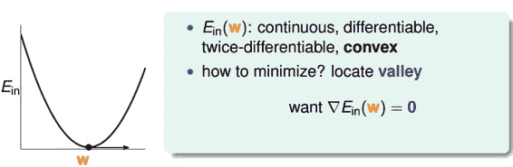

对计算梯度，学过微积分的都应该很容易计算出来：

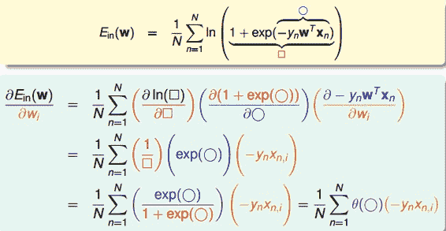

最终得到的梯度表达式为：

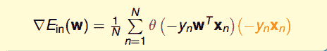

为了计算最小值，我们就要找到让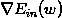等于0的位置。

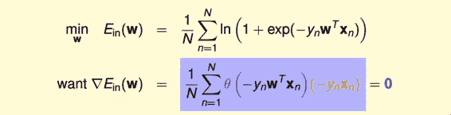

上式可以看成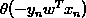是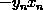的线性加权。要求与的线性加权和为0，那么一种情况是线性可分，如果所有的权重为0，那就能保证为0。是sigmoid function，根据其特性，只要让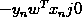，即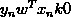。表示对于所有的点，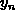与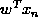都是同号的，这表示数据集D必须是全部线性可分的才能成立。

然而，保证所有的权重为0是不太现实的，总有不等于0的时候，那么另一种常见的情况是非线性可分，只能通过使加权和为零，来求解w。这种情况没有closed-form解，与Linear Regression不同，只能用迭代方法求解。

之前所说的Linear Regression有closed-form解，可以说是“一步登天”的；但是PLA算法是一步一步修正迭代进行的，每次对错误点进行修正，不断更新w值。PLA的迭代优化过程表示如下：

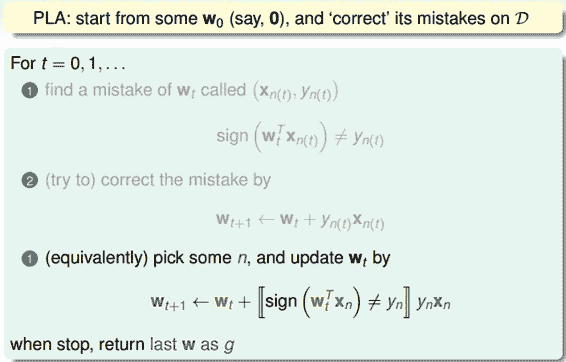

w每次更新包含两个内容：一个是每次更新的方向，用表示，另一个是每次更新的步长。参数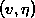和终止条件决定了我们的迭代优化算法。

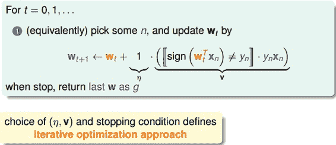

### **四、Gradient Descent**

根据上一小节PLA的思想，迭代优化让每次w都有更新：

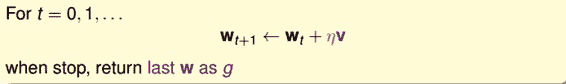

我们把曲线看做是一个山谷的话，要求最小，即可比作下山的过程。整个下山过程由两个因素影响：一个是下山的单位方向；另外一个是下山的步长。

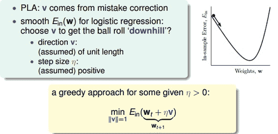

利用微分思想和线性近似，假设每次下山我们只前进一小步，即很小，那么根据泰勒Taylor一阶展开，可以得到：

关于Taylor展开的介绍，可参考我另一篇博客：
[多元函数的泰勒(Taylor)展开式](http://blog.csdn.net/red_stone1/article/details/70260070)

迭代的目的是让越来越小，即让。是标量，因为如果两个向量方向相反的话，那么他们的内积最小（为负），也就是说如果方向与梯度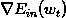反向的话，那么就能保证每次迭代都成立。则，我们令下降方向为：

是单位向量，每次都是沿着梯度的反方向走，这种方法称为梯度下降（gradient descent）算法。那么每次迭代公式就可以写成：

下面讨论一下的大小对迭代优化的影响：如果太小的话，那么下降的速度就会很慢；如果太大的话，那么之前利用Taylor展开的方法就不准了，造成下降很不稳定，甚至会上升。因此，应该选择合适的值，一种方法是在梯度较小的时候，选择小的，梯度较大的时候，选择大的，即正比于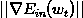。这样保证了能够快速、稳定地得到最小值。

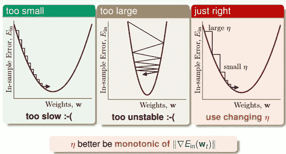

对学习速率做个更修正，梯度下降算法的迭代公式可以写成：

其中：

总结一下基于梯度下降的Logistic Regression算法步骤如下：

*   **初始化**
*   **计算梯度**
*   **迭代跟新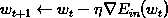**
*   **满足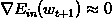或者达到迭代次数，迭代结束**

### **五、总结**

我们今天介绍了Logistic Regression。首先，从逻辑回归的问题出发，将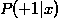作为目标函数，将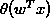作为hypothesis。接着，我们定义了logistic regression的err function，称之为cross-entropy error交叉熵误差。然后，我们计算logistic regression error的梯度，最后，通过梯度下降算法，计算时对应的值。

**_注明：_**

文章中所有的图片均来自台湾大学林轩田《机器学习基石》课程