# 12 -- Nonlinear Transformation

上一节课，我们介绍了分类问题的三种线性模型，可以用来解决binary classification和multiclass classification问题。本节课主要介绍非线性的模型来解决分类问题。

### **一、Quadratic Hypothesis**

之前介绍的线性模型，在2D平面上是一条直线，在3D空间中是一个平面。数学上，我们用线性得分函数s来表示：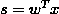。其中，x为特征值向量，w为权重，s是线性的。

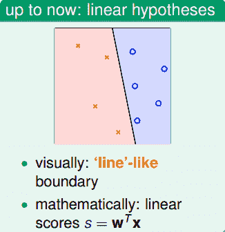

线性模型的优点就是，它的VC Dimension比较小，保证了。但是缺点也很明显，对某些非线性问题，可能会造成很大，虽然，但是也造成很大，分类效果不佳。

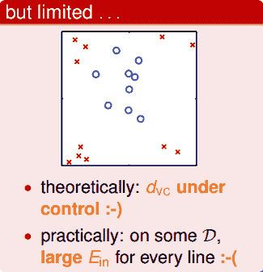

为了解决线性模型的缺点，我们可以使用非线性模型来进行分类。例如数据集D不是线性可分的，而是圆形可分的，圆形内部是正类，外面是负类。假设它的hypotheses可以写成：

基于这种非线性思想，我们之前讨论的PLA、Regression问题都可以有非线性的形式进行求解。

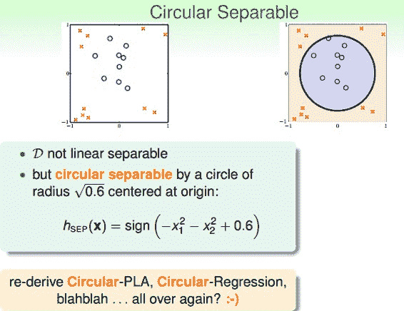

下面介绍如何设计这些非线性模型的演算法。还是上面介绍的平面圆形分类例子，它的h(x)的权重w0=0.6，w1=-1，w2=-1，但是h(x)的特征不是线性模型的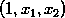，而是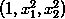。我们令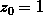，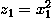，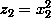，那么，h(x)变成：

这种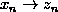的转换可以看成是x空间的点映射到z空间中去，而在z域中，可以用一条直线进行分类，也就是从x空间的圆形可分映射到z空间的线性可分。z域中的直线对应于x域中的圆形。因此，我们把这个过程称之为特征转换（Feature Transform）。通过这种特征转换，可以将非线性模型转换为另一个域中的线性模型。

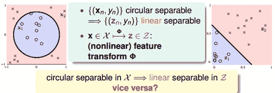

已知x域中圆形可分在z域中是线性可分的，那么反过来，如果在z域中线性可分，是否在x域中一定是圆形可分的呢？答案是否定的。由于权重向量w取值不同，x域中的hypothesis可能是圆形、椭圆、双曲线等等多种情况。

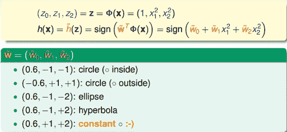

目前讨论的x域中的圆形都是圆心过原点的，对于圆心不过原点的一般情况，映射公式包含的所有项为：

也就是说，对于二次hypothesis，它包含二次项、一次项和常数项1，z域中每一条线对应x域中的某二次曲线的分类方式，也许是圆，也许是椭圆，也许是双曲线等等。那么z域中的hypothesis可以写成：

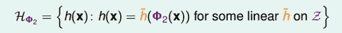

### **二、Nonlinear Transform**

上一部分我们定义了什么了二次hypothesis，那么这部分将介绍如何设计一个好的二次hypothesis来达到良好的分类效果。那么目标就是在z域中设计一个最佳的分类线。

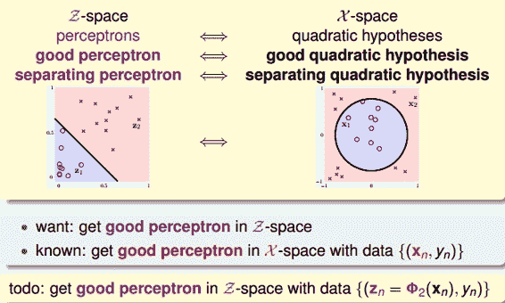

其实，做法很简单，利用映射变换的思想，通过映射关系，把x域中的最高阶二次的多项式转换为z域中的一次向量，也就是从quardratic hypothesis转换成了perceptrons问题。用z值代替x多项式，其中向量z的个数与x域中x多项式的个数一致（包含常数项）。这样就可以在z域中利用线性分类模型进行分类训练。训练好的线性模型之后，再将z替换为x的多项式就可以了。具体过程如下：

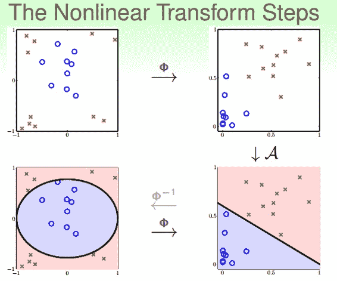

整个过程就是通过映射关系，换个空间去做线性分类，重点包括两个：

*   特征转换

*   训练线性模型

其实，我们以前处理机器学习问题的时候，已经做过类似的特征变换了。比如数字识别问题，我们从原始的像素值特征转换为一些实际的concrete特征，比如密度、对称性等等，这也用到了feature transform的思想。

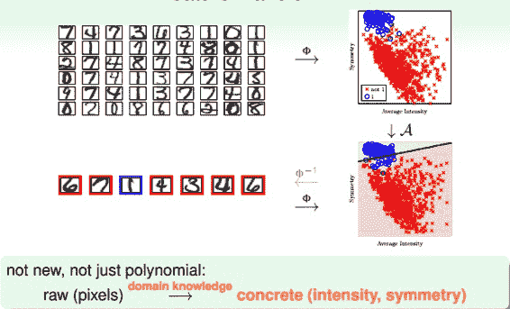

### **三、Price of Nonlinear Transform**

若x特征维度是d维的，也就是包含d个特征，那么二次多项式个数，即z域特征维度是：

如果x特征维度是2维的，即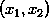，那么它的二次多项式为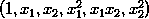，有6个。

现在，如果阶数更高，假设阶数为Q，那么对于x特征维度是d维的，它的z域特征维度为：

由上式可以看出，计算z域特征维度个数的时间复杂度是Q的d次方，随着Q和d的增大，计算量会变得很大。同时，空间复杂度也大。也就是说，这种特征变换的一个代价是计算的时间、空间复杂度都比较大。

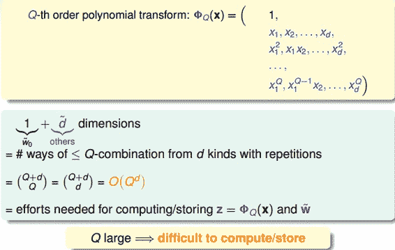

另一方面，z域中特征个数随着Q和d增加变得很大，同时权重w也会增大，即自由度增加，VC Dimension增大。令z域中的特征维度是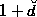，则在在域中，任何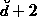的输入都不能被shattered；同样，在x域中，任何的输入也不能被shattered。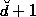是VC Dimension的上界，如果很大的时候，相应的VC Dimension就会很大。根据之前章节课程的讨论，VC Dimension过大，模型的泛化能力会比较差。

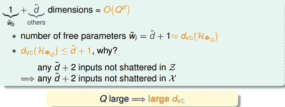

下面通过一个例子来解释为什么VC Dimension过大，会造成不好的分类效果：

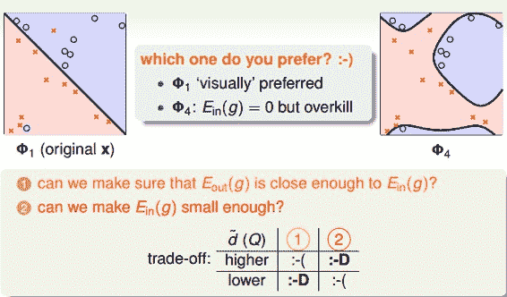

上图中，左边是用直线进行线性分类，有部分点分类错误；右边是用四次曲线进行非线性分类，所有点都分类正确，那么哪一个分类效果好呢？单从平面上这些训练数据来看，四次曲线的分类效果更好，但是四次曲线模型很容易带来过拟合的问题，虽然它的比较小，从泛化能力上来说，还是左边的分类器更好一些。也就是说VC Dimension过大会带来过拟合问题，不能太大了。

那么如何选择合适的Q，来保证不会出现过拟合问题，使模型的泛化能力强呢？一般情况下，为了尽量减少特征自由度，我们会根据训练样本的分布情况，人为地减少、省略一些项。但是，这种人为地删减特征会带来一些“自我分析”代价，虽然对训练样本分类效果好，但是对训练样本外的样本，不一定效果好。所以，一般情况下，还是要保存所有的多项式特征，避免对训练样本的人为选择。

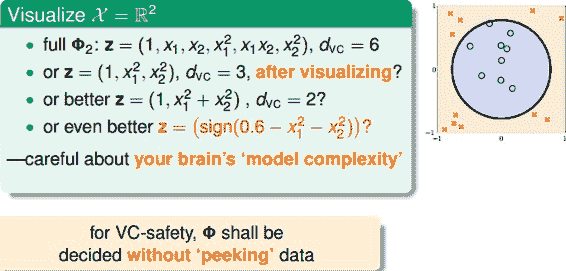

### **四、Structured Hypothesis Sets**

下面，我们讨论一下从x域到z域的多项式变换。首先，如果特征维度只有1维的话，那么变换多项式只有常数项：

如果特征维度是两维的，变换多项式包含了一维的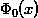：

如果特征维度是三维的，变换多项式包含了二维的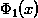：

以此类推，如果特征维度是Q次，那么它的变换多项式为：

那么对于不同阶次构成的hypothesis有如下关系：

我们把这种结构叫做Structured Hypothesis Sets：

那么对于这种Structured Hypothesis Sets，它们的VC Dimension满足下列关系：

它的满足下列关系：

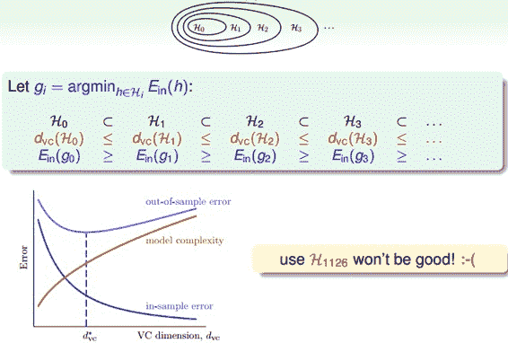

从上图中也可以看到，随着变换多项式的阶数增大，虽然逐渐减小，但是model complexity会逐渐增大，造成很大，所以阶数不能太高。

那么，如果选择的阶数很大，确实能使接近于0，但是泛化能力通常很差，我们把这种情况叫做tempting sin。所以，一般最合适的做法是先从低阶开始，如先选择一阶hypothesis，看看是否很小，如果足够小的话就选择一阶，如果大的话，再逐渐增加阶数，直到满足要求为止。也就是说，尽量选择低阶的hypothes，这样才能得到较强的泛化能力。

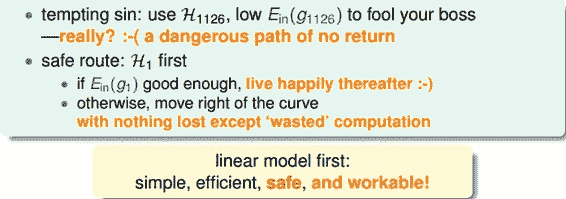

### **五、总结**

这节课主要介绍了非线性分类模型，通过非线性变换，将非线性模型映射到另一个空间，转换为线性模型，再来进行线性分类。本节课完整介绍了非线性变换的整体流程，以及非线性变换可能会带来的一些问题：时间复杂度和空间复杂度的增加。最后介绍了在要付出代价的情况下，使用非线性变换的最安全的做法，尽可能使用简单的模型，而不是模型越复杂越好。

**_注明：_**

文章中所有的图片均来自台湾大学林轩田《机器学习基石》课程