# 13 -- Hazard of Overfitting

上节课我们主要介绍了非线性分类模型，通过非线性变换，将非线性模型映射到另一个空间，转换为线性模型，再来进行分类，分析了非线性变换可能会使计算复杂度增加。本节课介绍这种模型复杂度增加带来机器学习中一个很重要的问题：过拟合（overfitting）。

### **一、What is Overfitting?**

首先，我们通过一个例子来介绍什么bad generalization。假设平面上有5个点，目标函数f(x)是2阶多项式，如果hypothesis是二阶多项式加上一些小的noise的话，那么这5个点很靠近这个hypothesis，很小。如果hypothesis是4阶多项式，那么这5点会完全落在hypothesis上，。虽然4阶hypothesis的比2阶hypothesis的要好很多，但是它的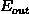很大。因为根据VC Bound理论，阶数越大，即VC Dimension越大，就会让模型复杂度更高，更大。我们把这种很小，很大的情况称之为bad generation，即泛化能力差。

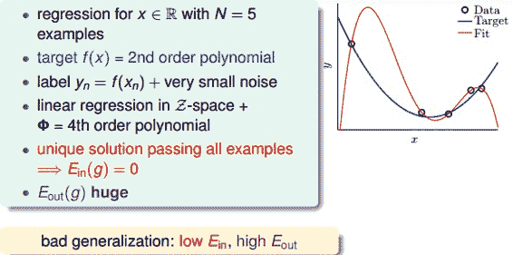

我们回过头来看一下VC曲线：

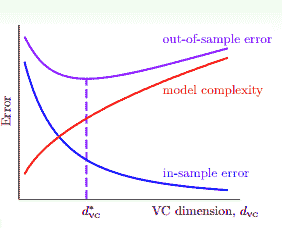

hypothesis的阶数越高，表示VC Dimension越大。随着VC Dimension增大，是一直减小的，而先减小后增大。在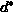位置，取得最小值。在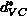右侧，随着VC Dimension越来越大，越来越小，接近于0，越来越大。即当VC Dimension很大的时候，这种对训练样本拟合过分好的情况称之为过拟合（overfitting）。另一方面，在左侧，随着VC Dimension越来越小，和都越来越大，这种情况称之为欠拟合（underfitting），即模型对训练样本的拟合度太差，VC Dimension太小了。

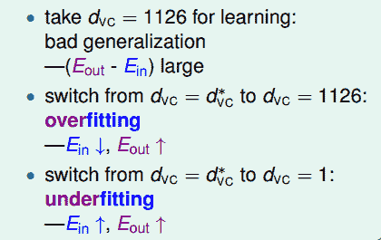

bad generation和overfitting的关系可以理解为：overfitting是VC Dimension过大的一个过程，bad generation是overfitting的结果。

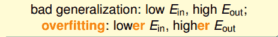

一个好的fit，和都比较小，尽管没有足够接近零；而对overfitting来说，，但是很大。那么，overfitting的原因有哪些呢？

我们举个开车的例子，把发生车祸比作成overfitting，那么造成车祸的原因包括：

*   **车速太快（VC Dimension太大）；**

*   **道路崎岖（noise）；**

*   **对路况的了解程度（训练样本数量N不够）；**

也就是说，VC Dimension、noise、N这三个因素是影响过拟合现象的关键。

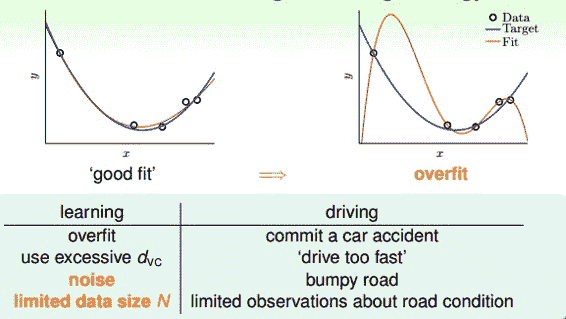

### **二、The Role of Noise and Data Size**

为了尽可能详细地解释overfitting，我们进行这样一个实验，试验中的数据集不是很大。首先，在二维平面上，一个模型的分布由目标函数f(x)（x的10阶多项式）加上一些noise构成，下图中，离散的圆圈是数据集，目标函数是蓝色的曲线。数据没有完全落在曲线上，是因为加入了noise。

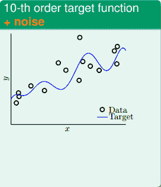

然后，同样在二维平面上，另一个模型的分布由目标函数f(x)（x的50阶多项式）构成，没有加入noise。下图中，离散的圆圈是数据集，目标函数是蓝色的曲线。可以看出由于没有noise，数据集完全落在曲线上。

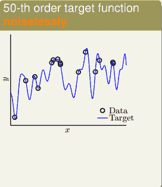

现在，有两个学习模型，一个是2阶多项式，另一个是10阶多项式，分别对上面两个问题进行建模。首先，对于第一个目标函数是10阶多项式包含noise的问题，这两个学习模型的效果如下图所示：

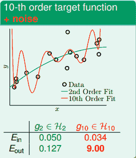

由上图可知，2阶多项式的学习模型，；10阶多项式的学习模型，。虽然10阶模型的比2阶的小，但是其要比2阶的大得多，而2阶的和相差不大，很明显用10阶的模型发生了过拟合。

然后，对于第二个目标函数是50阶多项式没有noise的问题，这两个学习模型的效果如下图所示：

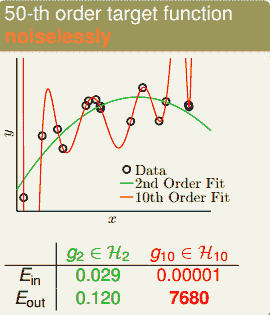

由上图可知，2阶多项式的学习模型，；10阶多项式的学习模型，。虽然10阶模型的比2阶的小，但是其要比2阶的大得多的多，而2阶的和相差不大，很明显用10阶的模型仍然发生了明显的过拟合。

上面两个问题中，10阶模型都发生了过拟合，反而2阶的模型却表现得相对不错。这好像违背了我们的第一感觉，比如对于目标函数是10阶多项式，加上noise的模型，按道理来说应该是10阶的模型更能接近于目标函数，因为它们阶数相同。但是，事实却是2阶模型泛化能力更强。这种现象产生的原因，从哲学上来说，就是“以退为进”。有时候，简单的学习模型反而能表现的更好。

下面从learning curve来分析一下具体的原因，learning curve描述的是和随着数据量N的变化趋势。下图中左边是2阶学习模型的learning curve，右边是10阶学习模型的learning curve。

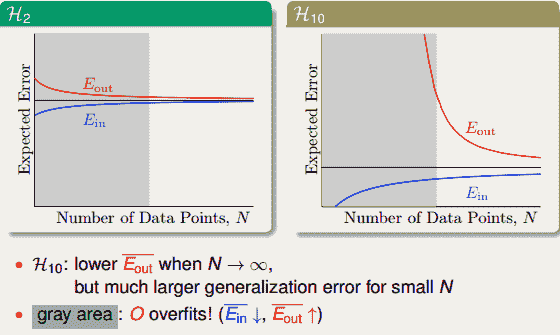

我们的第9次课的笔记 [NTU林轩田机器学习基石课程学习笔记9 – Linear Regression](http://blog.csdn.net/red_stone1/article/details/71599034)已经介绍过了learning curve。在learning curve中，横轴是样本数量N，纵轴是Error。和可表示为：

其中d为模型阶次，左图中d=2，右图中d=10。

本节的实验问题中，数据量N不大，即对应于上图中的灰色区域。左图的灰色区域中，因为d=2，和相对来说比较接近；右图中的灰色区域中，d=10，根据和的表达式，很小，而很大。这就解释了之前2阶多项式模型的更接近，泛化能力更好。

值得一提的是，如果数据量N很大的时候，上面两图中和都比较接近，但是对于高阶模型，z域中的特征很多的时候，需要的样本数量N很大，且容易发生维度灾难。关于维度灾难的详细生动解释，请参考我另一篇博文：

[机器学习中的维度灾难](http://blog.csdn.net/red_stone1/article/details/71692444)

另一个例子中，目标函数是50阶多项式，且没有加入noise。这种情况下，我们发现仍然是2阶的模型拟合的效果更好一些，明明没有noise，为什么是这样的结果呢？

实际上，我们忽略了一个问题：这种情况真的没有noise吗？其实，当模型很复杂的时候，即50阶多项式的目标函数，无论是2阶模型还是10阶模型，都不能学习的很好，这种复杂度本身就会引入一种‘noise’。所以，这种高阶无noise的问题，也可以类似于10阶多项式的目标函数加上noise的情况，只是二者的noise有些许不同，下面一部分将会详细解释。

### **三、Deterministic Noise**

下面我们介绍一个更细节的实验来说明 什么时候小心overfit会发生。假设我们产生的数据分布由两部分组成：第一部分是目标函数f(x)，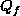阶多项式；第二部分是噪声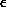，服从Gaussian分布。接下来我们分析的是noise强度不同对overfitting有什么样的影响。总共的数据量是N。

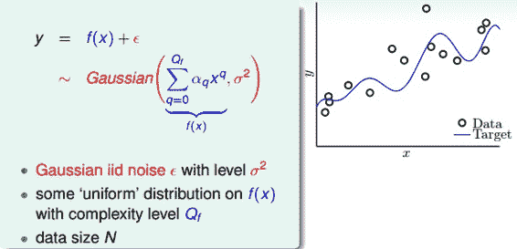

那么下面我们分析不同的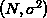和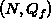对overfit的影响。overfit可以量化为。结果如下：

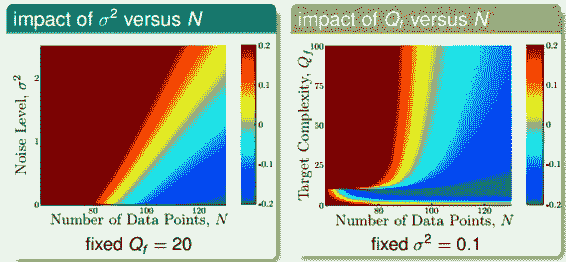

上图中，红色越深，代表overfit程度越高，蓝色越深，代表overfit程度越低。先看左边的图，左图中阶数固定为20，横坐标代表样本数量N，纵坐标代表噪声水平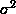。红色区域集中在N很小或者很大的时候，也就是说N越大，越小，越不容易发生overfit。右边图中，横坐标代表样本数量N，纵坐标代表目标函数阶数。红色区域集中在N很小或者很大的时候，也就是说N越大，越小，越不容易发生overfit。上面两图基本相似。

从上面的分析，我们发现对overfit是有很大的影响的，我们把这种noise称之为stochastic noise。同样地，即模型复杂度也对overfit有很大影响，而且二者影响是相似的，所以我们把这种称之为deterministic noise。之所以把它称为noise，是因为模型高复杂度带来的影响。

总结一下，有四个因素会导致发生overfitting：

*   **data size N 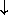**

*   **stochastic noise **

*   **deterministic noise **

*   **excessive power 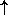**

我们刚才解释了如果目标函数f(x)的复杂度很高的时候，那么跟有noise也没有什么两样。因为目标函数很复杂，那么再好的hypothesis都会跟它有一些差距，我们把这种差距称之为deterministic noise。deterministic noise与stochastic noise不同，但是效果一样。其实deterministic noise类似于一个伪随机数发生器，它不会产生真正的随机数，而只产生伪随机数。它的值与hypothesis有关，且固定点x的deterministic noise值是固定的。

### **四、Dealing with Overfitting**

现在我们知道了什么是overfitting，和overfitting产生的原因，那么如何避免overfitting呢？避免overfitting的方法主要包括：

*   **start from simple model**

*   **data cleaning/pruning**

*   **data hinting**

*   **regularization**

*   **validataion**

这几种方法类比于之前举的开车的例子，对应如下：

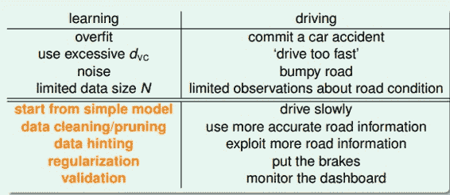

regularization和validation我们之后的课程再介绍，本节课主要介绍简单的data cleaning/pruning和data hinting两种方法。

data cleaning/pruning就是对训练数据集里label明显错误的样本进行修正（data cleaning），或者对错误的样本看成是noise，进行剔除（data pruning）。data cleaning/pruning关键在于如何准确寻找label错误的点或者是noise的点，而且如果这些点相比训练样本N很小的话，这种处理效果不太明显。

data hinting是针对N不够大的情况，如果没有办法获得更多的训练集，那么data hinting就可以对已知的样本进行简单的处理、变换，从而获得更多的样本。举个例子，数字分类问题，可以对已知的数字图片进行轻微的平移或者旋转，从而让N丰富起来，达到扩大训练集的目的。这种额外获得的例子称之为virtual examples。但是要注意一点的就是，新获取的virtual examples可能不再是iid某个distribution。所以新构建的virtual examples要尽量合理，且是独立同分布的。

### **五、总结**

本节课主要介绍了overfitting的概念，即当很小，很大的时候，会出现overfitting。详细介绍了overfitting发生的四个常见原因data size N、stochastic noise、deterministic noise和excessive power。解决overfitting的方法有很多，本节课主要介绍了data cleaning/pruning和data hinting两种简单的方法，之后的课程将会详细介绍regularization和validataion两种更重要的方法。

**_注明：_**

文章中所有的图片均来自台湾大学林轩田《机器学习基石》课程