# 14 -- Regularization

上节课我们介绍了过拟合发生的原因：excessive power, stochastic/deterministic noise 和limited data。并介绍了解决overfitting的简单方法。本节课，我们将介绍解决overfitting的另一种非常重要的方法：Regularization规则化。

### **一、Regularized Hypothesis Set**

先来看一个典型的overfitting的例子：

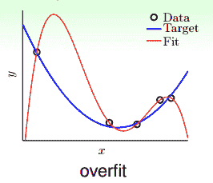

如图所示，在数据量不够大的情况下，如果我们使用一个高阶多项式（图中红色曲线所示），例如10阶，对目标函数（蓝色曲线）进行拟合。拟合曲线波动很大，虽然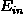很小，但是很大，也就造成了过拟合现象。

那么如何对过拟合现象进行修正，使hypothesis更接近于target function呢？一种方法就是regularized fit。

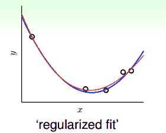

这种方法得到的红色fit曲线，要比overfit的红色曲线平滑很多，更接近与目标函数，它的阶数要更低一些。那么问题就变成了我们要把高阶（10阶）的hypothesis sets转换为低阶（2阶）的hypothesis sets。通过下图我们发现，不同阶数的hypothesis存在如下包含关系：

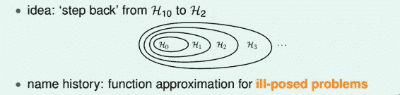

我们发现10阶多项式hypothesis sets里包含了2阶多项式hypothesis sets的所有项，那么在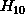中加入一些限定条件，使它近似为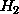即可。这种函数近似曾被称之为不适定问题（ill-posed problem）。

如何从10阶转换为2阶呢？首先，可表示为：

而可表示为：

所以，如果限定条件是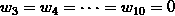，那么就有。也就是说，对于高阶的hypothesis，为了防止过拟合，我们可以将其高阶部分的权重w限制为0，这样，就相当于从高阶的形式转换为低阶，fit波形更加平滑，不容易发生过拟合。

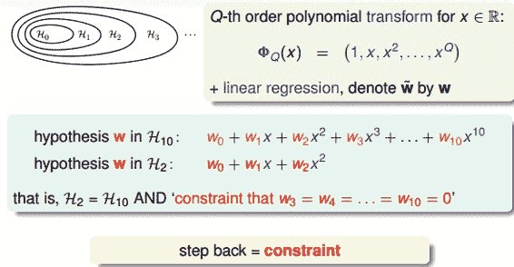

那有一个问题，令高阶权重w为0，为什么不直接使用呢？这样做的目的是拓展我们的视野，为即将讨论的问题做准备。刚刚我们讨论的限制是高阶部分的权重w限制为0，这是比较苛刻的一种限制。下面，我们把这个限制条件变得更宽松一点，即令任意8个权重w为0，并不非要限定，这个Looser Constraint可以写成：

也就只是限定了w不为0的个数，并不限定必须是高阶的w。这种hypothesis记为，称为sparse hypothesis set，它与和的关系为：

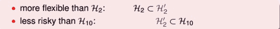

Looser Constraint对应的hypothesis应该更好解一些，但事实是sparse hypothesis set 被证明也是NP-hard，求解非常困难。所以，还要转换为另一种易于求解的限定条件。

那么，我们寻找一种更容易求解的宽松的限定条件Softer Constraint，即：

其中，C是常数，也就是说，所有的权重w的平方和的大小不超过C，我们把这种hypothesis sets记为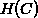。

与的关系是，它们之间有重叠，有交集的部分，但是没有完全包含的关系，也不一定相等。对应，C值越大，限定的范围越大，即越宽松：

当C无限大的时候，即限定条件非常宽松，相当于没有加上任何限制，就与没有什么两样。称为regularized hypothesis set，这种形式的限定条件是可以进行求解的，我们把求解的满足限定条件的权重w记为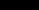。接下来就要探讨如何求解。

### **二、Weight Decay Regularization**

现在，针对H(c)，即加上限定条件，我们的问题变成：

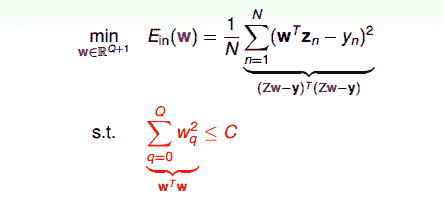

我们的目的是计算的最小值，限定条件是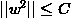。这个限定条件从几何角度上的意思是，权重w被限定在半径为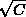的圆内，而球外的w都不符合要求，即便它是靠近梯度为零的w。

下面用一张图来解释在限定条件下，最小化的过程：

如上图所示，假设在空间中的一点w，根据梯度下降算法，w会朝着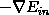的方向移动（图中蓝色箭头指示的方向），在没有限定条件的情况下，w最终会取得最小值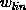，即“谷底”的位置。现在，加上限定条件，即w被限定在半径为的圆内，w距离原点的距离不能超过圆的半径，球如图中红色圆圈所示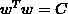。那么，这种情况下，w不能到达的位置，最大只能位于圆上，沿着圆的切线方向移动（图中绿色箭头指示的方向）。与绿色向量垂直的向量（图中红色箭头指示的方向）是圆切线的法向量，即w的方向，w不能靠近红色箭头方向移动。那么随着迭代优化过程，只要与w点切线方向不垂直，那么根据向量知识，一定在w点切线方向上有不为零的分量，即w点会继续移动。只有当与绿色切线垂直，即与红色法向量平行的时候，在切线方向上没有不为零的分量了，也就表示这时w达到了最优解的位置。

有了这个平行的概念，我们就得到了获得最优解需要满足的性质：

上面公式中的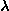称为Lagrange multiplier，是用来解有条件的最佳化问题常用的数学工具，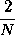是方便后面公式推导。那么我们的目标就变成了求解满足上面公式的。

之前我们推导过，线性回归的的表达式为：

计算梯度，并代入到平行条件中，得到：

这是一个线性方程式，直接得到为：

上式中包含了求逆矩阵的过程，因为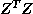是半正定矩阵，如果大于零，那么一定是正定矩阵，即一定可逆。另外提一下，统计学上把这叫做ridge regression，可以看成是linear regression的进阶版。

如果对于更一般的情况，例如逻辑回归问题中，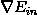不是线性的，那么将其代入平行条件中得到的就不是一个线性方程式，不易求解。下面我们从另一个角度来看一下平行等式：

已知是对的导数，而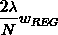也可以看成是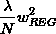的导数。那么平行等式左边可以看成一个函数的导数，导数为零，即求该函数的最小值。也就是说，问题转换为最小化该函数：

该函数中第二项就是限定条件regularizer，也称为weight-decay regularization。我们把这个函数称为Augmented Error，即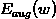。

如果不为零，对应于加上了限定条件，若等于零，则对应于没有任何限定条件，问题转换成之前的最小化。

下面给出一个曲线拟合的例子，取不同的值时，得到的曲线也不相同：

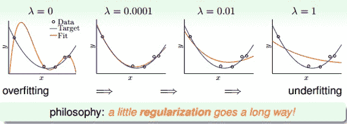

从图中可以看出，当时，发生了过拟合；当时，拟合的效果很好；当和时，发生了欠拟合。我们可以把看成是一种penality，即对hypothesis复杂度的惩罚，越大，w就越小，对应于C值越小，即这种惩罚越大，拟合曲线就会越平滑，高阶项就会削弱，容易发生欠拟合。一般取比较小的值就能达到良好的拟合效果，过大过小都有问题，但究竟取什么值，要根据具体训练数据和模型进行分析与调试。

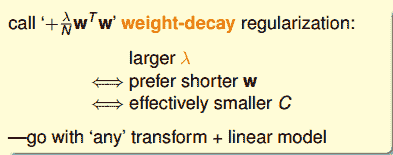

事实上，这种regularization不仅可以用在多项式的hypothesis中，还可以应用在logistic regression等其他hypothesis中，都可以达到防止过拟合的效果。

我们目前讨论的多项式是形如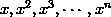的形式，若x的范围限定在[-1,1]之间，那么可能导致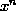相对于低阶的值要小得多，则其对于的w非常大，相当于要给高阶项设置很大的惩罚。为了避免出现这种数据大小差别很大的情况，可以使用Legendre Polynomials代替这种形式，Legendre Polynomials各项之间是正交的，用它进行多项式拟合的效果更好。关于Legendre Polynomials的概念这里不详细介绍，有兴趣的童鞋可以看一下[维基百科](https://en.wikipedia.org/wiki/Legendre_polynomials)。

### **三、Regularization and VC Theory**

下面我们研究一下Regularization与VC理论之间的关系。Augmented Error表达式如下：

VC Bound表示为：

其中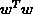表示的是单个hypothesis的复杂度，记为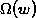；而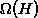表示整个hypothesis set的复杂度。根据Augmented Error和VC Bound的表达式，包含于之内，所以，比更接近于，即更好地代表，与之间的误差更小。

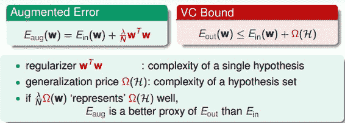

根据VC Dimension理论，整个hypothesis set的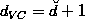，这是因为所有的w都考虑了，没有任何限制条件。而引入限定条件的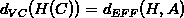，即有效的VC dimension。也就是说，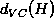比较大，因为它代表了整个hypothesis set，但是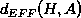比较小，因为由于regularized的影响，限定了w只取一小部分。其中A表示regularized算法。当时，有：

这些与实际情况是相符的，比如对多项式拟合模型，当时，所有的w都给予考虑，相应的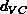很大，容易发生过拟合。当且越来越大时，很多w将被舍弃，减小，拟合曲线越来越平滑，容易发生欠拟合。

### **四、General Regularizers**

那么通用的Regularizers，即，应该选择什么样的形式呢？一般地，我们会朝着目标函数的方向进行选取。有三种方式：

*   **target-dependent**

*   **plausible**

*   **friendly**

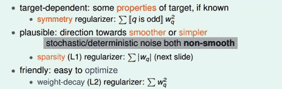

其实这三种方法跟之前error measure类似，其也有三种方法：

*   **user-dependent**

*   **plausible**

*   **friendly**

regularizer与error measure是机器学习模型设计中的重要步骤。

接下来，介绍两种Regularizer：L2和L1。L2 Regularizer一般比较通用，其形式如下：

这种形式的regularizer计算的是w的平方和，是凸函数，比较平滑，易于微分，容易进行最优化计算。

L1 Regularizer的表达式如下：

L1计算的不是w的平方和，而是绝对值和，即长度和，也是凸函数。已知围成的是圆形，而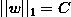围成的是正方形，那么在正方形的四个顶点处，是不可微分的（不像圆形，处处可微分）。根据之前介绍的平行等式推导过程，对应这种正方形，它的解大都位于四个顶点处（不太理解，欢迎补充赐教），因为正方形边界处的w绝对值都不为零，若不与其平行，那么w就会向顶点处移动，顶点处的许多w分量为零，所以，L1 Regularizer的解是稀疏的，称为sparsity。优点是计算速度快。

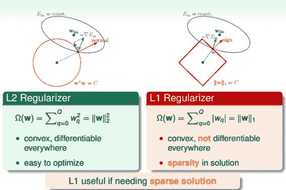

下面来看一下如何取值，首先，若stochastic noise不同，那么一般情况下，取值有如下特点：

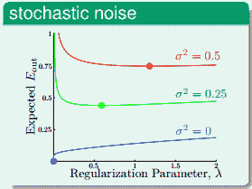

从图中可以看出，stochastic noise越大，越大。

另一种情况，不同的deterministic noise，取值有如下特点：

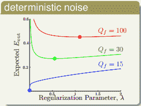

从图中可以看出，deterministic noise越大，越大。

以上两种noise的情况下，都是noise越大，相应的也就越大。这也很好理解，如果在开车的情况下，路况也不好，即noise越多，那么就越会踩刹车，这里踩刹车指的就是regularization。但是大多数情况下，noise是不可知的，这种情况下如何选择？这部分内容，我们下节课将会讨论。

### **五、总结**

本节课主要介绍了Regularization。首先，原来的hypothesis set加上一些限制条件，就成了Regularized Hypothesis Set。加上限制条件之后，我们就可以把问题转化为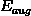最小化问题，即把w的平方加进去。这种过程，实际上回降低VC Dimension。最后，介绍regularization是通用的机器学习工具，设计方法通常包括target-dependent，plausible，friendly等等。下节课将介绍如何选取合适的来建立最佳拟合模型。

**_注明：_**

文章中所有的图片均来自台湾大学林轩田《机器学习基石》课程