# 15 -- Validation

上节课我们主要讲了为了避免overfitting，可以使用regularization方法来解决。在之前的上加上一个regularizer，生成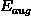，将其最小化，这样可以有效减少模型的复杂度，避免过拟合现象的发生。那么，机器学习领域还有许多选择，如何保证训练的模型具有良好的泛化能力？本节课将介绍一些概念和方法来解决这个选择性的问题。

### **一、Model Selection Problem**

机器学习模型建立的过程中有许多选择，例如对于简单的二元分类问题，首先是算法A的选择，有PLA，pocket，linear regression，logistic regression等等；其次是迭代次数T的选择，有100，1000,10000等等；之后是学习速率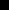的选择，有1，0.01,0.0001等等；接着是模型特征转换的选择，有linear，quadratic，poly-10，Legendre-poly-10等等；然后是正则化regularizer的选择，有L2，L1等等；最后是正则化系数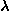的选择，有0，0.01，1等等。不同的选择搭配，有不同的机器学习效果。我们的目标就是找到最合适的选择搭配，得到一个好的矩g，构建最佳的机器学习模型。

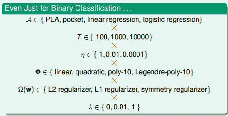

假设有M个模型，对应有，即有M个hypothesis set，演算法为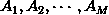，共M个。我们的目标是从这M个hypothesis set中选择一个模型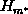，通过演算法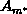对样本集D的训练，得到一个最好的矩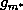，使其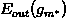最小。所以，问题的关键就是机器学习中如何选择到最好的矩。

考虑有这样一种方法，对M个模型分别计算使最小的矩g，再横向比较，取其中能使最小的模型的矩：

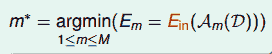

但是足够小并不能表示模型好，反而可能表示训练的矩发生了过拟合，泛化能力很差。而且这种“模型选择+学习训练”的过程，它的VC Dimension是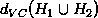，模型复杂度增加。总的来说，泛化能力差，用来选择模型是不好的。

另外一种方法，如果有这样一个独立于训练样本的测试集，将M个模型在测试集上进行测试，看一下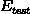的大小，则选取最小的模型作为最佳模型：

这种测试集验证的方法，根据finite-bin Hoffding不等式，可以得到：

由上式可以看出，模型个数M越少，测试集数目越大，那么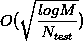越小，即越接近于。

下面比较一下之前讲的两种方法，第一种方法使用作为判断基准，使用的数据集就是训练集D本身；第二种方法使用作为判断基准，使用的是独立于训练集D之外的测试集。前者不仅使用D来训练不同的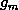，而且又使用D来选择最好的，那么对未知数据并不一定泛化能力好。举个例子，这相当于老师用学生做过的练习题再来对学生进行考试，那么即使学生得到高分，也不能说明他的学习能力强。所以最小化的方法并不科学。而后者使用的是独立于D的测试集，相当于新的考试题能更好地反映学生的真实水平，所以最小化更加理想。

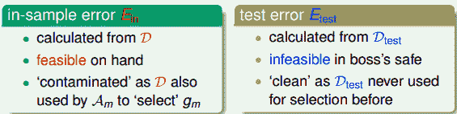

但是，我们拿到的一都是训练集D，测试集是拿不到的。所以，寻找一种折中的办法，我们可以使用已有的训练集D来创造一个验证集validation set，即从D中划出一部分作为验证集。D另外的部分作为训练模型使用，独立开来，用来测试各个模型的好坏，最小化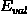，从而选择最佳的。

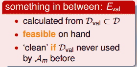

### **二、Validation**

从训练集D中抽出一部分K个数据作为验证集，对应的error记为。这样做的一个前提是保证独立同分布（iid）于P(x,y)，也就是说的选择是从D中平均随机抽样得到的，这样能够把与联系起来。D中去除后的数据就是供模型选择的训练数据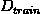，其大小为N-k。从中选择最好的矩，记为。

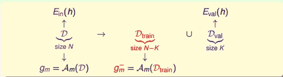

假如D共有1000个样本，那么可以选择其中900个，剩下的100个作为。使用训练模型，得到最佳的，使用对进行验证，得到如下Hoffding不等式：

假设有M种模型hypothesis set，的数量为K，那么从每种模型m中得到一个在上表现最好的矩，再横向比较，从M个矩中选择一个最好的作为我们最终得到的模型。

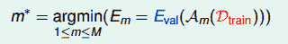

现在由于数量为N的总样本D的一部分K作为验证集，那么只有N-k个样本可供训练。从中得到最好的，而总样本D对应的最好的矩为。根据之前的leraning curve很容易知道，训练样本越多，得到的模型越准确，其hypothesis越接近target function，即D的比的要小：

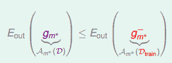

所以，我们通常的做法是通过来选择最好的矩对应的模型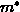，再对整体样本集D使用该模型进行训练，最终得到最好的矩。

总结一下，使用验证集进行模型选择的整个过程为：先将D分成两个部分，一个是训练样本，一个是验证集。若有M个模型，那么分别对每个模型在上进行训练，得到矩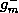，再用对每个进行验证，选择表现最好的矩，则该矩对应的模型被选择。最后使用该模型对整个D进行训练，得到最终的。下图展示了整个模型选择的过程：

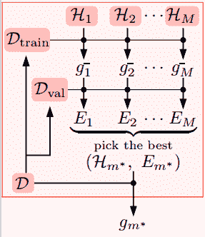

不等式关系满足：

下面我们举个例子来解释这种模型选择的方法的优越性，假设有两个模型：一个是5阶多项式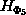，一个是10阶多项式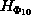。通过不使用验证集和使用验证集两种方法对模型选择结果进行比较，分析结果如下：

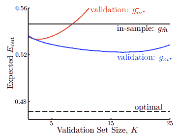

图中，横坐标表示验证集数量K，纵坐标表示大小。黑色水平线表示没有验证集，完全使用进行判断基准，那么更好一些，但是这种方法的比较大，而且与K无关。黑色虚线表示测试集非常接近实际数据，这是一种理想的情况，其很小，同样也与K无关，实际中很难得到这条虚线。红色曲线表示使用验证集，但是最终选取的矩是，其趋势是随着K的增加，它对应的先减小再增大，当K大于一定值的时候，甚至会超过黑色水平线。蓝色曲线表示也使用验证集，最终选取的矩是，其趋势是随着K的增加，它对应的先缓慢减小再缓慢增大，且一直位于红色曲线和黑色直线之下。从此可见，蓝色曲线对应的方法最好，符合我们之前讨论的使用验证集进行模型选择效果最好。

这里提一点，当K大于一定的值时，红色曲线会超过黑色直线。这是因为随着K的增大，增大，但可供模型训练的在减小，那得到的不具有很好的泛化能力，即对应的会增大，甚至当K增大到一定值时，比模型更差。

那么，如何设置验证集K值的大小呢？根据之前的分析：

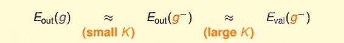

当K值很大时，，但是与相差很大；当K值很小是，，但是与可能相差很大。所以有个折中的办法，通常设置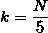。值得一提的是，划分验证集，通常并不会增加整体时间复杂度，反而会减少，因为减少了。

### **三、Leave-One-Out Cross Validation**

假如考虑一个极端的例子，k=1，也就是说验证集大小为1，即每次只用一组数据对进行验证。这样做的优点是，但是与可能相差很大。为了避免与相差很大，每次从D中取一组作为验证集，直到所有样本都作过验证集，共计算N次，最后对验证误差求平均，得到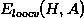，这种方法称之为留一法交叉验证，表达式为：

这样求平均的目的是为了让尽可能地接近。

下面用一个例子图解留一法的过程：

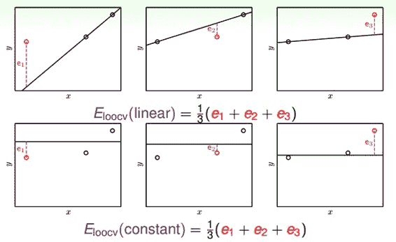

如上图所示，要对二维平面上的三个点做拟合，上面三个图表示的是线性模型，下面三个图表示的是常数模型。对于两种模型，分别使用留一交叉验证法来计算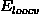，计算过程都是每次将一个点作为验证集，其他两个点作为训练集，最终将得到的验证误差求平均值，就得到了和，比较两个值的大小，取值小对应的模型即为最佳模型。

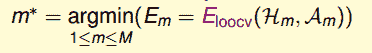

接下来，我们从理论上分析Leave-One-Out方法的可行性，即是否能保证的矩足够好？假设有不同的数据集D，它的期望分布记为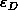，则其可以通过推导，等于的平均值。由于N-1近似为N，的平均值也近似等于的平均值。具体推导过程如下：

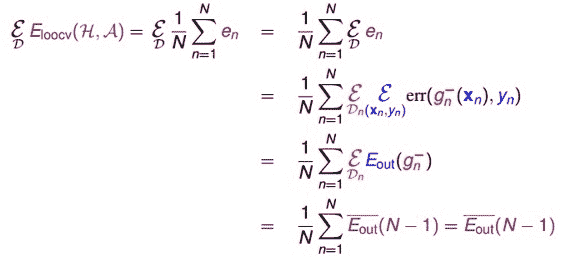

最终我们得到的结论是的期望值和的期望值是相近的，这代表得到了比较理想的，Leave-One-Out方法是可行的。

举一个例子，使用两个特征：Average Intensity和Symmetry加上这两个特征的非线性变换（例如高阶项）来进行手写数字识别。平面特征分布如下图所示：

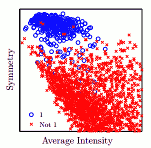

Error与特征数量的关系如下图所示：

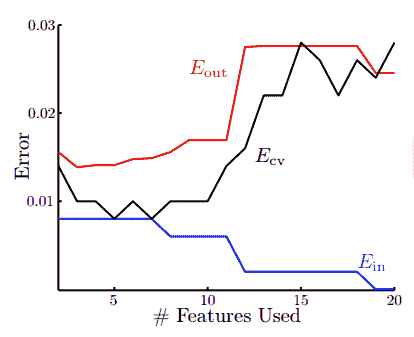

从图中我们看出，随着特征数量的增加，不断减小，先减小再增大，虽然是不断减小的，但是它与的差距越来越大，发生了过拟合，泛化能力太差。而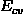与的分布基本一致，能较好地反映的变化。所以，我们只要使用Leave-One-Out方法得到使最小的模型，就能保证其足够小。下图是分别使用和进行训练得到的分类曲线：

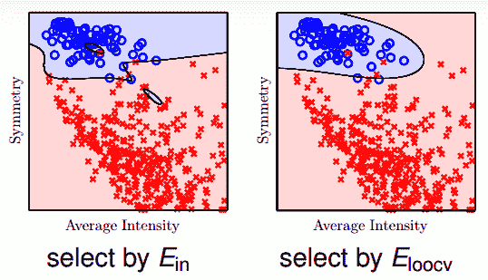

很明显可以看出，使用发生了过拟合，而分类效果更好，泛化能力强。

### **四、V-Fold Cross Validation**

接下来我们看看Leave-One-Out可能的问题是什么。首先，第一个问题是计算量，假设N=1000，那么就需要计算1000次的，再计算其平均值。当N很大的时候，计算量是巨大的，很耗费时间。第二个问题是稳定性，例如对于二分类问题，取值只有0和1两种，预测本身存在不稳定的因素，那么对所有的计算平均值可能会带来很大的数值跳动，稳定性不好。所以，这两个因素决定了Leave-One-Out方法在实际中并不常用。

针对Leave-One-Out的缺点，我们对其作出了改进。Leave-One-Out是将N个数据分成N分，那么改进措施是将N个数据分成V份（例如V=10），计算过程与Leave-One-Out相似。这样可以减少总的计算量，又能进行交叉验证，得到最好的矩，这种方法称为V-折交叉验证。其实Leave-One-Out就是V-折交叉验证的一个极端例子。

所以呢，一般的Validation使用V-折交叉验证来选择最佳的模型。值得一提的是Validation的数据来源也是样本集中的，所以并不能保证交叉验证的效果好，它的模型一定好。只有样本数据越多，越广泛，那么Validation的结果越可信，其选择的模型泛化能力越强。

### **五、总结**

本节课主要介绍了Validation验证。先从如何选择一个好的模型开始切入，例如使用、都是不太好的，最终使用来进行模型选择。然后详细介绍了Validation的过程。最后，介绍了Leave-One-Out和V-Fold Cross两种验证方法，比较它们各自的优点和缺点，实际情况下，V-Fold Cross更加常用。

**_注明：_**
文章中所有的图片均来自台湾大学林轩田《机器学习基石》课程