# 1 -- Linear Support Vector Machine

关于台湾大学林轩田老师的《机器学习基石》课程，我们已经总结了16节课的笔记。这里附上基石第一节课的博客地址：

[台湾大学林轩田机器学习基石课程学习笔记1 – The Learning Problem](http://blog.csdn.net/red_stone1/article/details/72899485)

本系列同样分成16节课，将会介绍《机器学习基石》的进阶版《机器学习技法》，更深入地探讨机器学习一些高级算法和技巧。

### **Large-Margin Separating Hyperplane**

回顾一下我们之前介绍了linear classification，对于线性可分的情况，我们可以使用PLA/pocket算法在平面或者超平面上把正负类分开。

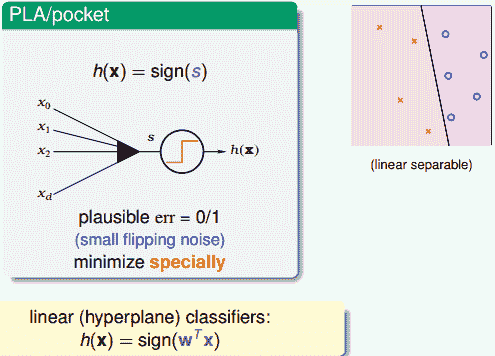

例如对平面2D这种情况，我们可以找到一条直线，能将正类和负类完全分开。但是，这样的直线通常不止一条，如下图所示。那么，下图中的三条分类线都能将数据分开，但是哪条线更好呢？

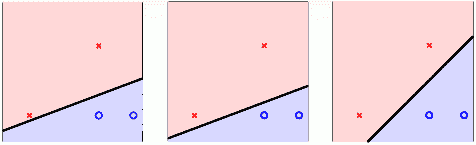

这三条直线都是由PLA/pocket算法不断修正错误点而最终产生的，整个确定直线形状的过程是随机的。单从分类效果上看，这三条直线都满足要求，而且都满足VC bound要求，模型复杂度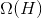是一样的，即具有一定的泛化能力。但是，如果要选择的话，凭第一感觉，我们还是会选择第三条直线，感觉它的分类效果更好一些。那这又是为什么呢？

先给个简单解释，一般情况下，训练样本外的测量数据应该分布在训练样本附近，但与训练样本的位置有一些偏差。若要保证对未知的测量数据也能进行正确分类，最好让分类直线距离正类负类的点都有一定的距离。这样能让每个样本点附近的圆形区域是“安全”的。圆形区域越大，表示分类直线对测量数据误差的容忍性越高，越“安全”。

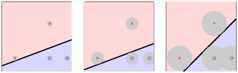

如上图所示，左边的点距离分类直线的最小距离很小，它的圆形区域很小。那么，这种情况下，分类线对测量数据误差的容忍性就很差，测量数据与样本数据稍有偏差，很有可能就被误分。而右边的点距离分类直线的最小距离更大一些，其圆形区域也比较大。这种情况下，分类线对测量数据误差的容忍性就相对来说大很多，不容易误分。也就是说，左边分类线和右边分类线的最大区别是对这类测量误差的容忍度不同。

那么，如果每一笔训练资料距离分类线越远的话，就表示分类型可以忍受更多的测量误差（noise）。我们之前在《机器学习基石》中介绍过，noise是造成overfitting的主要原因，而测量误差也是一种noise。所以，如果分类线对测量误差的容忍性越好的话，表示这是一条不错的分类线。那么，我们的目标就是找到这样一条最“健壮”的线，即距离数据点越远越好。

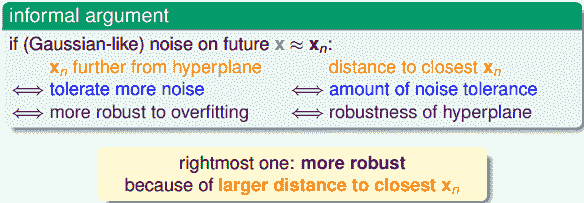

上面我们用圆形区域表示分类线能够容忍多少误差，也就相当于计算点到直线的距离。距离越大，表示直线越“胖”，越能容忍误差；距离越小，表示直线越“瘦”，越不能容忍误差。越胖越好（像杨贵妃那样的哦~）。

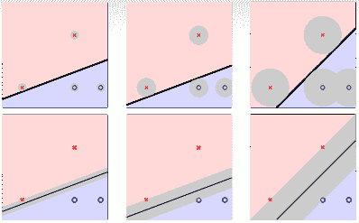

如何定义分类线有多胖，就是看距离分类线最近的点与分类线的距离，我们把它用margin表示。分类线由权重w决定，目的就是找到使margin最大时对应的w值。整体来说，我们的目标就是找到这样的分类线并满足下列条件：

*   **分类正确，即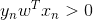**

*   **margin最大化**

### **Standard Large-Margin Problem**

要让margin最大，即让离分类线最近的点到分类线距离最大，我们先来看一下如何计算点到分类线的距离。

首先，我们将权重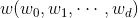中的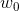拿出来，用b表示。同时省去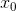项。这样，hypothesis就变成了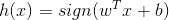。

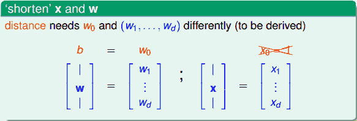

下面，利用图解的方式，详细推导如何计算点到分类平面的距离：

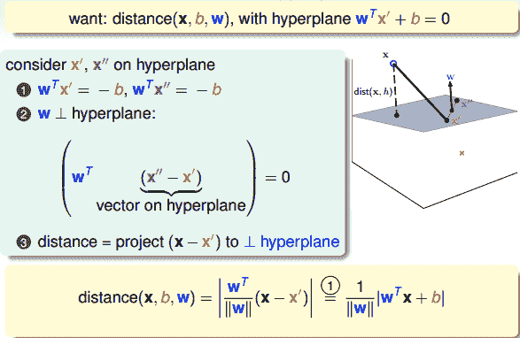

如上图所示，平面上有两个点：x’和x”。因为这两个点都在分类平面上，所以它们都满足：

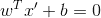

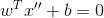

同时可以得到：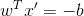，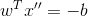，则有：

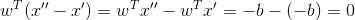

(x”-x’)是平面上的任一向量，(x”-x’)与w内积为0，表示(x”-x’)垂直于w，那么w就是平面的法向量。

现在，若要计算平面外一点x到该平面的距离，做法是只要将向量(x-x’)投影到垂直于该平面的方向（即w方向）上就可以了。那么，令(x”-x’)与w的夹角为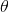，距离就可以表示为：

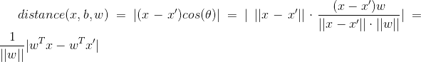

代入，可得：

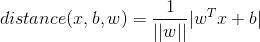

点到分类面（Separating Hyperplane）的距离已经算出来了。基于这个分类面，所有的点均满足：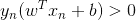，表示所有点都分类正确，则distance公式就可以变换成：

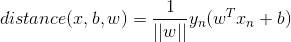

那么，我们的目标形式就转换为：

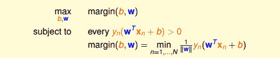

对上面的式子还不容易求解，我们继续对它进行简化。我们知道分类面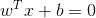和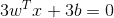其实是一样的。也就是说，对w和b进行同样的缩放还会得到同一分类面。所以，为了简化计算，我们令距离分类满最近的点满足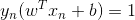。那我们所要求的margin就变成了:

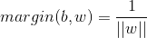

这样，目标形式就简化为：

这里可以省略条件：，因为满足条件必然满足大于零的条件。我们的目标就是根据这个条件，计算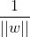的最大值。

刚刚我们讲的距离分类满最近的点满足，也就是说对所有的点满足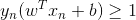。另外，因为最小化问题我们最熟悉也最好解，所以可以把目标最大化转化为计算的最小化问题。

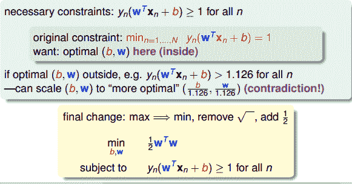

如上图所示，最终的条件就是，而我们的目标就是最小化值。

### **Support Vector Machine**

现在，条件和目标变成：

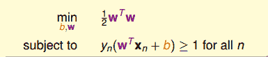

现在，举个例子，假如平面上有四个点，两个正类，两个负类：

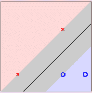

不同点的坐标加上条件，可以得到：

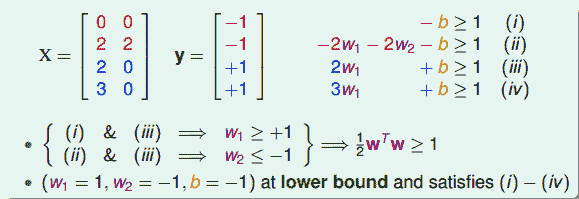

最终，我们得到的条件是：

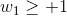

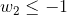

而我们的目标是：

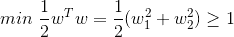

目标最小值为1，即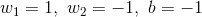，那么这个例子就得到了最佳分类面的解，如图所示，且。分类面的表达式为：

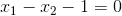

最终我们得到的矩的表达式为：

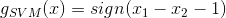

Support Vector Machine(SVM)这个名字从何而来？为什么把这种分类面解法称为支持向量机呢？这是因为分类面仅仅由分类面的两边距离它最近的几个点决定的，其它点对分类面没有影响。决定分类面的几个点称之为支持向量（Support Vector），好比这些点“支撑”着分类面。而利用Support Vector得到最佳分类面的方法，称之为支持向量机（Support Vector Machine）。

下面介绍SVM的一般求解方法。先写下我们的条件和目标：

这是一个典型的二次规划问题，即Quadratic Programming（QP）。因为SVM的目标是关于w的二次函数，条件是关于w和b的一次函数，所以，它的求解过程还是比较容易的，可以使用一些软件（例如Matlab）自带的二次规划的库函数来求解。下图给出SVM与标准二次规划问题的参数对应关系：

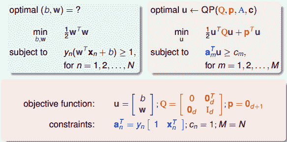

那么，线性SVM算法可以总结为三步：

*   **计算对应的二次规划参数Q，p，A，c**

*   **根据二次规划库函数，计算b，w**

*   **将b和w代入，得到最佳分类面**

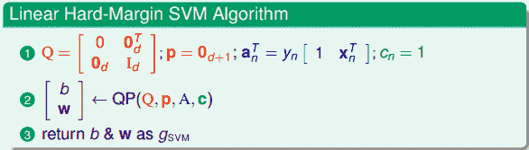

这种方法称为Linear Hard-Margin SVM Algorithm。如果是非线性的，例如包含x的高阶项，那么可以使用我们之前在《机器学习基石》课程中介绍的特征转换的方法，先作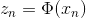的特征变换，从非线性的x域映射到线性的z域空间，再利用Linear Hard-Margin SVM Algorithm求解即可。

### **Reasons behind Large-Margin Hyperplane**

从视觉和直觉的角度，我们认为Large-Margin Hyperplane的分类效果更好。SVM的这种思想其实与我们之前介绍的机器学习非常重要的正则化regularization思想很类似。regularization的目标是将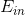最小化，条件是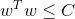；SVM的目标是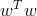最小化，条件是，即保证了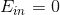。有趣的是，regularization与SVM的目标和限制条件分别对调了。其实，考虑的内容是类似的，效果也是相近的。SVM也可以说是一种weight-decay regularization，限制条件是。

从另一方面来看，Large-Margin会限制Dichotomies的个数。这从视觉上也很好理解，假如一条分类面越“胖”，即对应Large-Margin，那么它可能shtter的点的个数就可能越少：

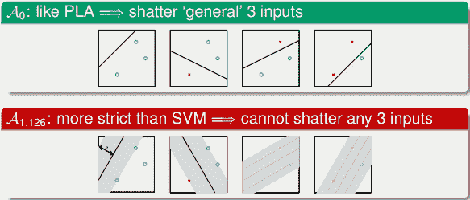

之前的《机器学习基石》课程中介绍过，Dichotomies与VC Dimension是紧密联系的。也就是说如果Dichotomies越少，那么复杂度就越低，即有效的VC Dimension就越小，得到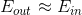，泛化能力强。

下面我们从概念的角度推导一下为什么dichotomies越少，VC Dimension就越少。首先我们考虑一下Large-Margin演算法的VC Dimension，记为。与数据有关，而我们之前介绍的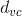与数据无关。

假如平面上有3个点分布在单位圆上，如果Margin为0，即，这条细细的直线可以很容易将圆上任意三点分开（shatter），就能得到它的。如果，这条粗粗的线无论如何都不能将圆上的任一三点全完分开（no shatter），因为圆上必然至少存在两个点的距离小于，那么其对应d的。

那么，一般地，在d维空间，当数据点分布在半径为R的超球体内时，得到的满足下列不等式：

之前介绍的Perceptrons的VC Dimension为d+1，这里得到的结果是Large-Margin演算法的。所以，由于Large-Margin，得到的dichotomies个数减少，从而VC Dimension也减少了。VC Dimension减少降低了模型复杂度，提高了泛化能力。

### **总结**

本节课主要介绍了线性支持向量机（Linear Support Vector Machine）。我们先从视觉角度出发，希望得到一个比较“胖”的分类面，即满足所有的点距离分类面都尽可能远。然后，我们通过一步步推导和简化，最终把这个问题转换为标准的二次规划（QP）问题。二次规划问题可以使用Matlab等软件来进行求解，得到我们要求的w和b，确定分类面。这种方法背后的原理其实就是减少了dichotomies的种类，减少了有效的VC Dimension数量，从而让机器学习的模型具有更好的泛化能力。

**_注明：_**

文章中所有的图片均来自台湾大学林轩田《机器学习技法》课程
