# 2 -- Dual Support Vector Machine

上节课我们主要介绍了线性支持向量机（Linear Support Vector Machine）。Linear SVM的目标是找出最“胖”的分割线进行正负类的分离，方法是使用二次规划来求出分类线。本节课将从另一个方面入手，研究对偶支持向量机（Dual Support Vector Machine），尝试从新的角度计算得出分类线，推广SVM的应用范围。

### **Motivation of Dual SVM**

首先，我们回顾一下，对于非线性SVM，我们通常可以使用非线性变换将变量从x域转换到z域中。然后，在z域中，根据上一节课的内容，使用线性SVM解决问题即可。上一节课我们说过，使用SVM得到large-margin，减少了有效的VC Dimension，限制了模型复杂度；另一方面，使用特征转换，目的是让模型更复杂，减小。所以说，非线性SVM是把这两者目的结合起来，平衡这两者的关系。那么，特征转换下，求解QP问题在z域中的维度设为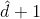，如果模型越复杂，则越大，相应求解这个QP问题也变得很困难。当无限大的时候，问题将会变得难以求解，那么有没有什么办法可以解决这个问题呢？一种方法就是使SVM的求解过程不依赖，这就是我们本节课所要讨论的主要内容。

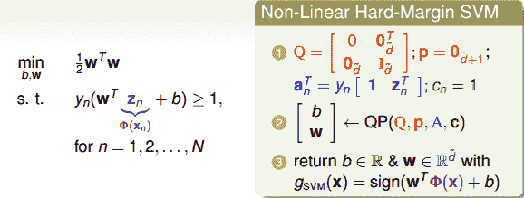

比较一下，我们上一节课所讲的Original SVM二次规划问题的变量个数是，有N个限制条件；而本节课，我们把问题转化为对偶问题（’Equivalent’ SVM），同样是二次规划，只不过变量个数变成N个，有N+1个限制条件。这种对偶SVM的好处就是问题只跟N有关，与无关，这样就不存在上文提到的当无限大时难以求解的情况。

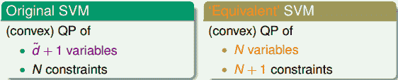

如何把问题转化为对偶问题（’Equivalent’ SVM），其中的数学推导非常复杂，本文不做详细数学论证，但是会从概念和原理上进行简单的推导。

还记得我们在《机器学习基石》课程中介绍的Regularization中，在最小化的过程中，也添加了限制条件：。我们的求解方法是引入拉格朗日因子，将有条件的最小化问题转换为无条件的最小化问题：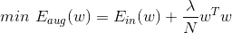，最终得到的w的最优化解为：

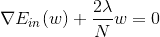

所以，在regularization问题中，是已知常量，求解过程变得容易。那么，对于dual SVM问题，同样可以引入，将条件问题转换为非条件问题，只不过是未知参数，且个数是N，需要对其进行求解。

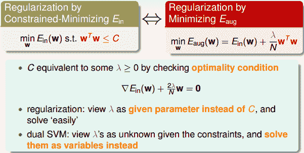

如何将条件问题转换为非条件问题？上一节课我们介绍的SVM中，目标是：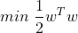，条件是：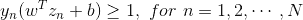。首先，我们令拉格朗日因子为（区别于regularization），构造一个函数：

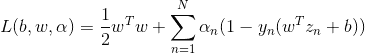

这个函数右边第一项是SVM的目标，第二项是SVM的条件和拉格朗日因子的乘积。我们把这个函数称为拉格朗日函数，其中包含三个参数：b，w，。

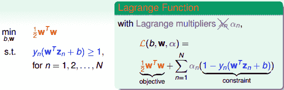

下面，我们利用拉格朗日函数，把SVM构造成一个非条件问题：

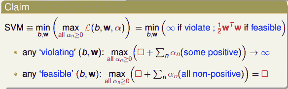

该最小化问题中包含了最大化问题，怎么解释呢？首先我们规定拉格朗日因子，根据SVM的限定条件可得：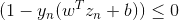，如果没有达到最优解，即有不满足的情况，因为，那么必然有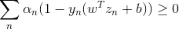。对于这种大于零的情况，其最大值是无解的。如果对于所有的点，均满足，那么必然有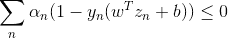，则当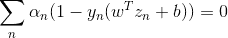时，其有最大值，最大值就是我们SVM的目标：。因此，这种转化为非条件的SVM构造函数的形式是可行的。

### **Lagrange Dual SVM**

现在，我们已经将SVM问题转化为与拉格朗日因子有关的最大最小值形式。已知，那么对于任何固定的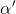，且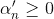，一定有如下不等式成立：

对上述不等式右边取最大值，不等式同样成立：

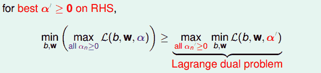

上述不等式表明，我们对SVM的min和max做了对调，满足这样的关系，这叫做Lagrange dual problem。不等式右边是SVM问题的下界，我们接下来的目的就是求出这个下界。

已知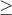是一种弱对偶关系，在二次规划QP问题中，如果满足以下三个条件：

*   **函数是凸的（convex primal）**

*   **函数有解（feasible primal）**

*   **条件是线性的（linear constraints）**

那么，上述不等式关系就变成强对偶关系，变成=，即一定存在满足条件的解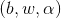，使等式左边和右边都成立，SVM的解就转化为右边的形式。

经过推导，SVM对偶问题的解已经转化为无条件形式：

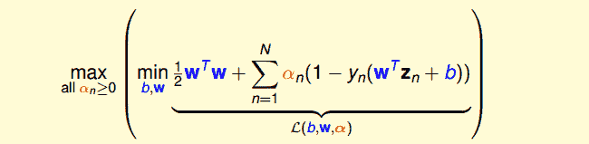

其中，上式括号里面的是对拉格朗日函数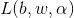计算最小值。那么根据梯度下降算法思想：最小值位置满足梯度为零。首先，令对参数b的梯度为零：

也就是说，最优解一定满足。那么，我们把这个条件代入计算max条件中（与同为条件），并进行化简：

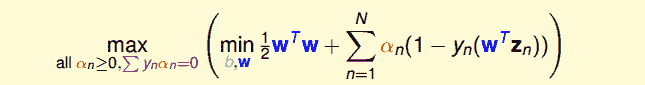

这样，SVM表达式消去了b，问题化简了一些。然后，再根据最小值思想，令对参数w的梯度为零：

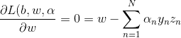

即得到：

也就是说，最优解一定满足。那么，同样我们把这个条件代入并进行化简：

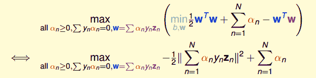

这样，SVM表达式消去了w，问题更加简化了。这时候的条件有3个：

*   all 

*   

*   

SVM简化为只有的最佳化问题，即计算满足上述三个条件下，函数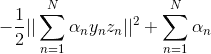最小值时对应的是多少。

总结一下，SVM最佳化形式转化为只与有关：

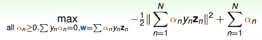

其中，满足最佳化的条件称之为Karush-Kuhn-Tucker(KKT)：

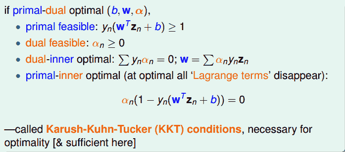

在下一部分中，我们将利用KKT条件来计算最优化问题中的，进而得到b和w。

### **Solving Dual SVM**

上面我们已经得到了dual SVM的简化版了，接下来，我们继续对它进行一些优化。首先，将max问题转化为min问题，再做一些条件整理和推导，得到：

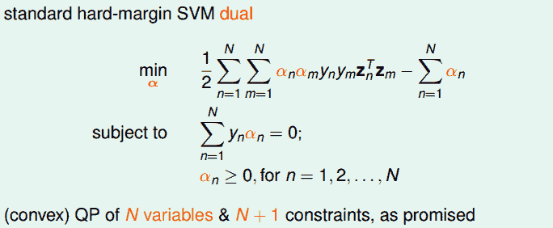

显然，这是一个convex的QP问题，且有N个变量，限制条件有N+1个。则根据上一节课讲的QP解法，找到Q，p，A，c对应的值，用软件工具包进行求解即可。

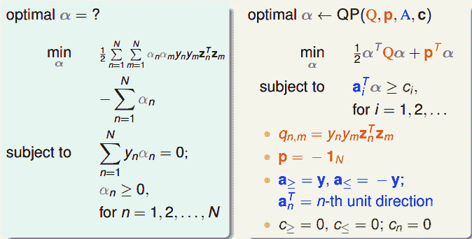

求解过程很清晰，但是值得注意的是，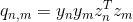，大部分值是非零的，称为dense。当N很大的时候，例如N=30000，那么对应的的计算量将会很大，存储空间也很大。所以一般情况下，对dual SVM问题的矩阵，需要使用一些特殊的方法，这部分内容就不再赘述了。

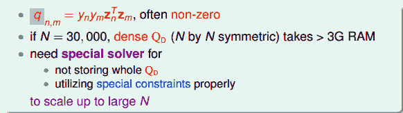

得到之后，再根据之前的KKT条件，就可以计算出w和b了。首先利用条件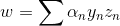得到w，然后利用条件，取任一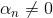即&gt;0的点，得到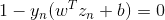，进而求得。

值得注意的是，计算b值，&gt;0时，有成立。正好表示的是该点在SVM分类线上，即fat boundary。也就是说，满足&gt;0的点一定落在fat boundary上，这些点就是Support Vector。这是一个非常有趣的特性。

### **Messages behind Dual SVM**

回忆一下，上一节课中，我们把位于分类线边界上的点称为support vector（candidates）。本节课前面介绍了&gt;0的点一定落在分类线边界上，这些点称之为support vector（注意没有candidates）。也就是说分类线上的点不一定都是支持向量，但是满足&gt;0的点，一定是支持向量。

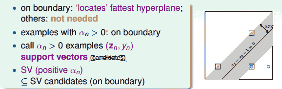

SV只由&gt;0的点决定，根据上一部分推导的w和b的计算公式，我们发现，w和b仅由SV即&gt;0的点决定，简化了计算量。这跟我们上一节课介绍的分类线只由“胖”边界上的点所决定是一个道理。也就是说，样本点可以分成两类：一类是support vectors，通过support vectors可以求得fattest hyperplane；另一类不是support vectors，对我们求得fattest hyperplane没有影响。

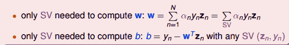

回过头来，我们来比较一下SVM和PLA的w公式：

我们发现，二者在形式上是相似的。由fattest hyperplane边界上所有的SV决定，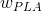由所有当前分类错误的点决定。和都是原始数据点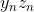的线性组合形式，是原始数据的代表。

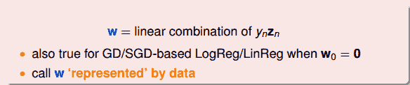

总结一下，本节课和上节课主要介绍了两种形式的SVM，一种是Primal Hard-Margin SVM，另一种是Dual Hard_Margin SVM。Primal Hard-Margin SVM有个参数，有N个限制条件。当很大时，求解困难。而Dual Hard_Margin SVM有N个参数，有N+1个限制条件。当数据量N很大时，也同样会增大计算难度。两种形式都能得到w和b，求得fattest hyperplane。通常情况下，如果N不是很大，一般使用Dual SVM来解决问题。

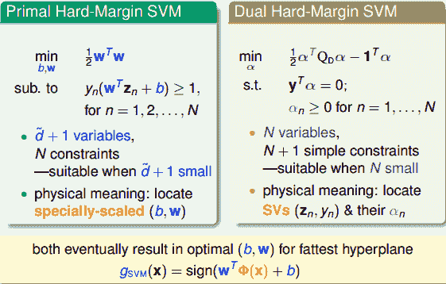

这节课提出的Dual SVM的目的是为了避免计算过程中对的依赖，而只与N有关。但是，Dual SVM是否真的消除了对的依赖呢？其实并没有。因为在计算的过程中，由z向量引入了，实际上复杂度已经隐藏在计算过程中了。所以，我们的目标并没有实现。下一节课我们将继续研究探讨如何消除对的依赖。

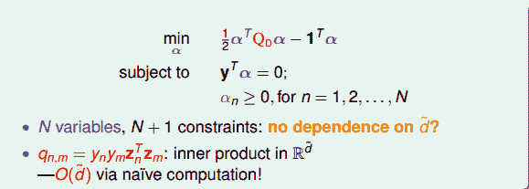

### **总结**

本节课主要介绍了SVM的另一种形式：Dual SVM。我们这样做的出发点是为了移除计算过程对的依赖。Dual SVM的推导过程是通过引入拉格朗日因子，将SVM转化为新的非条件形式。然后，利用QP，得到最佳解的拉格朗日因子。再通过KKT条件，计算得到对应的w和b。最终求得fattest hyperplane。下一节课，我们将解决Dual SVM计算过程中对的依赖问题。

**_注明：_**

文章中所有的图片均来自台湾大学林轩田《机器学习技法》课程
