# 3 -- Kernel Support Vector Machine

上节课我们主要介绍了SVM的对偶形式，即dual SVM。Dual SVM也是一个二次规划问题，可以用QP来进行求解。之所以要推导SVM的对偶形式是因为：首先，它展示了SVM的几何意义；然后，从计算上，求解过程“好像”与所在维度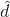无关，规避了很大时难以求解的情况。但是，上节课的最后，我们也提到dual SVM的计算过程其实跟还是有关系的。那么，能不能完全摆脱对的依赖，从而减少SVM计算量呢？这就是我们本节课所要讲的主要内容。

### **Kernel Trick**

我们上节课推导的dual SVM是如下形式：

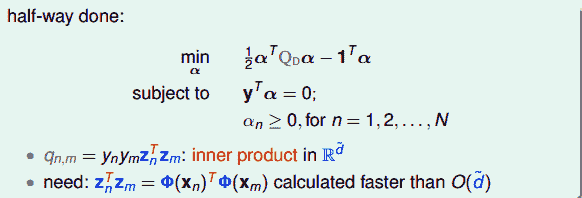

其中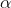是拉格朗日因子，共N个，这是我们要求解的，而条件共有N+1个。我们来看向量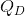中的，看似这个计算与无关，但是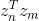的内积中不得不引入。也就是说，如果很大，计算的复杂度也会很高，同样会影响QP问题的计算效率。可以说，这一步是计算的瓶颈所在。

其实问题的关键在于内积求解上。我们知道，z是由x经过特征转换而来：

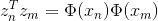

如果从x空间来看的话，分为两个步骤：1\. 进行特征转换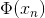和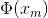；2\. 计算与的内积。这种先转换再计算内积的方式，必然会引入参数，从而在很大的时候影响计算速度。那么，若把这两个步骤联合起来，是否可以有效地减小计算量，提高计算速度呢？

我们先来看一个简单的例子，对于二阶多项式转换，各种排列组合为：

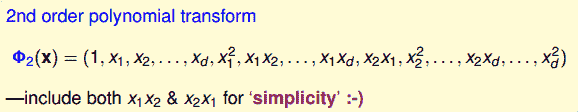

这里提一下，为了简单起见，我们把包含进来，同时将二次项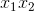和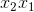也包含进来。转换之后再做内积并进行推导，得到：

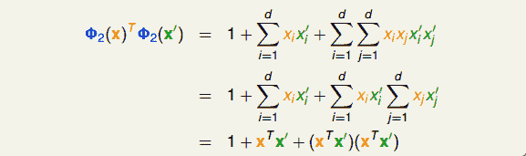

其中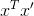是x空间中特征向量的内积。所以，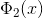与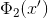的内积的复杂度由原来的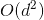变成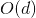，只与x空间的维度d有关，而与z空间的维度无关，这正是我们想要的！

至此，我们发现如果把特征转换和z空间计算内积这两个步骤合并起来，有可能会简化计算。因为我们只是推导了二阶多项式会提高运算速度，这个特例并不具有一般推论性。但是，我们还是看到了希望。

我们把合并特征转换和计算内积这两个步骤的操作叫做Kernel Function，用大写字母K表示。例如刚刚讲的二阶多项式例子，它的kernel function为：

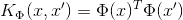

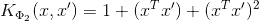

有了kernel function之后，我们来看看它在SVM里面如何使用。在dual SVM中，二次项系数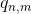中有z的内积计算，就可以用kernel function替换：

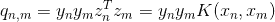

所以，直接计算出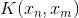，再代入上式，就能得到的值。

值计算之后，就能通过QP得到拉格朗日因子。然后，下一步就是计算b（取&gt;0的点，即SV），b的表达式中包含z，可以作如下推导：

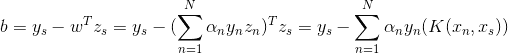

这样得到的b就可以用kernel function表示，而与z空间无关。

最终我们要求的矩可以作如下推导：

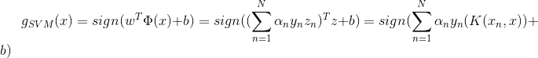

至此，dual SVM中我们所有需要求解的参数都已经得到了，而且整个计算过程中都没有在z空间作内积，即与z无关。我们把这个过程称为kernel trick，也就是把特征转换和计算内积两个步骤结合起来，用kernel function来避免计算过程中受的影响，从而提高运算速度。

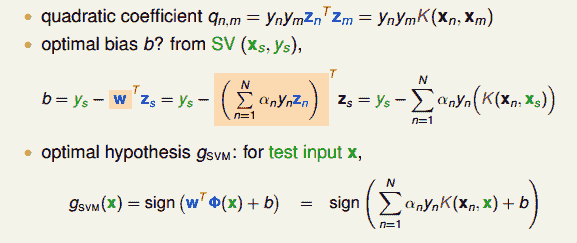

那么总结一下，引入kernel funtion后，SVM算法变成：

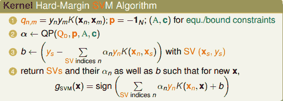

分析每个步骤的时间复杂度为：

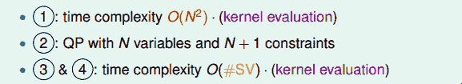

我们把这种引入kernel function的SVM称为kernel SVM，它是基于dual SVM推导而来的。kernel SVM同样只用SV（&gt;0）就能得到最佳分类面，而且整个计算过程中摆脱了的影响，大大提高了计算速度。

### **Polynomial Kernel**

我们刚刚通过一个特殊的二次多项式导出了相对应的kernel，其实二次多项式的kernel形式是多种的。例如，相应系数的放缩构成完全平方公式等。下面列举了几种常用的二次多项式kernel形式：

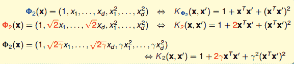

比较一下，第一种（蓝色标记）和第三种（绿色标记）从某种角度来说是一样的，因为都是二次转换，对应到同一个z空间。但是，它们系数不同，内积就会有差异，那么就代表有不同的距离，最终可能会得到不同的SVM margin。所以，系数不同，可能会得到不同的SVM分界线。通常情况下，第三种（绿色标记）简单一些，更加常用。

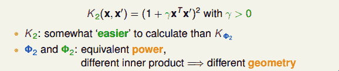

不同的转换，对应到不同的几何距离，得到不同的距离，这是什么意思呢？举个例子，对于我们之前介绍的一般的二次多项式kernel，它的SVM margin和对应的SV如下图（中）所示。对于上面介绍的完全平方公式形式，自由度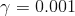，它的SVM margin和对应的SV如下图（左）所示。比较发现，这种SVM margin比较简单一些。对于自由度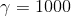，它的SVM margin和对应的SV如下图（右）所示。与前两种比较，margin和SV都有所不同。

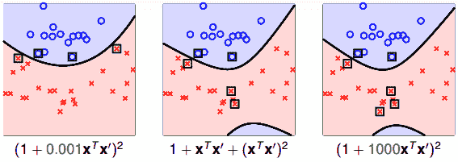

通过改变不同的系数，得到不同的SVM margin和SV，如何选择正确的kernel，非常重要。

归纳一下，引入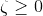和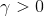，对于Q次多项式一般的kernel形式可表示为：

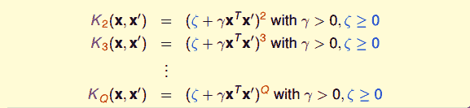

所以，使用高阶的多项式kernel有两个优点：

*   **得到最大SVM margin，SV数量不会太多，分类面不会太复杂，防止过拟合，减少复杂度**

*   **计算过程避免了对的依赖，大大简化了计算量。**

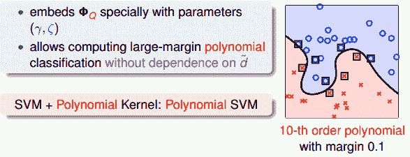

顺便提一下，当多项式阶数Q=1时，那么对应的kernel就是线性的，即本系列课程第一节课所介绍的内容。对于linear kernel，计算方法是简单的，而且也是我们解决SVM问题的首选。还记得机器学习基石课程中介绍的奥卡姆剃刀定律（Occam’s Razor）吗？

### **Gaussian Kernel**

刚刚我们介绍的Q阶多项式kernel的阶数是有限的，即特征转换的是有限的。但是，如果是无限多维的转换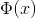，是否还能通过kernel的思想，来简化SVM的计算呢？答案是肯定的。

先举个例子，简单起见，假设原空间是一维的，只有一个特征x，我们构造一个kernel function为高斯函数：

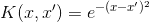

构造的过程正好与二次多项式kernel的相反，利用反推法，先将上式分解并做泰勒展开：

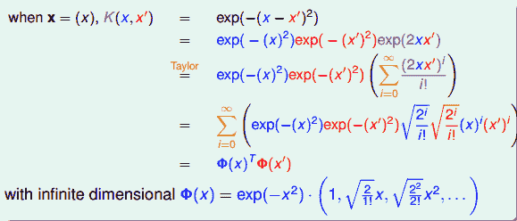

将构造的K(x,x’)推导展开为两个和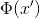的乘积，其中：

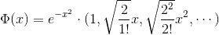

通过反推，我们得到了，是无限多维的，它就可以当成特征转换的函数，且是无限的。这种得到的核函数即为Gaussian kernel。

更一般地，对于原空间不止一维的情况（d&gt;1），引入缩放因子，它对应的Gaussian kernel表达式为：

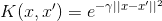

那么引入了高斯核函数，将有限维度的特征转换拓展到无限的特征转换中。根据本节课上一小节的内容，由K，计算得到和b，进而得到矩。将其中的核函数K用高斯核函数代替，得到：

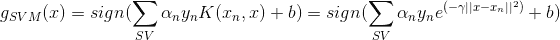

通过上式可以看出，有n个高斯函数线性组合而成，其中n是SV的个数。而且，每个高斯函数的中心都是对应的SV。通常我们也把高斯核函数称为径向基函数（Radial Basis Function, RBF）。

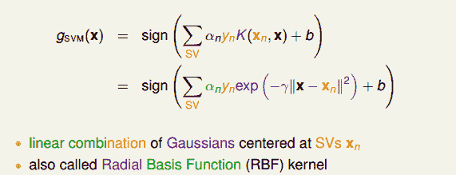

总结一下，kernel SVM可以获得large-margin的hyperplanes，并且可以通过高阶的特征转换使尽可能地小。kernel的引入大大简化了dual SVM的计算量。而且，Gaussian kernel能将特征转换扩展到无限维，并使用有限个SV数量的高斯函数构造出矩。

值得注意的是，缩放因子取值不同，会得到不同的高斯核函数，hyperplanes不同，分类效果也有很大的差异。举个例子，分别取1, 10, 100时对应的分类效果如下：

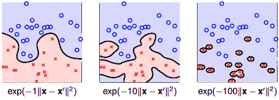

从图中可以看出，当比较小的时候，分类线比较光滑，当越来越大的时候，分类线变得越来越复杂和扭曲，直到最后，分类线变成一个个独立的小区域，像小岛一样将每个样本单独包起来了。为什么会出现这种区别呢？这是因为越大，其对应的高斯核函数越尖瘦，那么有限个高斯核函数的线性组合就比较离散，分类效果并不好。所以，SVM也会出现过拟合现象，的正确选择尤为重要，不能太大。

### **Comparison of Kernels**

目前为止，我们已经介绍了几种kernel，下面来对几种kernel进行比较。

首先，Linear Kernel是最简单最基本的核，平面上对应一条直线，三维空间里对应一个平面。Linear Kernel可以使用上一节课介绍的Dual SVM中的QP直接计算得到。

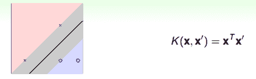

Linear Kernel的优点是计算简单、快速，可以直接使用QP快速得到参数值，而且从视觉上分类效果非常直观，便于理解；缺点是如果数据不是线性可分的情况，Linear Kernel就不能使用了。

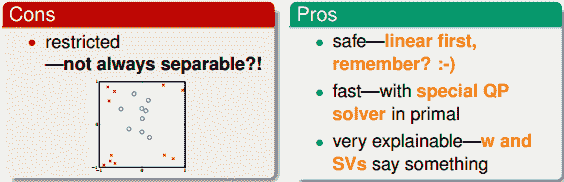

然后，Polynomial Kernel的hyperplanes是由多项式曲线构成。

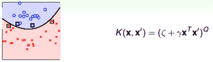

Polynomial Kernel的优点是阶数Q可以灵活设置，相比linear kernel限制更少，更贴近实际样本分布；缺点是当Q很大时，K的数值范围波动很大，而且参数个数较多，难以选择合适的值。

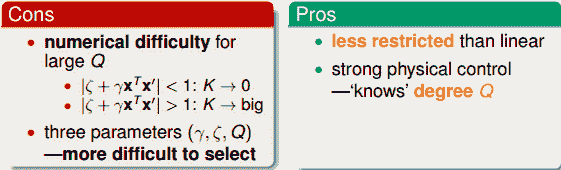

对于Gaussian Kernel，表示为高斯函数形式。

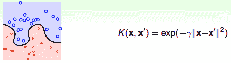

Gaussian Kernel的优点是边界更加复杂多样，能最准确地区分数据样本，数值计算K值波动较小，而且只有一个参数，容易选择；缺点是由于特征转换到无限维度中，w没有求解出来，计算速度要低于linear kernel，而且可能会发生过拟合。

除了这三种kernel之外，我们还可以使用其它形式的kernel。首先，我们考虑kernel是什么？实际上kernel代表的是两笔资料x和x’，特征变换后的相似性即内积。但是不能说任何计算相似性的函数都可以是kernel。有效的kernel还需满足几个条件：

*   **K是对称的**

*   **K是半正定的**

这两个条件不仅是必要条件，同时也是充分条件。所以，只要我们构造的K同时满足这两个条件，那它就是一个有效的kernel。这被称为Mercer 定理。事实上，构造一个有效的kernel是比较困难的。

### **总结**

本节课主要介绍了Kernel Support Vector Machine。首先，我们将特征转换和计算内积的操作合并到一起，消除了的影响，提高了计算速度。然后，分别推导了Polynomial Kernel和Gaussian Kernel，并列举了各自的优缺点并做了比较。对于不同的问题，应该选择合适的核函数进行求解，以达到最佳的分类效果。

**_注明：_**

文章中所有的图片均来自台湾大学林轩田《机器学习技法》课程
