# 4 -- Soft-Margin Support Vector Machine

上节课我们主要介绍了Kernel SVM。先将特征转换和计算内积这两个步骤合并起来，简化计算、提高计算速度，再用Dual SVM的求解方法来解决。Kernel SVM不仅能解决简单的线性分类问题，也可以求解非常复杂甚至是无限多维的分类问题，关键在于核函数的选择，例如线性核函数、多项式核函数和高斯核函数等等。但是，我们之前讲的这些方法都是Hard-Margin SVM，即必须将所有的样本都分类正确才行。这往往需要更多更复杂的特征转换，甚至造成过拟合。本节课将介绍一种Soft-Margin SVM，目的是让分类错误的点越少越好，而不是必须将所有点分类正确，也就是允许有noise存在。这种做法很大程度上不会使模型过于复杂，不会造成过拟合，而且分类效果是令人满意的。

### **Motivation and Primal Problem**

上节课我们说明了一点，就是SVM同样可能会造成overfit。原因有两个，一个是由于我们的SVM模型（即kernel）过于复杂，转换的维度太多，过于powerful了；另外一个是由于我们坚持要将所有的样本都分类正确，即不允许错误存在，造成模型过于复杂。如下图所示，左边的图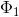是线性的，虽然有几个点分类错误，但是大部分都能完全分开。右边的图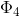是四次多项式，所有点都分类正确了，但是模型比较复杂，可能造成过拟合。直观上来说，左边的图是更合理的模型。

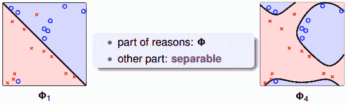

如何避免过拟合？方法是允许有分类错误的点，即把某些点当作是noise，放弃这些noise点，但是尽量让这些noise个数越少越好。回顾一下我们在机器学习基石笔记中介绍的pocket算法，pocket的思想不是将所有点完全分开，而是找到一条分类线能让分类错误的点最少。而Hard-Margin SVM的目标是将所有点都完全分开，不允许有错误点存在。为了防止过拟合，我们可以借鉴pocket的思想，即允许有犯错误的点，目标是让这些点越少越好。

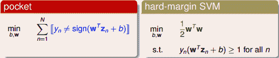

为了引入允许犯错误的点，我们将Hard-Margin SVM的目标和条件做一些结合和修正，转换为如下形式：

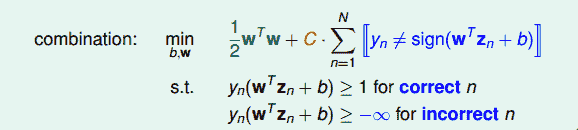

修正后的条件中，对于分类正确的点，仍需满足，而对于noise点，满足，即没有限制。修正后的目标除了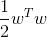项，还添加了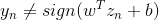，即noise点的个数。参数C的引入是为了权衡目标第一项和第二项的关系，即权衡large margin和noise tolerance的关系。

我们再对上述的条件做修正，将两个条件合并，得到：

这个式子存在两个不足的地方。首先，最小化目标中第二项是非线性的，不满足QP的条件，所以无法使用dual或者kernel SVM来计算。然后，对于犯错误的点，有的离边界很近，即error小，而有的离边界很远，error很大，上式的条件和目标没有区分small error和large error。这种分类效果是不完美的。

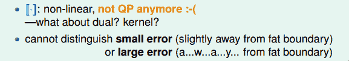

为了改正这些不足，我们继续做如下修正：

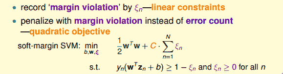

修正后的表达式中，我们引入了新的参数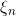来表示每个点犯错误的程度值，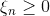。通过使用error值的大小代替是否有error，让问题变得易于求解，满足QP形式要求。这种方法类似于我们在机器学习基石笔记中介绍的0/1 error和squared error。这种soft-margin SVM引入新的参数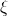。

至此，最终的Soft-Margin SVM的目标为：

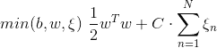

条件是：

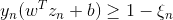

其中，表示每个点犯错误的程度，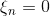，表示没有错误，越大，表示错误越大，即点距离边界（负的）越大。参数C表示尽可能选择宽边界和尽可能不要犯错两者之间的权衡，因为边界宽了，往往犯错误的点会增加。large C表示希望得到更少的分类错误，即不惜选择窄边界也要尽可能把更多点正确分类；small C表示希望得到更宽的边界，即不惜增加错误点个数也要选择更宽的分类边界。

与之对应的QP问题中，由于新的参数的引入，总共参数个数为，限制条件添加了，则总条件个数为2N。

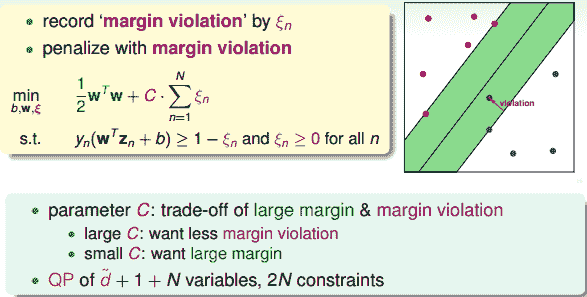

### **Dual Problem**

接下来，我们将推导Soft-Margin SVM的对偶dual形式，从而让QP计算更加简单，并便于引入kernel算法。首先，我们把Soft-Margin SVM的原始形式写出来：

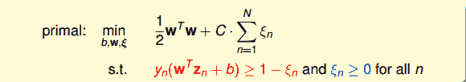

然后，跟我们在第二节课中介绍的Hard-Margin SVM做法一样，构造一个拉格朗日函数。因为引入了，原始问题有两类条件，所以包含了两个拉格朗日因子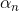和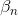。拉格朗日函数可表示为如下形式：

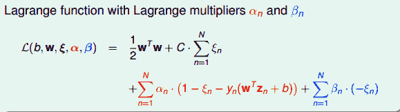

接下来，我们跟第二节课中的做法一样，利用Lagrange dual problem，将Soft-Margin SVM问题转换为如下形式：

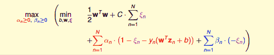

根据之前介绍的KKT条件，我们对上式进行简化。上式括号里面的是对拉格朗日函数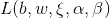计算最小值。那么根据梯度下降算法思想：最小值位置满足梯度为零。

我们先对做偏微分：

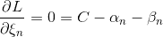

根据上式，得到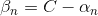，因为有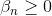，所以限制。将代入到dual形式中并化简，我们发现和都被消去了：

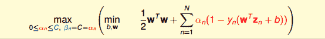

这个形式跟Hard-Margin SVM中的dual形式是基本一致的，只是条件不同。那么，我们分别令拉个朗日函数L对b和w的偏导数为零，分别得到：

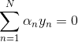

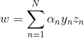

经过化简和推导，最终标准的Soft-Margin SVM的Dual形式如下图所示：

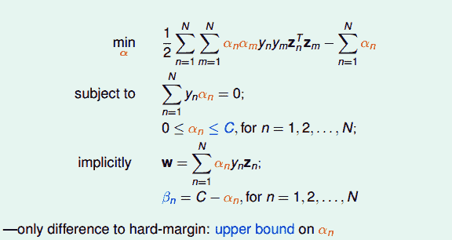

Soft-Margin SVM Dual与Hard-Margin SVM Dual基本一致，只有一些条件不同。Hard-Margin SVM Dual中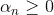，而Soft-Margin SVM Dual中，且新的拉格朗日因子。在QP问题中，Soft-Margin SVM Dual的参数同样是N个，但是，条件由Hard-Margin SVM Dual中的N+1个变成2N+1个，这是因为多了N个的上界条件。

对于Soft-Margin SVM Dual这部分推导不太清楚的同学，可以看下第二节课的笔记：[2 – Dual Support Vector Machine](http://blog.csdn.net/red_stone1/article/details/73822768)

### **Messages behind Soft-Margin SVM**

推导完Soft-Margin SVM Dual的简化形式后，就可以利用QP，找到Q，p，A，c对应的值，用软件工具包得到的值。或者利用核函数的方式，同样可以简化计算，优化分类效果。Soft-Margin SVM Dual计算的方法过程与Hard-Margin SVM Dual的过程是相同的。

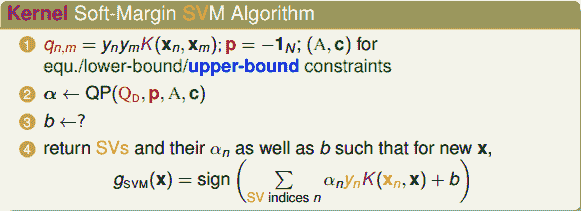

但是如何根据的值计算b呢？在Hard-Margin SVM Dual中，有complementary slackness条件：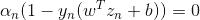，找到SV，即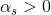的点，计算得到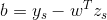。

那么，在Soft-Margin SVM Dual中，相应的complementary slackness条件有两个（因为两个拉格朗日因子和）：

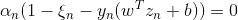

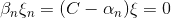

找到SV，即的点，由于参数的存在，还不能完全计算出b的值。根据第二个complementary slackness条件，如果令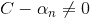，即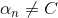，则一定有，代入到第一个complementary slackness条件，即可计算得到。我们把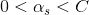的点称为free SV。引入核函数后，b的表达式为：

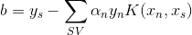

上面求解b提到的一个假设是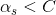，这个假设是否一定满足呢？如果没有free SV，所有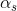大于零的点都满足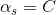怎么办？一般情况下，至少存在一组SV使的概率是很大的。如果出现没有free SV的情况，那么b通常会由许多不等式条件限制取值范围，值是不确定的，只要能找到其中满足KKT条件的任意一个b值就可以了。这部分细节比较复杂，不再赘述。

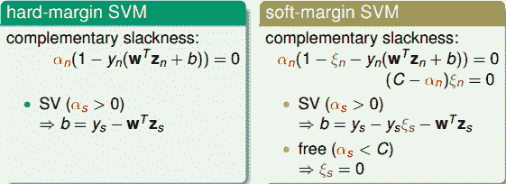

接下来，我们看看C取不同的值对margin的影响。例如，对于Soft-Margin Gaussian SVM，C分别取1，10，100时，相应的margin如下图所示：

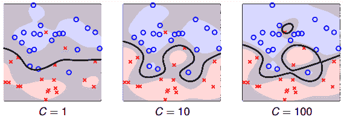

从上图可以看出，C=1时，margin比较粗，但是分类错误的点也比较多，当C越来越大的时候，margin越来越细，分类错误的点也在减少。正如前面介绍的，C值反映了margin和分类正确的一个权衡。C越小，越倾向于得到粗的margin，宁可增加分类错误的点；C越大，越倾向于得到高的分类正确率，宁可margin很细。我们发现，当C值很大的时候，虽然分类正确率提高，但很可能把noise也进行了处理，从而可能造成过拟合。也就是说Soft-Margin Gaussian SVM同样可能会出现过拟合现象，所以参数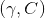的选择非常重要。

我们再来看看取不同值是对应的物理意义。已知满足两个complementary slackness条件：

若，得。表示该点没有犯错，表示该点不是SV。所以对应的点在margin之外（或者在margin上），且均分类正确。

若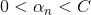，得，且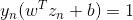。表示该点没有犯错，表示该点在margin上。这些点即free SV，确定了b的值。

若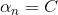，不能确定是否为零，且得到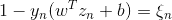，这个式表示该点偏离margin的程度，越大，偏离margin的程度越大。只有当时，该点落在margin上。所以这种情况对应的点在margin之内负方向（或者在margin上），有分类正确也有分类错误的。这些点称为bounded SV。

所以，在Soft-Margin SVM Dual中，根据的取值，就可以推断数据点在空间的分布情况。

### **Model Selection**

在Soft-Margin SVM Dual中，kernel的选择、C等参数的选择都非常重要，直接影响分类效果。例如，对于Gaussian SVM，不同的参数，会得到不同的margin，如下图所示。

其中横坐标是C逐渐增大的情况，纵坐标是逐渐增大的情况。不同的组合，margin的差别很大。那么如何选择最好的等参数呢？最简单最好用的工具就是validation。

validation我们在机器学习基石课程中已经介绍过，只需要将由不同等参数得到的模型在验证集上进行cross validation，选取最小的对应的模型就可以了。例如上图中各种组合得到的如下图所示：

因为左下角的最小，所以就选择该对应的模型。通常来说，并不是的连续函数，很难使用最优化选择（例如梯度下降）。一般做法是选取不同的离散的值进行组合，得到最小的，其对应的模型即为最佳模型。这种算法就是我们之前在机器学习基石中介绍过的V-Fold cross validation，在SVM中使用非常广泛。

V-Fold cross validation的一种极限就是Leave-One-Out CV，也就是验证集只有一个样本。对于SVM问题，它的验证集Error满足：

也就是说留一法验证集Error大小不超过支持向量SV占所有样本的比例。下面做简单的证明。令样本总数为N，对这N个点进行SVM分类后得到margin，假设第N个点的，不是SV，即远离margin（正距离）。这时候，如果我们只使用剩下的N-1个点来进行SVM分类，那么第N个点必然是分类正确的点，所得的SVM margin跟使用N个点的到的是完全一致的。这是因为我们假设第N个点是non-SV，对SV没有贡献，不影响margin的位置和形状。所以前N-1个点和N个点得到的margin是一样的。

那么，对于non-SV的点，它的，即对第N个点，它的Error必然为零：

另一方面，假设第N个点，即对于SV的点，它的Error可能是0，也可能是1，必然有：

综上所述，即证明了。这符合我们之前得到的结论，即只有SV影响margin，non-SV对margin没有任何影响，可以舍弃。

SV的数量在SVM模型选择中也是很重要的。一般来说，SV越多，表示模型可能越复杂，越有可能会造成过拟合。所以，通常选择SV数量较少的模型，然后在剩下的模型中使用cross-validation，比较选择最佳模型。

### **总结**

本节课主要介绍了Soft-Margin SVM。我们的出发点是与Hard-Margin SVM不同，不一定要将所有的样本点都完全分开，允许有分类错误的点，而使margin比较宽。然后，我们增加了作为分类错误的惩罚项，根据之前介绍的Dual SVM，推导出了Soft-Margin SVM的QP形式。得到的除了要满足大于零，还有一个上界C。接着介绍了通过值的大小，可以将数据点分为三种：non-SVs，free SVs，bounded SVs，这种更清晰的物理解释便于数据分析。最后介绍了如何选择合适的SVM模型，通常的办法是cross-validation和利用SV的数量进行筛选。

**_注明：_**

文章中所有的图片均来自台湾大学林轩田《机器学习技法》课程
