# 5 -- Kernel Logistic Regression

上节课我们主要介绍了Soft-Margin SVM，即如果允许有分类错误的点存在，那么在原来的Hard-Margin SVM中添加新的惩罚因子C，修正原来的公式，得到新的值。最终的到的有个上界，上界就是C。Soft-Margin SVM权衡了large-margin和error point之前的关系，目的是在尽可能犯更少错误的前提下，得到最大分类边界。本节课将把Soft-Margin SVM和我们之前介绍的Logistic Regression联系起来，研究如何使用kernel技巧来解决更多的问题。

### **Soft-Margin SVM as Regularized Model**

先复习一下我们已经介绍过的内容，我们最早开始讲了Hard-Margin Primal的数学表达式，然后推导了Hard-Margin Dual形式。后来，为了允许有错误点的存在（或者noise），也为了避免模型过于复杂化，造成过拟合，我们建立了Soft-Margin Primal的数学表达式，并引入了新的参数C作为权衡因子，然后也推导了其Soft-Margin Dual形式。因为Soft-Margin Dual SVM更加灵活、便于调整参数，所以在实际应用中，使用Soft-Margin Dual SVM来解决分类问题的情况更多一些。

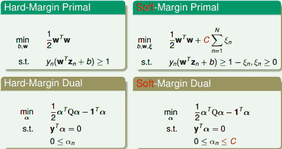

Soft-Margin Dual SVM有两个应用非常广泛的工具包，分别是Libsvm和Liblinear。 Libsvm和Liblinear都是国立台湾大学的Chih-Jen Lin博士开发的，Chih-Jen Lin的个人网站为：[Welcome to Chih-Jen Lin’s Home Page](http://www.csie.ntu.edu.tw/~cjlin/index.html)

下面我们再来回顾一下Soft-Margin SVM的主要内容。我们的出发点是用来表示margin violation，即犯错值的大小，没有犯错对应的。然后将有条件问题转化为对偶dual形式，使用QP来得到最佳化的解。

从另外一个角度来看，描述的是点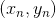 距离的边界有多远。第一种情况是violating margin，即不满足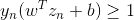。那么可表示为：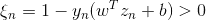。第二种情况是not violating margin，即点 在边界之外，满足的条件，此时。我们可以将两种情况整合到一个表达式中，对任意点：

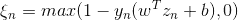

上式表明，如果有voilating margin，则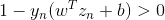，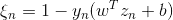；如果not violating margin，则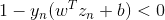，。整合之后，我们可以把Soft-Margin SVM的最小化问题写成如下形式：

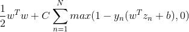

经过这种转换之后，表征犯错误值大小的变量就被消去了，转而由一个max操作代替。

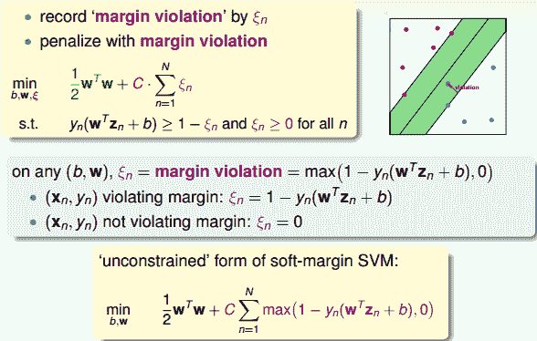

为什么要将把Soft-Margin SVM转换为这种unconstrained form呢？我们再来看一下转换后的形式，其中包含两项，第一项是w的内积，第二项关于y和w，b，z的表达式，似乎有点像一种错误估计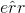，则类似这样的形式：

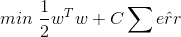

看到这样的形式我们应该很熟悉，因为之前介绍的L2 Regularization中最优化问题的表达式跟这个是类似的：

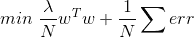

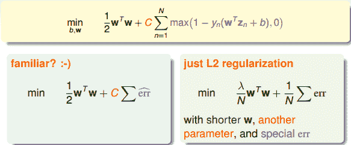

这里提一下，既然unconstrained form SVM与L2 Regularization的形式是一致的，而且L2 Regularization的解法我们之前也介绍过，那么为什么不直接利用这种方法来解决unconstrained form SVM的问题呢？有两个原因。一个是这种无条件的最优化问题无法通过QP解决，即对偶推导和kernel都无法使用；另一个是这种形式中包含的max()项可能造成函数并不是处处可导，这种情况难以用微分方法解决。

我们在第一节课中就介绍过Hard-Margin SVM与Regularization Model是有关系的。Regularization的目标是最小化，条件是，而Hard-Margin SVM的目标是最小化，条件是，即它们的最小化目标和限制条件是相互对调的。对于L2 Regularization来说，条件和最优化问题结合起来，整体形式写成：

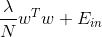

而对于Soft-Margin SVM来说，条件和最优化问题结合起来，整体形式写成：

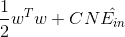

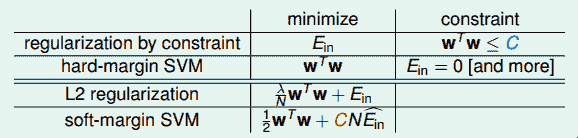

通过对比，我们发现L2 Regularization和Soft-Margin SVM的形式是相同的，两个式子分别包含了参数和C。Soft-Margin SVM中的large margin对应着L2 Regularization中的short w，也就是都让hyperplanes更简单一些。我们使用特别的来代表可以容忍犯错误的程度，即soft margin。L2 Regularization中的和Soft-Margin SVM中的C也是相互对应的，越大，w会越小，Regularization的程度就越大；C越小，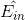会越大，相应的margin就越大。所以说增大C，或者减小，效果是一致的，Large-Margin等同于Regularization，都起到了防止过拟合的作用。

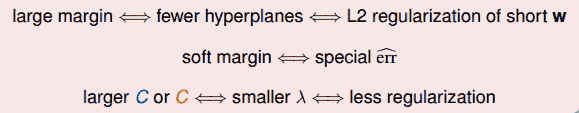

建立了Regularization和Soft-Margin SVM的关系，接下来我们将尝试看看是否能把SVM作为一个regularized的模型进行扩展，来解决其它一些问题。

### **SVM versus Logistic Regression**

上一小节，我们已经把Soft-Margin SVM转换成无条件的形式：

上式中第二项的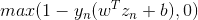倍设置为。下面我们来看看与之前再二元分类中介绍过的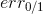有什么关系。

对于，它的linear score 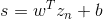，当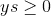时，；当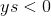时，，呈阶梯状，如下图所示。而对于，当时，；当时，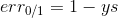，呈折线状，如下图所示，通常把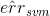称为hinge error measure。比较两条error曲线，我们发现始终在的上面，则可作为的上界。所以，可以使用来代替，解决二元线性分类问题，而且是一个凸函数，使它在最佳化问题中有更好的性质。

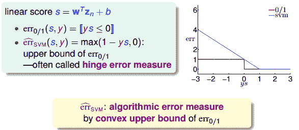

紧接着，我们再来看一下logistic regression中的error function。逻辑回归中，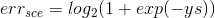，当ys=0时，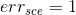。它的err曲线如下所示。

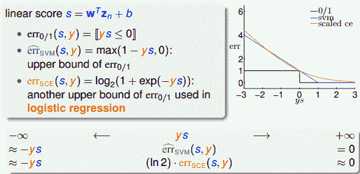

很明显，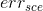也是的上界，而与也是比较相近的。因为当ys趋向正无穷大的时候，和都趋向于零；当ys趋向负无穷大的时候，和都趋向于正无穷大。正因为二者的这种相似性，我们可以把SVM看成是L2-regularized logistic regression。

总结一下，我们已经介绍过几种Binary Classification的Linear Models，包括PLA，Logistic Regression和Soft-Margin SVM。PLA是相对简单的一个模型，对应的是，通过不断修正错误的点来获得最佳分类线。它的优点是简单快速，缺点是只对线性可分的情况有用，线性不可分的情况需要用到pocket算法。Logistic Regression对应的是，通常使用GD/SGD算法求解最佳分类线。它的优点是凸函数便于最优化求解，而且有regularization作为避免过拟合的保证；缺点是作为的上界，当ys很小（负值）时，上界变得更宽松，不利于最优化求解。Soft-Margin SVM对应的是，通常使用QP求解最佳分类线。它的优点和Logistic Regression一样，凸优化问题计算简单而且分类线比较“粗壮”一些；缺点也和Logistic Regression一样，当ys很小（负值）时，上界变得过于宽松。其实，Logistic Regression和Soft-Margin SVM都是在最佳化的上界而已。

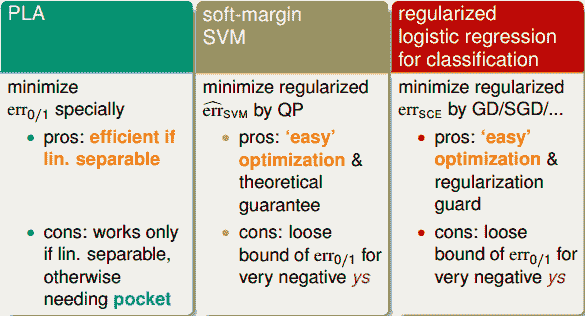

至此，可以看出，求解regularized logistic regression的问题等同于求解soft-margin SVM的问题。反过来，如果我们求解了一个soft-margin SVM的问题，那这个解能否直接为regularized logistic regression所用？来预测结果是正类的几率是多少，就像regularized logistic regression做的一样。我们下一小节将来解答这个问题。

### **SVM for Soft Binary Classification**

接下来，我们探讨如何将SVM的结果应用在Soft Binary Classification中，得到是正类的概率值。

第一种简单的方法是先得到SVM的解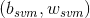，然后直接代入到logistic regression中，得到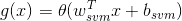。这种方法直接使用了SVM和logistic regression的相似性，一般情况下表现还不错。但是，这种形式过于简单，与logistic regression的关联不大，没有使用到logistic regression中好的性质和方法。

第二种简单的方法是同样先得到SVM的解，然后把作为logistic regression的初始值，再进行迭代训练修正，速度比较快，最后，将得到的b和w代入到g(x)中。这种做法有点显得多此一举，因为并没有比直接使用logistic regression快捷多少。

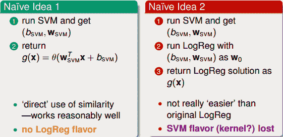

这两种方法都没有融合SVM和logistic regression各自的优势，下面构造一个模型，融合了二者的优势。构造的模型g(x)表达式为：

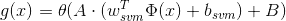

与上述第一种简单方法不同，我们额外增加了放缩因子A和平移因子B。首先利用SVM的解来构造这个模型，放缩因子A和平移因子B是待定系数。然后再用通用的logistic regression优化算法，通过迭代优化，得到最终的A和B。一般来说，如果较为合理的话，满足A&gt;0且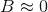。

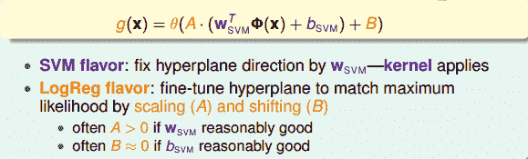

那么，新的logistic regression表达式为：

这个表达式看上去很复杂，其实其中的已经在SVM中解出来了，实际上的未知参数只有A和B两个。归纳一下，这种Probabilistic SVM的做法分为三个步骤：

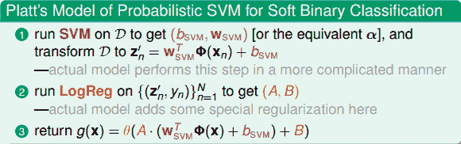

这种soft binary classifier方法得到的结果跟直接使用SVM classifier得到的结果可能不一样，这是因为我们引入了系数A和B。一般来说，soft binary classifier效果更好。至于logistic regression的解法，可以选择GD、SGD等等。

### **Kernel Logistic Regression**

上一小节我们介绍的是通过kernel SVM在z空间中求得logistic regression的近似解。如果我们希望直接在z空间中直接求解logistic regression，通过引入kernel，来解决最优化问题，又该怎么做呢？SVM中使用kernel，转化为QP问题，进行求解，但是logistic regression却不是个QP问题，看似好像没有办法利用kernel来解决。

我们先来看看之前介绍的kernel trick为什么会work，kernel trick就是把z空间的内积转换到x空间中比较容易计算的函数。如果w可以表示为z的线性组合，即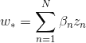的形式，那么乘积项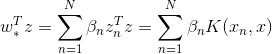，即其中包含了z的内积。也就是w可以表示为z的线性组合是kernel trick可以work的关键。

我们之前介绍过SVM、PLA包扩logistic regression都可以表示成z的线性组合，这也提供了一种可能，就是将kernel应用到这些问题中去，简化z空间的计算难度。

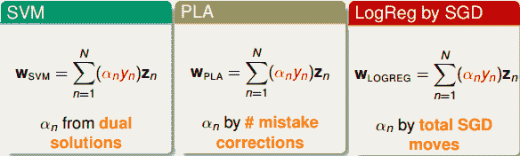

有这样一个理论，对于L2-regularized linear model，如果它的最小化问题形式为如下的话，那么最优解。

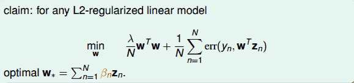

下面给出简单的证明，假如最优解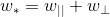。其中，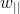和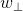分别是平行z空间和垂直z空间的部分。我们需要证明的是。利用反证法，假如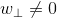，考虑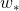与的比较。第一步先比较最小化问题的第二项：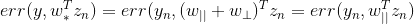，即第二项是相等的。然后第二步比较第一项：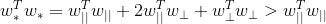，即对应的L2-regularized linear model值要比大，这就说明并不是最优解，从而证明必然等于零，即一定成立，一定可以写成z的线性组合形式。

经过证明和分析，我们得到了结论是任何L2-regularized linear model都可以使用kernel来解决。

现在，我们来看看如何把kernel应用在L2-regularized logistic regression上。上面我们已经证明了一定可以写成z的线性组合形式，即。那么我们就无需一定求出，而只要求出其中的就行了。怎么求呢？直接将代入到L2-regularized logistic regression最小化问题中，得到：

上式中，所有的w项都换成来表示了，变成了没有条件限制的最优化问题。我们把这种问题称为kernel logistic regression，即引入kernel，将求w的问题转换为求的问题。

从另外一个角度来看Kernel Logistic Regression（KLR）：

上式中log项里的可以看成是变量和的内积。上式第一项中的可以看成是关于的正则化项。所以，KLR是的线性组合，其中包含了kernel内积项和kernel regularizer。这与SVM是相似的形式。

但值得一提的是，KLR中的与SVM中的是有区别的。SVM中的大部分为零，SV的个数通常是比较少的；而KLR中的通常都是非零值。

### **总结**

本节课主要介绍了Kernel Logistic Regression。首先把Soft-Margin SVM解释成Regularized Model，建立二者之间的联系，其实Soft-Margin SVM就是一个L2-regularization，对应着hinge error messure。然后利用它们之间的相似性，讨论了如何利用SVM的解来得到Soft Binary Classification。方法是先得到SVM的解，再在logistic regression中引入参数A和B，迭代训练，得到最佳解。最后介绍了Kernel Logistic Regression，证明L2-regularized logistic regression中，最佳解一定可以写成z的线性组合形式，从而可以将kernel引入logistic regression中，使用kernel思想在z空间直接求解L2-regularized logistic regression问题。

**_注明：_**

文章中所有的图片均来自台湾大学林轩田《机器学习技法》课程
