# 6 -- Support Vector Regression

上节课我们主要介绍了Kernel Logistic Regression，讨论如何把SVM的技巧应用在soft-binary classification上。方法是使用2-level learning，先利用SVM得到参数b和w，然后再用通用的logistic regression优化算法，通过迭代优化，对参数b和w进行微调，得到最佳解。然后，也介绍了可以通过Representer Theorem，在z空间中，引入SVM的kernel技巧，直接对logistic regression进行求解。本节课将延伸上节课的内容，讨论如何将SVM的kernel技巧应用到regression问题上。

### **Kernel Ridge Regression**

首先回顾一下上节课介绍的Representer Theorem，对于任何包含正则项的L2-regularized linear model，它的最佳化解w都可以写成是z的线性组合形式，因此，也就能引入kernel技巧，将模型kernelized化。

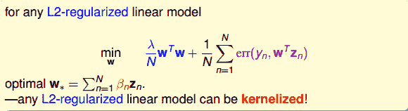

那么如何将regression模型变成kernel的形式呢？我们之前介绍的linear/ridge regression最常用的错误估计是squared error，即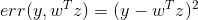。这种形式对应的解是analytic solution，即可以使用线性最小二乘法，通过向量运算，直接得到最优化解。那么接下来我们就要研究如何将kernel引入到ridge regression中去，得到与之对应的analytic solution。

我们先把Kernel Ridge Regression问题写下来：

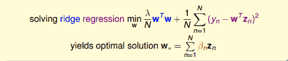

其中，最佳解必然是z的线性组合。那么我们就把代入到ridge regression中，将z的内积用kernel替换，把求的问题转化成求的问题，得到：

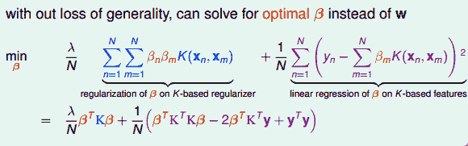

ridge regression可以写成矩阵的形式，其中第一项可以看成是的正则项，而第二项可以看成是的error function。这样，我们的目的就是求解该式最小化对应的值，这样就解决了kernel ridge regression问题。

求解的问题可以写成如下形式：

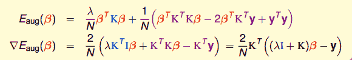

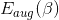是关于的二次多项式，要对求最小化解，这种凸二次最优化问题，只需要先计算其梯度，再令梯度为零即可。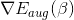已经在上式中写出来了，令其等于零，即可得到一种可能的的解析解为：

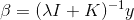

这里需要关心的问题是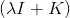的逆矩阵是否存在？答案是肯定的。因为我们之前介绍过，核函数K满足Mercer’s condition，它是半正定的，而且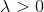，所以一定是可逆的。从计算的时间复杂上来说，由于是NxN大小的，所以时间复杂度是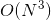。还有一点，是由两项乘积构成的，另一项是K，会不会出现K=0的情况呢？其实，由于核函数K表征的是z空间的内积，一般而言，除非两个向量互相垂直，内积才为零，否则，一般情况下K不等于零。这个原因也决定了是dense matrix，即的解大部分都是非零值。这个性质，我们之后还会说明。

所以说，我们可以通过kernel来解决non-linear regression的问题。下面比较一下linear ridge regression和kernel ridge regression的关系。

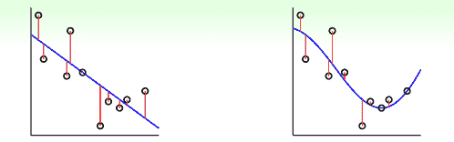

如上图所示，左边是linear ridge regression，是一条直线；右边是kernel ridge regression，是一条曲线。大致比较一下，右边的曲线拟合的效果更好一些。这两种regression有什么样的优点和缺点呢？对于linear ridge regression来说，它是线性模型，只能拟合直线；其次，它的训练复杂度是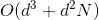，预测的复杂度是，如果N比d大很多时，这种模型就更有效率。而对于kernel ridge regression来说，它转换到z空间，使用kernel技巧，得到的是非线性模型，所以更加灵活；其次，它的训练复杂度是，预测的复杂度是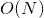，均只与N有关。当N很大的时候，计算量就很大，所以，kernel ridge regression适合N不是很大的场合。比较下来，可以说linear和kernel实际上是效率（efficiency）和灵活（flexibility）之间的权衡。

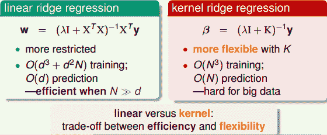

### **Support Vector Regression Primal**

我们在机器学习基石课程中介绍过linear regression可以用来做classification，那么上一部分介绍的kernel ridge regression同样可以来做classification。我们把kernel ridge regression应用在classification上取个新的名字，叫做least-squares SVM（LSSVM）。

先来看一下对于某个问题，soft-margin Gaussian SVM和Gaussian LSSVM结果有哪些不一样的地方。

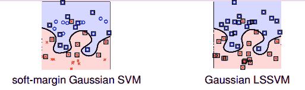

如上图所示，如果只看分类边界的话，soft-margin Gaussian SVM和Gaussian LSSVM差别不是很大，即的到的分类线是几乎相同的。但是如果看Support Vector的话（图中方框标注的点），左边soft-margin Gaussian SVM的SV不多，而右边Gaussian LSSVM中基本上每个点都是SV。这是因为soft-margin Gaussian SVM中的大部分是等于零，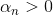的点只占少数，所以SV少。而对于LSSVM，我们上一部分介绍了的解大部分都是非零值，所以对应的每个点基本上都是SV。SV太多会带来一个问题，就是做预测的矩，如果非零值较多，那么g的计算量也比较大，降低计算速度。基于这个原因，soft-margin Gaussian SVM更有优势。

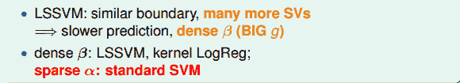

那么，针对LSSVM中dense 的缺点，我们能不能使用一些方法来的得到sparse ，使得SV不会太多，从而得到和soft-margin SVM同样的分类效果呢？下面我们将尝试解决这个问题。

方法是引入一个叫做Tube Regression的做法，即在分类线上下分别划定一个区域（中立区），如果数据点分布在这个区域内，则不算分类错误，只有误分在中立区域之外的地方才算error。

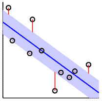

假定中立区的宽度为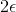，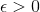,那么error measure就可以写成：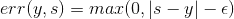，对应上图中红色标注的距离。

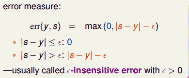

通常把这个error叫做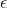-insensitive error，这种max的形式跟我们上节课中介绍的hinge error measure形式其实是类似的。所以，我们接下来要做的事情就是将L2-regularized tube regression做类似于soft-margin SVM的推导，从而得到sparse 。

首先，我们把tube regression中的error与squared error做个比较：

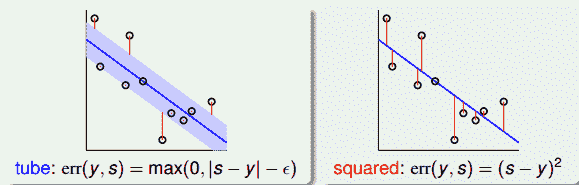

然后，将err(y,s)与s的关系曲线分别画出来：

上图中，红色的线表示squared error，蓝色的线表示tube error。我们发现，当|s-y|比较小即s比较接近y的时候，squared error与tube error是差不多大小的。而在|s-y|比较大的区域，squared error的增长幅度要比tube error大很多。error的增长幅度越大，表示越容易受到noise的影响，不利于最优化问题的求解。所以，从这个方面来看，tube regression的这种error function要更好一些。

现在，我们把L2-Regularized Tube Regression写下来：

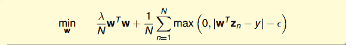

这个最优化问题，由于其中包含max项，并不是处处可微分的，所以不适合用GD/SGD来求解。而且，虽然满足representer theorem，有可能通过引入kernel来求解，但是也并不能保证得到sparsity 。从另一方面考虑，我们可以把这个问题转换为带条件的QP问题，仿照dual SVM的推导方法，引入kernel，得到KKT条件，从而保证解是sparse的。

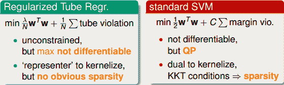

所以，我们就可以把L2-Regularized Tube Regression写成跟SVM类似的形式：

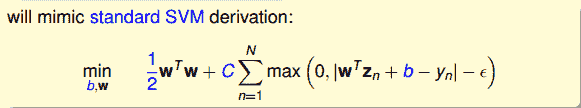

值得一提的是，系数和C是反比例相关的，越大对应C越小，越小对应C越大。而且该式也把即b单独拿了出来，这跟我们之前推导SVM的解的方法是一致的。

现在我们已经有了Standard Support Vector Regression的初始形式，这还是不是一个标准的QP问题。我们继续对该表达式做一些转化和推导：

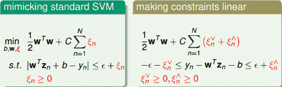

如上图右边所示，即为标准的QP问题，其中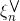和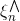分别表示upper tube violations和lower tube violations。这种形式叫做Support Vector Regression（SVR） primal。

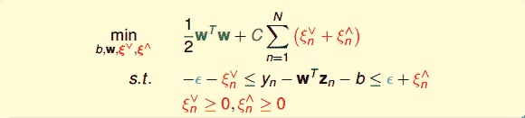

SVR的标准QP形式包含几个重要的参数：C和。C表示的是regularization和tube violation之间的权衡。large C倾向于tube violation，small C则倾向于regularization。表征了tube的区域宽度，即对错误点的容忍程度。越大，则表示对错误的容忍度越大。是可设置的常数，是SVR问题中独有的，SVM中没有这个参数。另外，SVR的QP形式共有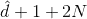个参数，2N+2N个条件。

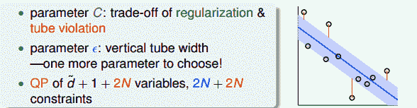

### **Support Vector Regression Dual**

现在我们已经得到了SVR的primal形式，接下来将推导SVR的Dual形式。首先，与SVM对偶形式一样，先令拉格朗日因子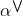和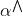，分别是与和不等式相对应。这里忽略了与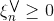和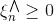对应的拉格朗日因子。

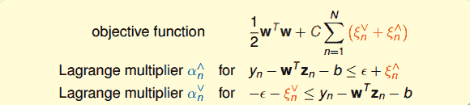

然后，与SVM一样做同样的推导和化简，拉格朗日函数对相关参数偏微分为零，得到相应的KKT条件：

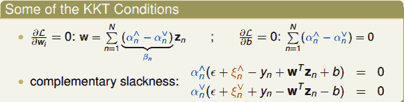

接下来，通过观察SVM primal与SVM dual的参数对应关系，直接从SVR primal推导出SVR dual的形式。（具体数学推导，此处忽略！）

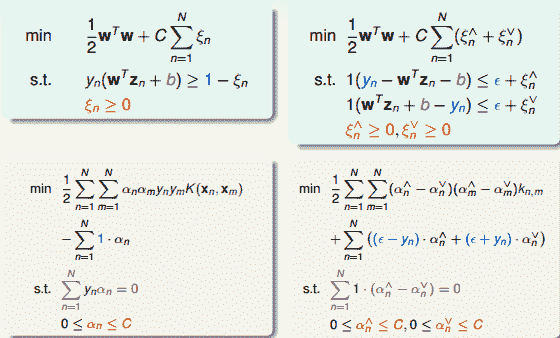

最后，我们就要来讨论一下SVR的解是否真的是sparse的。前面已经推导了SVR dual形式下推导的解w为：

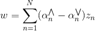

相应的complementary slackness为：

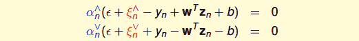

对于分布在tube中心区域内的点，满足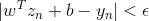，此时忽略错误，和都等于零。则complementary slackness两个等式的第二项均不为零，必然得到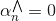和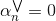，即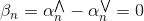。

所以，对于分布在tube内的点，得到的解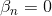，是sparse的。而分布在tube之外的点，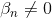。至此，我们就得到了SVR的sparse解。

### **Summary of Kernel Models**

这部分将对我们介绍过的所有的kernel模型做个概括和总结。我们总共介绍过三种线性模型，分别是PLA/pocket，regularized logistic regression和linear ridge regression。这三种模型都可以使用国立台湾大学的Chih-Jen Lin博士开发的Liblinear库函数来解决。

另外，我们介绍了linear soft-margin SVM，其中的error function是，可以通过标准的QP问题来求解。linear soft-margin SVM和PLA/pocket一样都是解决同样的问题。然后，还介绍了linear SVR问题，它与linear ridge regression一样都是解决同样的问题，从SVM的角度，使用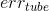，转换为QP问题进行求解，这也是我们本节课的主要内容。

上图中相应的模型也可以转化为dual形式，引入kernel，整体的框图如下：

其中SVM，SVR和probabilistic SVM都可以使用国立台湾大学的Chih-Jen Lin博士开发的LLibsvm库函数来解决。通常来说，这些模型中SVR和probabilistic SVM最为常用。

### **总结**

本节课主要介绍了SVR，我们先通过representer theorem理论，将ridge regression转化为kernel的形式，即kernel ridge regression，并推导了SVR的解。但是得到的解是dense的，大部分为非零值。所以，我们定义新的tube regression，使用SVM的推导方法，来最小化regularized tube errors，转化为对偶形式，得到了sparse的解。最后，我们对介绍过的所有kernel模型做个总结，简单概述了各自的特点。在实际应用中，我们要根据不同的问题进行合适的模型选择。

**_注明：_**

文章中所有的图片均来自台湾大学林轩田《机器学习技法》课程
