# 7 -- Blending and Bagging

上节课我们主要介绍了Support Vector Regression，将kernel model引入到regression中。首先，通过将ridge regression和representer theorem结合起来，得到kernel ridge regression。但是其解是dense的，即不部分不为零。为了得到sparse解，我们将regularized tube error和Lagrange dual结合起来，利用SVM dual的推导方法，得到support vector regression的sparse解。本系列1-6节课主要介绍Kernel Models及其应用，从本节课开始，讲介绍Aggregation Models，即如何将不同的hypothesis和features结合起来，让模型更好。本节课将介绍其中的两个方法，一个是Blending，一个是Bagging。

### **Motivation of Aggregation**

首先举个例子来说明为什么要使用Aggregation。假如你有T个朋友，每个朋友向你预测推荐明天某支股票会涨还是会跌，对应的建议分别是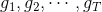，那么你该选择哪个朋友的建议呢？即最终选择对股票预测的是什么样的？

第一种方法是从T个朋友中选择一个最受信任，对股票预测能力最强的人，直接听从他的建议就好。这是一种普遍的做法，对应的就是validation思想，即选择犯错误最小的模型。第二种方法，如果每个朋友在股票预测方面都是比较厉害的，都有各自的专长，那么就同时考虑T个朋友的建议，将所有结果做个投票，一人一票，最终决定出对该支股票的预测。这种方法对应的是uniformly思想。第三种方法，如果每个朋友水平不一，有的比较厉害，投票比重应该更大一些，有的比较差，投票比重应该更小一些。那么，仍然对T个朋友进行投票，只是每个人的投票权重不同。这种方法对应的是non-uniformly的思想。第四种方法与第三种方法类似，但是权重不是固定的，根据不同的条件，给予不同的权重。比如如果是传统行业的股票，那么给这方面比较厉害的朋友较高的投票权重，如果是服务行业，那么就给这方面比较厉害的朋友较高的投票权重。以上所述的这四种方法都是将不同人不同意见融合起来的方式，接下来我们就要讨论如何将这些做法对应到机器学习中去。Aggregation的思想与这个例子是类似的，即把多个hypothesis结合起来，得到更好的预测效果。

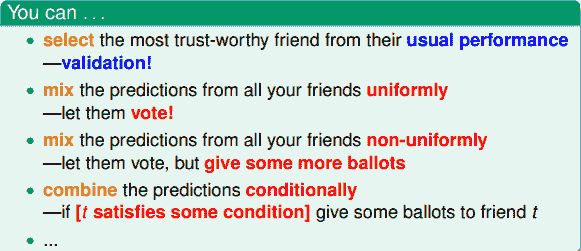

将刚刚举的例子的各种方法用数学化的语言和机器学习符号归纳表示出来，其中G(x)表示最终选择的模型。

第一种方法对应的模型：

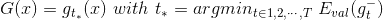

第二种方法对应的模型：

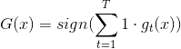

第三种方法对应的模型：

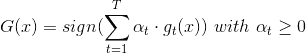

第四种方法对应的模型：

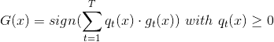

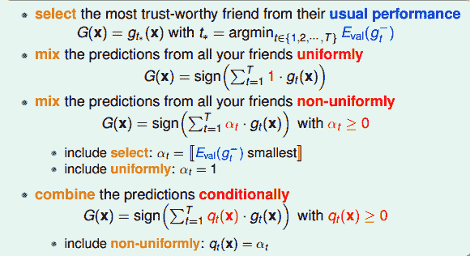

注意这里提到的第一种方法是通过验证集来选择最佳模型，不能使用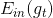来代替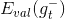。经过Validation，选择最小的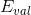，保证最小，从而将对应的模型作为最佳的选择。

但是第一种方法只是从众多可能的hypothesis中选择最好的模型，并不能发挥集体的智慧。而Aggregation的思想是博采众长，将可能的hypothesis优势集合起来，将集体智慧融合起来，使预测模型达到更好的效果。

下面先来看一个例子，通过这个例子说明为什么Aggregation能work得更好。

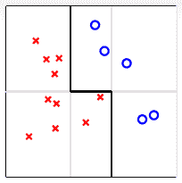

如上图所示，平面上分布着一些待分类的点。如果要求只能用一条水平的线或者垂直的线进行分类，那不论怎么选取直线，都达不到最佳的分类效果。这实际上就是上面介绍的第一种方法：validation。但是，如果可以使用集体智慧，比如一条水平线和两条垂直线组合而成的图中折线形式，就可以将所有的点完全分开，得到了最优化的预测模型。

这个例子表明，通过将不同的hypotheses均匀地结合起来，得到了比单一hypothesis更好的预测模型。这就是aggregation的优势所在，它提高了预测模型的power，起到了特征转换（feature transform）的效果。

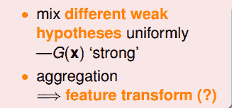

我们再从另外一方面来看，同样是平面上分布着一些待分类的点，使用PLA算法，可以得到很多满足条件的分类线，如下图所示：

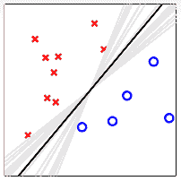

这无数条PLA选择出来的直线对应的hypothesis都是满足分类要求的。但是我们最想得到的分类直线是中间那条距离所有点都比较远的黑色直线，这与之前SVM目标是一致的。如果我们将所有可能的hypothesis结合起来，以投票的方式进行组合选择，最终会发现投票得到的分类线就是中间和黑色那条。这从哲学的角度来说，就是对各种效果较好的可能性进行组合，得到的结果一般是中庸的、最合适的，即对应图中那条黑色直线。所以，aggregation也起到了正则化（regularization）的效果，让预测模型更具有代表性。

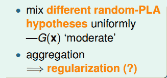

基于以上的两个例子，我们得到了aggregation的两个优势：feature transform和regularization。我们之前在机器学习基石课程中就介绍过，feature transform和regularization是对立的，还把它们分别比作踩油门和踩刹车。如果进行feature transform，那么regularization的效果通常很差，反之亦然。也就是说，单一模型通常只能倾向于feature transform和regularization之一，在两者之间做个权衡。但是aggregation却能将feature transform和regularization各自的优势结合起来，好比把油门和刹车都控制得很好，从而得到不错的预测模型。

### **Uniform Blending**

那对于我们已经选择的性能较好的一些矩，如何将它们进行整合、合并，来得到最佳的预测模型呢？这个过程称为blending。

最常用的一种方法是uniform blending，应用于classification分类问题，做法是将每一个可能的矩赋予权重1，进行投票，得到的G(x)表示为：

这种方法对应三种情况：第一种情况是每个候选的矩都完全一样，这跟选其中任意一个效果相同；第二种情况是每个候选的矩都有一些差别，这是最常遇到的，大都可以通过投票的形式使多数意见修正少数意见，从而得到很好的模型，如下图所示；第三种情况是多分类问题，选择投票数最多的那一类即可。

如果是regression回归问题，uniform blending的做法很简单，就是将所有的矩求平均值：

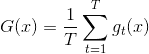

uniform blending for regression对应两种情况：第一种情况是每个候选的矩都完全一样，这跟选其中任意一个效果相同；第二种情况是每个候选的矩都有一些差别，有的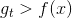，有的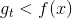，此时求平均值的操作可能会消去这种大于和小于的影响，从而得到更好的回归模型。因此，从直觉上来说，求平均值的操作更加稳定，更加准确。

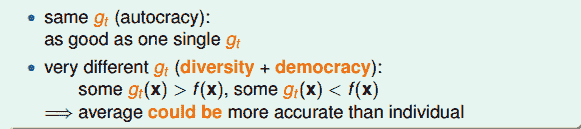

对于uniform blending，一般要求每个候选的矩都有一些差别。这样，通过不同矩的组合和集体智慧，都能得到比单一矩更好的模型。

刚才我们提到了uniform blending for regression中，计算的平均值可能比单一的更稳定，更准确。下面进行简单的推导和证明。

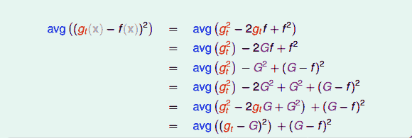

推导过程中注意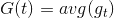。经过推导，我们发现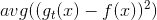与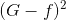之间差了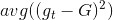项，且是大于零的。从而得到与目标函数f的差值要比G与f的差值大。

刚才是对单一的x进行证明，如果从期望角度，对整个x分布进行上述公式的整理，得到：

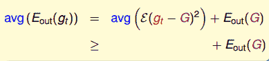

从结果上来看，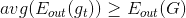，从而证明了从平均上来说，计算的平均值G(t)要比单一的更接近目标函数f，regression效果更好。

我们已经知道G是数目为T的的平均值。令包含N个数据的样本D独立同分布于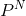，每次从新的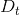中学习得到新的，在对求平均得到G，当做无限多次，即T趋向于无穷大的时候：

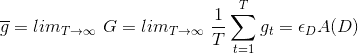

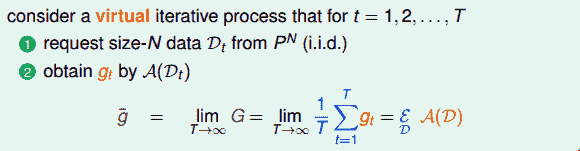

当T趋于无穷大的时候，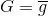，则有如下等式成立：

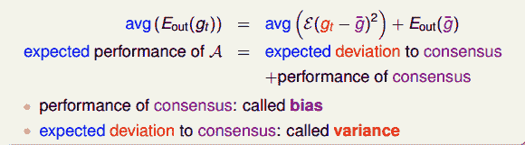

上述等式中左边表示演算法误差的期望值；右边第二项表示不同的平均误差共识，用偏差bias表示；右边第一项表示不同与共识的差距是多少，反映之间的偏差，用方差variance表示。也就是说，一个演算法的平均表现可以被拆成两项，一个是所有的共识，一个是不同之间的差距是多少，即bias和variance。而uniform blending的操作时求平均的过程，这样就削减弱化了上式第一项variance的值，从而演算法的表现就更好了，能得到更加稳定的表现。

### **Linear and Any Blending**

上一部分讲的是uniform blending，即每个所占的权重都是1，求平均的思想。下面我们将介绍linear blending，每个赋予的权重并不相同，其中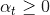。我们最终得到的预测结果等于所有的线性组合。

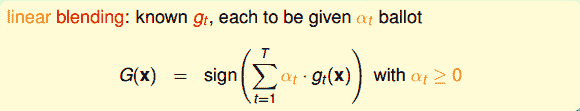

如何确定的值，方法是利用误差最小化的思想，找出最佳的，使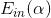取最小值。例如对于linear blending for regression，可以写成下图左边形式，其中是带求解参数，是每个矩得到的预测值，由已知矩得到。这种形式很类似于下图右边的形式，即加上特征转换的linear regression模型。两个式子中的对应于，唯一不同的就是linear blending for regression中，而linear regression中没有限制。

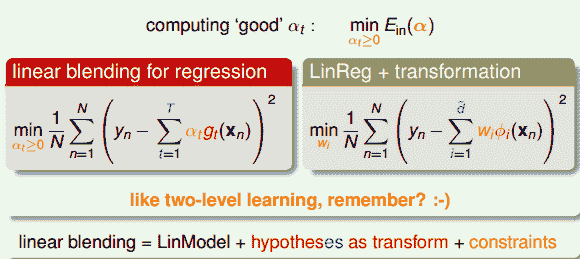

这种求解的方法就像是使用two-level learning，类似于我们之前介绍的probabilistic SVM。这里，我们先计算，再进行linear regression得到值。总的来说，linear blending由三个部分组成：LinModel，hypotheses as transform，constraints。其中值得注意的一点就是，计算过程中可以把当成feature transform，求解过程就跟之前没有什么不同，除了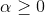的条件限制。

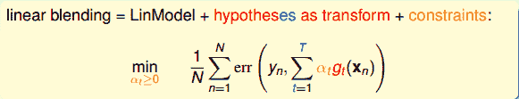

我们来看一下linear blending中的constraint 。这个条件是否一定要成立呢？如果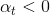，会带来什么后果呢？其实并不会影响分类效果，只需要将正类看成负类，负类当成正类即可。例如分类问题，判断该点是正类对应的，则它就表示该点是负类，且对应的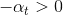。如果我们说这个样本是正类的概率是-99%，意思也就是说该样本是负类的概率是99%。和的效果是等同的一致的。所以，我们可以把这个条件舍去，这样linear blending就可以使用常规方法求解。

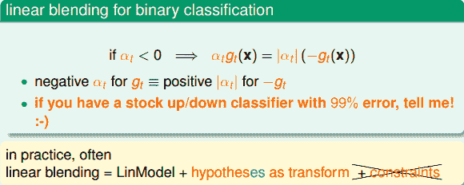

Linear Blending中使用的是通过模型选择而得到的，利用validation，从中得到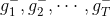。然后将中每个数据点经过各个矩的计算得到的值，代入到相应的linear blending计算公式中，迭代优化得到对应值。最终，再利用所有样本数据，得到新的代替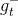，则G(t)就是的线性组合而不是，系数是。

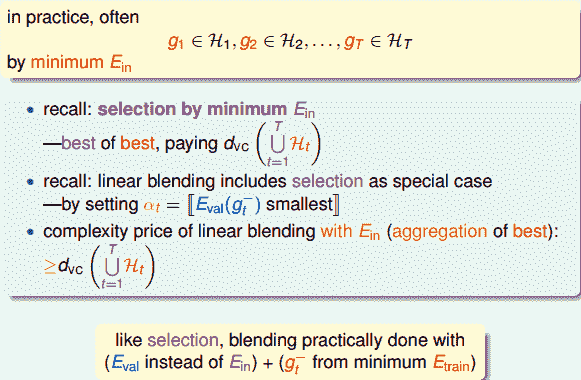

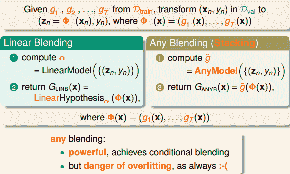

除了linear blending之外，还可以使用任意形式的blending。linear blending中，G(t)是g(t)的线性组合；any blending中，G(t)可以是g(t)的任何函数形式（非线性）。这种形式的blending也叫做Stacking。any blending的优点是模型复杂度提高，更容易获得更好的预测模型；缺点是复杂模型也容易带来过拟合的危险。所以，在使用any blending的过程中要时刻注意避免过拟合发生，通过采用regularization的方法，让模型具有更好的泛化能力。

### **Bagging(Bootstrap Aggregation)**

总结一些上面讲的内容，blending的做法就是将已经得到的矩进行aggregate的操作。具体的aggregation形式包括：uniform，non-uniforn和conditional。

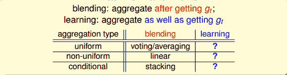

现在考虑一个问题：如何得到不同的呢？可以选取不同模型H；可以设置不同的参数，例如、迭代次数n等；可以由算法的随机性得到，例如PLA、随机种子等；可以选择不同的数据样本等。这些方法都可能得到不同的。

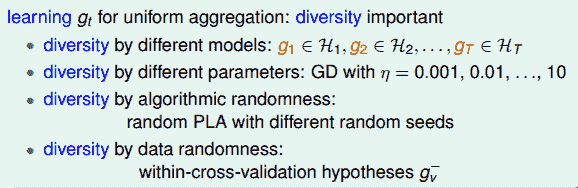

那如何利用已有的一份数据集来构造出不同的呢？首先，我们回顾一下之前介绍的bias-variance，即一个演算法的平均表现可以被拆成两项，一个是所有的共识（bias），一个是不同之间的差距是多少（variance）。其中每个都是需要新的数据集的。只有一份数据集的情况下，如何构造新的数据集？

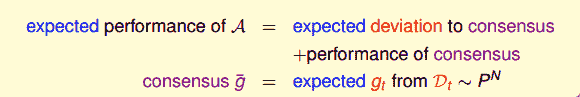

其中，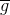是在矩个数T趋向于无穷大的时候，不同的计算平均得到的值。这里我们为了得到，做两个近似条件：

*   **有限的T；**

*   **由已有数据集D构造出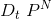，独立同分布**

第一个条件没有问题，第二个近似条件的做法就是bootstrapping。bootstrapping是统计学的一个工具，思想就是从已有数据集D中模拟出其他类似的样本。

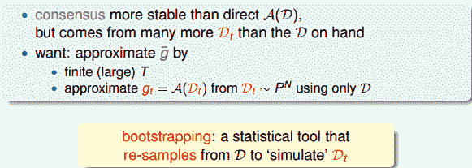

bootstrapping的做法是，假设有N笔资料，先从中选出一个样本，再放回去，再选择一个样本，再放回去，共重复N次。这样我们就得到了一个新的N笔资料，这个新的中可能包含原D里的重复样本点，也可能没有原D里的某些样本，与D类似但又不完全相同。值得一提的是，抽取-放回的操作不一定非要是N，次数可以任意设定。例如原始样本有10000个，我们可以抽取-放回3000次，得到包含3000个样本的也是完全可以的。利用bootstrap进行aggragation的操作就被称为bagging。

下面举个实际中Bagging Pocket算法的例子。如下图所示，先通过bootstrapping得到25个不同样本集，再使用pocket算法得到25个不同的，每个pocket算法迭代1000次。最后，再利用blending，将所有的融合起来，得到最终的分类线，如图中黑线所示。可以看出，虽然bootstrapping会得到差别很大的分类线（灰线），但是经过blending后，得到的分类线效果是不错的，则bagging通常能得到最佳的分类模型。

值得注意的是，只有当演算法对数据样本分布比较敏感的情况下，才有比较好的表现。

### **总结**

本节课主要介绍了blending和bagging的方法，它们都属于aggregation，即将不同的合并起来，利用集体的智慧得到更加优化的G(t)。Blending通常分为三种情况：Uniform Blending，Linear Blending和Any Blending。其中，uniform blending采样最简单的“一人一票”的方法，linear blending和any blending都采用标准的two-level learning方法，类似于特征转换的操作，来得到不同的线性组合或非线性组合。最后，我们介绍了如何利用bagging（bootstrap aggregation），从已有数据集D中模拟出其他类似的样本，而得到不同的，再合并起来，优化预测模型。

**_注明：_**

文章中所有的图片均来自台湾大学林轩田《机器学习技法》课程
