# 8 -- Adaptive Boosting

上节课我们主要开始介绍Aggregation Models，目的是将不同的hypothesis得到的集合起来，利用集体智慧得到更好的预测模型G。首先我们介绍了Blending，blending是将已存在的所有结合起来，可以是uniformly，linearly，或者non-linearly组合形式。然后，我们讨论了在没有那么多的情况下，使用bootstrap方式，从已有数据集中得到新的类似的数据集，从而得到不同的。这种做法称为bagging。本节课将继续从这些概念出发，介绍一种新的演算法。

### **Motivation of Boosting**

我们先来看一个简单的识别苹果的例子，老师展示20张图片，让6岁孩子们通过观察，判断其中哪些图片的内容是苹果。从判断的过程中推导如何解决二元分类问题的方法。

显然这是一个监督式学习，20张图片包括它的标签都是已知的。首先，学生Michael回答说：所有的苹果应该是圆形的。根据Michael的判断，对应到20张图片中去，大部分苹果能被识别出来，但也有错误。其中错误包括有的苹果不是圆形，而且圆形的水果也不一定是苹果。如下图所示：

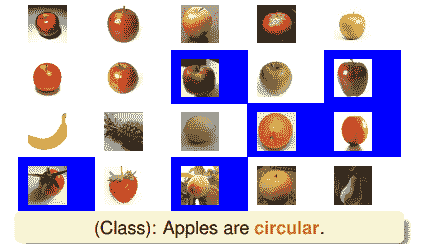

上图中蓝色区域的图片代表分类错误。显然，只用“苹果是圆形的”这一个条件不能保证分类效果很好。我们把蓝色区域（分类错误的图片）放大，分类正确的图片缩小，这样在接下来的分类中就会更加注重这些错误样本。

然后，学生Tina观察被放大的错误样本和上一轮被缩小的正确样本，回答说：苹果应该是红色的。根据Tina的判断，得到的结果如下图所示：

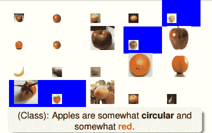

上图中蓝色区域的图片一样代表分类错误，即根据这个苹果是红色的条件，使得青苹果和草莓、西红柿都出现了判断错误。那么结果就是把这些分类错误的样本放大化，其它正确的样本缩小化。同样，这样在接下来的分类中就会更加注重这些错误样本。

接着，学生Joey经过观察又说：苹果也可能是绿色的。根据Joey的判断，得到的结果如下图所示：

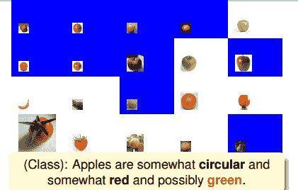

上图中蓝色区域的图片一样代表分类错误，根据苹果是绿色的条件，使得图中蓝色区域都出现了判断错误。同样把这些分类错误的样本放大化，其它正确的样本缩小化，在下一轮判断继续对其修正。

后来，学生Jessica又发现：上面有梗的才是苹果。得到如下结果：

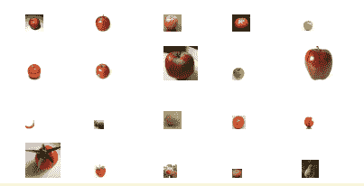

经过这几个同学的推论，苹果被定义为：圆的，红色的，也可能是绿色的，上面有梗。从一个一个的推导过程中，我们似乎得到一个较为准确的苹果的定义。虽然可能不是非常准确，但是要比单一的条件要好得多。也就是说把所有学生对苹果的定义融合起来，最终得到一个比较好的对苹果的总体定义。这种做法就是我们本节课将要讨论的演算法。这些学生代表的就是简单的hypotheses ，将所有融合，得到很好的预测模型G。例如，二维平面上简单的hypotheses（水平线和垂直线），这些简单最终组成的较复杂的分类线能够较好地将正负样本完全分开，即得到了好的预测模型。

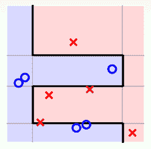

所以，上个苹果的例子中，不同的学生代表不同的hypotheses ；最终得到的苹果总体定义就代表hypothesis G；而老师就代表演算法A，指导学生的注意力集中到关键的例子中（错误样本），从而得到更好的苹果定义。其中的数学原理，我们下一部分详细介绍。

### **Diversity by Re-weighting**

在介绍这个演算法之前，我们先来讲一下上节课就介绍过的bagging。Bagging的核心是bootstrapping，通过对原始数据集D不断进行bootstrap的抽样动作，得到与D类似的数据集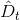，每组都能得到相应的，从而进行aggregation的操作。现在，假如包含四个样本的D经过bootstrap，得到新的如下：

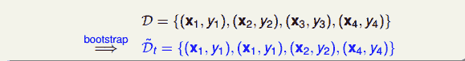

那么，对于新的，把它交给base algorithm，找出最小时对应的，如下图右边所示。

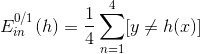

由于完全是D经过bootstrap得到的，其中样本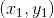出现2次，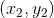出现1次，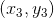出现0次，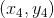出现1次。引入一个参数来表示原D中第i个样本在中出现的次数，如下图左边所示。

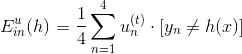

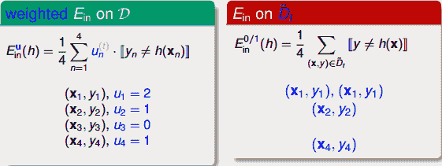

参数u相当于是权重因子，当中第i个样本出现的次数越多的时候，那么对应的越大，表示在error function中对该样本的惩罚越多。所以，从另外一个角度来看bagging，它其实就是通过bootstrap的方式，来得到这些值，作为犯错样本的权重因子，再用base algorithn最小化包含的error function，得到不同的。这个error function被称为bootstrap-weighted error。

这种算法叫做Weightd Base Algorithm，目的就是最小化bootstrap-weighted error。

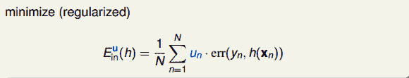

其实，这种weightd base algorithm我们之前就介绍过类似的算法形式。例如在soft-margin SVM中，我们引入允许犯错的项，同样可以将每个点的error乘以权重因子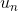。加上该项前的参数C，经过QP，最终得到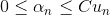，有别于之前介绍的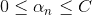。这里的相当于每个犯错的样本的惩罚因子，并会反映到的范围限定上。

同样在logistic regression中，同样可以对每个犯错误的样本乘以相应的，作为惩罚因子。表示该错误点出现的次数，越大，则对应的惩罚因子越大，则在最小化error时就应该更加重视这些点。

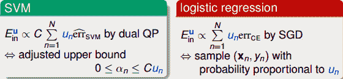

其实这种example-weighted learning，我们在机器学习基石课程第8次笔记中就介绍过class-weighted的思想。二者道理是相通的。

知道了u的概念后，我们知道不同的u组合经过base algorithm得到不同的。那么如何选取u，使得到的之间有很大的不同呢？之所以要让所有的差别很大，是因为上节课aggregation中，我们介绍过越不一样，其aggregation的效果越好，即每个人的意见越不相同，越能运用集体的智慧，得到好的预测模型。

为了得到不同的，我们先来看看和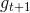是怎么得到的：

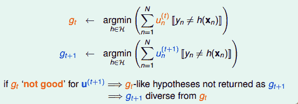

如上所示，是由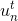得到的，是由得到的。如果这个模型在使用的时候得到的error很大，即预测效果非常不好，那就表示由计算的会与有很大不同。而与差异性大正是我们希望看到的。

怎么做呢？方法是利用在使用的时候表现很差的条件，越差越好。如果在作用下，中的表现（即error）近似为0.5的时候，表明对的预测分类没有什么作用，就像抛硬币一样，是随机选择的。这样的做法就能最大限度地保证会与有较大的差异性。其数学表达式如下所示：

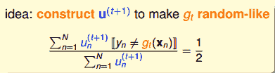

乍看上面这个式子，似乎不好求解。但是，我们对它做一些等价处理，其中分式中分子可以看成作用下犯错误的点，而分母可以看成犯错的点和没有犯错误的点的集合，即所有样本点。其中犯错误的点和没有犯错误的点分别用橘色方块和绿色圆圈表示：

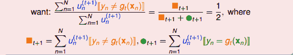

要让分式等于0.5，显然只要将犯错误的点和没有犯错误的点的数量调成一样就可以了。也就是说，在作用下，让犯错的数量和没有犯错的数量一致就行（包含权重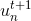）。一种简单的方法就是利用放大和缩小的思想（本节课开始引入识别苹果的例子中提到的放大图片和缩小图片就是这个目的），将犯错误的和没有犯错误的做相应的乘积操作，使得二者值变成相等。例如 of incorrect为1126， of correct为6211，要让中错误比例正好是0.5，可以这样做，对于incorrect ：

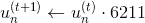

对于correct ：

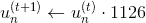

或者利用犯错的比例来做，令weighted incorrect rate和weighted correct rate分别设为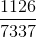和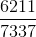。一般求解方式是令犯错率为，在计算的时候，分别乘以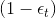和。

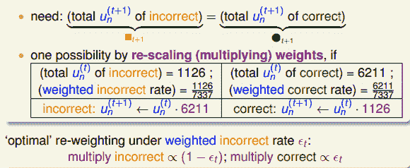

### **Adaptive Boosting Algorithm**

上一部分，我们介绍了在计算的时候，分别乘以和。下面将构造一个新的尺度因子：

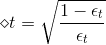

那么引入这个新的尺度因子之后，对于错误的，将它乘以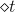；对于正确的，将它除以。这种操作跟之前介绍的分别乘以和的效果是一样的。之所以引入是因为它告诉我们更多的物理意义。因为如果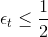，得到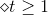，那么接下来错误的与的乘积就相当于把错误点放大了，而正确的与的相除就相当于把正确点缩小了。这种scale up incorrect和scale down correct的做法与本节课开始介绍的学生识别苹果的例子中放大错误的图片和缩小正确的图片是一个原理，让学生能够将注意力更多地放在犯错误的点上。通过这种scaling-up incorrect的操作，能够保证得到不同于的。

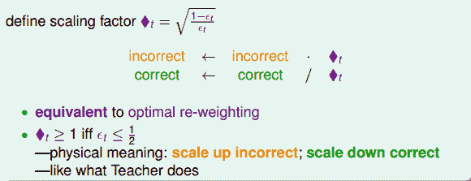

值得注意的是上述的结论是建立在的基础上，如果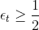，那么就做相反的推论即可。关于的情况，我们稍后会进行说明。

从这个概念出发，我们可以得到一个初步的演算法。其核心步骤是每次迭代时，利用把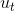更新为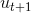。具体迭代步骤如下：

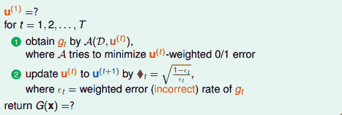

但是，上述步骤还有两个问题没有解决，第一个问题是初始的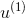应为多少呢？一般来说，为了保证第一次最小的话，设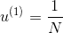即可。这样最开始的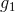就能由此推导。第二个问题，最终的G(x)应该怎么求？是将所有的g(t)合并uniform在一起吗？一般来说并不是这样直接uniform求解，因为是通过得来的，二者在上的表现差别比较大。所以，一般是对所有的g(t)进行linear或者non-linear组合来得到G(t)。

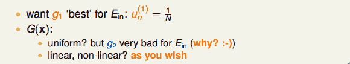

接下来的内容，我们将对上面的第二个问题进行探讨，研究一种算法，将所有的g(t)进行linear组合。方法是计算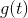的同时，就能计算得到其线性组合系数，即aggregate linearly on the fly。这种算法使最终求得的时候，所有的线性组合系数也求得了，不用再重新计算了。这种Linear Aggregation on the Fly算法流程为：

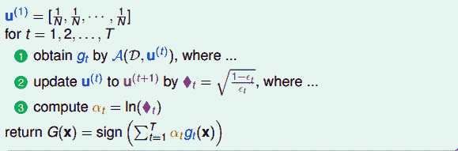

如何在每次迭代的时候计算呢？我们知道与是相关的：越小，对应的应该越大，越大，对应的应该越小。又因为与是正相关的，所以，应该是的单调函数。我们构造为：

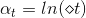

这样取值是有物理意义的，例如当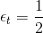时，error很大，跟掷骰子这样的随机过程没什么两样，此时对应的，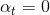，即此对G没有什么贡献，权重应该设为零。而当时，没有error，表示该预测非常准，此时对应的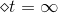，，即此对G贡献非常大，权重应该设为无穷大。

这种算法被称为Adaptive Boosting。它由三部分构成：base learning algorithm A，re-weighting factor 和linear aggregation 。这三部分分别对应于我们在本节课开始介绍的例子中的Student，Teacher和Class。

综上所述，完整的adaptive boosting（AdaBoost）Algorithm流程如下：

从我们之前介绍过的VC bound角度来看，AdaBoost算法理论上满足：

上式中，的上界由两部分组成，一项是，另一项是模型复杂度O(*)。模型复杂度中是的VC Dimension，T是迭代次数，可以证明G的服从。

对这个VC bound中的第一项来说，有一个很好的性质：如果满足，则经过次迭代之后，能减小到等于零的程度。而当N很大的时候，其中第二项也能变得很小。因为这两项都能变得很小，那么整个就能被限定在一个有限的上界中。

其实，这种性质也正是AdaBoost算法的精髓所在。只要每次的，即所选择的矩g比乱猜的表现好一点点，那么经过每次迭代之后，矩g的表现都会比原来更好一些，逐渐变强，最终得到且很小。

### **Adaptive Boosting in Action**

上一小节我们已经介绍了选择一个“弱弱”的算法A（，比乱猜好就行），就能经过多次迭代得到。我们称这种形式为decision stump模型。下面介绍一个例子，来看看AdaBoost是如何使用decision stump解决实际问题的。

如下图所示，二维平面上分布一些正负样本点，利用decision stump来做切割。

第一步：

第二步：

第三步：

第四步：

第五步：

可以看到，经过5次迭代之后，所有的正负点已经被完全分开了，则最终得到的分类线为：

另外一个例子，对于一个相对比较复杂的数据集，如下图所示。它的分界线从视觉上看应该是一个sin波的形式。如果我们再使用AdaBoost算法，通过decision stump来做切割。在迭代切割100次后，得到的分界线如下所示。

可以看出，AdaBoost-Stump这种非线性模型得到的分界线对正负样本有较好的分离效果。

课程中还介绍了一个AdaBoost-Stump在人脸识别方面的应用：

### **总结**

本节课主要介绍了Adaptive Boosting。首先通过讲一个老师教小学生识别苹果的例子，来引入Boosting的思想，即把许多“弱弱”的hypotheses合并起来，变成很强的预测模型。然后重点介绍这种算法如何实现，关键在于每次迭代时，给予样本不同的系数u，宗旨是放大错误样本，缩小正确样本，得到不同的小矩g。并且在每次迭代时根据错误值的大小，给予不同不同的权重。最终由不同的进行组合得到整体的预测模型G。实际证明，Adaptive Boosting能够得到有效的预测模型。

**_注明：_**

文章中所有的图片均来自台湾大学林轩田《机器学习技法》课程
