# 10 -- Random Forest

上节课我们主要介绍了Decision Tree模型。Decision Tree算法的核心是通过递归的方式，将数据集不断进行切割，得到子分支，最终形成数的结构。C&RT算法是决策树比较简单和常用的一种算法，其切割的标准是根据纯度来进行，每次切割都是为了让分支内部纯度最大。最终，决策树不同的分支得到不同的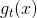（即树的叶子，C&RT算法中，是常数）。本节课将介绍随机森林（Random Forest）算法，它是我们之前介绍的Bagging和上节课介绍的Decision Tree的结合。

### **Random Forest Algorithm**

首先我们来复习一下之前介绍过的两个机器学习模型：Bagging和Decision Tree。Bagging是通过bootstrap的方式，从原始的数据集D中得到新的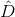；然后再使用一些base algorithm对每个都得到相应的；最后将所有的通过投票uniform的形式组合成一个G，G即为我们最终得到的模型。Decision Tree是通过递归形式，利用分支条件，将原始数据集D切割成一个个子树结构，长成一棵完整的树形结构。Decision Tree最终得到的G(x)是由相应的分支条件b(x)和分支树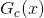递归组成。

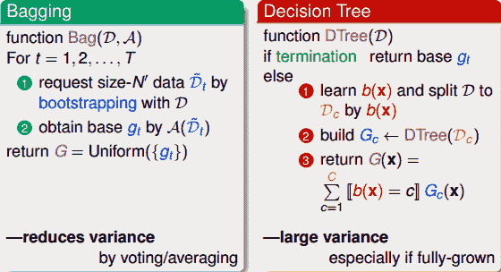

Bagging和Decison Tree算法各自有一个很重要的特点。Bagging具有减少不同的方差variance的特点。这是因为Bagging采用投票的形式，将所有uniform结合起来，起到了求平均的作用，从而降低variance。而Decision Tree具有增大不同的方差variance的特点。这是因为Decision Tree每次切割的方式不同，而且分支包含的样本数在逐渐减少，所以它对不同的资料D会比较敏感一些，从而不同的D会得到比较大的variance。

所以说，Bagging能减小variance，而Decision Tree能增大variance。如果把两者结合起来，能否发挥各自的优势，起到优势互补的作用呢？这就是我们接下来将要讨论的aggregation of aggregation，即使用Bagging的方式把众多的Decision Tree进行uniform结合起来。这种算法就叫做随机森林（Random Forest），它将完全长成的C&RT决策树通过bagging的形式结合起来，最终得到一个庞大的决策模型。

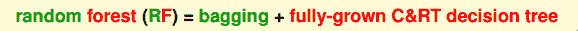

Random Forest算法流程图如下所示：

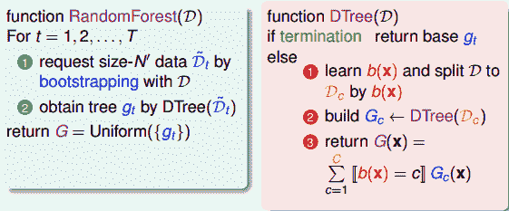

Random Forest算法的优点主要有三个。第一，不同决策树可以由不同主机并行训练生成，效率很高；第二，随机森林算法继承了C&RT的优点；第三，将所有的决策树通过bagging的形式结合起来，避免了单个决策树造成过拟合的问题。

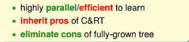

以上是基本的Random Forest算法，我们再来看一下如何让Random Forest中决策树的结构更有多样性。Bagging中，通过bootstrap的方法得到不同于D的D’，使用这些随机抽取的资料得到不同的。除了随机抽取资料获得不同的方式之外，还有另外一种方法，就是随机抽取一部分特征。例如，原来有100个特征，现在只从中随机选取30个来构成决策树，那么每一轮得到的树都由不同的30个特征构成，每棵树都不一样。假设原来样本维度是d，则只选择其中的d’（d’小于d）个维度来建立决策树结构。这类似是一种从d维到d’维的特征转换，相当于是从高维到低维的投影，也就是说d’维z空间其实就是d维x空间的一个随机子空间（subspace）。通常情况下，d’远小于d，从而保证算法更有效率。Random Forest算法的作者建议在构建C&RT每个分支b(x)的时候，都可以重新选择子特征来训练，从而得到更具有多样性的决策树。

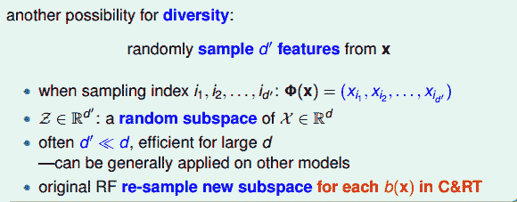

所以说，这种增强的Random Forest算法增加了random-subspace。

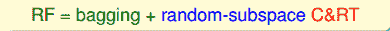

上面我们讲的是随机抽取特征，除此之外，还可以将现有的特征x，通过数组p进行线性组合，来保持多样性：

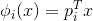

这种方法使每次分支得到的不再是单一的子特征集合，而是子特征的线性组合（权重不为1）。好比在二维平面上不止得到水平线和垂直线，也能得到各种斜线。这种做法使子特征选择更加多样性。值得注意的是，不同分支i下的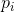是不同的，而且向量中大部分元素为零，因为我们选择的只是一部分特征，这是一种低维映射。

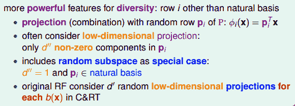

所以，这里的Random Forest算法又有增强，由原来的random-subspace变成了random-combination。顺便提一下，这里的random-combination类似于perceptron模型。

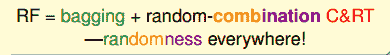

### **Out-Of-Bag Estimate**

上一部分我们已经介绍了Random Forest算法，而Random Forest算法重要的一点就是Bagging。接下来将继续探讨bagging中的bootstrap机制到底蕴含了哪些可以为我们所用的东西。

通过bootstrap得到新的样本集D’，再由D’训练不同的。我们知道D’中包含了原样本集D中的一些样本，但也有些样本没有涵盖进去。如下表所示，不同的下，红色的_表示在中没有这些样本。例如对来说，和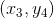没有包含进去，对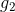来说，和没有包含进去，等等。每个中，红色_表示的样本被称为out-of-bag(OOB) example。

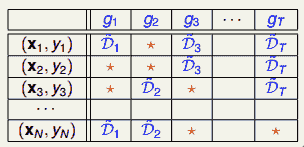

首先，我们来计算OOB样本到底有多少。假设bootstrap的数量N’=N，那么某个样本是OOB的概率是：

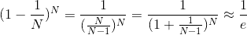

其中，e是自然对数，N是原样本集的数量。由上述推导可得，每个中，OOB数目大约是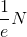，即大约有三分之一的样本没有在bootstrap中被抽到。

然后，我们将OOB与之前介绍的Validation进行对比：

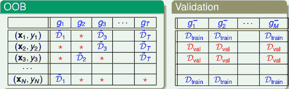

在Validation表格中，蓝色的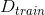用来得到不同的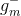，而红色的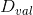用来验证各自的。与没有交集，一般是的数倍关系。再看左边的OOB表格，之前我们也介绍过，蓝色的部分用来得到不同的，而红色的部分是OOB样本。而我们刚刚也推导过，红色部分大约占N的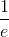。通过两个表格的比较，我们发现OOB样本类似于，那么是否能使用OOB样本来验证的好坏呢？答案是肯定的。但是，通常我们并不需要对单个进行验证。因为我们更关心的是由许多组合成的G，即使表现不太好，只要G表现足够好就行了。那么问题就转化成了如何使用OOB来验证G的好坏。方法是先看每一个样本是哪些的OOB资料，然后计算其在这些上的表现，最后将所有样本的表现求平均即可。例如，样本是，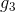，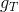的OOB，则可以计算在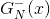上的表现为：

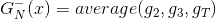

这种做法我们并不陌生，就像是我们之前介绍过的Leave-One-Out Cross Validation，每次只对一个样本进行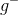的验证一样，只不过这里选择的是每个样本是哪些的OOB，然后再分别进行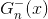的验证。每个样本都当成验证资料一次（与留一法相同），最后计算所有样本的平均表现：

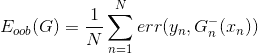

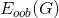估算的就是G的表现好坏。我们把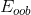称为bagging或者Random Forest的self-validation。

这种self-validation相比于validation来说还有一个优点就是它不需要重复训练。如下图左边所示，在通过选择到表现最好的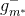之后，还需要在和组成的所有样本集D上重新对该模型训练一次，以得到最终的模型系数。但是self-validation在调整随机森林算法相关系数并得到最小的之后，就完成了整个模型的建立，无需重新训练模型。随机森林算法中，self-validation在衡量G的表现上通常相当准确。

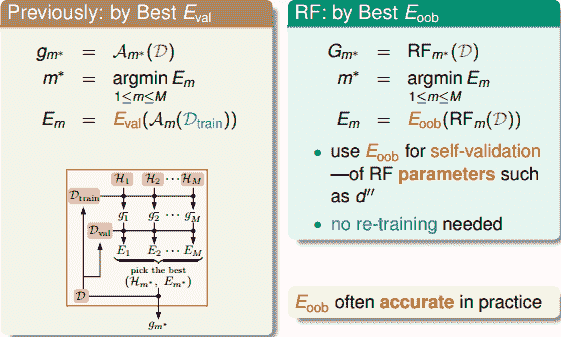

### **Feature Selection**

如果样本资料特征过多，假如有10000个特征，而我们只想从中选取300个特征，这时候就需要舍弃部分特征。通常来说，需要移除的特征分为两类：一类是冗余特征，即特征出现重复，例如“年龄”和“生日”；另一类是不相关特征，例如疾病预测的时候引入的“保险状况”。这种从d维特征到d’维特征的subset-transform 称为Feature Selection，最终使用这些d’维的特征进行模型训练。

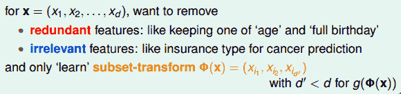

特征选择的优点是：

*   **提高效率，特征越少，模型越简单**

*   **正则化，防止特征过多出现过拟合**

*   **去除无关特征，保留相关性大的特征，解释性强**

同时，特征选择的缺点是：

*   **筛选特征的计算量较大**

*   **不同特征组合，也容易发生过拟合**

*   **容易选到无关特征，解释性差**

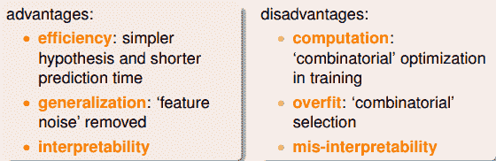

值得一提的是，在decision tree中，我们使用的decision stump切割方式也是一种feature selection。

那么，如何对许多维特征进行筛选呢？我们可以通过计算出每个特征的重要性（即权重），然后再根据重要性的排序进行选择即可。

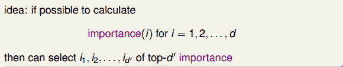

这种方法在线性模型中比较容易计算。因为线性模型的score是由每个特征经过加权求和而得到的，而加权系数的绝对值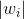正好代表了对应特征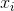的重要性为多少。越大，表示对应特征越重要，则该特征应该被选择。w的值可以通过对已有的数据集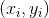建立线性模型而得到。

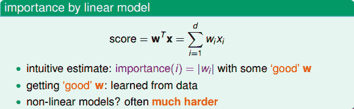

然而，对于非线性模型来说，因为不同特征可能是非线性交叉在一起的，所以计算每个特征的重要性就变得比较复杂和困难。例如，Random Forest就是一个非线性模型，接下来，我们将讨论如何在RF下进行特征选择。

RF中，特征选择的核心思想是random test。random test的做法是对于某个特征，如果用另外一个随机值替代它之后的表现比之前更差，则表明该特征比较重要，所占的权重应该较大，不能用一个随机值替代。相反，如果随机值替代后的表现没有太大差别，则表明该特征不那么重要，可有可无。所以，通过比较某特征被随机值替代前后的表现，就能推断出该特征的权重和重要性。

那么random test中的随机值如何选择呢？通常有两种方法：一是使用uniform或者gaussian抽取随机值替换原特征；一是通过permutation的方式将原来的所有N个样本的第i个特征值重新打乱分布（相当于重新洗牌）。比较而言，第二种方法更加科学，保证了特征替代值与原特征的分布是近似的（只是重新洗牌而已）。这种方法叫做permutation test（随机排序测试），即在计算第i个特征的重要性的时候，将N个样本的第i个特征重新洗牌，然后比较D和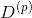表现的差异性。如果差异很大，则表明第i个特征是重要的。

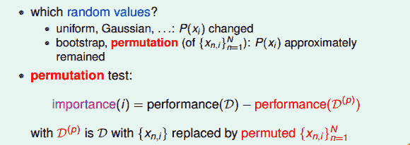

知道了permutation test的原理后，接下来要考虑的问题是如何衡量上图中的performance，即替换前后的表现。显然，我们前面介绍过performance可以用来衡量。但是，对于N个样本的第i个特征值重新洗牌重置的，要对它进行重新训练，而且每个特征都要重复训练，然后再与原D的表现进行比较，过程非常繁琐。为了简化运算，RF的作者提出了一种方法，就是把permutation的操作从原来的training上移到了OOB validation上去，记为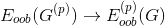。也就是说，在训练的时候仍然使用D，但是在OOB验证的时候，将所有的OOB样本的第i个特征重新洗牌，验证G的表现。这种做法大大简化了计算复杂度，在RF的feature selection中应用广泛。

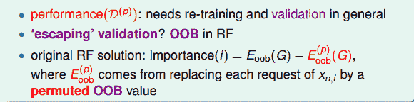

### **Random Forest in Action**

最后，我们通过实际的例子来看一下RF的特点。首先，仍然是一个二元分类的例子。如下图所示，左边是一个C&RT树没有使用bootstrap得到的模型分类效果，其中不同特征之间进行了随机组合，所以有斜线作为分类线；中间是由bootstrap（N’=N/2）后生成的一棵决策树组成的随机森林，图中加粗的点表示被bootstrap选中的点；右边是将一棵决策树进行bagging后的分类模型，效果与中间图是一样的，都是一棵树。

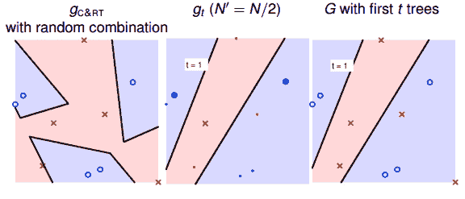

当t=100，即选择了100棵树时，中间的模型是第100棵决策树构成的，还是只有一棵树；右边的模型是由100棵决策树bagging起来的，如下图所示：

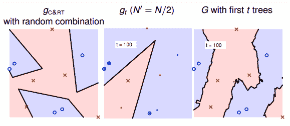

当t=200时：

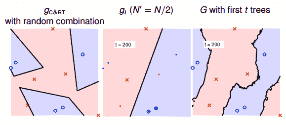

当t=300时：

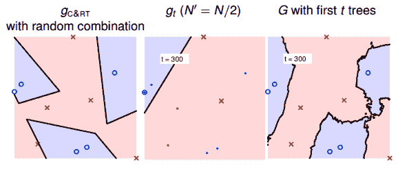

当t=400时：

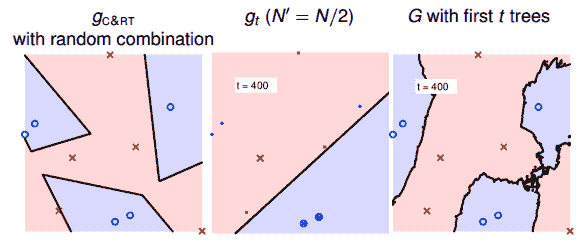

当t=500时：

当t=600时：

当t=700时：

当t=800时：

当t=900时：

当t=1000时：

随着树木个数的增加，我们发现，分界线越来越光滑而且得到了large-margin-like boundary，类似于SVM一样的效果。也就是说，树木越多，分类器的置信区间越大。

然后，我们再来看一个比较复杂的例子，二维平面上分布着许多离散点，分界线形如sin函数。当只有一棵树的时候（t=1），下图左边表示单一树组成的RF，右边表示所有树bagging组合起来构成的RF。因为只有一棵树，所以左右两边效果一致。

当t=6时：

当t=11时：

当t=16时：

当t=21时：

可以看到，当RF由21棵树构成的时候，分界线就比较平滑了，而且它的边界比单一树构成的RF要robust得多，更加平滑和稳定。

最后，基于上面的例子，再让问题复杂一点：在平面上添加一些随机噪声。当t=1时，如下图所示：

当t=6时：

当t=11时：

当t=16时：

当t=21时：

从上图中，我们发现21棵树的时候，随机noise的影响基本上能够修正和消除。这种bagging投票的机制能够保证较好的降噪性，从而得到比较稳定的结果。

经过以上三个例子，我们发现RF中，树的个数越多，模型越稳定越能表现得好。在实际应用中，应该尽可能选择更多的树。值得一提的是，RF的表现同时也与random seed有关，即随机的初始值也会影响RF的表现。

### **总结：**

本节课主要介绍了Random Forest算法模型。RF将bagging与decision tree结合起来，通过把众多的决策树组进行组合，构成森林的形式，利用投票机制让G表现最佳，分类模型更稳定。其中为了让decision tree的随机性更强一些，可以采用randomly projected subspaces操作，即将不同的features线性组合起来，从而进行各式各样的切割。同时，我们也介绍了可以使用OOB样本来进行self-validation，然后可以使用self-validation来对每个特征进行permutaion test，得到不同特征的重要性，从而进行feature selection。总的来说，RF算法能够得到比较平滑的边界，稳定性强，前提是有足够多的树。

**_注明：_**

文章中所有的图片均来自台湾大学林轩田《机器学习技法》课程
