# 11 -- Gradient Boosted Decision Tree

上节课我们主要介绍了Random Forest算法模型。Random Forest就是通过bagging的方式将许多不同的decision tree组合起来。除此之外，在decision tree中加入了各种随机性和多样性，比如不同特征的线性组合等。RF还可以使用OOB样本进行self-validation，而且可以通过permutation test进行feature selection。本节课将使用Adaptive Boosting的方法来研究decision tree的一些算法和模型。

### **Adaptive Boosted Decision Tree**

Random Forest的算法流程我们上节课也详细介绍过，就是先通过bootstrapping“复制”原样本集D，得到新的样本集D’；然后对每个D’进行训练得到不同的decision tree和对应的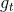；最后再将所有的通过uniform的形式组合起来，即以投票的方式得到G。这里采用的Bagging的方式，也就是把每个的预测值直接相加。现在，如果将Bagging替换成AdaBoost，处理方式有些不同。首先每轮bootstrap得到的D’中每个样本会赋予不同的权重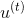；然后在每个decision tree中，利用这些权重训练得到最好的；最后得出每个所占的权重，线性组合得到G。这种模型称为AdaBoost-D Tree。

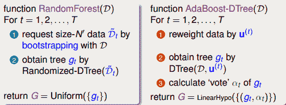

但是在AdaBoost-DTree中需要注意的一点是每个样本的权重。我们知道，在Adaptive Boosting中进行了bootstrap操作，表示D中每个样本在D’中出现的次数。但是在决策树模型中，例如C&RT算法中并没有引入。那么，如何在决策树中引入这些权重来得到不同的而又不改变原来的决策树算法呢？

在Adaptive Boosting中，我们使用了weighted algorithm，形如：

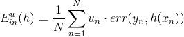

每个犯错误的样本点乘以相应的权重，求和再平均，最终得到了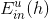。如果在决策树中使用这种方法，将当前分支下犯错误的点赋予权重，每层分支都这样做，会比较复杂，不易求解。为了简化运算，保持决策树算法本身的稳定性和封闭性，我们可以把决策树算法当成一个黑盒子，即不改变其结构，不对算法本身进行修改，而从数据来源D’上做一些处理。按照这种思想，我们来看权重u实际上表示该样本在bootstrap中出现的次数，反映了它出现的概率。那么可以根据u值，对原样本集D进行一次重新的随机sampling，也就是带权重的随机抽样。sampling之后，会得到一个新的D’，D’中每个样本出现的几率与它权重u所占的比例应该是差不多接近的。因此，使用带权重的sampling操作，得到了新的样本数据集D’，可以直接代入决策树进行训练，从而无需改变决策树算法结构。sampling可看成是bootstrap的反操作，这种对数据本身进行修改而不更改算法结构的方法非常重要！

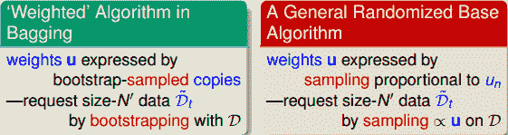

所以，AdaBoost-DTree结合了AdaBoost和DTree，但是做了一点小小的改变，就是使用sampling替代权重，效果是相同的。

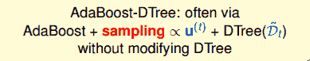

上面我们通过使用sampling，将不同的样本集代入决策树中，得到不同的。除此之外，我们还要确定每个所占的权重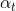。之前我们在AdaBoost中已经介绍过，首先算出每个的错误率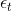，然后计算权重：

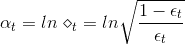

如果现在有一棵完全长成的树（fully grown tree），由所有的样本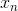训练得到。若每个样本都不相同的话，一刀刀切割分支，直到所有的都被完全分开。这时候，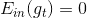，加权的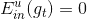而且也为0，从而得到权重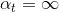。表示该所占的权重无限大，相当于它一个就决定了G结构，是一种autocracy，而其它的对G没有影响。

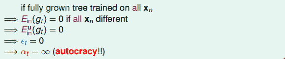

显然不是我们想看到的，因为autocracy总是不好的，我们希望使用aggregation将不同的结合起来，发挥集体智慧来得到最好的模型G。首先，我们来看一下什么原因造成了。有两个原因：一个是使用了所有的样本进行训练；一个是树的分支过多，fully grown。针对这两个原因，我们可以对树做一些修剪（pruned），比如只使用一部分样本，这在sampling的操作中已经起到这类作用，因为必然有些样本没有被采样到。除此之外，我们还可以限制树的高度，让分支不要那么多，从而避免树fully grown。

因此，AdaBoost-DTree使用的是pruned DTree，也就是说将这些预测效果较弱的树结合起来，得到最好的G，避免出现autocracy。

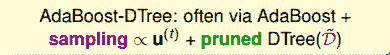

刚才我们说了可以限制树的高度，那索性将树的高度限制到最低，即只有1层高的时候，有什么特性呢？当树高为1的时候，整棵树只有两个分支，切割一次即可。如果impurity是binary classification error的话，那么此时的AdaBoost-DTree就跟AdaBoost-Stump没什么两样。也就是说AdaBoost-Stump是AdaBoost-DTree的一种特殊情况。

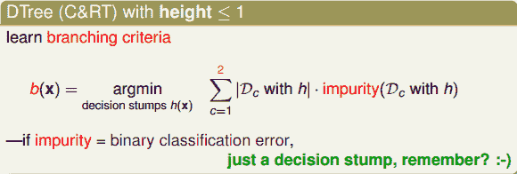

值得一提是，如果树高为1时，通常较难遇到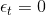的情况，且一般不采用sampling的操作，而是直接将权重u代入到算法中。这是因为此时的AdaBoost-DTree就相当于是AdaBoost-Stump，而AdaBoost-Stump就是直接使用u来优化模型的。

### **Optimization View of AdaBoost**

接下来，我们继续将继续探讨AdaBoost算法的一些奥妙之处。我们知道AdaBoost中的权重的迭代计算如下所示：

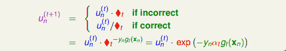

之前对于incorrect样本和correct样本，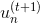的表达式不同。现在，把两种情况结合起来，将写成一种简化的形式：

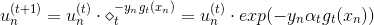

其中，对于incorrect样本，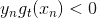，对于correct样本，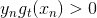。从上式可以看出，由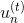与某个常数相乘得到。所以，最后一轮更新的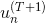可以写成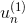的级联形式，我们之前令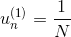，则有如下推导：

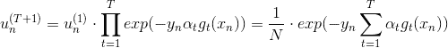

上式中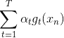被称为voting score，最终的模型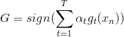。可以看出，在AdaBoost中，与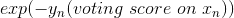成正比。

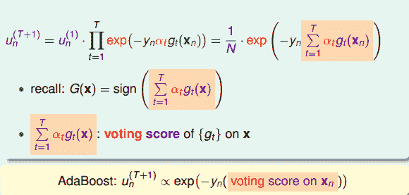

接下来我们继续看一下voting score中蕴含了哪些内容。如下图所示，voting score由许多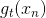乘以各自的系数线性组合而成。从另外一个角度来看，我们可以把看成是对的特征转换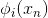，就是线性模型中的权重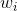。看到这里，我们回忆起之前SVM中，w与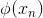的乘积再除以w的长度就是margin，即点到边界的距离。另外，乘积项再与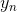相乘，表示点的位置是在正确的那一侧还是错误的那一侧。所以，回过头来，这里的voting score实际上可以看成是没有正规化（没有除以w的长度）的距离，即可以看成是该点到分类边界距离的一种衡量。从效果上说，距离越大越好，也就是说voting score要尽可能大一些。

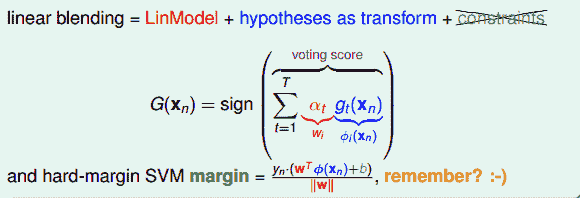

我们再来看，若voting score与相乘，则表示一个有对错之分的距离。也就是说，如果二者相乘是负数，则表示该点在错误的一边，分类错误；如果二者相乘是正数，则表示该点在正确的一边，分类正确。所以，我们算法的目的就是让与voting score的乘积是正的，而且越大越好。那么在刚刚推导的中，得到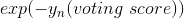越小越好，从而得到越小越好。也就是说，如果voting score表现不错，与的乘积越大的话，那么相应的应该是最小的。

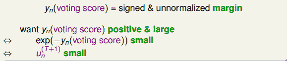

那么在AdaBoost中，随着每轮学习的进行，每个样本的是逐渐减小的，直到最小。以上是从单个样本点来看的。总体来看，所有样本的之和应该也是最小的。我们的目标就是在最后一轮（T+1）学习后，让所有样本的之和尽可能地小。之和表示为如下形式：

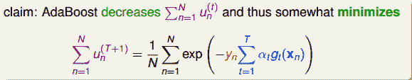

上式中，被称为linear score，用s表示。对于0/1 error：若ys&lt;0，则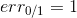；若ys&gt;=0，则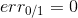。如下图右边黑色折线所示。对于上式中提到的指数error，即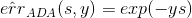，随着ys的增加，error单调下降，且始终落在0/1 error折线的上面。如下图右边蓝色曲线所示。很明显，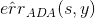可以看成是0/1 error的上界。所以，我们可以使用来替代0/1 error，能达到同样的效果。从这点来说，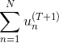可以看成是一种error measure，而我们的目标就是让其最小化，求出最小值时对应的各个和。

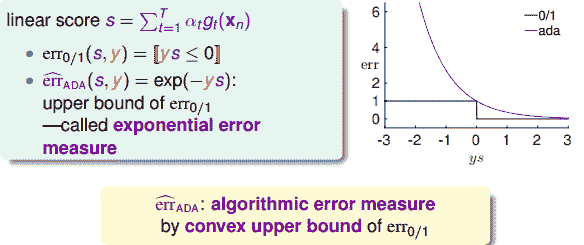

下面我们来研究如何让取得最小值，思考是否能用梯度下降（gradient descent）的方法来进行求解。我们之前介绍过gradient descent的核心是在某点处做一阶泰勒展开：

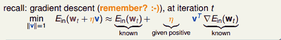

其中，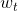是泰勒展开的位置，v是所要求的下降的最好方向，它是梯度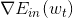的反方向，而是每次前进的步长。则每次沿着当前梯度的反方向走一小步，就会不断逼近谷底（最小值）。这就是梯度下降算法所做的事情。

现在，我们对做梯度下降算法处理，区别是这里的方向是一个函数，而不是一个向量。其实，函数和向量的唯一区别就是一个下标是连续的，另一个下标是离散的，二者在梯度下降算法应用上并没有大的区别。因此，按照梯度下降算法的展开式，做出如下推导：

上式中，表示当前的方向，它是一个矩，是沿着当前方向前进的步长。我们要求出这样的和，使得是在不断减小的。当取得最小值的时候，那么所有的方向即最佳的和就都解出来了。上述推导使用了在处的一阶泰勒展开近似。这样经过推导之后，被分解为两个部分，一个是前N个u之和，也就是当前所有的之和；另外一个是包含下一步前进的方向和步进长度的项。的这种形式与gradient descent的形式基本是一致的。

那么接下来，如果要最小化的话，就要让第二项越小越好。则我们的目标就是找到一个好的（即好的方向）来最小化，此时先忽略步进长度。

对于binary classification，和均限定取值-1或+1两种。我们对做一些推导和平移运算：

最终化简为两项组成，一项是；另一项是。则最小化就转化为最小化。要让最小化，正是由AdaBoost中的base algorithm所做的事情。所以说，AdaBoost中的base algorithm正好帮我们找到了梯度下降中下一步最好的函数方向。

以上就是从数学上，从gradient descent角度验证了AdaBoost中使用base algorithm得到的就是让减小的方向，只不过这个方向是一个函数而不是向量。

在解决了方向问题后，我们需要考虑步进长度如何选取。方法是在确定方向后，选取合适的，使取得最小值。也就是说，把看成是步进长度的函数，目标是找到最小化时对应的值。

目的是找到在最佳方向上的最大步进长度，也就是steepest decent。我们先把表达式写下来：

上式中，有两种情况需要考虑：

*   **： correct**

*   **： incorrect**

经过推导，可得：

然后对求导，令，得：

由此看出，最大的步进长度就是，即AdaBoost中计算所占的权重。所以，AdaBoost算法所做的其实是在gradient descent上找到下降最快的方向和最大的步进长度。这里的方向就是，它是一个函数，而步进长度就是。也就是说，在AdaBoost中确定和的过程就相当于在gradient descent上寻找最快的下降方向和最大的步进长度。

### **Gradient Boosting**

前面我们从gradient descent的角度来重新介绍了AdaBoost的最优化求解方法。整个过程可以概括为：

以上是针对binary classification问题。如果往更一般的情况进行推广，对于不同的error function，比如logistic error function或者regression中的squared error function，那么这种做法是否仍然有效呢？这种情况下的GradientBoost可以写成如下形式：

仍然按照gradient descent的思想，上式中，是下一步前进的方向，是步进长度。此时的error function不是前面所讲的exp了，而是任意的一种error function。因此，对应的hypothesis也不再是binary classification，最常用的是实数输出的hypothesis，例如regression。最终的目标也是求解最佳的前进方向和最快的步进长度。

接下来，我们就来看看如何求解regression的GradientBoost问题。它的表达式如下所示：

利用梯度下降的思想，我们把上式进行一阶泰勒展开，写成梯度的形式：

上式中，由于regression的error function是squared的，所以，对s的导数就是。其中标注灰色的部分表示常数，对最小化求解并没有影响，所以可以忽略。很明显，要使上式最小化，只要令是梯度的反方向就行了，即。但是直接这样赋值，并没有对的大小进行限制，一般不直接利用这个关系求出。

实际上的大小并不重要，因为有步进长度。那么，我们上面的最小化问题中需要对的大小做些限制。限制的一种简单做法是把的大小当成一个惩罚项（）添加到上面的最小化问题中，这种做法与regularization类似。如下图所示，经过推导和整理，忽略常数项，我们得到最关心的式子是：

上式是一个完全平方项之和，表示当前第n个样本真实值和预测值的差，称之为余数。余数表示当前预测能够做到的效果与真实值的差值是多少。那么，如果我们想要让上式最小化，求出对应的的话，只要让尽可能地接近余数即可。在平方误差上尽可能接近其实很简单，就是使用regression的方法，对所有N个点做squared-error的regression，得到的回归方程就是我们要求的。

以上就是使用GradientBoost的思想来解决regression问题的方法，其中应用了一个非常重要的概念，就是余数。根据这些余数做regression，得到好的矩，方向函数也就是由余数决定的。

在求出最好的方向函数之后，就要来求相应的步进长度。表达式如下：

同样，对上式进行推导和化简，得到如下表达式：

上式中也包含了余数，其中可以看成是的特征转换，是已知量。那么，如果我们想要让上式最小化，求出对应的的话，只要让尽可能地接近余数即可。显然，这也是一个regression问题，而且是一个很简单的形如y=ax的线性回归，只有一个未知数。只要对所有N个点做squared-error的linear regression，利用梯度下降算法就能得到最佳的。

将上述这些概念合并到一起，我们就得到了一个最终的演算法Gradient Boosted Decision Tree(GBDT)。可能有人会问，我们刚才一直没有说到Decison Tree，只是讲到了GradientBoost啊？下面我们来看看Decison Tree究竟是在哪出现并使用的。其实刚刚我们在计算方向函数的时候，是对所有N个点做squared-error的regression。那么这个回归算法就可以是决策树C&RT模型（决策树也可以用来做regression）。这样，就引入了Decision Tree，并将GradientBoost和Decision Tree结合起来，构成了真正的GBDT算法。GBDT算法的基本流程图如下所示：

值得注意的是，的初始值一般均设为0，即。每轮迭代中，方向函数通过C&RT算法做regression，进行求解；步进长度通过简单的单参数线性回归进行求解；然后每轮更新的值，即。T轮迭代结束后，最终得到。

值得一提的是，本节课第一部分介绍的AdaBoost-DTree是解决binary classification问题，而此处介绍的GBDT是解决regression问题。二者具有一定的相似性，可以说GBDT就是AdaBoost-DTree的regression版本。

### **Summary of Aggregation Models**

从机器学习技法课程的第7节课笔记到现在的第11节课笔记，我们已经介绍完所有的aggregation模型了。接下来，我们将对这些内容进行一个简单的总结和概括。

首先，我们介绍了blending。blending就是将所有已知的 aggregate结合起来，发挥集体的智慧得到G。值得注意的一点是这里的都是已知的。blending通常有三种形式：

*   **uniform：简单地计算所有的平均值**

*   **non-uniform：所有的线性组合**

*   **conditional：所有的非线性组合**

其中，uniform采用投票、求平均的形式更注重稳定性；而non-uniform和conditional追求的更复杂准确的模型，但存在过拟合的危险。

刚才讲的blending是建立在所有已知的情况。那如果所有未知的情况，对应的就是learning模型，做法就是一边学，一边将它们结合起来。learning通常也有三种形式（与blending的三种形式一一对应）：

*   **Bagging：通过bootstrap方法，得到不同，计算所有的平均值**

*   **AdaBoost：通过bootstrap方法，得到不同，所有的线性组合**

*   **Decision Tree：通过数据分割的形式得到不同的，所有的非线性组合**

然后，本节课我们将AdaBoost延伸到另一个模型GradientBoost。对于regression问题，GradientBoost通过residual fitting的方式得到最佳的方向函数和步进长度。

除了这些基本的aggregation模型之外，我们还可以把某些模型结合起来得到新的aggregation模型。例如，Bagging与Decision Tree结合起来组成了Random Forest。Random Forest中的Decision Tree是比较“茂盛”的树，即每个树的都比较强一些。AdaBoost与Decision Tree结合组成了AdaBoost-DTree。AdaBoost-DTree的Decision Tree是比较“矮弱”的树，即每个树的都比较弱一些，由AdaBoost将所有弱弱的树结合起来，让综合能力更强。同样，GradientBoost与Decision Tree结合就构成了经典的算法GBDT。

Aggregation的核心是将所有的结合起来，融合到一起，即集体智慧的思想。这种做法之所以能得到很好的模型G，是因为aggregation具有两个方面的优点：cure underfitting和cure overfitting。

第一，aggregation models有助于防止欠拟合（underfitting）。它把所有比较弱的结合起来，利用集体智慧来获得比较好的模型G。aggregation就相当于是feature transform，来获得复杂的学习模型。

第二，aggregation models有助于防止过拟合（overfitting）。它把所有进行组合，容易得到一个比较中庸的模型，类似于SVM的large margin一样的效果，从而避免一些极端情况包括过拟合的发生。从这个角度来说，aggregation起到了regularization的效果。

由于aggregation具有这两个方面的优点，所以在实际应用中aggregation models都有很好的表现。

### **总结**

本节课主要介绍了Gradient Boosted Decision Tree。首先讲如何将AdaBoost与Decision Tree结合起来，即通过sampling和pruning的方法得到AdaBoost-D Tree模型。然后，我们从optimization的角度来看AdaBoost，找到好的hypothesis也就是找到一个好的方向，找到权重也就是找到合适的步进长度。接着，我们从binary classification的0/1 error推广到其它的error function，从Gradient Boosting角度推导了regression的squared error形式。Gradient Boosting其实就是不断迭代，做residual fitting。并将其与Decision Tree算法结合，得到了经典的GBDT算法。最后，我们将所有的aggregation models做了总结和概括，这些模型有的能防止欠拟合有的能防止过拟合，应用十分广泛。

**_注明：_**

文章中所有的图片均来自台湾大学林轩田《机器学习技法》课程
