# 12 -- Neural Network

上节课我们主要介绍了Gradient Boosted Decision Tree。GBDT通过使用functional gradient的方法得到一棵一棵不同的树，然后再使用steepest descent的方式给予每棵树不同的权重，最后可以用来处理任何而定error measure。上节课介绍的GBDT是以regression为例进行介绍的，使用的是squared error measure。本节课讲介绍一种出现时间较早，但当下又非常火的一种机器算法模型，就是神经网络（Neural Network）。

### **Motivation**

在之前的机器学习基石课程中，我们就接触过Perceptron模型了，例如PLA算法。Perceptron就是在矩外面加上一个sign函数，取值为{-1,+1}。现在，如果把许多perceptrons线性组合起来，得到的模型G就如下图所示：

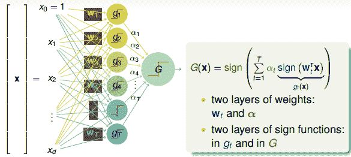

将左边的输入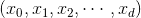与T个不同的权重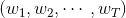相乘（每个是d+1维的），得到T个不同的perceptrons为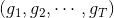。最后，每个给予不同的权重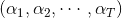，线性组合得到G。G也是一个perceptron模型。

从结构上来说，上面这个模型包含了两层的权重，分别是和。同时也包含了两层的sign函数，分别是和G。那么这样一个由许多感知机linear aggregation的模型能实现什么样的boundary呢？

举个简单的例子，如下图所示，和分别是平面上两个perceptrons。其中，红色表示-1，蓝色表示+1。这两个perceptrons线性组合可能得到下图右侧的模型，这表示的是和进行与（AND）的操作，蓝色区域表示+1。

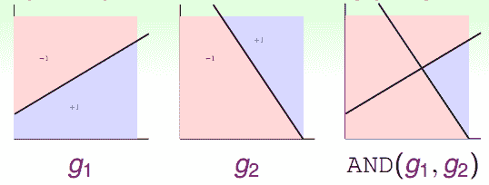

如何通过感知机模型来实现上述的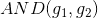逻辑操作呢？一种方法是令第二层中的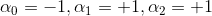。这样，G(x)就可表示为：

和的取值是{-1,+1}，当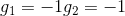时，G(x)=0；当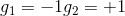时，G(x)=0；当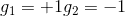时，G(x)=0；当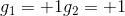时，G(x)=1。感知机模型如下所示：

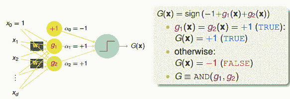

这个例子说明了一些简单的线性边界，如上面的和，在经过一层感知机模型，经线性组合后，可以得到一些非线性的复杂边界（AND运算）G(x)。

除此之外，或（OR）运算和非（NOT）运算都可以由感知机建立相应的模型，非常简单。

所以说，linear aggregation of perceptrons实际上是非常powerful的模型同时也是非常complicated模型。再看下面一个例子，如果二维平面上有个圆形区域，圆内表示+1，圆外表示-1。这样复杂的圆形边界是没有办法使用单一perceptron来解决的。如果使用8个perceptrons，用刚才的方法线性组合起来，能够得到一个很接近圆形的边界（八边形）。如果使用16个perceptrons，那么得到的边界更接近圆形（十六边形）。因此，使用的perceptrons越多，就能得到各种任意的convex set，即凸多边形边界。之前我们在机器学习基石中介绍过，convex set的VC Dimension趋向于无穷大（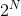）。这表示只要perceptrons够多，我们能得到任意可能的情况，可能的模型。但是，这样的坏处是模型复杂度可能会变得很大，从而造成过拟合（overfitting）。

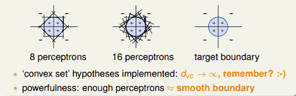

总的来说，足够数目的perceptrons线性组合能够得到比较平滑的边界和稳定的模型，这也是aggregation的特点之一。

但是，也有单层perceptrons线性组合做不到的事情。例如刚才我们将的AND、OR、NOT三种逻辑运算都可以由单层perceptrons做到，而如果是异或（XOR）操作，就没有办法只用单层perceptrons实现。这是因为XOR得到的是非线性可分的区域，如下图所示，没有办法由和线性组合实现。所以说linear aggregation of perceptrons模型的复杂度还是有限制的。

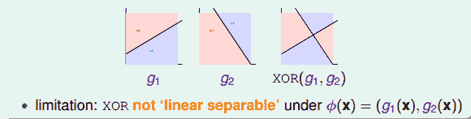

那么，为了实现XOR操作，可以使用多层perceptrons，也就是说一次transform不行，我们就用多层的transform，这其实就是Basic Neural Network的基本原型。下面我们就尝试使用两层perceptrons来实现XOR的操作。

首先，根据布尔运算，异或XOR操作可以拆分成：

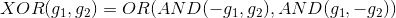

这种拆分实际上就包含了两层transform。第一层仅有AND操作，第二层是OR操作。这种两层的感知机模型如下所示：

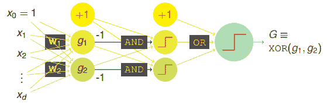

这样，从AND操作到XOR操作，从简单的aggregation of perceptrons到multi-layer perceptrons，感知机层数在增加，模型的复杂度也在增加，使最后得到的G能更容易解决一些非线性的复杂问题。这就是基本神经网络的基本模型。

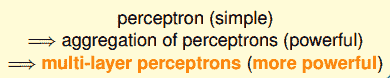

顺便提一下，这里所说的感知机模型实际上就是在模仿人类的神经元模型（这就是Neural Network名称的由来）。感知机模型每个节点的输入就对应神经元的树突dendrite，感知机每个节点的输出就对应神经元的轴突axon。

### **Neural Network Hypothesis**

上一部分我们介绍的这种感知机模型其实就是Neural Network。输入部分经过一层一层的运算，相当于一层一层的transform，最后通过最后一层的权重，得到一个分数score。即在OUTPUT层，输出的就是一个线性模型。得到s后，下一步再进行处理。

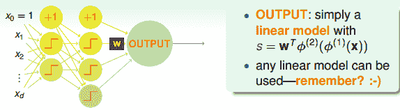

我们之前已经介绍过三种线性模型：linear classification，linear regression，logistic regression。那么，对于OUTPUT层的分数s，根据具体问题，可以选择最合适的线性模型。如果是binary classification问题，可以选择linear classification模型；如果是linear regression问题，可以选择linear regression模型；如果是soft classification问题，则可以选择logistic regression模型。本节课接下来将以linear regression为例，选择squared error来进行衡量。

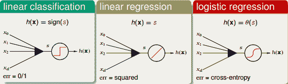

上面讲的是OUTPUT层，对于中间层，每个节点对应一个perceptron，都有一个transform运算。上文我们已经介绍过的transformation function是阶梯函数sign()。那除了sign()函数外，有没有其他的transformation function呢？

如果每个节点的transformation function都是线性运算（跟OUTPUT端一样），那么由每个节点的线性模型组合成的神经网络模型也必然是线性的。这跟直接使用一个线性模型在效果上并没有什么差异，模型能力不强，反而花费了更多不必要的力气。所以一般来说，中间节点不会选择线性模型。

如果每个节点的transformation function都是阶梯函数（即sign()函数）。这是一个非线性模型，但是由于阶梯函数是离散的，并不是处处可导，所以在优化计算时比较难处理。所以，一般也不选择阶梯函数作为transformation function。

既然线性函数和阶梯函数都不太适合作为transformation function，那么最常用的一种transformation function就是tanh(s)，其表达式如下：

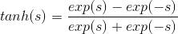

tanh(s)函数是一个平滑函数，类似“s”型。当|s|比较大的时候，tanh(s)与阶梯函数相近；当|s|比较小的时候，tanh(s)与线性函数比较接近。从数学上来说，由于处处连续可导，便于最优化计算。而且形状上类似阶梯函数，具有非线性的性质，可以得到比较复杂强大的模型。

顺便提一下，tanh(x)函数与sigmoid函数存在下列关系：

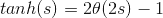

其中，

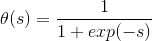

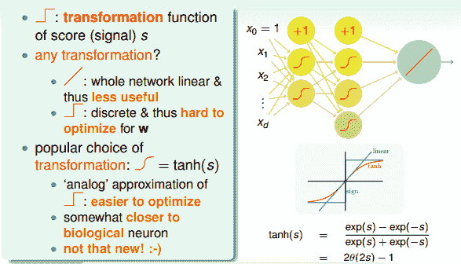

那么，接下来我们就使用tanh函数作为神经网络中间层的transformation function，所有的数学推导也基于此。实际应用中，可以选择其它的transformation function，不同的transformation function，则有不同的推导过程。

下面我们将仔细来看看Neural Network Hypothesis的结构。如下图所示，该神经网络左边是输入层，中间两层是隐藏层，右边是输出层。整体上来说，我们设定输入层为第0层，然后往右分别是第一层、第二层，输出层即为第3层。

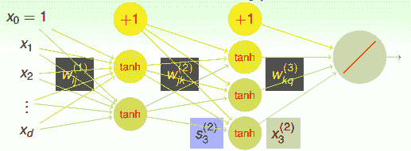

Neural Network Hypothesis中，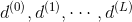分别表示神经网络的第几层，其中L为总层数。例如上图所示的是3层神经网络，L=3。我们先来看看每一层的权重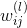，上标l满足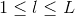，表示是位于哪一层。下标i满足，表示前一层输出的个数加上bias项（常数项）。下标j满足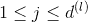，表示该层节点的个数（不包括bias项）。

对于每层的分数score，它的表达式为：

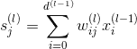

对于每层的transformation function，它的表达式为：

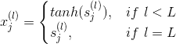

因为是regression模型，所以在输出层（l=L）直接得到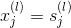。

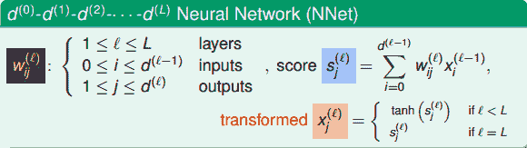

介绍完Neural Network Hypothesis的结构之后，我们来研究下这种算法结构到底有什么实际的物理意义。还是看上面的神经网络结构图，每一层输入到输出的运算过程，实际上都是一种transformation，而转换的关键在于每个权重值。每层网络利用输入x和权重w的乘积，在经过tanh函数，得到该层的输出，从左到右，一层一层地进行。其中，很明显，x和w的乘积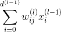越大，那么tanh(wx)就会越接近1，表明这种transformation效果越好。再想一下，w和x是两个向量，乘积越大，表明两个向量内积越大，越接近平行，则表明w和x有模式上的相似性。从而，更进一步说明了如果每一层的输入向量x和权重向量w具有模式上的相似性，比较接近平行，那么transformation的效果就比较好，就能得到表现良好的神经网络模型。也就是说，神经网络训练的核心就是pattern extraction，即从数据中找到数据本身蕴含的模式和规律。通过一层一层找到这些模式，找到与输入向量x最契合的权重向量w，最后再由G输出结果。

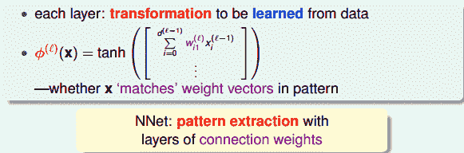

### **Neural Network Learning**

我们已经介绍了Neural Network Hypothesis的结构和算法流程。确定网络结构其实就是确定各层的权重值。那如何根据已有的样本数据，找到最佳的权重使error最小化呢？下面我们将详细推导。

首先，我们的目标是找到最佳的让最小化。如果只有一层隐藏层，就相当于是aggregation of perceptrons。可以使用我们上节课介绍的gradient boosting算法来一个一个确定隐藏层每个神经元的权重，输入层到隐藏层的权重可以通过C&RT算法计算的到。这不是神经网络常用的算法。如果隐藏层个数有两个或者更多，那么aggregation of perceptrons的方法就行不通了。就要考虑使用其它方法。

根据error function的思想，从输出层来看，我们可以得到每个样本神经网络预测值与实际值之间的squared error：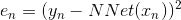，这是单个样本点的error。那么，我们只要能建立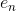与每个权重的函数关系，就可以利用GD或SGD算法对求偏微分，不断迭代优化值，最终得到使最小时对应的。

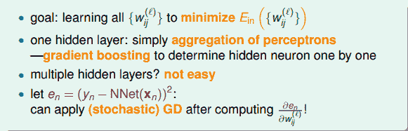

为了建立与各层权重的函数关系，求出对的偏导数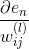，我们先来看输出层如何计算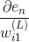。与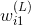的函数关系为：

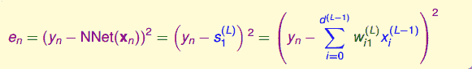

计算对的偏导数，得到：

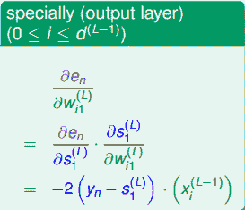

以上是输出层求偏导的结果。如果是其它层，即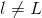，偏导计算可以写成如下形式：

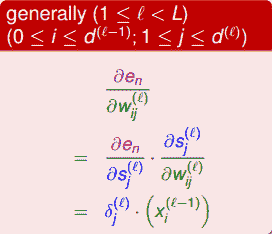

上述推导中，令与第l层第j个神经元的分数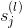的偏导数记为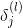。即：

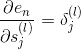

当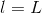时，；当时，是未知的，下面我们将进行运算推导，看看不同层之间的是否有递推关系。

如上图所示，第l层第j个神经元的分数经过tanh函数，得到该层输出，再与下一层权重相乘，得到第l+1层的分数，直到最后的输出层。

那么，利用上面到这样的递推关系，我们可以对偏导数做一些中间变量替换处理，得到如下表达式：

值得一提的是，上式中有个求和项，其中k表示下一层即l+1层神经元的个数。表明l层的与l+1层的所有都有关系。因为参与到每个的运算中了。

这样，我们得到了与的递推关系。也就是说如果知道了的值，就能推导出的值。而最后一层，即输出层的，那么就能一层一层往前推导，得到每一层的，从而可以计算出对各个的偏导数。计算完偏微分之后，就可以使用GD或SGD算法进行权重的迭代优化，最终得到最优解。

神经网络中，这种从后往前的推导方法称为Backpropagation Algorithm，即我们常常听到的BP神经网络算法。它的算法流程如下所示：

上面采用的是SGD的方法，即每次迭代更新时只取一个点，这种做法一般不够稳定。所以通常会采用mini-batch的方法，即每次选取一些数据，例如，来进行训练，最后求平均值更新权重w。这种做法的实际效果会比较好一些。

### **Optimization and Regularization**

经过以上的分析和推导，我们知道神经网络优化的目标就是让最小化。本节课我们采用error measure是squared error，当然也可以采用其它的错误衡量方式，只要在推导上做稍稍修改就可以了，此处不再赘述。

下面我们将主要分析神经网络的优化问题。由于神经网络由输入层、多个隐藏层、输出层构成，结构是比较复杂的非线性模型，因此可能有许多局部最小值，是non-convex的，找到全局最小值（globalminimum）就会困难许多。而我们使用GD或SGD算法得到的很可能就是局部最小值（local minimum）。

基于这个问题，不同的初始值权重通常会得到不同的local minimum。也就是说最终的输出G与初始权重有很大的关系。在选取上有个技巧，就是通常选择比较小的值，而且最好是随机random选择。这是因为，如果权重很大，那么根据tanh函数，得到的值会分布在两侧比较平缓的位置（类似于饱和saturation），这时候梯度很小，每次迭代权重可能只有微弱的变化，很难在全局上快速得到最优解。而随机选择的原因是通常对权重如何选择没有先验经验，只能通过random，从普遍概率上选择初始值，随机性避免了人为因素的干预，可以说更有可能经过迭代优化得到全局最优解。

下面从理论上看一下神经网络模型的VC Dimension。对于tanh这样的transfer function，其对应的整个模型的复杂度。其中V是神经网络中神经元的个数（不包括bias点）,D表示所有权值的数量。所以，如果V足够大的时候，VC Dimension也会非常大，这样神经网络可以训练出非常复杂的模型。但同时也可能会造成过拟合overfitting。所以，神经网络中神经元的数量V不能太大。

为了防止神经网络过拟合，一个常用的方法就是使用regularization。之前我们就介绍过可以在error function中加入一个regularizer，例如熟悉的L2 regularizer ：

但是，使用L2 regularizer 有一个缺点，就是它使每个权重进行等比例缩小（shrink）。也就是说大的权重缩小程度较大，小的权重缩小程度较小。这会带来一个问题，就是等比例缩小很难得到值为零的权重。而我们恰恰希望某些权重，即权重的解是松散（sparse）的。因为这样能有效减少VC Dimension，从而减小模型复杂度，防止过拟合发生。

那么为了得到sparse解，有什么方法呢？我们之前就介绍过可以使用L1 regularizer：，但是这种做法存在一个缺点，就是包含绝对值不容易微分。除此之外，另外一种比较常用的方法就是使用weight-elimination regularizer。weight-elimination regularizer类似于L2 regularizer，只不过是在L2 regularizer上做了尺度的缩小，这样能使large weight和small weight都能得到同等程度的缩小，从而让更多权重最终为零。weight-elimination regularizer的表达式如下：

除了weight-elimination regularizer之外，还有另外一个很有效的regularization的方法，就是Early Stopping。简而言之，就是神经网络训练的次数t不能太多。因为，t太大的时候，相当于给模型寻找最优值更多的可能性，模型更复杂，VC Dimension增大，可能会overfitting。而t不太大时，能有效减少VC Dimension，降低模型复杂度，从而起到regularization的效果。和随训练次数t的关系如下图右下角所示：

那么，如何选择最佳的训练次数t呢？可以使用validation进行验证选择。

### **总结**

本节课主要介绍了Neural Network模型。首先，我们通过使用一层甚至多层的perceptrons来获得更复杂的非线性模型。神经网络的每个神经元都相当于一个Neural Network Hypothesis，训练的本质就是在每一层网络上进行pattern extraction，找到最合适的权重，最终得到最佳的G。本课程以regression模型为例，最终的G是线性模型，而中间各层均采用tanh函数作为transform function。计算权重的方法就是采用GD或者SGD，通过Backpropagation算法，不断更新优化权重值，最终使得最小化，即完成了整个神经网络的训练过程。最后，我们提到了神经网络的可以使用一些regularization来防止模型过拟合。这些方法包括随机选择较小的权重初始值，使用weight-elimination regularizer或者early stopping等。

**_注明：_**

文章中所有的图片均来自台湾大学林轩田《机器学习技法》课程
