# 13 -- Deep Learning

上节课我们主要介绍了神经网络Neural Network。神经网络是由一层一层的神经元构成，其作用就是帮助提取原始数据中的模式即特征，简称为pattern feature extraction。神经网络模型的关键是计算出每个神经元的权重，方法就是使用Backpropagation算法，利用GD/SGD，得到每个权重的最优解。本节课我们将继续对神经网络进行深入研究，并介绍层数更多、神经元个数更多、模型更复杂的神经网络模型，即深度学习模型。

### **Deep Neural Network**

总的来说，根据神经网络模型的层数、神经元个数、模型复杂度不同，大致可分为两类：Shallow Neural Networks和Deep Neural Networks。上节课介绍的神经网络模型层数较少，属于Shallow Neural Networks，而本节课将着重介绍Deep Neural Networks。首先，比较一下二者之间的优缺点有哪些：

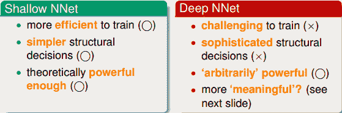

值得一提的是，近些年来，deep learning越来越火，尤其在电脑视觉和语音识别等领域都有非常广泛的应用。原因在于一层一层的神经网络有助于提取图像或者语音的一些物理特征，即pattern feature extraction，从而帮助人们掌握这些问题的本质，建立准确的模型。

下面举个例子，来看一下深度学习是如何提取出问题潜在的特征从而建立准确的模型的。如下图所示，这是一个手写识别的问题，简单地识别数字1和数字5。

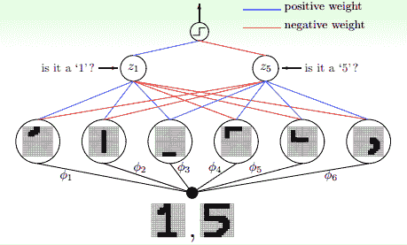

如何进行准确的手写识别呢？我们可以将写上数字的图片分解提取出一块一块不同部位的特征。例如左边三幅图每张图代表了数字1的某个部位的特征，三幅图片组合起来就是完整的数字1。右边四幅图也是一样，每张图代表了数字5的某个部位的特征，五幅图组合起来就是完整的数字5。对计算机来说，图片由许多像素点组成。要达到识别的目的，每层神经网络从原始像素中提取出更复杂的特征，再由这些特征对图片内容进行匹配和识别。层数越多，提取特征的个数和深度就越大，同时解决复杂问题的能量就越强，其中每一层都具有相应的物理意义。以上就是深度学习的作用和意义。

深度学习很强大，同时它也面临很多挑战和困难：

*   **difficult structural decisions**

*   **high model complexity**

*   **hard optimization problem**

*   **huge computational complexity**

面对以上深度学习的4个困难，有相应的技术和解决的办法：

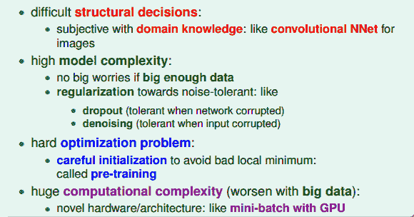

其中，最关键的技术就是regularization和initialization。

深度学习中，权重的初始化选择很重要，好的初始值能够帮助避免出现局部最优解的出现。常用的方法就是pre-train，即先权重进行初始值的选择，选择之后再使用backprop算法训练模型，得到最佳的权重值。在接下来的部分，我们将重点研究pre-training的方法。

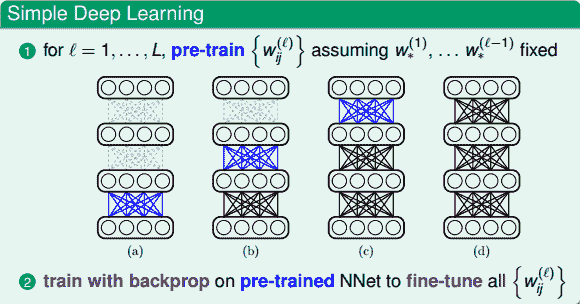

### **Autoencoder**

我们已经介绍了深度学习的架构，那么从算法模型上来说，如何进行pre-training，得到较好的权重初始值呢？首先，我们来看看，权重是什么？神经网络模型中，权重代表了特征转换（feature transform）。从另一个方面也可以说，权重表示一种编码（encoding），就是把数据编码成另外一些数据来表示。因为神经网络是一层一层进行的，有先后顺序，所以就单一层来看，好的权重初始值应该是尽可能地包含了该层输入数据的所有特征，即类似于information-preserving encoding。也就是说，能够把第i层的输入数据的特征传输到第i+1层，再把第i+1层的输入数据的特征传输到第i+2层，一层一层进行下去。这样，每层的权重初始值起到了对该层输入数据的编码作用，能够最大限度地保持其特征。

举个例子，上一小节我们讲了简单的手写识别的例子。从原始的一张像素图片转换到分解的不同笔画特征，那么反过来，这几个笔画特征也可以组合成原来的数字。这种可逆的转换被称为information-preserving，即转换后的特征保留了原输入的特征，而且转换是可逆的。这正是pre-train希望做到的，通过encoding将输入转换为一些特征，而这些特征又可以复原原输入x，实现information-preserving。所以，pre-training得到的权重初始值就应该满足这样的information-preserving特性。

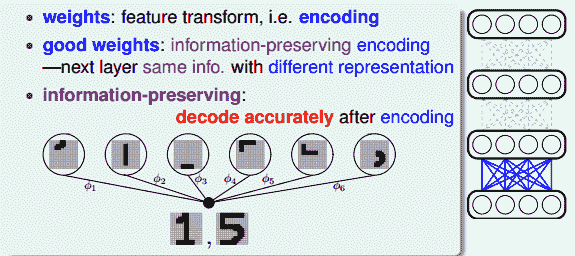

如何在pre-training中得到这样的权重初始值（即转换特征）呢？方法是建立一个简单的三层神经网络（一个输入层、一个隐藏层、一个输出层），如下图所示。

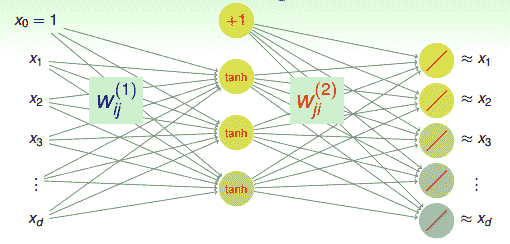

该神经网络中，输入层是原始数据（即待pre-training的数据），经过权重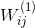得到隐藏层的输出为原始数据新的表达方式（即转换特征）。这些转换特征再经过权重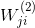得到输出层，输出层的结果要求跟原始数据类似，即输入层和输出层是近似相等的。整个网络是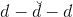 NNet结构。其核心在于“重构性”，从输入层到隐藏层实现特征转换，从隐藏层到输出层实现重构，满足上文所说的information-preserving的特性。这种结构的神经网络我们称之为autoencoder，输入层到隐藏层对应编码，而隐藏层到输出层对应解码。其中，表示编码权重，而表示解码权重。整个过程类似于在学习如何近似逼近identity function。

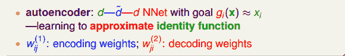

那么为什么要使用这样的结构来逼近identity function，有什么好处呢？首先对于监督式学习（supervised learning），这种的NNet结构中含有隐藏层。隐藏层的输出实际上就是对原始数据合理的特征转换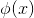，例如手写识别中隐藏层分解的各个笔画，包含了有用的信息。这样就可以从数据中学习得到一些有用的具有代表性的信息。然后，对于非监督式学习（unsupervised learning），autoencoder也可以用来做density estimation。如果网络最终的输出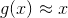，则表示密度较大；如果g(x)与x相差甚远，则表示密度较小。也就是说可以根据g(x)与x的接近程度来估计测试数据是落在密度较大的地方还是密度较小的地方。这种方法同样适用于outlier detection，异常检测。这样就可以从数据中学习得到一些典型的具有代表性的信息，找出哪些是典型资料，哪些不是典型资料。所以说，通过autoencoder不断逼近identity function，对监督式学习和非监督式学习都具有深刻的物理意义和非常广泛的应用。

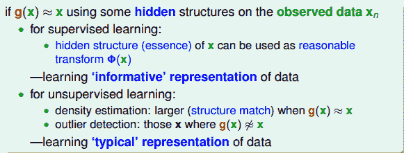

其实，对于autoencoder来说，我们更关心的是网络中间隐藏层，即原始数据的特征转换以及特征转换的编码权重。

Basic Autoencoder一般采用的NNet结构，对应的error function是squared error，即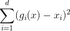。

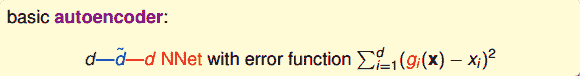

basic autoencoder在结构上比较简单，只有三层网络，容易训练和优化。各层之间的神经元数量上，通常限定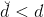，便于数据编码。数据集可表示为：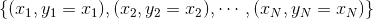，即输入输出都是x，可以看成是非监督式学习。一个重要的限制条件是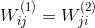，即编码权重与解码权重相同。这起到了regularization的作用，但是会让计算复杂一些。

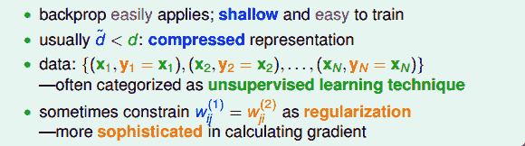

以上就是basic autoencoder的结构和一些限定条件。深度学习中，basic autoencoder的过程也就对应着pre-training的过程，使用这种方法，对无label的原始数据进行编码和解码，得到的编码权重就可以作为pre-trained的比较不错的初始化权重，也就是作为深度学习中层与层之间的初始化权重。

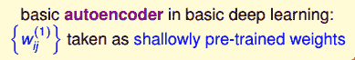

我们在本节课第一部分就说了深度学习中非常重要的一步就是pre-training，即权重初始化，而autoencoder可以作为pre-training的一个合理方法。Pre-training的整个过程是：首先，autoencoder会对深度学习网络第一层（即原始输入）进行编码和解码，得到编码权重，作为网络第一层到第二层的的初始化权重；然后再对网络第二层进行编码和解码，得到编码权重，作为网络第二层到第三层的初始化权重，以此类推，直到深度学习网络中所有层与层之间都得到初始化权重。值得注意的是，对于l-1层的网络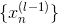，autoencoder中的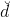应与下一层（即l层）的神经元个数相同。

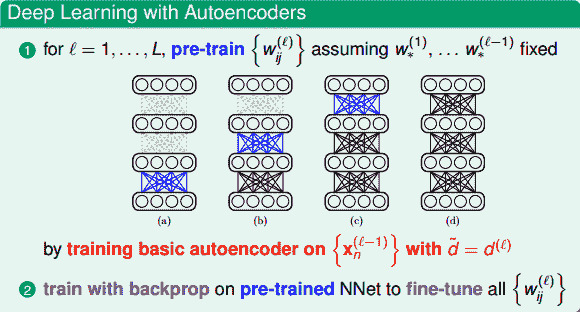

当然，除了basic autoencoder之外还有许多其它表现不错的pre-training方法。这些方法大都采用不同的结构和正则化技巧来得到不同的’fancier’ autoencoders，这里不再赘述。

### **Denoising Autoencoder**

上一部分，我们使用autoencoder解决了deep learning中pre-training的问题。接下来，我们将讨论deep learning中有什么样的regularization方式来控制模型的复杂度。

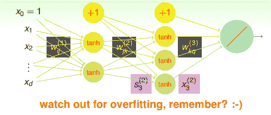

由于深度学习网络中神经元和权重的个数非常多，相应的模型复杂度就会很大，因此，regularization非常必要。之前我门也介绍过一些regularization的方法，包括：

*   **structural decisions/constraints**

*   **weight decay or weight elimination regularizers**

*   **early stopping**

下面我们将介绍另外一种regularization的方式，它在deep learning和autoencoder中都有很好的效果。

首先我们来复习一下之前介绍的overfitting产生的原因有哪些。如下图所示，我们知道overfitting与样本数量、噪声大小都有关系，数据量减少或者noise增大都会造成overfitting。如果数据量是固定的，那么noise的影响就非常大，此时，实现regularization的一个方法就是消除noise的影响。

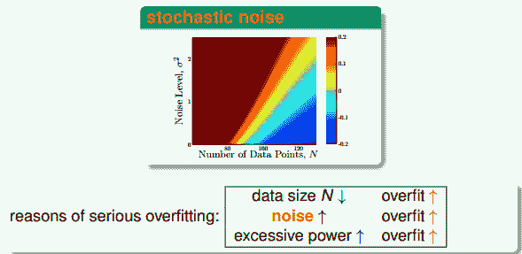

去除noise的一个简单方法就是对数据进行cleaning/pruning的操作。但是，这种方法通常比较麻烦，费时费力。此处，有一种比较“疯狂”的方法，就是往数据中添加一些noise。注意是添加noise！下面我们来解释这样做到底有什么作用。

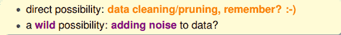

这种做法的idea来自于如何建立一个健壮（robust）的autoencoder。在autoencoder中，编码解码后的输出g(x)会非常接近真实样本值x。此时，如果对原始输入加入一些noise，对于健壮的autoencoder，编码解码后的输出g(x)同样会与真实样本值x很接近。举个例子，手写识别中，通常情况下，写的很规范的数字1经过autoencoder后能够复原为数字1。如果原始图片数字1歪斜或加入噪声，经过autoencoder后应该仍然能够解码为数字1。这表明该autoencoder是robust的，一定程度上起到了抗噪声和regularization的作用，这正是我们希望看到的。

所以，这就引出了denoising autoencoder的概念。denoising autoencoder不仅能实现编码和解码的功能，还能起到去噪声、抗干扰的效果，即输入一些混入noise的数据，经过autoencoder之后能够得到较纯净的数据。这样，autoencoder的样本集为：

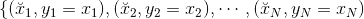

其中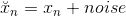，为混入噪声的样本，而为纯净样本。

autoencoder训练的目的就是让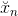经过编码解码后能够复原为纯净的样本。那么，在deep learning的pre-training中，如果使用这种denoising autoencoder，不仅能从纯净的样本中编解码得到纯净的样本，还能从混入noise的样本中编解码得到纯净的样本。这样得到的权重初始值更好，因为它具有更好的抗噪声能力，即健壮性好。实际应用中，denoising autoencoder非常有用，在训练过程中，输入混入人工noise，输出纯净信号，让模型本身具有抗噪声的效果，让模型健壮性更强，最关键的是起到了regularization的作用。

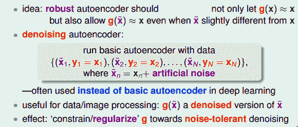

### **Principal Component Analysis**

刚刚我们介绍的autoencoder是非线性的，因为其神经网络模型中包含了tanh()函数。这部分我们将介绍linear autoencoder。nonlinear autoencoder通常比较复杂，多应用于深度学习中；而linear autoencoder通常比较简单，我们熟知的主成分分析（Principal Component Analysis，PCA），其实跟linear autoencoder有很大的关系。

对于一个linear autoencoder，它的第k层输出不包含tanh()函数，可表示为：

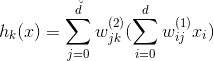

其中，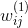和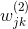分别是编码权重和解码权重。而且，有三个限制条件，分别是：

*   **移除常数项，让输入输出维度一致**

*   **编码权重与解码权重一致：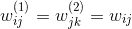**

*   ****

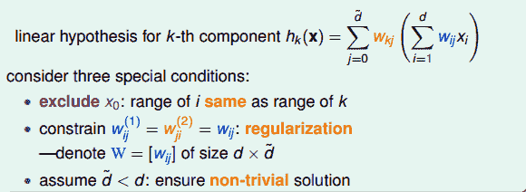

这样，编码权重用W表示，维度是d x ，解码权重用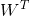表示。x的维度为d x 1。则linear autoencoder hypothesis可经过下式计算得到：

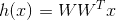

其实，linear autoencoder hypothesis就应该近似于原始输入x的值，即h(x)=x。根据这个，我们可以写出它的error function：

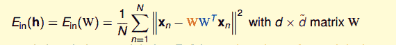

我们的目的是计算出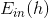最小化时对应的W。根据线性代数知识，首先进行特征值分解：

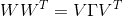

其中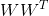是半正定矩阵。V矩阵满足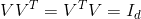。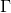是对角矩阵，对角线上有不超过个非零值（即为1），即对角线零值个数大于等于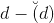。根据特征值分解的思想，我们可以把进行类似分解：

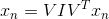

其中，I是单位矩阵，维度为dxd。这样，通过特征值分解我们就把对W的优化问题转换成对和V的优化问题。

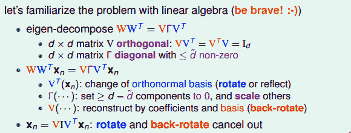

首先，我们来优化值，表达式如下：

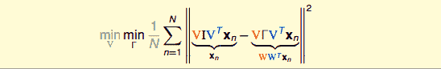

要求上式的最小化，可以转化为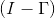越小越好，其结果对角线上零值越多越好，即I与越接近越好。因为的秩是小于等于的，最多有个1。所以，的最优解是其对角线上有个1。

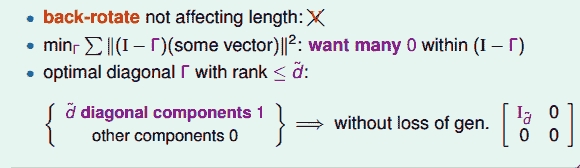

那么，的最优解已经得出，表达式变成：

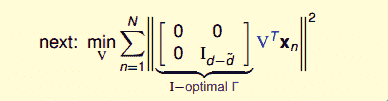

这里的最小化问题似乎有点复杂，我们可以做一些转换，把它变成最大化问题求解，转换后的表达式为：

当时，中只有第一行有用，最大化问题转化为：

引入拉格朗日因子，表达式的微分与条件微分应该是平行的，且由联系起来，即：

根据线性代数的知识，很明显能够看出，v就是矩阵的特征向量，而就是相对应的特征值。我们要求的是最大值，所以最优解v就是矩阵最大特征值对应的特征向量。

当时，求解方法是类似的，最优解就是矩阵前大的特征值对应的个特征向量。

经过以上分析，我们得到了和V的最优解。这就是linear autoencoder的编解码推导过程。

值得一提的是，linear autoencoder与PCA推导过程十分相似。但有一点不同的是，一般情况下，PCA会对原始数据x进行处理，即减去其平均值。这是为了在推导过程中的便利。这两种算法的计算流程大致如下：

linear autoencoder与PCA也有差别，PCA是基于统计学分析得到的。一般我们认为，将高维数据投影（降维）到低维空间中，应该保证数据本身的方差越大越好，而噪声方差越小越好，而PCA正是基于此原理推导的。linear autoencoder与PCA都可以用来进行数据压缩，但是PCA应用更加广泛一些。

以上关于PCA的推导基本上是从几何的角度，而没有从代数角度进行详细的数学推导。网上关于PCA的资料很多，这里附上一篇个人觉得讲解得通俗易懂的PCA原理介绍：[PCA的数学原理](http://blog.codinglabs.org/articles/pca-tutorial.html)。有兴趣的朋友可以看一看。

### **总结**

本节课主要介绍了深度学习（deep learning）的数学模型，也是上节课讲的神经网络的延伸。由于深度学习网络的复杂性，其建模优化是比较困难的。通常，我们可以从pre-training和regularization的角度来解决这些困难。首先，autoencoder可以得到比较不错的初始化权重，起到pre-training的效果。然后，denoising autoencoder通过引入人工噪声，训练得到初始化权重，从而使模型本身抗噪声能力更强，更具有健壮性，起到了regularization的效果。最后，我们介绍了linear autoencoder并从几何角度详述了其推导过程。linear autoencoder与PCA十分类似，都可以用来进行数据压缩和数据降维处理。

**_注明：_**

文章中所有的图片均来自台湾大学林轩田《机器学习技法》课程
