# 14 -- Radial Basis Function Network

上节课我们主要介绍了Deep Learning的概念。Deep Learing其实是Neural Networ的延伸，神经元更多，网络结构更加复杂。深度学习网络在训练的过程中最核心的问题就是pre-training和regularization。pre-training中，我们使用denoising autoencoder来对初始化权重进行选择。denoising autoencoder与统计学中经常用来进行数据处理的PCA算法具有很大的关联性。这节课我们将介绍Radial Basis Function Network，把之前介绍的adial Basis Function和Neural Network联系起来。

### **RBF Network Hypothesis**

之前我们介绍过，在SVM中引入Gaussian Kernel就能在无限多维的特征转换中得到一条“粗壮”的分界线（或者高维分界平面、分界超平面）。从结果来看，Gaussian SVM其实就是将一些Gaussian函数进行线性组合，而Gaussian函数的中心就位于Support Vectors上，最终得到预测模型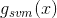。

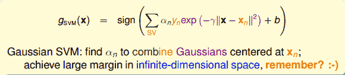

Gaussian kernel的另一种叫法是Radial Basis Function(RBF) kernel，即径向基函数。这个名字从何而来？首先，radial表示Gaussian函数计算结果只跟新的点x与中心点的距离有关，与其它无关。basis function就是指Gaussian函数，最终的矩就是由这些basis function线性组合而成。

从另外一个角度来看Gaussian SVM。首先，构造一个函数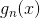：

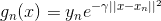

上式中，指数项表示新的点x与之间的距离大小。距离越近，即权重越大，相当于对投的票数更多；而距离越远，权重越小，相当于对投的票数更少。其物理意义是新的点与的距离远近决定了与的接近程度。如果距离越近，则对的权重影响越大；如果距离越远，则对的权重影响越小。那么整体来说，就由所有的SV组成的线性组合而成，不同对应的系数是，最后由sign函数做最后的选择。这个过程很类型我们之前介绍的aggregation中将所有较好的hypothesis线性组合，不同的有不同的权重。我们把叫做radial hypotheses，Gaussian SVM就是将所有SV对应的radial hypotheses进行线性组合（linear aggregation）。

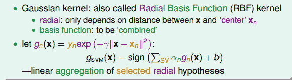

那么，Radial Basis Function(RBF) Network其实就是上面Gaussian SVM概念的延伸，目的就是找到所有radial hypotheses的linear aggregation，得到更好的网络模型。

之所以叫作RBF Network是因为它的模型结构类似于我们之前介绍的Neural Network。

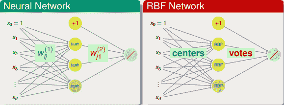

Neural Network与RBF Network在输出层基本是类似的，都是上一层hypotheses的线性组合（linear aggregation）。但是对于隐藏层的各个神经元来说，Neural Network是使用内积（inner-product）加上tanh()函数的方法，而RBF Network是使用距离（distance）加上Gaussian函数的方法。总的来说，RBF Network是Neural Network的一个分支。

至此，RBF Network Hypothesis以及网络结构可以写成如下形式：

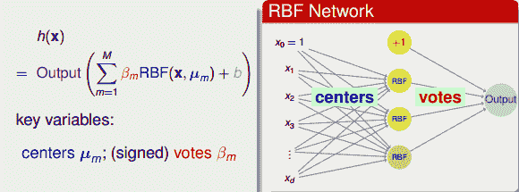

上式中，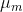表示每个中心点的位置，隐藏层每个神经元对应一个中心点；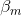表示每个RBF的权重，即投票所占比重。

对应到Gaussian SVM上，上式中的RBF就是Gaussian函数。由于是分类问题，上式中的Output就是sign函数。其中，RBF的个数M就等于支持向量的个数SV，就代表每个SV的坐标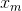，而就是在Dual SVM中推导得到的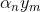值。那我们学习的目标就是根据已知的RBF和Output，来决定最好的中心点位置和权重系数。

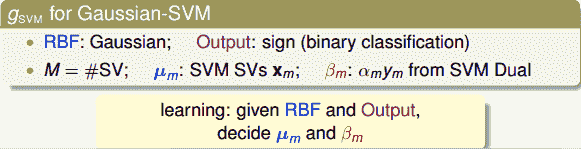

在之前介绍SVM的时候，我们就讲过Mercer定理：一个矩阵是Kernel的充分必要条件是它是对称的且是半正定的，条件比较苛刻。除了Gaussian kernel还有Polynomial kernel等等。Kernel实际上描述了两个向量之间的相似性，通过转换到z空间计算内积的方式，来表征二者之间的相似性。而RBF实际上是直接使用x空间的距离来描述了一种相似性，距离越近，相似性越高。因此，kernel和RBF可以看成是两种衡量相似性（similarity）的方式。本文介绍的Gaussian RBF即为二者的交集。

除了kernel和RBF之外，还有其它衡量相似性的函数。例如神经网络中的神经元就是衡量输入和权重之间的相似性。

经过以上分析，我们知道了RBF Network中distance similarity是一个很好的定义特征转换的方法。除此之外，我们还可以使用其它相似性函数来表征特征转换，从而得到更好的机器学习模型。

### **RBF Network Learning**

我们已经介绍了RBF Network的Hypothesis可表示为：

其中表示中心点的位置。的个数M是人为决定的，如果将每个样本点都作为一个中心点，即M=N，则我们把这种结构称为full RBF Network。也就是说，对于full RBF Network，每个样本点都对最终的预测都有影响（uniform influence），影响的程度由距离函数和权重决定。如果每个样本点的影响力都是相同的，设为1，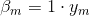，那么相当于只根据距离的远近进行投票。最终将x与所有样本点的RBF距离线性组合，经过sign函数后，得到最终的预测分类结果。这实际上就是aggregation的过程，考虑并计入所有样本点的影响力，最后将x与所有样本点的distance similarity进行线性组合。

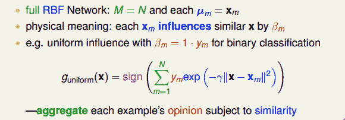

full RBF Network的矩可以表示为：

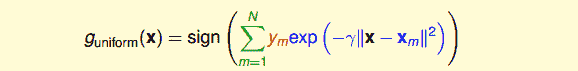

我们来看上式中的Gaussian函数项，当x与样本点越接近的时候，其高斯函数值越大。由于Gaussian函数曲线性质，越靠近中心点，值越大；偏离中心点，其值会下降得很快。也就是说，在所有N个中心样本点中，往往只有距离x最近的那个样本点起到关键作用，而其它距离x较远的样本点其值很小，基本可以忽略。因此，为了简化运算，我们可以找到距离x最近的中心样本点，只用这一个点来代替所有N个点，最后得到的矩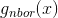也只由该最近的中心点决定。这种模型叫做nearest neighbor model，只考虑距离x最近的那一个“邻居”。

当然可以对nearest neighbor model进行扩展，如果不是只选择一个“邻居”，而是选择距离x最近的k个“邻居”，进行uniformly aggregation，得到最终的矩。这种方法通常叫做k近邻算法（k nearest neighbor）。

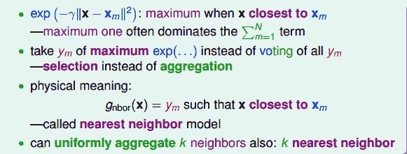

k nearest neighbor通常比nearest neighbor model效果更好，计算量上也比full RBF Network要简单一些。值得一提的是，k nearest neighbor与full RBF Network都是比较“偷懒”的方法。因为它们在训练模型的时候比较简单，没有太多的运算，但是在测试的时候却要花费更多的力气，找出最相近的中心点，计算相对复杂一些。

接下来，我们来看一下Full RBF Network有什么样的优点和好处。考虑一个squared error regression问题，且每个RBF的权重为而不是前面简化的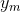。目的是计算最优化模型对应的值。该hypothesis可表示为：

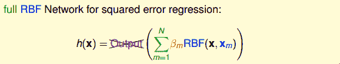

很明显，这是一个简单的线性回归问题，每个RBF都可以看成是特征转换。特征转换后的向量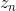可表示为：

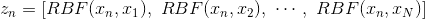

那么，根据之前线性回归介绍过的最优化解公式，就能快速地得到的最优解为：

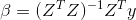

上述解的条件是矩阵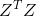是可逆的。

矩阵Z的大小是NxN，是一个方阵。而且，由于Z中每个向量表示该点与其它所有点的RBF distance，所以从形式上来说，Z也是对称矩阵。如果所有的样本点都不一样，则Z一定是可逆的。

根据Z矩阵的这些性质，我们可以对的解进行化简，得到：

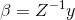

将的解代入矩的计算中，以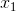为例，得到：

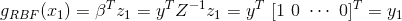

结果非常有趣，模型的输出与原样本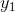完全相同。同样，对任意的，都能得到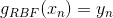。因此，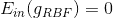。看起来，这个模型非常完美了，没有error。但是，我们之前就说过，机器学习中，并非好事，很可能造成模型复杂度增加及过拟合。

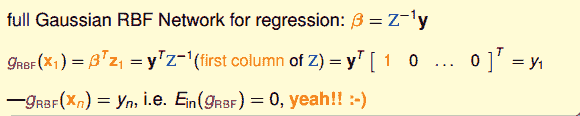

当然，这种方法在某些领域还是很有用的。比如在函数拟合（function approximation）中，目标就是让，使得原所有样本都尽可能地落在拟合的函数曲线上。

为了避免发生过拟合，我们可以引入正则项，得到的最优解为：

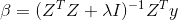

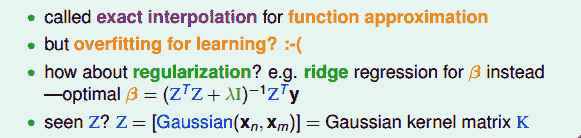

我们再来看一下Z矩阵，Z矩阵是由一系列Gaussian函数组成，每个Gaussian函数计算的是两个样本之间的distance similarity。这里的Z与之前我们介绍的Gaussian SVM中的kernel K是一致的。当时我们得到kernel ridgeregression中线性系数的解为：

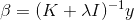

比较一下kernel ridgeregression与regularized full RBF Network的解，形式上相似但不完全相同。这是因为regularization不一样，在kernel ridgeregression中，是对无限多维的特征转换做regularization，而在regularized full RBF Network中，是对有限维（N维度）的特征转换做regularization。因此，两者的公式解有细微差别。

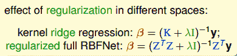

除此之外，还有另外一种regularization的方法，就是不把所有N个样本点都拿来作中心点，而是只选择其中的M个样本点作为中心点。类似于SVM中的SV一样，只选择具有代表性的M个中心点。这样减少中心点数量的同时也就减少了权重的数量，能够起到regularization的效果，避免发生过拟合。

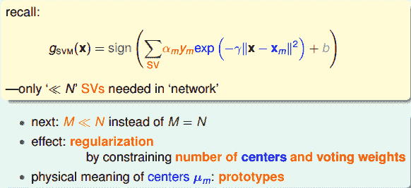

下一部分，我们将讨论如何选取M个中心点作为好的代表。

### **k-Means Algorithm**

之所以要选择代表，是因为如果某些样本点很接近，那么就可以用一个中心点来代表它们。这就是聚类（cluster）的思想，从所有N个样本点中选择少数几个代表作为中心点。

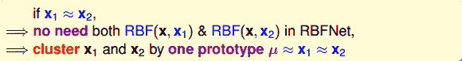

聚类（clustering）问题是一种典型的非监督式学习（unsupervised learning）。它的优化问题有两个变量需要确定：一个是分类的分群值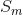，每一类可表示为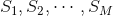；另外一个是每一类对应的中心点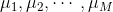。那么对于该聚类问题的优化，其error function可使用squared error measure来衡量。

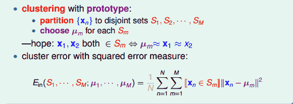

那么，我们的目标就是通过选择最合适的和，使得最小化。对应的公式可表示为：

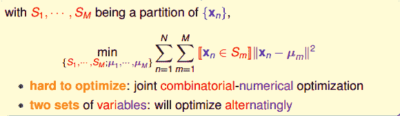

从这个最小化公式，我们能够发现这是一个组合最佳化的问题，既要优化分群值，又要求解每一类的中心点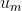。所以，这个最小化问题是比较复杂、难优化的。通常的办法是对S和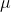分别进行最优化求解。

首先，如果是固定的，目标就是只要对所有的进行分群归类。这个求解过程很简单，因为每个样本点只能属于一个群S，不能同时属于两个或多个群。所以，只要根据距离公式，计算选择离最近的中心点即可。

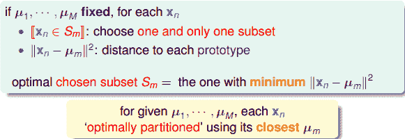

然后，如果是固定的，目标就是只要找出每个类的中心点。显然，根据上式中的error function，所有的分群是已知的，那么该最小化问题就是一个典型的数值最优化问题。对于每个类群，利用梯度下降算法，即可得到的解。

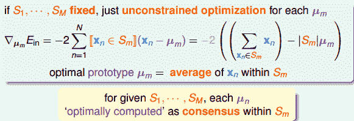

如上图所示，中心点就等于所有属于类群的平均位置处。

经过以上的推导，我们得到了一个非常有名的一种unsupervised learning算法，叫做k-Means Algorithm。这里的k就是代表上面的M，表示类群的个数。

k-Means Algorithm的流程是这样的：首先，随机选择k个中心点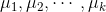；然后，再由确定的中心点得到不同的类群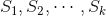；接着，再由确定的类群计算出新的不同的k个中心点；继续循环迭代计算，交互地对和S值进行最优化计算，不断更新和S值，直到程序收敛，实现最小化。具体算法流程图如下所示：

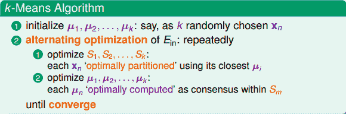

有一个问题是，k-Means Algorithm的循环迭代一定会停止吗？或者说一定能得到最优解吗？答案是肯定的。因为每次迭代更新，和S值都会比上一次的值更接近最优解，也就是说是不断减小的。而的下界是0，所以，最终会等于0，和S最终能得到最优解。

k-Means Algorithm已经介绍完毕。接下来，我们把k-Means Algorithm应用到RBF Network中去。首先，使用k-Means，得到原始样本的k个中心点。原始样本到k个中心点组成了RBF特征转换。然后，根据上面介绍过的线性模型，由最优化公式解计算得到权重值。最后，将所有的用线性组合，即得到矩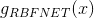的表达式。具体的算法流程如下所示：

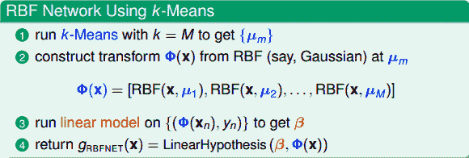

值得一提的是，这里我们使用了unsupervised learning（k-Means）与我们上节课介绍的autoencoder类似，同样都是特征转换（feature transform）的方法。

在最优化求解过程中，参数有k-Means类群个数M、Gaussian函数参数等。我们可以采用validation的方法来选取最佳的参数值。

### **k-means and RBF Network in Action**

下面这部分，我们将举几个例子，看一下k-Means Algorithm是如何处理分类问题的。

第一个例子，平面上有4个类群，k=4。首先，我们随机选择4个中心点，如下图中四种颜色的方块所示：

第一次迭代，由初始中心点，得到4个类群点的分布：

4个类群点确定后，再更新4个中心点的位置：

第二次迭代，由上面得到的4个中心点，再计算4个类群点的分布：

4个类群点确定后，再更新4个中心点的位置：

第三次迭代，由上面得到的4个中心点，再计算4个类群点的分布：

4个类群点确定后，再更新4个中心点的位置：

第四次迭代，由上面得到的4个中心点，再计算4个类群点的分布：

4个类群点确定后，再更新4个中心点的位置：

第五次迭代，由上面得到的4个中心点，再计算4个类群点的分布：

4个类群点确定后，再更新4个中心点的位置：

第六次迭代，由上面得到的4个中心点，再计算4个类群点的分布：

4个类群点确定后，再更新4个中心点的位置：

从上图我们可以看到，经过六次迭代计算后，聚类的效果已经相当不错了。从另外一个角度来说，k值的选择很重要，下面我们来看看不同的k值对应什么样的分类效果。

如上图所示，初始时，我们分别设定k为2，4，7，随机选择中心点位置。在经过多次迭代后，得到的聚类结果如下：

通过上面这个例子可以得出，不同的k值会得到不同的聚类效果。还有一点值得注意的是，初始中心点位置也可能会影响最终的聚类。例如上图中k=7的例子，初始值选取的右边三个中心点比较靠近，最后得到的右边三个聚类中心点位置也跟初始位置比较相近。所以，k值大小和初始中心点位置都会影响聚类效果。

接下来，我们把k-Means应用到RBF Network中，同样分别设定k为2，4，7，不同模型得到的分类效果如下：

很明显，k=2时，分类效果不是太好；k=4时，分类效果好一些；而k=7时，分类效果更好，能够更细致地将样本准确分类。这说明了k-Means中k值设置得是否合理，对RBF Network的分类效果起到重要的作用。

再来看一个例子，如果使用full RBF Network进行分类，即k=N，如下图左边所示，设置正则化因子。下图右边表示只考虑full RBF Network中的nearest neighbor。下图中间表示的是k=4的RBF Network的分类效果。

从上图的比较中，我们可以发现full RBF Network得到的分类线比较弯曲复杂。由于full RBF Network的计算量比较大，所以一般情况下，实际应用得不太多。

### **总结**

本节课主要介绍了Radial Basis Function Network。RBF Network Hypothesis就是计算样本之间distance similarity的Gaussian函数，这类原型替代了神经网络中的神经元。RBF Network的训练学习过程，其实就是对所有的原型Hypotheses进行linear aggregation。然后，我们介绍了一个确定k个中心点的unsupervised learning算法，叫做k-Means Algorithm。这是一种典型的聚类算法，实现对原始样本数据的聚类分群。接着，将k-Means Algorithm应用到RBF Network中，选择合适数量的中心点，得到更好的分类模型。最后，我们列举了几个在实际中使用k-Means和RBF Network的例子，结果显示不同的类群k值对分类的效果影响很大。

**_注明：_**

文章中所有的图片均来自台湾大学林轩田《机器学习技法》课程
