# 6 -- Theory of Generalization

上一节课，我们主要探讨了当M的数值大小对机器学习的影响。如果M很大，那么就不能保证机器学习有很好的泛化能力，所以问题转换为验证M有限，即最好是按照多项式成长。然后通过引入了成长函数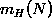和dichotomy以及break point的概念，提出2D perceptrons的成长函数是多项式级别的猜想。这就是本节课将要深入探讨和证明的内容。

### **一、Restriction of Break Point**

我们先回顾一下上节课的内容，四种成长函数与break point的关系：

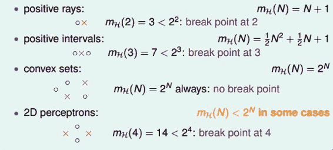

下面引入一个例子，如果k=2，那么当N取不同值的时候，计算其成长函数是多少。很明显，当N=1时，=2,；当N=2时，由break point为2可知，任意两点都不能被shattered（shatter的意思是对N个点，能够分解为种dichotomies）；最大值只能是3；当N=3时，简单绘图分析可得其，即最多只有4种dichotomies。

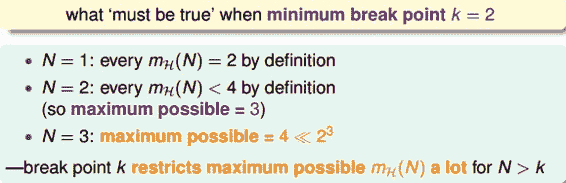

所以，我们发现当N&gt;k时，break point限制了值的大小，也就是说影响成长函数的因素主要有两个：

*   抽样数据集N

*   break point k（这个变量确定了假设的类型）

那么，如果给定N和k，能够证明其的最大值的上界是多项式的，则根据霍夫丁不等式，就能用代替M，得到机器学习是可行的。所以，证明的上界是poly(N)，是我们的目标。

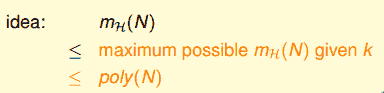

### **二、Bounding Function: Basic Cases**

现在，我们引入一个新的函数：bounding function，B(N,k)。Bound Function指的是当break point为k的时候，成长函数可能的最大值。也就是说B(N,k)是的上界，对应最多有多少种dichotomy。那么，我们新的目标就是证明：

这里值得一提的是，B(N,k)的引入不考虑是1D postive intrervals问题还是2D perceptrons问题，而只关心成长函数的上界是多少，从而简化了问题的复杂度。

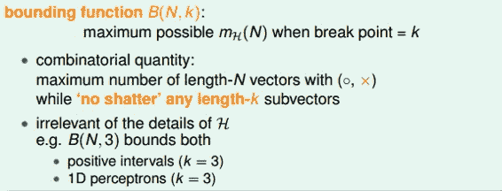

求解B(N,k)的过程十分巧妙：

*   当k=1时，B(N,1)恒为1。

*   当N &lt; k时，根据break point的定义，很容易得到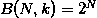。

*   当N = k时，此时N是第一次出现不能被shatter的值，所以最多只能有个dichotomies，则。

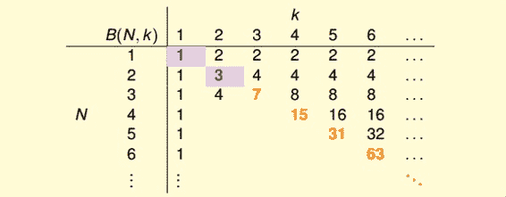

到此，bounding function的表格已经填了一半了，对于最常见的N&gt;k的情况比较复杂，推导过程下一小节再详细介绍。

### **三、Bounding Function: Inductive Cases**

N &gt; k的情况较为复杂，下面给出推导过程：

以B(4,3)为例，首先想着能否构建B(4,3)与B(3,x)之间的关系。

首先，把B(4,3)所有情况写下来，共有11组。也就是说再加一种dichotomy，任意三点都能被shattered，11是极限。

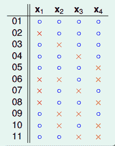

对这11种dichotomy分组，目前分成两组，分别是orange和purple，orange的特点是，x1,x2和x3是一致的，x4不同并成对，例如1和5，2和8等，purple则是单一的，x1,x2,x3都不同，如6,7,9三组。

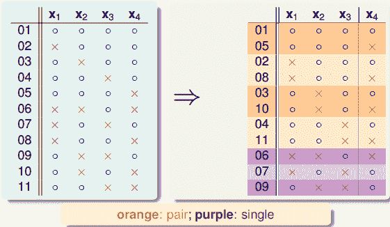

将Orange去掉x4后去重得到4个不同的vector并成为，相应的purple为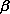。那么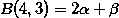，这个是直接转化。紧接着，由定义，B(4,3)是不能允许任意三点shatter的，所以由和构成的所有三点组合也不能shatter（alpha经过去重），即。

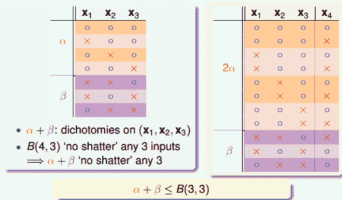

另一方面，由于中x4是成对存在的，且是不能被任意三点shatter的，则能推导出是不能被任意两点shatter的。这是因为，如果是不能被任意两点shatter，而x4又是成对存在的，那么x1、x2、x3、x4组成的必然能被三个点shatter。这就违背了条件的设定。这个地方的推导非常巧妙，也解释了为什么会这样分组。此处得到的结论是

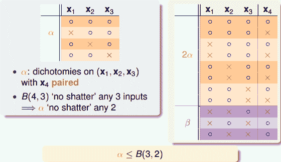

由此得出B(4,3)与B(3,x)的关系为：

最后，推导出一般公式为：

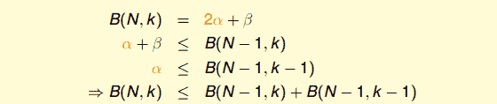

根据推导公式，下表给出B(N,K)值

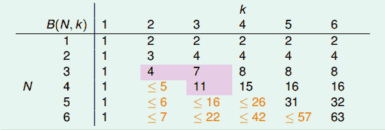

根据递推公式，推导出B(N,K)满足下列不等式：

上述不等式的右边是最高阶为k-1的N多项式，也就是说成长函数的上界B(N,K)的上界满足多项式分布poly(N)，这就是我们想要得到的结果。

得到了的上界B(N,K)的上界满足多项式分布poly(N)后，我们回过头来看看之前介绍的几种类型它们的与break point的关系：

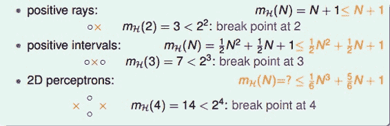

我们得到的结论是，对于2D perceptrons，break point为k=4，的上界是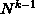。推广一下，也就是说，如果能找到一个模型的break point，且是有限大的，那么就能推断出其成长函数有界。

### **四、A Pictorial Proof**

我们已经知道了成长函数的上界是poly(N)的，下一步，如果能将代替M，代入到Hoffding不等式中，就能得到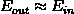的结论：

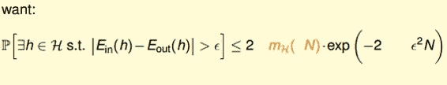

实际上并不是简单的替换就可以了，正确的表达式为：

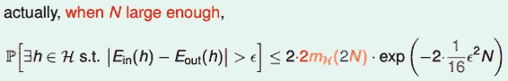

该推导的证明比较复杂，我们可以简单概括为三个步骤来证明：

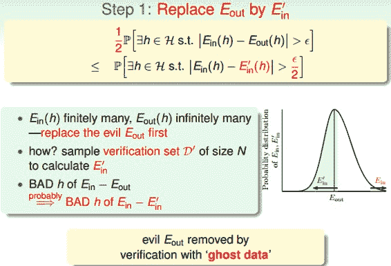

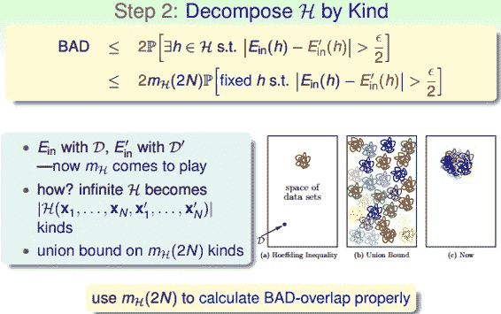

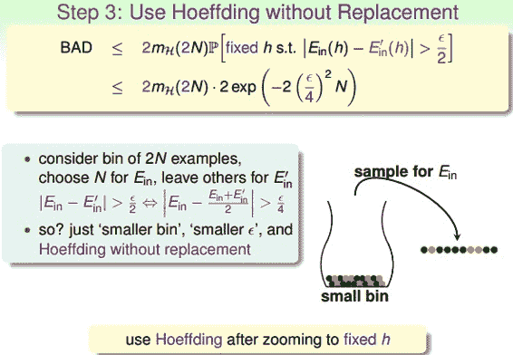

这部分内容，我也只能听个大概内容，对具体的证明过程有兴趣的童鞋可以自行研究一下，研究的结果记得告诉一下我哦。

最终，我们通过引入成长函数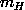，得到了一个新的不等式，称为Vapnik-Chervonenkis(VC) bound：

对于2D perceptrons，它的break point是4，那么成长函数。所以，我们可以说2D perceptrons是可以进行机器学习的，只要找到hypothesis能让，就能保证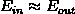。

### **五、总结**

本节课我们主要介绍了只要存在break point，那么其成长函数就满足poly(N)。推导过程是先引入的上界B(N,k)，B(N,k)的上界是N的k-1阶多项式，从而得到的上界就是N的k-1阶多项式。然后，我们通过简单的三步证明，将代入了Hoffding不等式中，推导出了Vapnik-Chervonenkis(VC) bound，最终证明了只要break point存在，那么机器学习就是可行的。

**_注明：_**

文章中所有的图片均来自台湾大学林轩田《机器学习基石》课程。