# 7 -- The VC Dimension

前几节课着重介绍了机器能够学习的条件并做了详细的推导和解释。机器能够学习必须满足两个条件：

*   **假设空间H的Size M是有限的，即当N足够大的时候，那么对于假设空间中任意一个假设g，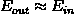**。
*   **利用算法A从假设空间H中，挑选一个g，使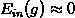，则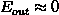**。

这两个条件，正好对应着test和trian两个过程。train的目的是使损失期望；test的目的是使将算法用到新的样本时的损失期望也尽可能小，即。

正因为如此，上次课引入了break point，并推导出只要break point存在，则M有上界，一定存在。

本次笔记主要介绍VC Dimension的概念。同时也是总结VC Dimension与，，Model Complexity Penalty（下面会讲到）的关系。

### **一、Definition of VC Dimension**

首先，我们知道如果一个假设空间H有break point k，那么它的成长函数是有界的，它的上界称为Bound function。根据数学归纳法，Bound function也是有界的，且上界为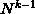。从下面的表格可以看出，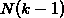比B(N,k)松弛很多。

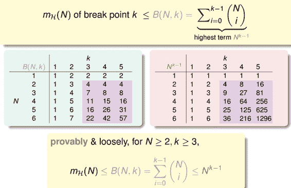

则根据上一节课的推导，VC bound就可以转换为：

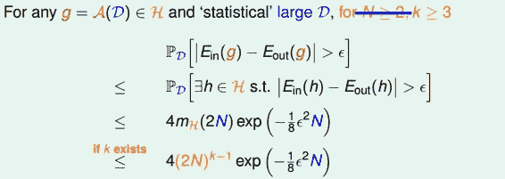

这样，不等式只与k和N相关了，一般情况下样本N足够大，所以我们只考虑k值。有如下结论：

*   **若假设空间H有break point k，且N足够大，则根据VC bound理论，算法有良好的泛化能力**

*   **在假设空间中选择一个矩g，使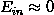，则其在全集数据中的错误率会较低**

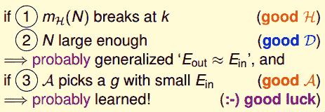

下面介绍一个新的名词：VC Dimension。VC Dimension就是某假设集H能够shatter的最多inputs的个数，即最大完全正确的分类能力。（注意，只要存在一种分布的inputs能够正确分类也满足）。

shatter的英文意思是“粉碎”，也就是说对于inputs的所有情况都能列举出来。例如对N个输入，如果能够将种情况都列出来，则称该N个输入能够被假设集H shatter。

根据之前break point的定义：假设集不能被shatter任何分布类型的inputs的最少个数。则VC Dimension等于break point的个数减一。

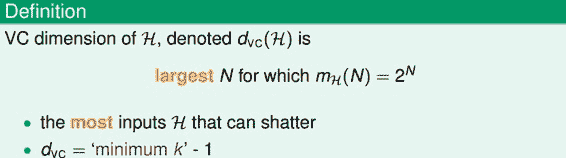

现在，我们回顾一下之前介绍的四种例子，它们对应的VC Dimension是多少：

用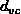代替k，那么VC bound的问题也就转换为与和N相关了。同时，如果一个假设集H的确定了，则就能满足机器能够学习的第一个条件，与算法、样本数据分布和目标函数都没有关系。

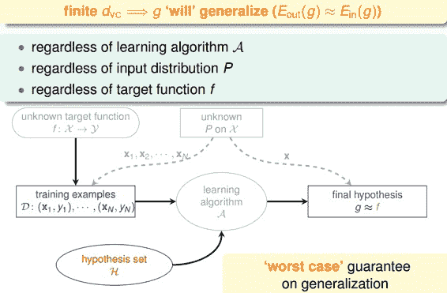

### **二、VC Dimension of Perceptrons**

回顾一下我们之前介绍的2D下的PLA算法，已知Perceptrons的k=4，即。根据VC Bound理论，当N足够大的时候，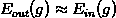。如果找到一个g，使，那么就能证明PLA是可以学习的。

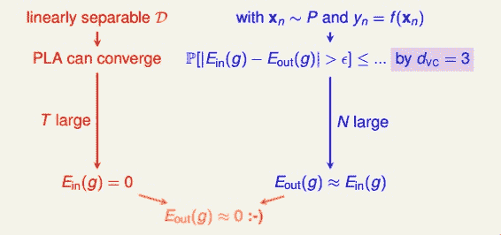

这是在2D情况下，那如果是多维的Perceptron，它对应的又等于多少呢？

已知在1D Perceptron，，在2D Perceptrons，，那么我们有如下假设：，其中d为维数。

要证明的话，只需分两步证明：

*   
*   

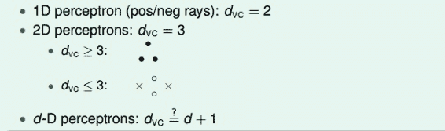

首先证明第一个不等式：。

在d维里，我们只要找到某一类的d+1个inputs可以被shatter的话，那么必然得到。所以，我们有意构造一个d维的矩阵能够被shatter就行。是d维的，有d+1个inputs，每个inputs加上第零个维度的常数项1，得到的矩阵：

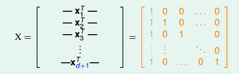

矩阵中，每一行代表一个inputs，每个inputs是d+1维的，共有d+1个inputs。这里构造的很明显是可逆的。shatter的本质是假设空间H对的所有情况的判断都是对的，即总能找到权重W，满足，。由于这里我们构造的矩阵的逆矩阵存在，那么d维的所有inputs都能被shatter，也就证明了第一个不等式。

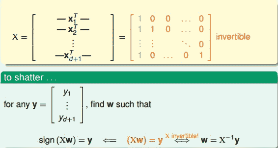

然后证明第二个不等式：。

在d维里，如果对于任何的d+2个inputs，一定不能被shatter，则不等式成立。我们构造一个任意的矩阵，其包含d+2个inputs，该矩阵有d+1列，d+2行。这d+2个向量的某一列一定可以被另外d+1个向量线性表示，例如对于向量，可表示为：

其中，假设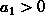，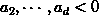.

那么如果是正类，均为负类，则存在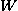，得到如下表达式：
&lt;font color="#0000ff"&gt;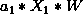&lt;/font&gt;+&lt;font color="#ff0000"&gt;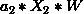&lt;/font&gt;++&lt;font color="#ff0000"&gt;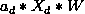&lt;/font&gt;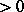

因为其中蓝色项大于0，代表正类；红色项小于0，代表负类。所有对于这种情况，一定是正类，无法得到负类的情况。也就是说，d+2个inputs无法被shatter。证明完毕！

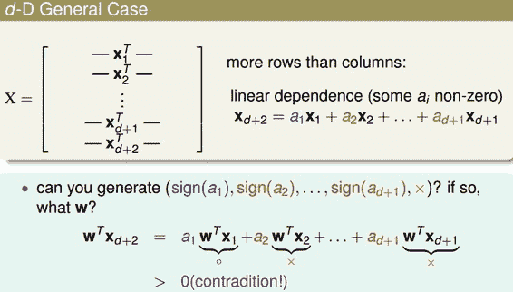

综上证明可得。

### **三、Physical Intuition VC Dimension**

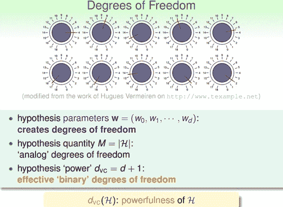

上节公式中又名features，即自由度。自由度是可以任意调节的，如同上图中的旋钮一样，可以调节。VC Dimension代表了假设空间的分类能力，即反映了H的自由度，产生dichotomy的数量，也就等于features的个数，但也不是绝对的。

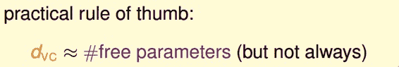

例如，对2D Perceptrons，线性分类，，则，也就是说只要3个features就可以进行学习，自由度为3。

介绍到这，我们发现M与是成正比的，从而得到如下结论：

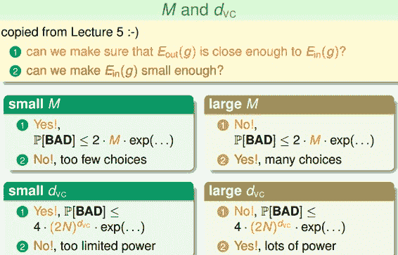

### **四、Interpreting VC Dimension**

下面，我们将更深入地探讨VC Dimension的意义。首先，把VC Bound重新写到这里：

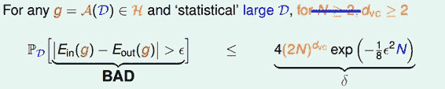

根据之前的泛化不等式，如果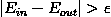，即出现bad坏的情况的概率最大不超过。那么反过来，对于good好的情况发生的概率最小为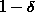，则对上述不等式进行重新推导：

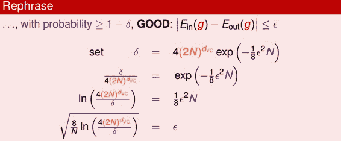

表现了假设空间H的泛化能力，越小，泛化能力越大。

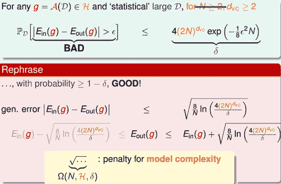

至此，已经推导出泛化误差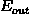的边界，因为我们更关心其上界（可能的最大值），即：

上述不等式的右边第二项称为模型复杂度，其模型复杂度与样本数量N、假设空间H()、有关。由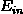共同决定。下面绘出、model complexity、随变化的关系：

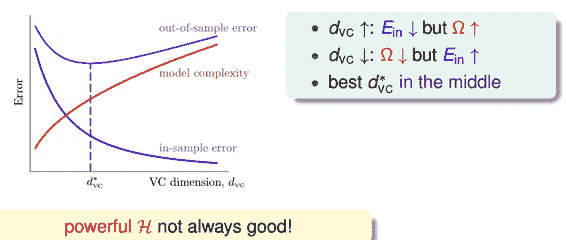

通过该图可以得出如下结论：

*   **越大，越小，越大（复杂）**。

*   **越小，越大，越小（简单）**。

*   **随着增大，会先减小再增大**。

所以，为了得到最小的，不能一味地增大以减小，因为太小的时候，模型复杂度会增加，造成变大。也就是说，选择合适的，选择的features个数要合适。

下面介绍一个概念：样本复杂度（Sample Complexity）。如果选定，样本数据D选择多少合适呢？通过下面一个例子可以帮助我们理解：

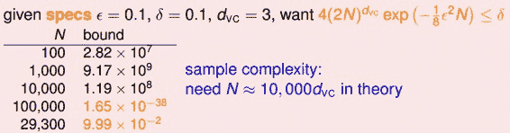

通过计算得到N=29300，刚好满足的条件。N大约是的10000倍。这个数值太大了，实际中往往不需要这么多的样本数量，大概只需要的10倍就够了。N的理论值之所以这么大是因为VC Bound 过于宽松了，我们得到的是一个比实际大得多的上界。

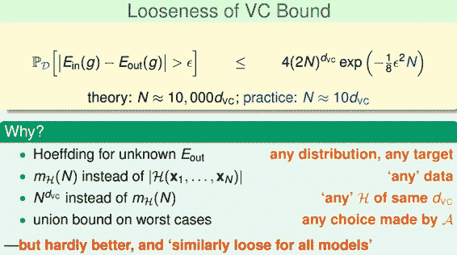

值得一提的是，VC Bound是比较宽松的，而如何收紧它却不是那么容易，这也是机器学习的一大难题。但是，令人欣慰的一点是，VC Bound基本上对所有模型的宽松程度是基本一致的，所以，不同模型之间还是可以横向比较。从而，VC Bound宽松对机器学习的可行性还是没有太大影响。

### **五、总结**

本节课主要介绍了VC Dimension的概念就是最大的non-break point。然后，我们得到了Perceptrons在d维度下的VC Dimension是d+1。接着，我们在物理意义上，将与自由度联系起来。最终得出结论不能过大也不能过小。选取合适的值，才能让足够小，使假设空间H具有良好的泛化能力。

**_注明：_**

文章中所有的图片均来自台湾大学林轩田《机器学习基石》课程