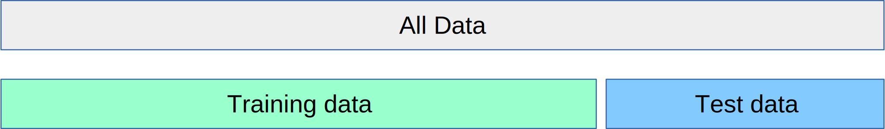
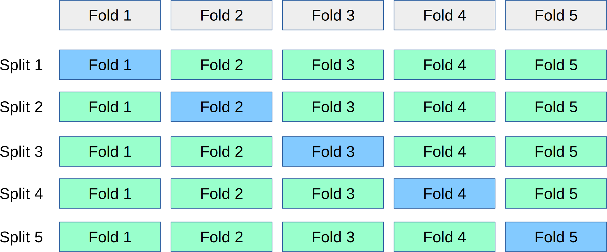

# 十三、交叉验证和得分方法

在前面的章节和笔记本中，我们将数据集分为两部分：训练集和测试集。 我们使用训练集来拟合我们的模型，并且我们使用测试集来评估其泛化能力 - 它对新的，没见过的数据的表现情况。



然而，（标记的）数据通常是宝贵的，这种方法让我们只将约 3/4 的数据用于行训练。 另一方面，我们只会尝试将我们的 1/4 数据应用于测试。 使用更多数据来构建模型，并且获得更加鲁棒的泛化能力估计，常用方法是交叉验证。 在交叉验证中，数据被重复拆分为非重叠的训练和测试集，并为每对建立单独的模型。 然后聚合测试集的得分来获得更鲁棒的估计。

进行交叉验证的最常用方法是`k`折交叉验证，其中数据首先被分成`k`（通常是 5 或 10）个相等大小的折叠，然后对于每次迭代，使用`k`折中的一个作为测试数据，其余作为训练数据：



这样，每个数据点只在测试集中一次，我们可以使用第`k`个数据之外的所有数据进行训练。 让我们应用这种技术，在鸢尾花数据集上评估`KNeighborsClassifier`算法：

```py
from sklearn.datasets import load_iris
from sklearn.neighbors import KNeighborsClassifier

iris = load_iris()
X, y = iris.data, iris.target

classifier = KNeighborsClassifier()
```

鸢尾花中的标签是有序的，这意味着如果我们像上面那样拆分数据，第一个折叠只有标签 0，而最后一个只有标签 2：

```py
y
```

为了在评估中避免这个问题，我们首先将我们的数据打乱：

```py
import numpy as np
rng = np.random.RandomState(0)

permutation = rng.permutation(len(X))
X, y = X[permutation], y[permutation]
print(y)
```

现在实现交叉验证很简单：

```py
k = 5
n_samples = len(X)
fold_size = n_samples // k
scores = []
masks = []
for fold in range(k):
    # 为此折叠中的测试集生成一个布尔掩码
    test_mask = np.zeros(n_samples, dtype=bool)
    test_mask[fold * fold_size : (fold + 1) * fold_size] = True
    # 为可视化存储掩码
    masks.append(test_mask)
    # 使用此掩码创建训练和测试集
    X_test, y_test = X[test_mask], y[test_mask]
    X_train, y_train = X[~test_mask], y[~test_mask]
    # 拟合分类器
    classifier.fit(X_train, y_train)
    # 计算得分并记录
    scores.append(classifier.score(X_test, y_test))
```

让我们检查一下我们的测试掩码是否正确：

```py
import matplotlib.pyplot as plt
%matplotlib inline
plt.matshow(masks, cmap='gray_r')
```

现在让我们看一下我们计算出的得分：

```py
print(scores)
print(np.mean(scores))
```

正如你所看到的，得分广泛分布于 90% 正确到 100％ 正确。 如果我们只进行一次分割，我们可能会得到任何答案。

由于交叉验证是机器学习中常见的模式，有个函数执行上面的操作，带有更多灵活性和更少代码。`sklearn.model_selection`模块具有交叉验证相关的所有函数。 最简单的函数是`cross_val_score`，它接受估计器和数据集，并将为你完成所有拆分：

```py
from sklearn.model_selection import cross_val_score
scores = cross_val_score(classifier, X, y)
print('Scores on each CV fold: %s' % scores)
print('Mean score: %0.3f' % np.mean(scores))
```

如你所见，该函数默认使用三个折叠。 你可以使用`cv`参数更改折叠数：

```py
cross_val_score(classifier, X, y, cv=5)
```

交叉验证模块中还有辅助对象，它们将为你生成各种不同交叉验证方法的索引，包括 k-fold：

```py
from sklearn.model_selection import KFold, StratifiedKFold, ShuffleSplit
```

默认情况下，`cross_val_score`将`StratifiedKFold`用于分类，这可确保数据集中的类比例反映在每个折叠中。 如果你有一个二分类数据集，其中 90% 的数据点属于类 0，那么这意味着在每个折叠中，90% 的数据点将属于类 0。如果你只是使用`KFold`交叉验证，你可能会生成一个只包含类 0 的分割。每当你进行分类时，通常最好使用`StratifiedKFold`。

`StratifiedKFold`也消除了我们打乱鸢尾花的需要。 让我们看看在未打乱的鸢尾花数据集上，它生成什么类型的折叠。 每个交叉验证类都是训练和测试索引的集合的生成器：

```py
cv = StratifiedKFold(n_splits=5)
for train, test in cv.split(iris.data, iris.target):
    print(test)
```

正如你所看到的，在每个折叠中，在开始，中间，和结束位置，都有一些样本。 这样，保留了类别比例。 让我们观察一下`split`：

```py
def plot_cv(cv, features, labels):
    masks = []
    for train, test in cv.split(features, labels):
        mask = np.zeros(len(labels), dtype=bool)
        mask[test] = 1
        masks.append(mask)
    
    plt.matshow(masks, cmap='gray_r')
    
plot_cv(StratifiedKFold(n_splits=5), iris.data, iris.target)
```

为了比较，仍旧是标准`KFold`，忽略标签：

```py
plot_cv(KFold(n_splits=5), iris.data, iris.target)
```

请记住，增加折叠数量会为你提供更大的训练数据集，但会导致更多重复，因此评估速度会变慢：

```py
plot_cv(KFold(n_splits=10), iris.data, iris.target)
```

另一个有用的交叉验证生成器是`ShuffleSplit`。 该生成器简单地重复分割数据的随机部分。 这允许用户独立指定重复次数和训练集大小：

```py
plot_cv(ShuffleSplit(n_splits=5, test_size=.2), iris.data, iris.target)
```

如果你想要更鲁棒的估计，你可以增加分割数量：

```py
plot_cv(ShuffleSplit(n_splits=20, test_size=.2), iris.data, iris.target)
```

你可以使用`cross_val_score`方法来使用所有这些交叉验证生成器：

```py
cv = ShuffleSplit(n_splits=5, test_size=.2)
cross_val_score(classifier, X, y, cv=cv)
```

> 练习
> 
> 在鸢尾花数据集上，使用`KFold`类进行三折交叉验证，而不打乱数据。你能解释一下结果吗？

```py
# %load solutions/13_cross_validation.py
```
