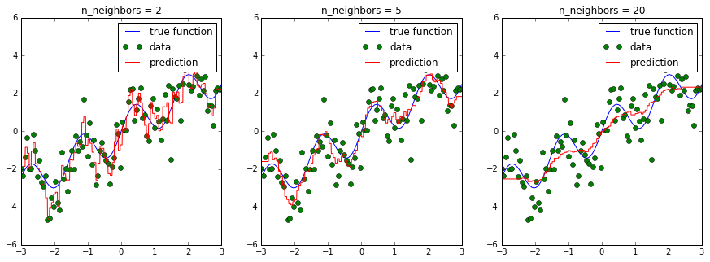
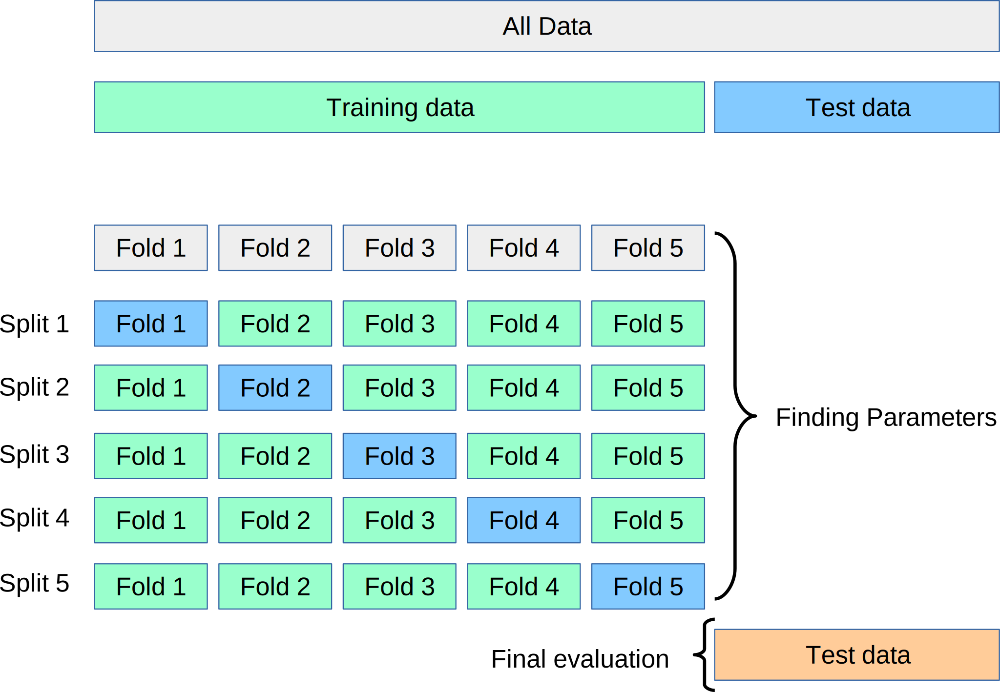
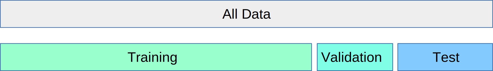

# 十四、参数选择、验证和测试

大多数模型的参数会影响他们可以学习的模型的复杂程度。回忆使用`KNeighborsRegressor`的时候。 如果我们改变我们考虑的邻居数量，我们会得到更平滑的预测：



在上图中，我们看到`n_neighbors`的三个不同值。对于`n_neighbors = 2`，数据过拟合，模型过于灵活，可以适应训练数据中的噪声。对于`n_neighbors = 20`，模型不够灵活，无法合理建模数据中的变化。

在中间，对于`n_neighbors = 5`，我们找到了一个很好的中点。它非常适合数据，并且不会受到任何一个图中所见的，过拟合或欠拟合问题的影响。我们想要的是一种定量识别过拟合和欠拟合的方法，并优化超参数（这种情况是多项式次数`d`）来确定最佳算法。

我们要权衡过多记录训练数据的特殊性和噪声，或者没有建模足够的可变性。这是一个需要在基本上每个机器学习应用中做出的权衡，并且是一个核心概念，称为偏差 - 方差 - 权衡或“过拟合与欠拟合”。


## 超参数、过拟合和欠拟合

遗憾的是，没有找到最佳位置的一般规则，因此机器学习实践者必须通过尝试几个超参数设置，来找到模型复杂性和泛化的最佳权衡。 超参数是机器学习算法的内部旋钮或可调参数（与算法从训练数据中学习的模型参数相反 - 例如，线性回归模型的权重系数）；K 近邻中的`k`的数量是这样的超参数。

最常见的是，这种“超参数调整”是使用暴力搜索完成的，例如在多个`n_neighbors`值上：

```py
from sklearn.model_selection import cross_val_score, KFold
from sklearn.neighbors import KNeighborsRegressor
# 生成玩具数据集
x = np.linspace(-3, 3, 100)
rng = np.random.RandomState(42)
y = np.sin(4 * x) + x + rng.normal(size=len(x))
X = x[:, np.newaxis]

cv = KFold(shuffle=True)

# 对每个参数设置执行交叉验证
for n_neighbors in [1, 3, 5, 10, 20]:
    scores = cross_val_score(KNeighborsRegressor(n_neighbors=n_neighbors), X, y, cv=cv)
    print("n_neighbors: %d, average score: %f" % (n_neighbors, np.mean(scores)))
```

scikit-learn 中有一个函数，称为`validation_plot`，用于重现上面的卡通图。 它根据训练和验证误差（使用交叉验证）绘制一个参数，例如邻居的数量：

```py
from sklearn.model_selection import validation_curve
n_neighbors = [1, 3, 5, 10, 20, 50]
train_scores, test_scores = validation_curve(KNeighborsRegressor(), X, y, param_name="n_neighbors",
                                             param_range=n_neighbors, cv=cv)
plt.plot(n_neighbors, train_scores.mean(axis=1), label="train accuracy")
plt.plot(n_neighbors, test_scores.mean(axis=1), label="test accuracy")

plt.ylabel('Accuracy')
plt.xlabel('Number of neighbors')
plt.xlim([50, 0])
plt.legend(loc="best");
```

请注意，许多邻居意味着“平滑”或“简单”的模型，因此绘图使用还原的`x`轴。

如果多个参数很重要，例如 SVM 中的参数`C`和`gamma`（稍后会详细介绍），则尝试所有可能的组合：

```py
from sklearn.model_selection import cross_val_score, KFold
from sklearn.svm import SVR

# 对每个参数设置执行交叉验证
for C in [0.001, 0.01, 0.1, 1, 10]:
    for gamma in [0.001, 0.01, 0.1, 1]:
        scores = cross_val_score(SVR(C=C, gamma=gamma), X, y, cv=cv)
        print("C: %f, gamma: %f, average score: %f" % (C, gamma, np.mean(scores)))
```

由于这是一种非常常见的模式，因此在 scikit-learn 中有一个内置类`GridSearchCV`。 `GridSearchCV`接受描述应该尝试的参数的字典，和一个要训练的模型。

参数网格被定义为字典，其中键是参数，值是要测试的设置。

要检查不同折叠的训练得分，请将参数`return_train_score`设置为`True`。

```py
from sklearn.model_selection import GridSearchCV
param_grid = {'C': [0.001, 0.01, 0.1, 1, 10], 'gamma': [0.001, 0.01, 0.1, 1]}

grid = GridSearchCV(SVR(), param_grid=param_grid, cv=cv, verbose=3, return_train_score=True)
```

`GridSearchCV`的一大优点是它是一个元估计器。 它需要像上面的 SVR 这样的估计器，并创建一个新的估计器，其行为完全相同 - 在这种情况下，就像一个回归器。 所以我们可以调用它的`fit`来训练：

```py
grid.fit(X, y)
```

`fit`所做的比我们上面做的复杂得多。 首先，它使用交叉验证运行相同的循环，来找到最佳参数组合。 一旦它具有最佳组合，它在所有传给`fit`的数据上再次执行`fit`（无交叉验证），来使用最佳参数设置构建单个新模型。

然后，与所有模型一样，我们可以使用`predict`或`score`：

```py
grid.predict(X)
```

你可以在`best_params_`属性中检查`GridSearchCV`找到的最佳参数，以及`best_score_`属性中的最佳得分：

```py
print(grid.best_score_)

print(grid.best_params_)
```

但是，你可以通过访问`cv_results_`属性来调查每组参数值的表现和更多信息。 `cv_results_`属性是一个字典，其中每个键都是字符串，每个值都是数组。 因此，它可以用于制作`pandas DataFrame`。

```py
type(grid.cv_results_)

print(grid.cv_results_.keys())

import pandas as pd

cv_results = pd.DataFrame(grid.cv_results_)
cv_results.head()

cv_results_tiny = cv_results[['param_C', 'param_gamma', 'mean_test_score']]
cv_results_tiny.sort_values(by='mean_test_score', ascending=False).head()
```

但是，将这个得分用于评估存在问题。 你可能会犯所谓的多假设检验错误。 如果你尝试了很多参数设置，其中一些参数设置只是偶然表现很好，而你获得的得分可能无法反映你的模型对新的没见过的数据的表现。 因此，在执行网格搜索之前拆分单独的测试集是很好的。 这种模式可以看作是训练-验证-测试分割，在机器学习中很常见：



我们可以非常容易地实现，通过使用`train_test_split`分割一些测试数据，在训练集上训练`GridSearchCV`，并将`score`方法应用于测试集：

```py
from sklearn.model_selection import train_test_split
X_train, X_test, y_train, y_test = train_test_split(X, y, random_state=1)

param_grid = {'C': [0.001, 0.01, 0.1, 1, 10], 'gamma': [0.001, 0.01, 0.1, 1]}
cv = KFold(n_splits=10, shuffle=True)

grid = GridSearchCV(SVR(), param_grid=param_grid, cv=cv)

grid.fit(X_train, y_train)
grid.score(X_test, y_test)
```

我们还可以查看所选的参数：

```py
grid.best_params_
```

一些实践者采用更简单的方案，将数据简单地分为三个部分，即训练，验证和测试。 如果你的训练集非常大，或者使用交叉验证训练许多模型是不可行的，因为训练模型需要很长时间，这是一种可能的替代方案。 你可以使用 scikit-learn 执行此操作，例如通过拆分测试集，然后将`GridSearchCV`与`ShuffleSplit`交叉验证应用于单次迭代：



```py
from sklearn.model_selection import train_test_split, ShuffleSplit

X_train, X_test, y_train, y_test = train_test_split(X, y, random_state=1)

param_grid = {'C': [0.001, 0.01, 0.1, 1, 10], 'gamma': [0.001, 0.01, 0.1, 1]}
single_split_cv = ShuffleSplit(n_splits=1)

grid = GridSearchCV(SVR(), param_grid=param_grid, cv=single_split_cv, verbose=3)

grid.fit(X_train, y_train)
grid.score(X_test, y_test)
```

这要快得多，但可能会产生更糟糕的超参数，从而产生更糟糕的结果。

```py
clf = GridSearchCV(SVR(), param_grid=param_grid)
clf.fit(X_train, y_train)
clf.score(X_test, y_test)
```

> 练习
> 
> 应用网格搜索来查找`KNeighborsClassifier`中邻居数量的最佳设置，并将其应用于数字数据集。
