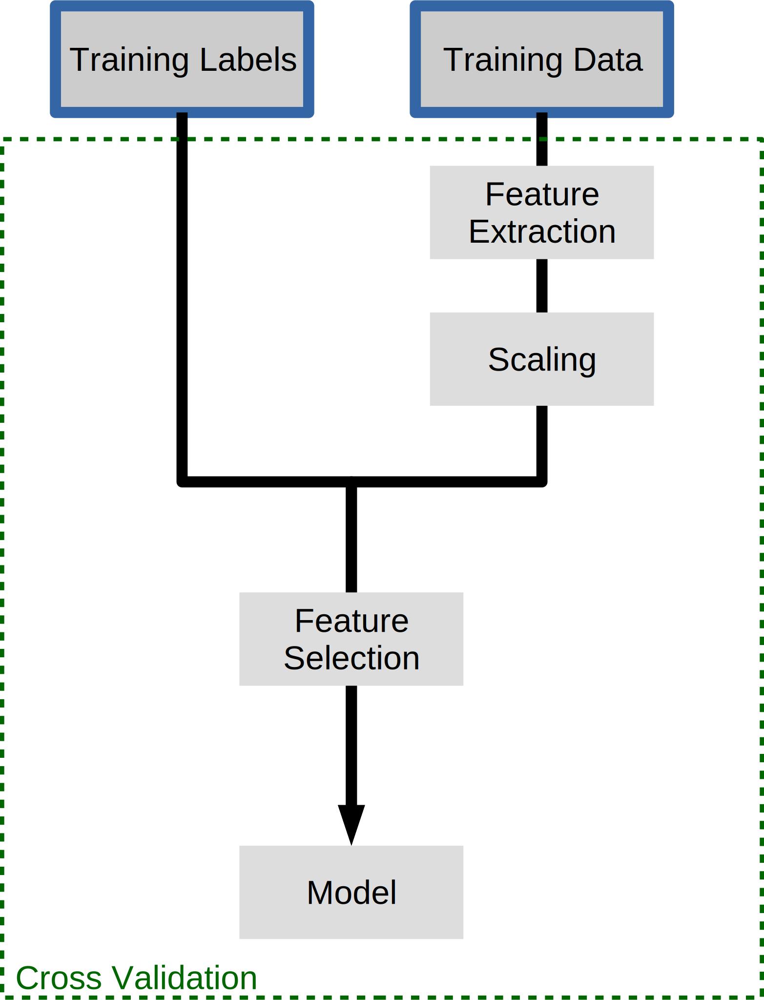

# 十五、估计器流水线

在本节中，我们将研究如何链接不同的估计器。

## 简单示例：估计器之前的特征提取和选择

## 特征提取：向量化器

对于某些类型的数据，例如文本数据，必须应用特征提取步骤将其转换为数值特征。 为了说明，我们加载我们之前使用的 SMS 垃圾邮件数据集。

```py
import os

with open(os.path.join("datasets", "smsspam", "SMSSpamCollection")) as f:
    lines = [line.strip().split("\t") for line in f.readlines()]
text = [x[1] for x in lines]
y = [x[0] == "ham" for x in lines]

from sklearn.model_selection import train_test_split

text_train, text_test, y_train, y_test = train_test_split(text, y)
```

以前，我们手动应用了特征提取，如下所示：

```py
from sklearn.feature_extraction.text import TfidfVectorizer
from sklearn.linear_model import LogisticRegression

vectorizer = TfidfVectorizer()
vectorizer.fit(text_train)

X_train = vectorizer.transform(text_train)
X_test = vectorizer.transform(text_test)

clf = LogisticRegression()
clf.fit(X_train, y_train)

clf.score(X_test, y_test)
```

我们学习转换然后将其应用于测试数据的情况，在机器学习中非常常见。 因此 scikit-learn 有一个快捷方式，称为流水线：

```py
from sklearn.pipeline import make_pipeline

pipeline = make_pipeline(TfidfVectorizer(), LogisticRegression())
pipeline.fit(text_train, y_train)
pipeline.score(text_test, y_test)
```

如你所见，这使代码更短，更容易处理。 在背后，与上面完全相同。 当在水流上调用`fit`时，它将依次调用每个步骤的`fit`。

在第一步的`fit`之后，它将使用第一步的`transform `方法来创建新的表示。 然后将其用于下一步的`fit`，依此类推。 最后，在最后一步，只调用`fit`。


如果我们调用`score`，那么每一步都只会调用`transform` - 毕竟这可能是测试集！ 然后，在最后一步，使用新的表示调用`score`。 `predict`也是如此。

流水线的构建不仅简化了代码，而且对于模型选择也很重要。 假设我们想要网格搜索`C`来调整上面的 Logistic 回归。

让我们假设我们这样做：

```py
# This illustrates a common mistake. Don't use this code!
from sklearn.model_selection import GridSearchCV

vectorizer = TfidfVectorizer()
vectorizer.fit(text_train)

X_train = vectorizer.transform(text_train)
X_test = vectorizer.transform(text_test)

clf = LogisticRegression()
grid = GridSearchCV(clf, param_grid={'C': [.1, 1, 10, 100]}, cv=5)
grid.fit(X_train, y_train)
```

## 我们哪里做错了？

在这里，我们使用`X_train`上的交叉验证进行了网格搜索。 然而，当应用`TfidfVectorizer`时，它看到了所有的`X_train`，而不仅仅是训练折叠！ 因此，它可以使用测试折叠中单词频率的知识。 这被称为测试集的“污染”，并且使泛化性能或错误选择的参数的估计过于乐观。 我们可以通过流水线解决这个问题：

```py
from sklearn.model_selection import GridSearchCV

pipeline = make_pipeline(TfidfVectorizer(), 
                         LogisticRegression())

grid = GridSearchCV(pipeline,
                    param_grid={'logisticregression__C': [.1, 1, 10, 100]}, cv=5)

grid.fit(text_train, y_train)
grid.score(text_test, y_test)
```

请注意，我们需要告诉流水线我们要在哪一步设置参数`C`。我们可以使用特殊的`__`语法来完成此操作。 `__`之前的名称只是类的名称，`__`之后的部分是我们想要使用网格搜索设置的参数。



使用流水线的另一个好处是，我们现在还可以使用`GridSearchCV`搜索特征提取的参数：

```py
from sklearn.model_selection import GridSearchCV

pipeline = make_pipeline(TfidfVectorizer(), LogisticRegression())

params = {'logisticregression__C': [.1, 1, 10, 100],
          "tfidfvectorizer__ngram_range": [(1, 1), (1, 2), (2, 2)]}
grid = GridSearchCV(pipeline, param_grid=params, cv=5)
grid.fit(text_train, y_train)
print(grid.best_params_)
grid.score(text_test, y_test)
```

> 练习
> 
> 使用`StandardScaler`和`RidgeRegression`创建流水线，并将其应用于波士顿住房数据集（使用`sklearn.datasets.load_boston`加载）。 尝试添加`sklearn.preprocessing.PolynomialFeatures`变换器作为第二个预处理步骤，并网格搜索多项式的次数（尝试 1,2 和 3）。

```py
# %load solutions/15A_ridge_grid.py
```
