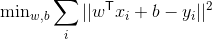
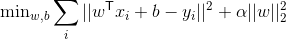
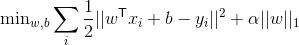

# 十七、深入：线性模型

线性模型在可用的数据很少时非常有用，或者对于文本分类中的非常大的特征空间很有用。 此外，它们是正则化的良好研究案例。

## 用于回归的线性模型

用于回归的所有线性模型学习系数参数`coef_`和偏移`intercept_`，来使用线性特征组合做出预测：

```py
y_pred = x_test[0] * coef_[0] + ... + x_test[n_features-1] * coef_[n_features-1] + intercept_
```

回归的线性模型之间的差异在于，除了很好地拟合训练数据之外，对系数施加什么样的限制或惩罚，作为正则化。 最标准的线性模型是“普通最小二乘回归”，通常简称为“线性回归”。 它没有对`coef_`施加任何额外限制，因此当特征数量很大时，它会变得行为异常，并且模型会过拟合。

让我们生成一个简单的模拟，以查看这些模型的行为。

```py
from sklearn.datasets import make_regression
from sklearn.model_selection import train_test_split

X, y, true_coefficient = make_regression(n_samples=200, n_features=30, n_informative=10, noise=100, coef=True, random_state=5)
X_train, X_test, y_train, y_test = train_test_split(X, y, random_state=5, train_size=60, test_size=140)
print(X_train.shape)
print(y_train.shape)
```

## 线性回归



```py
from sklearn.linear_model import LinearRegression
linear_regression = LinearRegression().fit(X_train, y_train)
print("R^2 on training set: %f" % linear_regression.score(X_train, y_train))
print("R^2 on test set: %f" % linear_regression.score(X_test, y_test))

from sklearn.metrics import r2_score
print(r2_score(np.dot(X, true_coefficient), y))

plt.figure(figsize=(10, 5))
coefficient_sorting = np.argsort(true_coefficient)[::-1]
plt.plot(true_coefficient[coefficient_sorting], "o", label="true")
plt.plot(linear_regression.coef_[coefficient_sorting], "o", label="linear regression")

plt.legend()

from sklearn.model_selection import learning_curve

def plot_learning_curve(est, X, y):
    training_set_size, train_scores, test_scores = learning_curve(est, X, y, train_sizes=np.linspace(.1, 1, 20))
    estimator_name = est.__class__.__name__
    line = plt.plot(training_set_size, train_scores.mean(axis=1), '--', label="training scores " + estimator_name)
    plt.plot(training_set_size, test_scores.mean(axis=1), '-', label="test scores " + estimator_name, c=line[0].get_color())
    plt.xlabel('Training set size')
    plt.legend(loc='best')
    plt.ylim(-0.1, 1.1)

plt.figure()    
plot_learning_curve(LinearRegression(), X, y)
```

## 岭回归（L2 惩罚）

岭估计器是普通`LinearRegression`的简单正则化（称为 l2 惩罚）。 特别是，它具有的优点是，在计算上不比普通的最小二乘估计更昂贵。



正则化的总数通过`Ridge`的`alpha`参数设置。

```py
from sklearn.linear_model import Ridge
ridge_models = {}
training_scores = []
test_scores = []

for alpha in [100, 10, 1, .01]:
    ridge = Ridge(alpha=alpha).fit(X_train, y_train)
    training_scores.append(ridge.score(X_train, y_train))
    test_scores.append(ridge.score(X_test, y_test))
    ridge_models[alpha] = ridge

plt.figure()
plt.plot(training_scores, label="training scores")
plt.plot(test_scores, label="test scores")
plt.xticks(range(4), [100, 10, 1, .01])
plt.xlabel('alpha')
plt.legend(loc="best")

plt.figure(figsize=(10, 5))
plt.plot(true_coefficient[coefficient_sorting], "o", label="true", c='b')

for i, alpha in enumerate([100, 10, 1, .01]):
    plt.plot(ridge_models[alpha].coef_[coefficient_sorting], "o", label="alpha = %.2f" % alpha, c=plt.cm.viridis(i / 3.))
    
plt.legend(loc="best")
```

调整`alpha`对表现至关重要。

```py
plt.figure()
plot_learning_curve(LinearRegression(), X, y)
plot_learning_curve(Ridge(alpha=10), X, y)
```

## Lasso（L1 惩罚）

`Lasso`估计器可用于对系数施加稀疏性。 换句话说，如果我们认为许多特征不相关，那么我们会更喜欢它。 这是通过所谓的 l1 惩罚来完成的。



```py
from sklearn.linear_model import Lasso

lasso_models = {}
training_scores = []
test_scores = []

for alpha in [30, 10, 1, .01]:
    lasso = Lasso(alpha=alpha).fit(X_train, y_train)
    training_scores.append(lasso.score(X_train, y_train))
    test_scores.append(lasso.score(X_test, y_test))
    lasso_models[alpha] = lasso
plt.figure()
plt.plot(training_scores, label="training scores")
plt.plot(test_scores, label="test scores")
plt.xticks(range(4), [30, 10, 1, .01])
plt.legend(loc="best")

plt.figure(figsize=(10, 5))
plt.plot(true_coefficient[coefficient_sorting], "o", label="true", c='b')

for i, alpha in enumerate([30, 10, 1, .01]):
    plt.plot(lasso_models[alpha].coef_[coefficient_sorting], "o", label="alpha = %.2f" % alpha, c=plt.cm.viridis(i / 3.))
    
plt.legend(loc="best")

plt.figure(figsize=(10, 5))
plot_learning_curve(LinearRegression(), X, y)
plot_learning_curve(Ridge(alpha=10), X, y)
plot_learning_curve(Lasso(alpha=10), X, y)
```

你也可以使用[`ElasticNet`](http://scikit-learn.org/stable/modules/generated/sklearn.linear_model.ElasticNet.html)，而不是选择`Ridge`或`Lasso`，它使用两种形式的正则化，并提供一个参数来指定它们之间的权重。`ElasticNet`通常在这些模型中表现最佳。

## 用于分类的线性模型

用于分类的所有线性模型学习系数参数`coef_`和偏移`intercept_`，来使用线性特征组合做出预测：

```py
y_pred = x_test[0] * coef_[0] + ... + x_test[n_features-1] * coef_[n_features-1] + intercept_ > 0
```

如你所见，这与回归非常相似，只是应用了零处的阈值。

同样，用于分类的线性模型之间的区别是，对`coef_`和`intercept_`施加什么类型的正则化，但是在如何测量训练集的拟合（所谓的损失函数）方面也存在微小差异。

线性分类的两种最常见的模型是`LinearSVC`实现的线性 SVM，和`LogisticRegression`。

线性分类器的正则化的良好直觉是，使用高正则化，如果大多数点被正确分类就足够了。 但使用较少的正则化，每个数据点的重要性也越来越高。这里使用具有不同`C`值的线性 SVM 来说明。

## `LinearSVC`中`C`的影响

在`LinearSVC`中，`C`参数控制模型中的正则化。

较低的`C`产生更多的正则化和更简单的模型，而较高的`C`产生较少的正则化和来自各个数据点的更多影响。

```py
from figures import plot_linear_svc_regularization
plot_linear_svc_regularization()
```

与`Ridge`/`Lasso`划分类似，你可以将`penalty`参数设置为`'l1'`来强制系数的稀疏性（类似于`Lasso`）或`'l2'`来鼓励更小的系数（类似于`Ridge`）。

## 多类线性分类

```py
from sklearn.datasets import make_blobs
plt.figure()
X, y = make_blobs(random_state=42)
plt.figure(figsize=(8, 8))
plt.scatter(X[:, 0], X[:, 1], c=plt.cm.tab10(y))

from sklearn.svm import LinearSVC
linear_svm = LinearSVC().fit(X, y)
print(linear_svm.coef_.shape)
print(linear_svm.intercept_.shape)

plt.figure(figsize=(8, 8))
plt.scatter(X[:, 0], X[:, 1], c=plt.cm.tab10(y))
line = np.linspace(-15, 15)
for coef, intercept in zip(linear_svm.coef_, linear_svm.intercept_):
    plt.plot(line, -(line * coef[0] + intercept) / coef[1])
plt.ylim(-10, 15)
plt.xlim(-10, 8);
```

点以一对多（OVR）的方式分类（又名 OVA），我们将测试点分配给模型对测试点具有最高置信度的类（在 SVM 情况下，与分隔超平面的距离最大）。

> 练习
> 
> 使用`LogisticRegression`来分类数字数据集，并网格搜索`C`参数。
> 当你增加或减少`alpha`时，你认为上面的学习曲线如何变化？ 尝试更改岭和`Lasso`中的`alpha`参数，看看你的直觉是否正确。

```py
from sklearn.datasets import load_digits
from sklearn.linear_model import LogisticRegression

digits = load_digits()
X_digits, y_digits = digits.data, digits.target

# split the dataset, apply grid-search

# %load solutions/17A_logreg_grid.py

# %load solutions/17B_learning_curve_alpha.py
```
