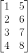

# 二、Python 中的科学计算工具

## Jupyter Notebooks

你可以按`[shift] + [Enter]`或按菜单中的“播放”按钮来运行单元格。


在`function(`后面按`[shift] + [tab]`，可以获得函数或对象的帮助。


你还可以通过执行`function?`获得帮助。


## NumPy 数组

操作`numpy`数组是 Python 机器学习（或者，实际上是任何类型的科学计算）的重要部分。 对大多数人来说，这可能是一个简短的回顾。 无论如何，让我们快速浏览一些最重要的功能。

```py
import numpy as np

# 设置随机种子来获得可重复性
rnd = np.random.RandomState(seed=123)

# 生成随机数组
X = rnd.uniform(low=0.0, high=1.0, size=(3, 5))  # a 3 x 5 array

print(X)
```

（请注意，NumPy 数组使用从 0 开始的索引，就像 Python 中的其他数据结构一样。）

```py
# 元素访问

# 获取单个元素
# （这里是第一行第一列的元素）
print(X[0, 0])

# 获取一行
# （这里是第二行）
print(X[1])

# 获取一列
# （这里是第二列）
print(X[:, 1])

# 数组转置
print(X.T)
```



```py
# 在指定的时间间隔内创建均匀间隔的数字的行向量。
y = np.linspace(0, 12, 5)
print(y)

# 将行向量转换为列向量
print(y[:, np.newaxis])

# 获得形状或改变数组形状

# 生成随机数组
rnd = np.random.RandomState(seed=123)
X = rnd.uniform(low=0.0, high=1.0, size=(3, 5))  # a 3 x 5 array

print(X.shape)

# 将 X 大小变为 (3, 5)
X_reshaped = X.reshape(5, 3)
print(X_reshaped)

# 使用整数数组的索引（花式索引）
indices = np.array([3, 1, 0])
print(indices)
X[:, indices]
```

还有很多东西要知道，但是这些操作对于我们在本教程中将要做的事情至关重要。

## SciPy 稀疏数组

我们不会在本教程中大量使用它们，但稀疏矩阵在某些情况下非常好用。 在一些机器学习任务中，尤其是与文本分析相关的任务，数据可能大多为零。 存储所有这些零是非常低效的，并且以仅包含“非零”值的方式表示可以更有效。 我们可以创建和操作稀疏矩阵，如下所示：

```py
# 创建一个包含大量零的随机数组
rnd = np.random.RandomState(seed=123)

X = rnd.uniform(low=0.0, high=1.0, size=(10, 5))
print(X)

# 将大多数元素设置为零
X[X < 0.7] = 0
print(X)
from scipy import sparse

# 将 X 转换为 CSR（压缩稀疏行）矩阵
X_csr = sparse.csr_matrix(X)
print(X_csr)

# 将稀疏矩阵转换为密集数组
print(X_csr.toarray())
```

（你可能偶然发现了一种将稀疏表示转换为密集表示的替代方法：`numpy.todense`；`toarray`返回一个 NumPy 数组，而`todense`返回一个 NumPy 矩阵。在本教程中，我们将使用 NumPy 数组，而不是矩阵；scikit-learn 不支持后者。）

CSR 表示对于计算非常有效，但它不适合添加元素。 为此，LIL（List-In-List）表示更好：

```py
# 创建一个空的 LIL 矩阵并添加一些项目
X_lil = sparse.lil_matrix((5, 5))

for i, j in np.random.randint(0, 5, (15, 2)):
    X_lil[i, j] = i + j

print(X_lil)
print(type(X_lil))

X_dense = X_lil.toarray()
print(X_dense)
print(type(X_dense))
```

通常，一旦创建了 LIL 矩阵，将其转换为 CSR 格式很有用（许多 scikit-learn 算法需要 CSR 或 CSC 格式）

```py
X_csr = X_lil.tocsr()
print(X_csr)
print(type(X_csr))
```

可用于各种问题的可用稀疏格式包括：

+   `CSR`（压缩稀疏行）
+   `CSC`（压缩稀疏列）
+   `BSR`（块稀疏行）
+   `COO`（坐标）
+   `DIA`（对角线）
+   `DOK`（键的字典）
+   `LIL`（列表中的列表）

[`scipy.sparse`](http://docs.scipy.org/doc/scipy/reference/sparse.html)子模块还有很多稀疏矩阵的函数，包括线性代数，稀疏求解器，图算法等等。

## Matplotlib

机器学习的另一个重要部分是数据可视化。 Python 中最常用的工具是[`matplotlib`](http://matplotlib.org/)。 这是一个非常灵活的包，我们将在这里介绍一些基础知识。

由于我们使用的是 Jupyter 笔记本，让我们使用 IPython 方便的内置“[魔术函数](https://ipython.org/ipython-doc/3/interactive/magics.html)”，即“`matoplotlib`内联”模式，它将直接在笔记本内部绘制图形。

```py
%matplotlib inline

import matplotlib.pyplot as plt

# 绘制直线
x = np.linspace(0, 10, 100)
plt.plot(x, np.sin(x));

# 散点图
x = np.random.normal(size=500)
y = np.random.normal(size=500)
plt.scatter(x, y);

# 使用 imshow 展示绘图
# - note that origin is at the top-left by default!

x = np.linspace(1, 12, 100)
y = x[:, np.newaxis]

im = y * np.sin(x) * np.cos(y)
print(im.shape)

plt.imshow(im);

# 轮廓图
# - 请注意，此处的原点默认位于左下角！
plt.contour(im);

# 3D 绘图
from mpl_toolkits.mplot3d import Axes3D
ax = plt.axes(projection='3d')
xgrid, ygrid = np.meshgrid(x, y.ravel())
ax.plot_surface(xgrid, ygrid, im, cmap=plt.cm.viridis, cstride=2, rstride=2, linewidth=0);
```

有许多可用的绘图类型。 探索它们的一个实用方法是查看matplotlib库。

你可以在笔记本中轻松测试这些示例：只需复制每页上的源代码链接，然后使用`%load magic`将其放入笔记本中。 例如：

```py
# %load http://matplotlib.org/mpl_examples/pylab_examples/ellipse_collection.py
```
