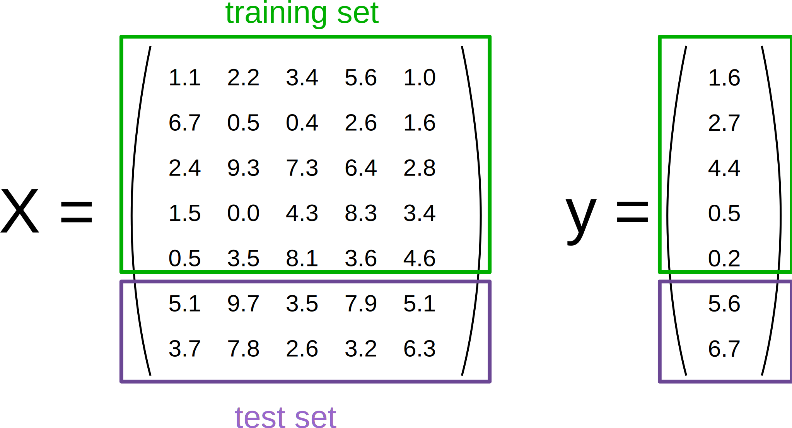

# 四、训练和测试数据

为了评估我们的监督模型的泛化能力，我们可以将数据分成训练和测试集：



```py
from sklearn.datasets import load_iris

iris = load_iris()
X, y = iris.data, iris.target
```

考虑如何正常执行机器学习，训练/测试分割的想法是有道理的。真实世界系统根据他们拥有的数据进行训练，当其他数据进入时（来自客户，传感器或其他来源），经过训练的分类器必须预测全新的数据。我们可以在训练期间使用训练/测试分割来模拟 - 测试数据是“未来数据”的模拟，它将在生产期间进入系统。

特别是对于鸢尾花，其中的 150 个标签是有序的，这意味着如果我们使用比例分割来分割数据，这将导致类分布基本上改变。例如，如果我们执行常见的 2/3 训练数据和 1/3 测试数据的分割，我们的训练数据集将仅包含类别 0 和 1（Setosa 和 Versicolor），我们的测试集将仅包含类别标签为 2 的样本（Virginica）。

假设所有样本彼此独立（而不是时间序列数据），我们希望在分割数据集之前随机打乱数据集。

现在我们需要将数据分成训练和测试集。 幸运的是，这是机器学习中常见的模式，scikit-learn 具有预先构建的函数，可以将数据分成训练和测试集。 在这里，我们使用 50% 的数据来训练，50% 来测试。 80% 和 20% 是另一种常见的分割，但没有严格的规则。 最重要的是，要在训练期间未见过的数据上，公平地评估您的系统！

```py
from sklearn.model_selection import train_test_split

train_X, test_X, train_y, test_y = train_test_split(X, y, 
                                                    train_size=0.5,
                                                    test_size=0.5,
                                                    random_state=123)
print("Labels for training data:")
print(train_y)

print("Labels for test data:")
print(test_y)
```

提示：分层分割

特别是对于相对较小的数据集，最好分层分割。 分层意味着我们在测试和训练集中保持数据集的原始类比例。 例如，在我们随机拆分前面的代码示例中所示的数据集之后，我们的类比例（百分比）如下：

```py
print('All:', np.bincount(y) / float(len(y)) * 100.0)
print('Training:', np.bincount(train_y) / float(len(train_y)) * 100.0)
print('Test:', np.bincount(test_y) / float(len(test_y)) * 100.0)
```

因此，为了分层分割，我们可以将`label`数组作为附加选项传递给`train_test_split`函数：

```py
train_X, test_X, train_y, test_y = train_test_split(X, y, 
                                                    train_size=0.5,
                                                    test_size=0.5,
                                                    random_state=123,
                                                    stratify=y)

print('All:', np.bincount(y) / float(len(y)) * 100.0)
print('Training:', np.bincount(train_y) / float(len(train_y)) * 100.0)
print('Test:', np.bincount(test_y) / float(len(test_y)) * 100.0)
```

通过在训练过程中看到的数据上评估我们的分类器性能，我们可能对模型的预测能力产生错误的信心。 在最坏的情况下，它可能只是记住训练样本，但完全没有分类新的类似样本 - 我们真的不想将这样的系统投入生产！

不使用相同的数据集进行训练和测试（这称为“重取代评估”），为了估计训练模型对新数据的效果，使用训练/测试分割要好得多。

```py
from sklearn.neighbors import KNeighborsClassifier

classifier = KNeighborsClassifier().fit(train_X, train_y)
pred_y = classifier.predict(test_X)

print("Fraction Correct [Accuracy]:")
print(np.sum(pred_y == test_y) / float(len(test_y)))
```

我们还可以可视化正确的预测......

```py
print('Samples correctly classified:')
correct_idx = np.where(pred_y == test_y)[0]
print(correct_idx)
```

...以及错误的预测。

```py
print('Samples incorrectly classified:')
incorrect_idx = np.where(pred_y != test_y)[0]
print(incorrect_idx)

# 绘制两个维度

for n in np.unique(test_y):
    idx = np.where(test_y == n)[0]
    plt.scatter(test_X[idx, 1], test_X[idx, 2], label="Class %s" % str(iris.target_names[n]))

plt.scatter(test_X[incorrect_idx, 1], test_X[incorrect_idx, 2], color="darkred")

plt.xlabel('sepal width [cm]')
plt.ylabel('petal length [cm]')
plt.legend(loc=3)
plt.title("Iris Classification results")
plt.show()
```

我们可以看到错误发生在绿色（类 1）和灰色（类 2）重叠的区域。 这使我们能够深入了解需要添加的特征 - 任何有助于分离类 1 和类 2 的特征都应该提高分类器的表现。

> 练习
> 
> 打印3个错误预测的真实标签，并修改我们上面使用的散点图代码，来在 2D 散点图中用不同的标记可视化和区分这三个样本。 你能解释为什么我们的分类器做出了这些错误的预测吗？

```py
# %load solutions/04_wrong-predictions.py
```
