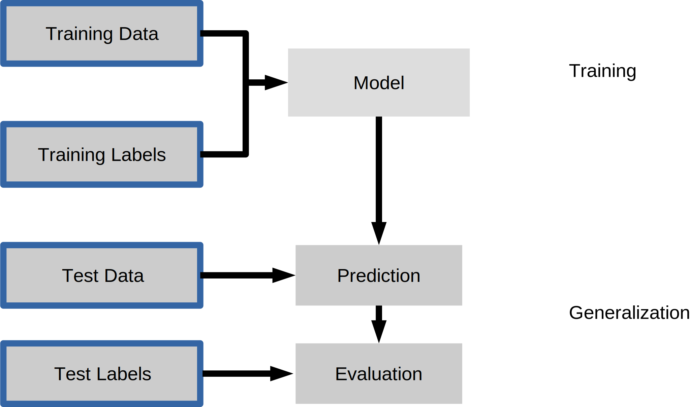

# 五、监督学习第一部分：分类

为了可视化机器学习算法的工作原理，研究二维或一维数据（即只有一个或两个特征的数据）通常很有帮助。 实际上，数据集通常具有更多特征，很难在二维屏幕上绘制高维数据。

在我们转向更多“真实世界”的数据集之前，我们将展示一些非常简单的示例。

首先，我们将从二维来看二分类问题。 我们使用`make_blobs`函数生成人造数据。

```py
from sklearn.datasets import make_blobs

X, y = make_blobs(centers=2, random_state=0, cluster_std=1.5)

print('X ~ n_samples x n_features:', X.shape)
print('y ~ n_samples:', y.shape)

print('First 5 samples:\n', X[:5, :])

print('First 5 labels:', y[:5])
```

由于数据是二维的，我们可以将每个样本绘制为二维坐标系中的一个点，第一个特征是`x`轴，第二个特征是`y`轴。

```py
plt.figure(figsize=(8, 8))
plt.scatter(X[y == 0, 0], X[y == 0, 1], s=40, label='0')
plt.scatter(X[y == 1, 0], X[y == 1, 1], s=40, label='1',
            marker='s')

plt.xlabel('first feature')
plt.ylabel('second feature')
plt.legend(loc='upper right');
```

分类是一项监督任务，由于我们对其在未见过的数据上的表现感兴趣，因此我们将数据分为两部分：

+   训练集，学习算法用它来拟合模型
+   测试集，用于评估模型的泛化性能

来自`model_selection`模块的`train_test_split`函数为我们做了这个 - 我们将使用它，将数据集拆分为 75% 的训练数据和 25% 的测试数据。


```py
from sklearn.model_selection import train_test_split

X_train, X_test, y_train, y_test = train_test_split(X, y,
                                                    test_size=0.25,
                                                    random_state=1234,
                                                    stratify=y)
```

## scikit-learn 估计器 API



scikit-learn 中的每个算法都通过“估计器”对象提供。 （scikit-learn 中的所有模型都具有非常一致的接口）。 例如，我们首先导入逻辑回归类。

```py
from sklearn.linear_model import LogisticRegression
```

下面，我们实例化估计器对象。

```py
classifier = LogisticRegression()
X_train.shape
y_train.shape
```

为了从我们的数据构建模型，即学习如何分类新的点，我们使用训练数据，以及相应的训练标签（训练数据点的所需输出）调用`fit`函数：

```py
classifier.fit(X_train, y_train)
```

（默认情况下，一些估计方法如`fit`返回`self`。因此，在执行上面的代码片段之后，你将看到`LogisticRegression`的特定实例的默认参数。另一种获取估计器的初始化参数的方法是执行`classifier.get_params()`，返回参数字典。）

然后，我们可以将模型应用于未见过的数据，并使用模型使用`predict`方法预测估计的结果：

```py
prediction = classifier.predict(X_test)
```

我们可以将它们与真实标签比较：

```py
print(prediction)
print(y_test)
```

通过测量预测的正确比例，我们可以定量评估我们的分类器。这称为准确度：

```py
np.mean(prediction == y_test)
```

还有一个便利函数，`score`，所有 scikit-learn 分类器必须直接从测试数据计算：

```py
classifier.score(X_test, y_test)
```

将（测试集上的）泛化表现与训练集上的表现进行比较通常很有帮助：

```py
classifier.score(X_train, y_train)
```

`LogisticRegression`是一种所谓的线性模型，这意味着它将在输入空间中创建线性决策。 在 2d 中，这只是意味着它找到一条线来将蓝色与红色分开：

```py
from figures import plot_2d_separator

plt.scatter(X[y == 0, 0], X[y == 0, 1], s=40, label='0')
plt.scatter(X[y == 1, 0], X[y == 1, 1], s=40, label='1', marker='s')

plt.xlabel("first feature")
plt.ylabel("second feature")
plot_2d_separator(classifier, X)
plt.legend(loc='upper right');
```

估计参数：所有估计模型的参数都是以下划线结尾的，估计器对象的属性。 这里是直线的系数和偏移量：

```py
print(classifier.coef_)
print(classifier.intercept_)
```

## 另一个分类器：K 最近邻

另一种流行且易于理解的分类器是 K 最近邻（kNN）。 它有一个最简单的学习策略：给出一个新的，未知的观侧值，在你的参考数据库中查找，哪些具有最接近的特征并分配优势类别。

接口与上面的`LogisticRegression`完全相同。

```py
from sklearn.neighbors import KNeighborsClassifier
```

这次我们设置`KNeighborsClassifier`的参数，告诉它我们只想查看 30 个最近的邻居：

```py
knn = KNeighborsClassifier(n_neighbors=30)
```

我们使用训练数据拟合模型：

```py
knn.fit(X_train, y_train)

plt.scatter(X_train[y_train == 0, 0], X_train[y_train == 0, 1],
            s=40, label='0')
plt.scatter(X_train[y_train == 1, 0], X_train[y_train == 1, 1],
            s=40, label='1', marker='s')

plt.xlabel("first feature")
plt.ylabel("second feature")
plot_2d_separator(knn, X)
plt.legend(loc='upper right');

knn.score(X_train, y_train)

plt.scatter(X_test[y_test == 0, 0], X_test[y_test == 0, 1],
            s=40, label='0')
plt.scatter(X_test[y_test == 1, 0], X_test[y_test == 1, 1],
            s=40, label='1', marker='s')

plt.xlabel("first feature")
plt.ylabel("second feature")
plot_2d_separator(knn, X)
plt.legend(loc='upper right');

knn.score(X_test, y_test)
```

> 练习
> 
> 将`KNeighborsClassifier`应用于鸢尾花数据集。 玩转`n_neighbors`的不同值，观察训练和测试得分的变化情况。
