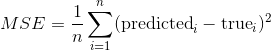

# 六、监督学习第二部分：回归分析

在回归中，我们试图预测连续输出变量 - 而不是我们在之前的分类示例中预测的标称变量。

让我们从一个简单的玩具示例开始，其中包含一个特征维度（解释性变量）和一个目标变量。 我们将使用一些噪声从正弦曲线创建数据集：

```py
x = np.linspace(-3, 3, 100)
print(x)

rng = np.random.RandomState(42)
y = np.sin(4 * x) + x + rng.uniform(size=len(x))

plt.plot(x, y, 'o');
```

## 线性回归

我们将介绍的第一个模型是所谓的简单线性回归。 在这里，我们想要为数据拟合一条直线。

最简单的模型之一是线性模型，它只是试图预测数据位于一条线上。 找到这样一条直线的一种方法是`LinearRegression`（也称为普通最小二乘（OLS）回归）。 `LinearRegression`的接口与之前的分类器完全相同，只是`y`现在包含浮点值而不是类别。

我们记得，scikit-learn API 要求我们将目标变量（`y`）提供为一维数组; scikit-learn 的 API 期望样本（`X`）是个二维数组 - 即使它可能只包含一个特征。 因此，让我们将 1 维 NumPy 数组`x`转换为具有 2 个轴的数组`X`：

```py
print('Before: ', x.shape)
X = x[:, np.newaxis]
print('After: ', X.shape)
```

同样，我们首先将数据集拆分为训练（75%）和测试集（25%）：

```py
from sklearn.model_selection import train_test_split

X_train, X_test, y_train, y_test = train_test_split(X, y, test_size=0.25, random_state=42)
```

接下来，我们使用`LinearRegression`中实现的学习算法使回归模型拟合训练数据：

```py
from sklearn.linear_model import LinearRegression

regressor = LinearRegression()
regressor.fit(X_train, y_train)
```

在拟合训练数据后，我们使用以下值来参数化线性回归模型。

```py
print('Weight coefficients: ', regressor.coef_)
print('y-axis intercept: ', regressor.intercept_)
```

由于我们的回归模型是线性模型，因此目标变量（`y`）和特征变量（`x`）之间的关系定义为：

```
y = weight × x + intercept
```

将最小值和最大值插入这个公式，我们可以绘制拟合我们的训练数据的回归：

```py
min_pt = X.min() * regressor.coef_[0] + regressor.intercept_
max_pt = X.max() * regressor.coef_[0] + regressor.intercept_

plt.plot([X.min(), X.max()], [min_pt, max_pt])
plt.plot(X_train, y_train, 'o');
```

与之前笔记本中的分类估计器类似，我们使用`predict`方法来预测目标变量。 我们希望这些预测值落在我们之前绘制的直线上：

```py
y_pred_train = regressor.predict(X_train)

plt.plot(X_train, y_train, 'o', label="data")
plt.plot(X_train, y_pred_train, 'o', label="prediction")
plt.plot([X.min(), X.max()], [min_pt, max_pt], label='fit')
plt.legend(loc='best')
```

我们在上图中看到，直线能够捕获数据的一般斜率，但没有太多细节。

接下来，让我们试试测试集：

```py
y_pred_test = regressor.predict(X_test)

plt.plot(X_test, y_test, 'o', label="data")
plt.plot(X_test, y_pred_test, 'o', label="prediction")
plt.plot([X.min(), X.max()], [min_pt, max_pt], label='fit')
plt.legend(loc='best');
```

同样，scikit-learn 提供了一种简便方法，使用`score`方法定量评估预测。 对于回归任务，这是 R2 得分。 另一种流行的方式是均方差（MSE）。 顾名思义，MSE 只是预测和实际目标值的均方差。



```py
regressor.score(X_test, y_test)
```

> 练习
> 
> 将（非线性）特征`sin(4x)`添加到`X`并将重新拟合`X_train`（和`X_test`）。 使用这个新的更丰富的还是线性的模型可视化预测。
> 提示：你可以使用`np.concatenate(A, B, axis=1)`将两个矩阵`A`和`B`水平连接（来组合列）。

```py
# %load solutions/06B_lin_with_sine.py
```

## `KNeighborsRegression`

就像分类一样，我们也可以使用基于邻居的方法来回归。 我们可以简单地获取最近点的输出，或者我们可以平均几个最近点。 这种方法不像分类那样流行于回归，但仍然是一个很好的基线。

```py
from sklearn.neighbors import KNeighborsRegressor
kneighbor_regression = KNeighborsRegressor(n_neighbors=1)
kneighbor_regression.fit(X_train, y_train)
```

再次，让我们看一下训练和测试集的行为：

```py
y_pred_train = kneighbor_regression.predict(X_train)

plt.plot(X_train, y_train, 'o', label="data", markersize=10)
plt.plot(X_train, y_pred_train, 's', label="prediction", markersize=4)
plt.legend(loc='best');
```

在训练集上，我们做得很好：每个点都是它自己最近的邻居！

```py
y_pred_test = kneighbor_regression.predict(X_test)

plt.plot(X_test, y_test, 'o', label="data", markersize=8)
plt.plot(X_test, y_pred_test, 's', label="prediction", markersize=4)
plt.legend(loc='best');
```

在测试集上，我们也更好地捕捉变化，但我们的估计看起来比以前更加混乱。 我们来看看 R2 得分：

```py
kneighbor_regression.score(X_test, y_test)
```

比以前好多了！ 在这里，线性模型不适合我们的问题；它缺乏复杂性，因此不适合我们的数据。

> 练习
> 
> 在波士顿住房数据集中，比较`KNeighborsRegressor`和`LinearRegression`。 你可以使用`sklearn.datasets.load_boston`加载数据集。 你可以通过阅读`DESCR`属性来了解数据集。

```py
# %load solutions/06A_knn_vs_linreg.py
```
