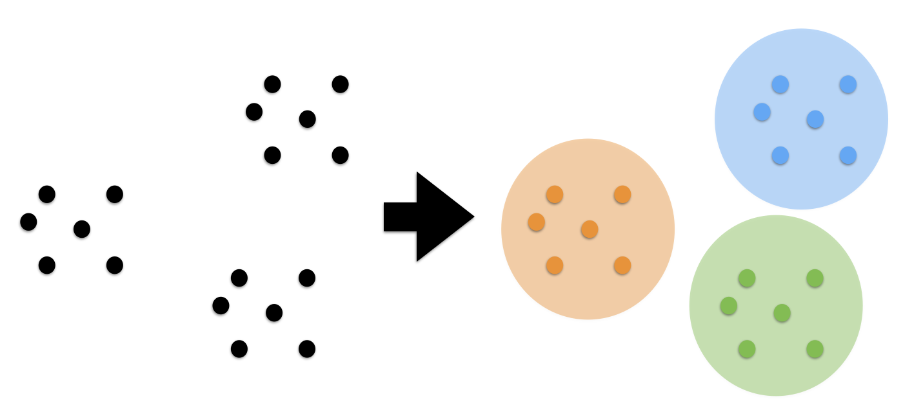

# 八、无监督学习第二部分：聚类

聚类是根据一些预定义的相似性或距离（相异性）度量（例如欧氏距离），将样本收集到相似样本分组中的任务。



在本节中，我们将在一些人造和真实数据集上，探讨一些基本聚类任务。

以下是聚类算法的一些常见应用：

+   用于数据减少的压缩
+   将数据汇总为推荐系统的再处理步骤
+   相似性：
    +   分组相关的网络新闻（例如 Google 新闻）和网络搜索结果
    +   为投资组合管理分组相关股票报价
    +   为市场分析建立客户档案
+   为无监督特征提取构建原型样本的代码簿

让我们从创建一个简单的二维人造数据集开始：

```py
from sklearn.datasets import make_blobs

X, y = make_blobs(random_state=42)
X.shape

plt.figure(figsize=(8, 8))
plt.scatter(X[:, 0], X[:, 1])
```

在上面的散点图中，我们可以看到三组不同的数据点，我们希望使用聚类来恢复它们 - 想一想“检测”类标签，我们在分类任务中认为它们是理所当然的。

即使这些分组在数据中是显而易见的，当数据存在于高维空间中时很难发现它们，我们无法在单个直方图或散点图中可视化。

现在我们将使用最简单的聚类算法之一，K-means。 这是一种迭代算法，其搜索三个簇中心，使得从每个点到其簇中心的距离最小。 K-means 的标准实现使用欧几里德距离，这就是为什么，如果我们使用真实世界的数据集，我们要确保所有变量都以相同的比例进行测量。 在之前的笔记本中，我们讨论了实现这一目标的一种技术，即标准化。

> 问题
> 
> 你期望输出看起来像什么？

```py
from sklearn.cluster import KMeans

kmeans = KMeans(n_clusters=3, random_state=42)
```

我们可以通过调用`fit`然后访问`KMeans`估计器的`labels_`属性，或者通过调用`fit_predict`来获取簇标签。 无论哪种方式，结果都包含分配给每个点的簇的 ID。

```py
labels = kmeans.fit_predict(X)

labels

np.all(y == labels)
```

让我们可视化已发现的分配：

```py
plt.figure(figsize=(8, 8))
plt.scatter(X[:, 0], X[:, 1], c=labels)
```

与真实标签相比：

```py
plt.figure(figsize=(8, 8))
plt.scatter(X[:, 0], X[:, 1], c=y)
```

在这里，我们可能对聚类结果感到满意。 但总的来说，我们可能希望具有更加量化的评估。 如何将我们的簇标签与生成 blob 时得到的真实情况进行比较？

```py
from sklearn.metrics import confusion_matrix, accuracy_score

print('Accuracy score:', accuracy_score(y, labels))
print(confusion_matrix(y, labels))

np.mean(y == labels)
```

> 练习
> 在查看“真实”标签数组`y`，以及上面的散点图和`labels`之后，你能理解为什么我们的计算精度为 0.0 而不是 1.0 吗，你能解决它吗？

即使我们完全恢复了数据的簇划分，我们分配的簇 ID 也是任意的，我们不能希望恢复它们。 因此，我们必须使用不同的评分指标，例如`adjusted_rand_score`，它对标签的排列不变：

```py
from sklearn.metrics import adjusted_rand_score

adjusted_rand_score(y, labels)
```

K-means 的“缺点”之一是我们必须指定簇的数量，这是我们通常事先不知道的。 例如，让我们看一下如果我们在人造 3-blob 数据集中，将簇数设置为 2 会发生什么：

```py
kmeans = KMeans(n_clusters=2, random_state=42)
labels = kmeans.fit_predict(X)
plt.figure(figsize=(8, 8))
plt.scatter(X[:, 0], X[:, 1], c=labels)

kmeans.cluster_centers_
```

## Elbow 方法

Elbow方法是一种“经验法则”，用于查找最佳簇数。 在这里，我们看一下不同 k 值的聚类散度：

```py
distortions = []
for i in range(1, 11):
    km = KMeans(n_clusters=i, 
                random_state=0)
    km.fit(X)
    distortions.append(km.inertia_)

plt.plot(range(1, 11), distortions, marker='o')
plt.xlabel('Number of clusters')
plt.ylabel('Distortion')
plt.show()
```

然后，我们选择类似“elbow 的凹陷”的值。 我们可以看到，在这种情况下，这是`k = 3`，给定我们先前对数据集的视觉预期，这是有意义的。

聚类具有以下假设：聚类算法通过假设样本应该分组到一起，来找到簇。 每种算法都会做出不同的假设，结果的质量和可解释性将取决于你的目标是否满足假设。 对于 K 均值聚类，模型是所有簇具有相等的球形方差。

通常，无法保证聚类算法找到的结构，与你感兴趣的内容有任何关系。

我们可以轻松地创建一个数据集，具有非各向同性的簇的，其中 kmeans 将失败：

```py
plt.figure(figsize=(12, 12))

n_samples = 1500
random_state = 170
X, y = make_blobs(n_samples=n_samples, random_state=random_state)

# 簇的数量不正确
y_pred = KMeans(n_clusters=2, random_state=random_state).fit_predict(X)

plt.subplot(221)
plt.scatter(X[:, 0], X[:, 1], c=y_pred)
plt.title("Incorrect Number of Blobs")

# 各向异性分布的数据
transformation = [[0.60834549, -0.63667341], [-0.40887718, 0.85253229]]
X_aniso = np.dot(X, transformation)
y_pred = KMeans(n_clusters=3, random_state=random_state).fit_predict(X_aniso)

plt.subplot(222)
plt.scatter(X_aniso[:, 0], X_aniso[:, 1], c=y_pred)
plt.title("Anisotropicly Distributed Blobs")

# 不同的方差
X_varied, y_varied = make_blobs(n_samples=n_samples,
                                cluster_std=[1.0, 2.5, 0.5],
                                random_state=random_state)
y_pred = KMeans(n_clusters=3, random_state=random_state).fit_predict(X_varied)

plt.subplot(223)
plt.scatter(X_varied[:, 0], X_varied[:, 1], c=y_pred)
plt.title("Unequal Variance")

# 大小不均匀的 blobs
X_filtered = np.vstack((X[y == 0][:500], X[y == 1][:100], X[y == 2][:10]))
y_pred = KMeans(n_clusters=3,
                random_state=random_state).fit_predict(X_filtered)

plt.subplot(224)
plt.scatter(X_filtered[:, 0], X_filtered[:, 1], c=y_pred)
plt.title("Unevenly Sized Blobs")
```

## 一些值得注意的聚类例程

以下是两种众所周知的聚类算法。

+   `sklearn.cluster.KMeans`：
    最简单但有效的聚类算法。需要事先提供簇数，并假设数据为输入而标准化（但使用 PCA 模型作为预处理器）。
+   `sklearn.cluster.MeanShift`：
    可以找到比 KMeans 更好看的簇，但不能扩展到大量样本。
+   `sklearn.cluster.DBSCAN`：
    可以基于密度检测不规则形状的簇，即输入空间中的稀疏区域可能变成簇间边界。还可以检测异常值（不属于簇的样本）。
+   `sklearn.cluster.AffinityPropagation`：
    基于数据点间消息传递的聚类算法。
+   `sklearn.cluster.SpectralClustering`：
    应用于归一化图拉普拉斯算子的投影的 KMeans：如果亲和度矩阵被解释为图的邻接矩阵，则找到归一化的图切割。
+   `sklearn.cluster.Ward`：
    `Ward`基于`Ward`算法实现层次聚类，`Ward`算法是一种方差最小化方法。在每个步骤中，它最小化所有簇内的平方差异的总和（惯性标准）。

其中，`Ward`，`SpectralClustering`，`DBSCAN`和`AffinityPropagation`也可以与预先计算的相似性矩阵一起使用。


> 练习：数字聚类
> 
> 对数字数据执行 K-means 聚类，搜索十个簇。 将簇中心可视化为图像（即，将每个聚类中心形状变为 8x8 并使用`plt.imshow`。）簇是否与特定数字相关？ 什么是`adjusted_rand_score`？
> 可视化上个笔记本中的投影数字，但这次使用簇标签作为颜色。你注意到了什么？

```py
from sklearn.datasets import load_digits
digits = load_digits()
# ...

# %load solutions/08B_digits_clustering.py
```
