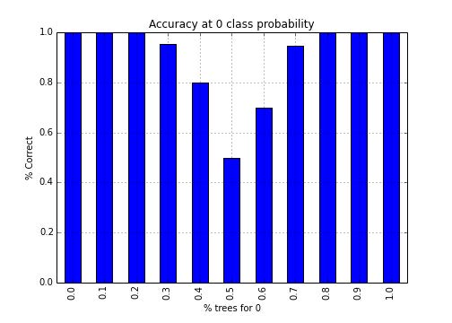
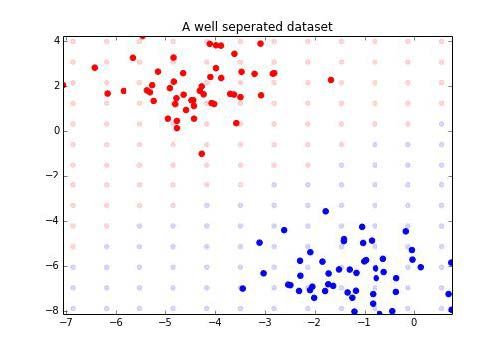
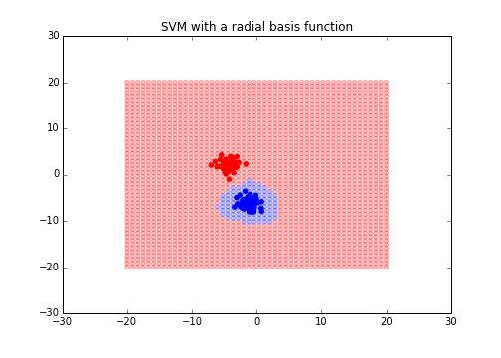

# 第四章 使用 scikit-learn 对数据分类

> 作者：Trent Hauck

> 译者：[飞龙](https://github.com/wizardforcel)

> 协议：[CC BY-NC-SA 4.0](http://creativecommons.org/licenses/by-nc-sa/4.0/)

分类在大量语境下都非常重要。例如，如果我们打算自动化一些决策过程，我们可以利用分类。在我们需要研究诈骗的情况下，有大量的事务，人去检查它们是不实际的。所以，我们可以使用分类都自动化这种决策。

## 4.1 使用决策树实现基本的分类

这个秘籍中，我们使用决策树执行基本的分类。它们是非常不错的模型，因为它们很易于理解，并且一旦训练完成，评估就很容易。通常可以使用 SQL 语句，这意味着结果可以由许多人使用。

## 准备

这个秘籍中，我们会看一看决策树。我喜欢将决策树看做基类，大量的模型从中派生。它是个非常简单的想法，但是适用于大量的情况。

首先，让我们获取一些分类数据，我们可以使用它来练习：

```py
>>> from sklearn import datasets 
>>> X, y = datasets.make_classification(n_samples=1000, n_features=3,
                                        n_redundant=0)
```

### 操作步骤

处理决策树非常简单。我们首先需要导入对象，之后训练模型：

```py

>>> from sklearn.tree import DecisionTreeClassifier 
>>> dt = DecisionTreeClassifier() 
>>> dt.fit(X, y) DecisionTreeClassifier(compute_importances=None, criterion='gini',
                        max_depth=None, max_features=None,
                        max_leaf_nodes=None, min_density=None,
                        min_samples_leaf=1, min_samples_split=2,
                        random_state=None, splitter='best')
>>> preds = dt.predict(X) 
>>> (y == preds).mean() 
1.0
```

你可以看到，我们猜测它是正确的。显然，这只是凑合着运行。现在我们研究一些选项。

首先，如果你观察`dt`对象，它拥有多种关键字参数，决定了对象的行为。我们如何选择对象十分重要，所以我们要详细观察对象的效果。

我们要观察的第一个细节是`max_depth`。这是个重要的参数，决定了允许多少分支。这非常重要，因为决策树需要很长时间来生成样本外的数据，它们带有一些类型的正则化。之后，我们会看到，我们如何使用多种浅层决策树，来生成更好的模型。让我们创建更复杂的数据集并观察当我们允许不同`max_depth`时会发生什么。我们会将这个数据及用于剩下的秘籍。


```py

>>> n_features=200 
>>> X, y = datasets.make_classification(750, n_features,
                                        n_informative=5) 
>>> import numpy as np 
>>> training = np.random.choice([True, False], p=[.75, .25],
                                size=len(y))

>>> accuracies = []

>>> for x in np.arange(1, n_features+1): 
>>> dt = DecisionTreeClassifier(max_depth=x)    
>>> dt.fit(X[training], y[training])    
>>> preds = dt.predict(X[~training])    
>>> accuracies.append((preds == y[~training]).mean())

>>> import matplotlib.pyplot as plt

>>> f, ax = plt.subplots(figsize=(7, 5))

>>> ax.plot(range(1, n_features+1), accuracies, color='k')

>>> ax.set_title("Decision Tree Accuracy") 
>>> ax.set_ylabel("% Correct") 
>>> ax.set_xlabel("Max Depth")

```

输出如下：


我们可以看到，我们实际上在较低最大深度处得到了漂亮的准确率。让我们进一步看看低级别的准确率，首先是 15：

```py
>>> N = 15 
>>> import matplotlib.pyplot as plt 
>>> f, ax = plt.subplots(figsize=(7, 5))
>>> ax.plot(range(1, n_features+1)[:N], accuracies[:N], color='k')
>>> ax.set_title("Decision Tree Accuracy") 
>>> ax.set_ylabel("% Correct") 
>>> ax.set_xlabel("Max Depth")

```

输出如下：


这个就是我们之前看到的峰值。比较令人惊讶的是它很快就下降了。最大深度 1 到 3 可能几乎是相等的。决策树很擅长分离规则，但是需要控制。

我们观察`compute_importances`参数。对于随机森林来说，它实际上拥有更广泛的含义。但是我们要更好地了解它。同样值得注意的是，如果你使用了 0.16 或之前的版本，你可以尽管这样做：

```py

>>> dt_ci = DecisionTreeClassifier(compute_importances=True) 
>>> dt.fit(X, y)
#plot the importances 
>>> ne0 = dt.feature_importances_ != 0

>>> y_comp = dt.feature_importances_[ne0] 
>>> x_comp = np.arange(len(dt.feature_importances_))[ne0]

>>> import matplotlib.pyplot as plt

>>> f, ax = plt.subplots(figsize=(7, 5)) 
>>> ax.bar(x_comp, y_comp)
```

输出如下：


> 要注意，你可能会得到一个错误，让你知道你不再需要显式设置`compute_importances`。

我们看到，这些特征之一非常重要，后面跟着几个其它特征。

### 工作原理

简单来说，我们所有时间都在构造决策树。当思考场景以及将概率分配给结果时，我们构造了决策树。我们的规则更加复杂，并涉及很多上下文，但是使用决策树，我们关心的所有东西都是结果之间的差异，假设特征的一些信息都是已知的。

现在，让我们讨论熵和基尼系数之间的差异。

熵不仅仅是给定变量的熵值，如果我们知道元素的值，它表示了熵中的变化。这叫做信息增益（IG），数学上是这样：

```
IG(Data,KnownFeatures) = H(Data) - H(Data|KnownFeatures)
```

对于基尼系数，我们关心的是，提供新的信息，一个数据点有多可能被错误标记。

熵和基尼系数都有优缺点。也就是说，如果你观察它们工作方式的主要差异，这可能是个重新验证你的假设的好方式。

## 4.2 调整决策树模型

如果我们仅仅使用基本的决策树实现，可能拟合得不是很好。所以我们需要调参，以便获得更好的拟合。这非常简单，并且不用花费什么精力。

### 准备

这个秘籍中，我们深入了解如何调整决策树分类器。有几个渲染，并且在上一个秘籍中，我们仅仅查看了它们之一。

我们会训练一个基本的模型，并实际观察决策树是什么样子。之后，我们会重新检测每个决策，并且指出不同的修改如何影响结构。

如果你打算遵循这个秘籍，需要安装`pydot`。

### 操作步骤

比起其它算法，决策树有许多“把手”，因为我们旋转把手时，易于发现发生了什么。

```py
>>> from sklearn import datasets 
>>> X, y = datasets.make_classification(1000, 20, n_informative=3)
>>> from sklearn.tree import DecisionTreeClassifier 
>>> dt = DecisionTreeClassifier() 
>>> dt.fit(X, y) 
```

好的，所以既然我们训练了基本的分类器，我们可以快速地查看它：

```py
>>> from StringIO import StringIO
>>> from sklearn import tree 
>>> import pydot
>>> str_buffer = StringIO() 
>>> tree.export_graphviz(dt, out_file=str_buffer) 
>>> graph = pydot.graph_from_dot_data(str_buffer.getvalue()) 
>>> graph.write("myfile.jpg")
```

这张图几乎难以辨认，但是这展示了一颗复杂的树，它可以使用非最优的决策树，作为结果生成。


哇哦！这是个非常复杂的树，看上去对数据过拟合了。首先，让我们降低最大深度值：

```py
>>> dt = DecisionTreeClassifier(max_depth=5) 
>>> dt.fit(X, y); 
```

顺带一说，如果你想知道为什么能看到分号，通常是`repr`，它实际上是决策树的模型。例如`fit`函数实际上返回决策树对象，它允许链式调用：

```py
>>> dt = DecisionTreeClassifier(max_depth=5).fit(X, y) 
```

现在，让我们返回正常的程序。

由于我们会多次绘制它，我们创建一个函数。


```py
>>> def plot_dt(model, filename):
       str_buffer = StringIO() 
>>> tree.export_graphviz(model, out_file=str_buffer)    
>>> graph = pydot.graph_from_dot_data(str_buffer.getvalue()) 
>>> graph.write_jpg(filename)
>>> plot_dt(dt, "myfile.png")

```

会生成下面的图：


这棵树稍微简单了一些。让我们看看，如果我们将熵用作分割标准，会发生什么：

```py
>>> dt = DecisionTreeClassifier(criterion='entropy',
                                 max_depth=5).fit(X, y) 
>>> plot(dt, "entropy.png") 
```

会生成下面的图：


很容易看到，前两个分割是相同特征，之后的分割以相似总数分布。这是个良好的合理的检查。

同样，注意第一个分割的熵是 0.999，但是使用基尼系数的时候是 0.5。我们需要弄清楚，决策树的分割的两种度量有什么不同。更多信息请见下面的工作原理一节。但是，如果我们想要使用熵穿件决策树，我们必须使用下列命令：

```py
>>> dt = DecisionTreeClassifier(min_samples_leaf=10,
                                criterion='entropy',
                                max_depth=5).fit(X, y)

```

### 工作原理

决策树，通常容易出现过拟合。由于它的自身特性，决策树经常会过拟合，所以，我们需要思考，如何避免过拟合，这是为了避免复杂性。实战中，简单的模型通常会执行得更好。

我们即将在实战中看到这个理念。随机森林会在简单模型的理念上构建。

## 4.3 使用许多决策树 -- 随机森林

这个秘籍中，我们会将随机森林用于分类任务。由于随机森林对于过拟合非常健壮，并且在大量场景中表现良好，所以使用它。

### 准备

我们会在工作原理一节中深入探索，但是随即森林通过构造大量浅层树，之后让每颗树为分类投票，再选取投票结果。这个想法在机器学习中十分有效。如果我们发现简单训练的分类器只有 60% 的准确率，我们可以训练大量分类器，它们通常是正确的，并且随后一起使用它们。

### 操作步骤

训练随机森林分类器的机制在 Scikit 中十分容易。这一节中，我们执行以下步骤：


1.  创建用于练习的样例数据集

2.  训练基本的随机森林对象

3.  看一看训练对象的一些属性

下一个秘籍中，我们会观察如何调整随机森林分类器，让我们以导入数据集来开始：

```py
>>> from sklearn import datasets 
```

之后，使用 1000 个样例创建数据集：

```py
>>> X, y = datasets.make_classification(1000) 
```

既然我们拥有了数据，我们可以创建分类器对象并训练它：

```py
>>> from sklearn.ensemble import RandomForestClassifier
>>> rf = RandomForestClassifier()
>>> rf.fit(X, y) 
```

我们想做的第一件事，就是看看如何拟合训练数据。我们可以将`predict `方法用于这些东西：

```py
>>> print "Accuracy:\t", (y == rf.predict(X)).mean() 
Accuracy:   0.993
>>> print "Total Correct:\t", (y == rf.predict(X)).sum() Total 
Correct:   993 
```

现在，让我们查看一些属性和犯法。

首先，我们查看一些实用属性。这里，由于我们保留默认值，它们是对象的默认值：

+   `rf.criterion`：这是决定分割的标准。默认是`gini`。

+   `rf.bootstrap`：布尔值，表示在训练随机森林时是否使用启动样例

+   `rf.n_jobs`：训练和预测的任务数量。如果你打算使用所有处理器，将其设置为`-1`。要记住，如果你的数据集不是非常大，使用过多任务通常会导致浪费，因为处理器之间需要序列化和移动。

+   `rf.max_features`：这表示执行最优分割时，考虑的特征数量。在调参过程中这会非常方便。

+   `rf.conpute_importtances`：这有助于我们决定，是否计算特征的重要性。如何使用它的信息，请见更多一节。

+   `rf.max_depth`：这表示树的深度。

有许多属性需要注意，更多信息请查看官方文档。

不仅仅是`predect`方法很实用，我们也可以从独立的样子获取概率。这是个非常实用的特性，用于理解每个预测的不确定性。例如，我们可以预测每个样例对于不同类的概率。

```py
>>> probs = rf.predict_proba(X)
>>> import pandas as pd
>>> probs_df = pd.DataFrame(probs, columns=['0', '1']) >>> probs_df['was_correct'] = rf.predict(X) == y
>>> import matplotlib.pyplot as plt
>>> f, ax = plt.subplots(figsize=(7, 5))
>>> probs_df.groupby('0').was_correct.mean().plot(kind='bar', ax=ax) 
>>> ax.set_title("Accuracy at 0 class probability")
>>> ax.set_ylabel("% Correct") 
>>> ax.set_xlabel("% trees for 0") 
```



### 工作原理

随机森轮实用预定义数量的弱决策树，并且使用数据的自己训练每一颗树。这对于避免过拟合至关重要。这也是`bootstrap`参数的原因。我们的每个树拥有下列东西：

+   票数最多的类

+   输出，如果我们使用回归树

当然，它们是表现上的考量，这会在下一个秘籍中设计。但是出于礼节随机森林如何工作的目的，我们训练一些平均数，作为结果，获得了非常好的分类器。

### 更多

特征重要性是随机森林的不错的副产品。这通常有助于回答一个问题：如果我们拥有 10 个特征，对于判断数据点的真实类别，哪个特征是最重要的？真实世界中的应用都易于观察。例如，如果一个事务是不真实的，我们可能想要了解，是否有特定的信号，可以用于更快弄清楚事务的类别。

如果我们打算极端特征重要性，我们需要在我们创建对象时说明。如果你使用 scikit-learn 0.15，你可能会得到一个警告，说这不是必需的。在 0.16 中，警告会被移除。

```py
>>> rf = RandomForestClassifier(compute_importances=True) 
>>> rf.fit(X, y) 
>>> f, ax = plt.subplots(figsize=(7, 5)) 
>>> ax.bar(range(len(rf.feature_importances_)),            rf.feature_importances_) 
>>> ax.set_title("Feature Importances")

```

下面就是输出：


我们可以看到，在判断结果是类 0 或者 1 时，特定的特征比其它特征重要。

## 4.4 调整随机森林模型

在上一个秘籍中，我们学习了如何使用随机森林分类器。在这个秘籍中，我们会浏览如何通过调整参数来调整它的表现。

### 准备

为了调整随机森林模型，我们首先需要创建数据集，它有一些难以预测。之后，我们修改参数并且做一些预处理来更好地拟合数据集。

所以，让我们首先创建数据集：

```py
>>> from sklearn import datasets 
>>> X, y = datasets.make_classification(n_samples=10000,
                                        n_features=20,
                                        n_informative=15,
                                        flip_y=.5, weights=[.2, .8])

```

### 操作步骤

这个秘籍中，我们执行下列操作：

1.  创建训练和测试集。和上个秘籍不同，如果不与训练集比较，调整模型就毫无用途。

2.  训练基本的随机森林，来评估原始算法有多好。

3.  用系统化的方式修改一些参数，之后观察拟合会发生什么变化。

好了，启动解释器并导入 NumPy：

```py
>>> import numpy as np 
>>> training = np.random.choice([True, False], p=[.8, .2],
                                size=y.shape)
>>> from sklearn.ensemble import RandomForestClassifier
>>> rf = RandomForestClassifier() 
>>> rf.fit(X[training], y[training])
>>> preds = rf.predict(X[~training])
>>> print "Accuracy:\t", (preds == y[~training]).mean() 
Accuracy: 0.652239557121 
```

我打算用一些花招，引入模型评估度量之一，我们会在这本书后面讨论它。准确率是第一个不错的度量，但是使用混淆矩阵会帮助我们理解发生了什么。

让我们迭代`max_features`的推荐选项，并观察对拟合有什么影响。我们同事迭代一些浮点值，它们是所使用的特征的分数。使用下列命令：

```py
>>> from sklearn.metrics import confusion_matrix
>>> max_feature_params = ['auto', 'sqrt', 'log2', .01, .5, .99]
>>> confusion_matrixes = {}
>>> for max_feature in max_feature_params:
        rf = RandomForestClassifier(max_features=max_feature)
        rf.fit(X[training], y[training])    
>>> confusion_matrixes[max_feature] = confusion_matrix(y[~training])
>>> rf.predict(X[~training])).ravel() 
```

由于我使用了`ravel`方法，我们的二维数组现在变成了一维。

现在，导入 Pandas 并查看刚刚创建的混淆矩阵：


```py
>>> import pandas as pd

>>> confusion_df = pd.DataFrame(confusion_matrixes)

>>> import itertools 
>>> from matplotlib import pyplot as plt 
>>> f, ax = plt.subplots(figsize=(7, 5))

>>> confusion_df.plot(kind='bar', ax=ax)

>>> ax.legend(loc='best')

>>> ax.set_title("Guessed vs Correct (i, j) where i is the guess and j is the actual.")

>>> ax.grid()

>>> ax.set_xticklabels([str((i, j)) for i, j list(itertools.product(range(2), range(2)))]); 
>>> ax.set_xlabel("Guessed vs Correct") 
>>> ax.set_ylabel("Correct")

```


虽然我们看不到表现中的任何真正的差异，对于你自己的项目来说，这是个非常简单的过程。让我们试一试`n_estimator `选项，但是使用原始的精确度。使用一些更多的选项，我们的图表就会变得很密集，难以使用。

由于我们正在使用混淆矩阵，我们可以从混淆矩阵的迹除以总和来计算准确度。


```py
>>> n_estimator_params = range(1, 20)
>>> confusion_matrixes = {}
>>> for n_estimator in n_estimator_params:
        rf = RandomForestClassifier(n_estimators=n_estimator)
        rf.fit(X[training], y[training])
        confusion_matrixes[n_estimator] = confusion_matrix(y[~training],
                                          rf.predict(X[~training]))
        # here's where we'll update the confusion matrix with the operation we talked about   
>>> accuracy = lambda x: np.trace(x) / np.sum(x, dtype=float) 
>>> confusion_matrixes[n_estimator] = accuracy(confusion_matrixes[n_estimator])
>>> accuracy_series = pd.Series(confusion_matrixes) 
>>> import itertools 
>>> from matplotlib import pyplot as plt
>>> f, ax = plt.subplots(figsize=(7, 5))
>>> accuracy_series.plot(kind='bar', ax=ax, color='k', alpha=.75) 
>>> ax.grid()
>>> ax.set_title("Accuracy by Number of Estimators") 
>>> ax.set_ylim(0, 1) # we want the full scope 
>>> ax.set_ylabel("Accuracy") 
>>> ax.set_xlabel("Number of Estimators")
```

输出如下：


现在对于大多数部分，准确度是如何上升的呢？确实有一些随机性和准确度相关，但是图像从左到右是上升的。在下面的工作原理一节，我们会讨论随机森林和 bootstrap 之间的关系，以及哪个通常更好。

### 工作原理

bootstarp 是个不错的技巧，用于扩展模型的其它部分。通常用于介绍 bootstarp 的案例是将标准误差与中位数相加。这里，我们估算了结果，并将估算聚集为概率。

所以，通过简单增加估算器的数量，我们增加了子样本，产生了整体上更快的收敛。

### 更多

我们可能打算加快训练过程。我之前提到了这个过程，但是同时，我们可以将`n_jobs`设为我们想要训练的树的数量。这应该大致等于机器的核数。

```py
>>> rf = RandomForestClassifier(n_jobs=4, verbose=True) 
>>> rf.fit(X, y) 
[Parallel(n_jobs=4)]: Done  1 out of  4 | elapsed:  0.3s remaining: 0.9s 
[Parallel(n_jobs=4)]: Done  4 out of  4 | elapsed:  0.3s finished 
```

这也可以并行预测：

```py
>>> rf.predict(X) 
[Parallel(n_jobs=4)]: Done  1 out of  4 | elapsed:  0.0s remaining:    0.0s 
[Parallel(n_jobs=4)]: Done  4 out of  4 | elapsed:  0.0s finished 

array([1, 1, 0, ..., 1, 1, 1])
```

## 4.5 使用支持向量机对数据分类

支持向量机（SVM）是我们使用的技巧之一，它不能轻易用概率解释。SVM 背后的原理是，我们寻找一个平面，，它将数据集分割为组，并且是最优的。这里，分割的意思是，平面的选择使平面上最接近的点之间的间距最大。这些点叫做支持向量。

### 准备

SVM 是我最喜欢的机器学习算法之一，它是我在学校中学习的第一批机器学习伏安法之一。所以，让我们获得一些数据并开始吧。

```py
>>> from sklearn import datasets 
>>> X, y = datasets.make_classification()
```

### 操作步骤

创建支持向量机分类器的机制非常简单。有许多可用的选项。所以，我们执行下列操作：


1.  创建 SVC 对象，并训练一些伪造数据。

2.  使用 SVC 对象训练一些示例数据。

3.  稍微讨论一些 SVC 选项。

从支持向量机模块导入支持向量分类器（SVC）：

```py
>>> from sklearn.svm import SVC
>>> base_svm = SVC()
>>> base_svm.fit(X, y) 
```

让我们看一些属性：

+   `C`：以防我们的数据集不是分离好的，`C`会在间距上放大误差。随着`C`变大，误差的惩罚也会变大，SVM 会尝试寻找一个更窄的间隔，即使它错误分类了更多数据点。

+   `class_weight`：这个表示问题中的每个类应该给予多少权重。这个选项以字典提供，其中类是键，值是与这些类关联的权重。

+   `gamma`：这是用于核的 Gamma 参数，并且由`rgb, sigmoid`和`ploy`支持。

+   `kernel`：这是所用的核，我们在下面使用`linear`核，但是`rgb`更流行，并且是默认选项。

### 工作原理

我们在准备一节中说过，SVM 会尝试寻找一个屏幕，它使两个类别最优分割。让我们查看带有两个特征的最简单示例，以及一个良好分割的结果。

首先，让我们训练数据集，之后我们将其绘制出来。

```py
>>> X, y = datasets.make_blobs(n_features=2, centers=2) 
>>> from sklearn.svm import LinearSVC 
>>> svm = LinearSVC() 
>>> svm.fit(X, y) 
```

既然我们训练了支持向量机，我们将图中每个点结果绘制出来。这会向我们展示近似的决策边界。

```py
>>> from itertools import product 
>>> from collections import namedtuple

>>> Point = namedtuple('Point', ['x', 'y', 'outcome']) 
>>> decision_boundary = [] 
>>> xmin, xmax = np.percentile(X[:, 0], [0, 100]) 
>>> ymin, ymax = np.percentile(X[:, 1], [0, 100])

>>> for xpt, ypt in product(np.linspace(xmin-2.5, xmax+2.5, 20),
    np.linspace(ymin-2.5, ymax+2.5, 20)):
        p = Point(xpt, ypt, svm.predict([xpt, ypt]))
            decision_boundary.append(p)

>>> import matplotlib.pyplot as plt 
>>> f, ax = plt.subplots(figsize=(7, 5)) 
>>> import numpy as np 
>>> colors = np.array(['r', 'b']) 
>>> for xpt, ypt, pt in decision_boundary:
        ax.scatter(xpt, ypt, color=colors[pt[0]], alpha=.15)
        ax.scatter(X[:, 0], X[:, 1], color=colors[y], s=30)
        ax.set_ylim(ymin, ymax)
        ax.set_xlim(xmin, xmax)
        ax.set_title("A well separated dataset")

```

输出如下：



让我们看看其他例子，但是这一次决策边界不是那么清晰：

```py
>>> X, y = datasets.make_classification(n_features=2,
                                        n_classes=2,            
                                        n_informative=2,        
                                        n_redundant=0)
```

我们已经看到，这并不是用线性分类易于解决的问题。

虽然我们不会将其用于实战，让我们看一看决策边界。首先，让我们使用新的数据点重新训练分类器。

```py

>>> svm.fit(X, y) 
>>> xmin, xmax = np.percentile(X[:, 0], [0, 100]) 
>>> ymin, ymax = np.percentile(X[:, 1], [0, 100]) 
>>> test_points = np.array([[xx, yy] for xx, yy in
                           product(np.linspace(xmin, xmax),
                           np.linspace(ymin, ymax))]) 
>>> test_preds = svm.predict(test_points)
>>> import matplotlib.pyplot as plt 
>>> f, ax = plt.subplots(figsize=(7, 5)) 
>>> import numpy as np 
>>> colors = np.array(['r', 'b']) 
>>> ax.scatter(test_points[:, 0], test_points[:, 1],
               color=colors[test_preds], alpha=.25) 
>>> ax.scatter(X[:, 0], X[:, 1], color=colors[y]) 
>>> ax.set_title("A well separated dataset") 
```

输出如下：


我们可以看到，决策边界并不完美，但是最后，这是我们获得的最好的线性 SVM。

### 更多

随让我们可能不能获得更好的线性 SVM，Scikit 中的 SVC 分类器会使用径向基函数。我们之前看过这个函数，但是让我们观察它如何计算我们刚刚拟合的数据集的决策边界。

```py

>>> radial_svm = SVC(kernel='rbf') 
>>> radial_svm.fit(X, y) 
>>> xmin, xmax = np.percentile(X[:, 0], [0, 100]) 
>>> ymin, ymax = np.percentile(X[:, 1], [0, 100])
>>> test_points = np.array([[xx, yy] for xx, yy in
                           product(np.linspace(xmin, xmax),
                           np.linspace(ymin, ymax))]) 
>>> test_preds = radial_svm.predict(test_points)
>>> import matplotlib.pyplot as plt 
>>> f, ax = plt.subplots(figsize=(7, 5)) 
>>> import numpy as np 
>>> colors = np.array(['r', 'b']) 
>>> ax.scatter(test_points[:, 0], test_points[:, 1],
               color=colors[test_preds], alpha=.25) 
>>> ax.scatter(X[:, 0], X[:, 1], color=colors[y]) 
>>> ax.set_title("SVM with a radial basis function") 
```

输出如下：



我们可以看到，决策边界改变了。我们甚至可以传入我们自己的径向基函数，如果需要的话：


```py
>>> def test_kernel(X, y):
        """ Test kernel that returns the exponentiation of the dot of the
        X and y matrices.
        This looks an awful lot like the log hazards if you're familiar with survival analysis.    
        """
        return np.exp(np.dot(X, y.T)) 
>>> test_svc = SVC(kernel=test_kernel) 
>>> test_svc.fit(X, y) 
SVC(C=1.0, cache_size=200, class_weight=None, coef0=0.0, degree=3,
    gamma=0.0,   kernel=<function test_kernel at 0x121fdfb90>,
    max_iter=-1,   probability=False, random_state=None,     
    shrinking=True, tol=0.001,   verbose=False) 
```

## 4.6 使用多类分类来归纳

这个秘籍中，我们会了解多类分类。取决于你的算法选择，你可以轻松地实现多类分类，或者定义用于比较的模式。

### 准备

在处理线性模型，例如逻辑回归时，我们需要使用`OneVsRestClassifier`。这个模式会为每个类创建一个分类器。

### 操作步骤

首先，我们会查看一个决策树的粗略示例，用于拟合多类的数据集。我们之前讨论过，我们可以使用一些分类器获得多类，所以我们仅仅拟合示例来证明它可以工作，然后继续。

其次，我们实际上将`OneVsRestClassifier`合并进我的模型中：

```py
>>> from sklearn import datasets 
>>> X, y = datasets.make_classification(n_samples=10000, n_classes=3,
                                        n_informative=3)
>>> from sklearn.tree import DecisionTreeClassifier 
>>> dt = DecisionTreeClassifier() 
>>> dt.fit(X, y) 
>>> dt.predict(X) 
array([1, 1, 0, .., 2, 1, 1])
```

你可以看到，我们能够以最低努力来拟合分类器。

现在，让我们转向多类分类器的案例中。这需要我们导入`OneVsRestClassifier`。我们也导入`LogisticRegression `。

```py
>>> from sklearn.multiclass import OneVsRestClassifier 
>>> from sklearn.linear_model import LogisticRegression
```

现在，我们覆盖`LogisticRegression`分类器，同时，注意我们可以使其并行化。如果我们想知道`OneVsRestClassifier`分类器如何工作，它仅仅是训练单独的模型，之后比较它们。所以，我们可以同时单独训练数据。

```py
>>> mlr = OneVsRestClassifier(LogisticRegression(), n_jobs=2) 
>>> mlr.fit(X, y) 
>>> mlr.predict(X) 
array([1, 1, 0, ..., 2, 1, 1])

```

### 工作原理

如果我们打算快速时间我们自己的`OneVsRestClassifier`，应该怎么做呢？


首先，我们需要构造一种方式，来迭代分类，并为每个分类训练分类器。之后，我们首先需要预测每个分类：

```py
>>> import numpy as np 
>>> def train_one_vs_rest(y, class_label):
        y_train = (y == class_label).astype(int)
        return y_train
>>> classifiers = [] 
>>> for class_i in sorted(np.unique(y)):       l = LogisticRegression()
        y_train = train_one_vs_rest(y, class_i)
        l.fit(X, y_train)
        classifiers.append(l) 
```

好的，所以既然我们配置好了 OneVsRest 模式，我们需要做的所有事情，就是求出每个数据点对于每个分类器的可能性。我们之后将可能性最大的分类赋给数据点。

例如，让我们预测`X[0]`：

```py
for classifier in classifiers 
>>>  print classifier.predict_proba(X[0])

[[ 0.90443776  0.09556224]] 
[[ 0.03701073  0.96298927]] 
[[ 0.98492829  0.01507171]]

```

你可以看到，第二个分类器（下标为`1`）拥有“正”的最大可能性，所以我们将这个点标为`1`。

## 4.7 将 LDA 用于分类

线性判别分析（LDA）尝试拟合特征的线性组合，来预测结果变量。LDA 通常用作预处理步骤，我们会在这篇秘籍中涉及这两种方法。

## 准备

这篇秘籍中，我们会做这些事情：

1.  从雅虎获取股票数据

2.  将其重新排列为我们熟悉的形状

3.  创建 LDA 对象来拟合和预测类标签

4.  给出如何使用 LDA 来降维的示例

## 操作步骤

这个例子中，我们就执行一种分析，类似于 Altman 的 Z 规范化。在他的论文中，Altamn 基于多种金融度量，预测了公司两年内的违约可能性。从它的维基页面中，我们看到了下面这些东西：

T1 = 流动资产 / 总资产。相对于公司规模来度量流动资产。

T2 = 留存收益 / 总资产。度量反映公司年龄和盈利能力的收益率。

T3 = 利息和税前的收益 / 总资产。度量税和杠杆系数之外的运作效率。它是运作收益，对于长期生存非常重要。

T4 = 股权市值 / 总负债的账面价值。添加市场维度，可以将证券价格波动展示为危险信号。

T5 = 营业额 / 总资产。总资产周转的标准度量（每个产业的变化都很大）。

这段来自维基百科：

[1] Altman, Edward I. (September 1968). ""Financial Ratios, Discriminant Analysis and the Prediction of Corporate Bankruptcy"". Journal of Finance: 189–209.

这个分析中，我们使用 Pandas 从雅虎抓取一些金融数据。我们尝试预测，股票是否在六个月内会涨，基于股票的当前属性。很显然没有比 Altman 的 Z 规范化更精妙的东西了。让我们使用一些汽车股票：

```py
>>> tickers = ["F", "TM", "GM", "TSLA"] 
>>> from pandas.io import data as external_data 
>>> stock_panel = external_data.DataReader(tickers, "yahoo")
```

这个数据结构是`panel`，类似于 OLAP 立方体，或者三维的`DataFrame`。让我们看看这些数据，来熟悉一下收盘价，因为我们在比较时只考虑它。

```py
>>> stock_df = stock_panel.Close.dropna() 
>>> stock_df.plot(figsize=(7, 5))
```

下面是输出：


好的，所以现在我们需要将每支股票的价格和它六个月内的价格比较。如果更高，置为 1，否则置为 0。

为此，我们只需要将其向前移动 180 天并比较：

```py
#this dataframe indicates if the stock was higher in 180 days 
>>> classes = (stock_df.shift(-180) > stock_df).astype(int) 
```

我们需要做的下一件事，就是展开数据集：

```py
>>> X = stock_panel.to_frame() 
>>> classes = classes.unstack() 
>>> classes = classes.swaplevel(0, 1).sort_index() 
>>> classes = classes.to_frame() 
>>> classes.index.names = ['Date', 'minor'] 
>>> data = X.join(classes).dropna() 
>>> data.rename(columns={0: 'is_higher'}, inplace=True) 
>>> data.head() 
```

输出如下：


好的，我们现在需要为 SciPy 创建矩阵。为此，我们会使用`patsy`库。这是一个非常棒的库，可以用于创建和 R 相似的决策矩阵。

```py
>>> import patsy 
>>> X = patsy.dmatrix("Open + High + Low + Close + Volume +
                       is_higher - 1", data.reset_index(),
                       return_type='dataframe') 
>>> X.head()

```

输出如下：


`patsy`是个非常强大的包。例如，假设我们打算使用第一章的一些预处理。在`patsy`中，可以像 R 一样，修改公式相当于修改决策矩阵。这里并不会这么做，但是如果我们打算将数据缩放为均值 0 和标准差 1，函数就是`scale(open) + scale(high)`。

太棒了。所以现在我们得到了数据集。让我们训练 LDA 对象吧。

```py
>>> import pandas as pd 
>>> from sklearn.lda import LDA 
>>> lda = LDA() 
>>> lda.fit(X.ix[:, :-1], X.ix[:, -1]);
```

我们可以看到，数据集的预测并不是非常糟糕。确实，我们打算使用其他参数改进并测试模型：


```py
>>> from sklearn.metrics import classification_report 
>>> print classification_report(X.ix[:, -1].values,
                                lda.predict(X.ix[:, :-1]))
             precision     recall    f1-score     support 
0.0               0.63       0.59        0.61        1895
1.0               0.60       0.64        0.62        1833
avg / total       0.61       0.61        0.61        3728 
```

这些度量以多种方式描述了模型如何拟合数据。

+   对于`precision`（准确率），假设模型预测正值，多大比例这个是对的？（`TP / (TP + FP)`）

+   对于`recall`（召回率），假设某个类的状态是正确的，我们选取了多大的比例？由于召回率是搜索问题中的常见度量，所以我用“选取”。例如，有一些潜在的网页和搜索术语相关，也就是返回的比例。（`TP / (TP + FN)`）

+   `f1-score`参数尝试总结二者关系。（`2 * p * r / (p + r)`）

## 工作原理

LDA 实际上非常类似于我们之前做过的聚类。我们从数据训练线性模型。之后，一旦我们拥有了模型，我们尝试预测并比较每个类的数据的可能性。我们选择更加常见的选项。

LDA 实际上是 QDA 的简化，我们会在下一节谈到它。这里，我们假设每个类的协方差都是一样的，但是 QDA 中，这个假设是不严格的。可以将它们的关系类比为 KNN 和 GMM。

# 4.8 使用 QDA - 非线性 LDA

QDA 是一些通用技巧的推广，例如平方回归。它只是模型的推广，能够拟合更复杂的模型。但是，就像其它东西那样，当混入复杂性时，就更加困难了。

## 准备

我们会扩展上一个秘籍，并通过 QDA 对象查看平方判别分析（QDA）。

我们说过我们会根据模型的协方差做出假设。这里，我们会缓和这个假设。

## 操作步骤

QDA 是`qda`模块的一个成员。使用下列命令来使用 QDA：

```py
>>> from sklearn.qda import QDA 
>>> qda = QDA()

>>> qda.fit(X.ix[:, :-1], X.ix[:, -1]) 
>>> predictions = qda.predict(X.ix[:, :-1]) 
>>> predictions.sum() 
2812.0

>>> from sklearn.metrics import classification_report 
>>> print classification_report(X.ix[:, -1].values, predictions)

              precision     recall     f1-score     support 
0.0                0.75       0.36        0.49         1895 
1.0                0.57       0.88        0.69         1833 
avg / total        0.66       0.62        0.59         3728
```

你可以看到，总体来说都差不多。如果我们回顾 LDA 秘籍，我们可以看到，与 QDA 相比，类 0 有很大变化，类 1 变化很小。

## 工作原理

我们在上一个秘籍中提到过，我们本质上在这里比较可能性。所以，如何比较可能性呢？让我们使用价格来尝试对`is_higher`分类。

我们假设收盘价服从对数正态分布。为了计算每个类的可能性，我们需要为每个类创建收盘价的子集，以及训练集和测试集。作为下一章的前瞻，我们使用内建的交叉验证方法：

```py
>>> from sklearn import cross_validation as cv
>>> import scipy.stats as sp
>>> for test, train in cv.ShuffleSplit(len(X.Close), n_iter=1):
        train_set = X.iloc[train]
        train_close = train_set.Close
        
        train_0 = train_close[~train_set.is_higher.astype(bool)]       
        train_1 = train_close[train_set.is_higher.astype(bool)]           
        
        test_set = X.iloc[test]
        test_close = test_set.Close.values

        ll_0 = sp.norm.pdf(test_close, train_0.mean())       
        ll_1 = sp.norm.pdf(test_close, train_1.mean())
```

我们有了两个类的可能性，我们可以比较和分配类：

```py
>>> (ll_0 > ll_1).mean() 
0.15588673621460505
```

## 4.9 使用随机梯度下降来分类

我们在第二章中讨论过，随机梯度下降是个用于训练分类模型的基本技巧。这两种技巧之间有一些自然联系，因为名称就暗示了这一点。

### 准备

在回归中，我们最小化了损失函数，它用于惩罚连续刻度上的不良选择。但是对于分类，我们会最小化损失函数，它用于乘法两个或更多情况。

### 操作步骤

首先，让我们创建一些基本数据：

```py
>>> from sklearn import datasets 
>>> X, y = datasets.make_classification() 
```

然后创建`SGDClassifier`实例：

```py
>>> from sklearn import linear_model 
>>> sgd_clf = linear_model.SGDClassifier() 
```

像往常一样，我们训练模型：

```py
>>> sgd_clf.fit(X, y) 
SGDClassifier(alpha=0.0001, class_weight=None, epsilon=0.1, eta0=0.0,
              fit_intercept=True, l1_ratio=0.15,
              learning_rate='optimal', loss='hinge', n_iter=5,
              n_jobs=1, penalty='l2', power_t=0.5,
              random_state=None,
              shuffle=False, verbose=0, warm_start=False) 
```

我们可以设置`class_weight`参数来统计数据集中不平衡的变化总数。

Hinge 损失函数定义为：

```
max(0, 1 - ty)
```

这里，`t`是真正分类，+1 为一种情况，-1 为另一种情况。系数向量记为`y`，因为它是从模型中拟合出来的。`x`是感兴趣的值。这也是一种很好的度量方式。以另外一种形式表述：

```
t ∈ -1, 1
y = βx + b
```

## 4.10 使用朴素贝叶斯来分类数据

朴素分页四是个非常有意思的模型。它类似于 KNN，做了一些假设来简化事实，但是仍然在许多情况下都很好。

### 准备

这个秘籍中，我们会使用朴素贝叶斯来分类文档。我拥有个人经验的一个示例就是，使用会计学中的组成账户描述符的单词，例如应付账款，来判断它属于利润表、现金流转表、还是资产负债表。

基本理念是使用来自带标签的测试语料库中的词频，来学习文档的分类。之后，我们可以将其用在训练集上来尝试预测标签。

我们使用 Sklearn 中的`newgroups `数据集来玩转朴素贝叶斯模型。这是有价值的一组数据，所以我们抓取它而不是加载它。我们也将分类限制为`rec.autos `和`rec.motorcycles`。


```py
>>> from sklearn.datasets import fetch_20newsgroups

>>> categories = ["rec.autos", "rec.motorcycles"] 
>>> newgroups = fetch_20newsgroups(categories=categories)

#take a look 
>>> print "\n".join(newgroups.data[:1]) 
From: gregl@zimmer.CSUFresno.EDU (Greg Lewis) 
Subject: Re: WARNING.....(please read)... 
Keywords: BRICK, TRUCK, DANGER 
Nntp-Posting-Host: zimmer.csufresno.edu 
Organization: CSU Fresno 
Lines: 33

[…]

>>> newgroups.target_names[newgroups.target[:1]] 
'rec.autos' 
```

既然我们拥有了`newgroups`，我们需要将每个文档表示为词频向量。这个表示就是朴素贝叶斯名称的来历。模型是“朴素”的，不按照任何文档间的单词协方差，来对文档进行分类。这可以认为是可以缺陷，但是朴素贝叶斯已经被证实相当可靠。

我们需要将数据处理为词频矩阵。这是个稀疏矩阵，当某个单词出现在文档中时，这个单词就有条目。这个矩阵可能非常大，就像这样：

```py
>>> from sklearn.feature_extraction.text import CountVectorizer

>>> count_vec = CountVectorizer() 
>>> bow = count_vec.fit_transform(newgroups.data
```

这个矩阵是个稀疏矩阵，它的长度是文档数量乘以不同单词的数量。它的值是每个文档中每个单词的频率。


```py
>>> bow <1192x19177 sparse matrix of type '<type 'numpy.int64'>'
    with 164296 stored elements in Compressed Sparse Row format> 
```

我们实际上需要将矩阵表示为密集数组，用于朴素贝叶斯对象。所以，让我们将其转换回来。

```py
>>> bow = np.array(bow.todense()) 
```

显然，多数元素都是 0，但是我们可能打算重构文档的统计，作为合理性检查。

```py
>>> words = np.array(count_vec.get_feature_names()) 
>>> words[bow[0] > 0][:5] 
array([u'10pm', u'1qh336innfl5', u'33', u'93740', 
u'___________________________________________________________________'],
dtype='<U79') 
```

现在，这些就是第一个文档的示例了？让我们使用下面的命令：

```py
>>> '10pm' in newgroups.data[0].lower() 
True 
>>> '1qh336innfl5' in newgroups.data[0].lower() 
True
```

### 操作步骤

好的，所以需要比平常更多的时间来准备数据，因为我们处理的文本数据，并不是能够像之前的矩阵那样快速表示。

但是，既然我们准备好了，我们启动分类器来训练我们的模型。

```py
>>> from sklearn import naive_bayes 
>>> clf = naive_bayes.GaussianNB() 
```

在我们训练模型之前，让我们将数据集划分为训练集和测试集。

```py
>>> mask = np.random.choice([True, False], len(bow)) 
>>> clf.fit(bow[mask], newgroups.target[mask]) 
>>> predictions = clf.predict(bow[~mask])
```

既然我们在训练集训练了模型，之后预测测试集来尝试判断文章属于哪个分类，让我们获取准确率。

```py
>>> np.mean(predictions == newgroups.target[~mask]) 
0.92446043165467628
```

### 工作原理

朴素贝叶斯的基本原理，就是我们可以根据特征向量，来估计数据点属于分类的概率（`P(Ci|X)`）。

这可以使用贝叶斯定期来变形，来变成特征向量的后验概率（`P(X|Ci)`）。如果特征向量的概率最大，那么后延估计就选择这个分类。

### 更多

我们也可以将朴素贝叶斯扩展来执行多类分类。我们不适用高斯可能性，而是使用多项式可能性。

首先，让我们获取第三个分类：

```py
>>> from sklearn.datasets import fetch_20newsgroups 
>>> mn_categories = ["rec.autos", "rec.motorcycles",
                     "talk.politics.guns"] 
>>> mn_newgroups = fetch_20newsgroups(categories=mn_categories)

```

我们需要将这些东西向量化。

```py
>>> mn_bow = count_vec.fit_transform(mn_newgroups.data) 
>>> mn_bow = np.array(mn_bow.todense()) 
```

让我们创建为训练集和测试集创建一个屏蔽数组。

```py
>>> mn_mask = np.random.choice([True, False], len(mn_newgroups.data)) 
>>> multinom = naive_bayes.MultinomialNB() 
>>> multinom.fit(mn_bow[mn_mask], mn_newgroups.target[mn_mask])

>>> mn_predict = multinom.predict(mn_bow[~mn_mask]) 
>>> np.mean(mn_predict == mn_newgroups.target[~mn_mask]) 0.96594778660612934 
```

我们做的很好，完全不会惊讶。我们在两个分类的情况下表现不错，由于`talk.politics.guns`分类和其它两个正交，我们应该也表现不错。

## 4.11 标签传递，半监督学习

标签传递是个半监督学习技巧，它利用带标签和不带标签的数据，来了解不带标签的数据。通常，受益于分类算法的数据是难以标注的。例如，标注数据的开销可能非常大，所以手动标注一个子集边角高效。也就是说，对于公司雇佣分类学家来说，存在可能较慢，但是在发展的支持。

### 准备

另一个问题范围就是截尾数据。你可以想象一种情况，其中时间的边界会影响你收集数据的能力。也就是说，例如，你将试验药物给病人，并测量它们。有些时候，你能够测量药物的结果。如果碰巧足够快，但是你可能打算预测药物的结果，它们的反应时间较慢。这些药物可能对一些病人有致命的反应，并且需要采取救生措施。

### 操作步骤

为了表示半监督或者截尾数据，我们需要做一些简单的数据处理。首先，我们会浏览一个简单的示例，之后转向一些更加困难的情况。

```py
>>> from sklearn import datasets 
>>> d = datasets.load_iris() 
```

由于我们会将数据搞乱，我们做一个备份，并向标签名称数组的副本添加一个`unlabeled`成员。它会使数据的识别变得容易。

```py
>>> X = d.data.copy() 
>>> y = d.target.copy() 
>>> names = d.target_names.copy()
>>> names = np.append(names, ['unlabeled']) 
>>> names 
array(['setosa', 'versicolor', 'virginica', 'unlabeled'],
       dtype='|S10') 
```

现在使用`-1`更新`y`，这就是未标注情况的记号。这也是我们将`unlabeled`添加到末尾的原因。

```py
>>> y[np.random.choice([True, False], len(y))] = -1 
```

我们的数据现在拥有一系列负值（`-1`），散布在真正数据当中：

```py
>>> y[:10] 
array([-1, -1, -1, -1,  0,  0, -1, -1,  0, -1])
```

```py
>>> names[y[:10]] 
array(['unlabeled', 'unlabeled', 'unlabeled', 'unlabeled', 'setosa',
       'setosa', 'unlabeled', 'unlabeled', 'setosa', 'unlabeled'],
       dtype='|S10')
```

我们显然拥有一大堆未标注的数据，现在的目标是使用`LabelPropagation `来预测标签：


```py
>>> from sklearn import semi_supervised 
>>> lp = semi_supervised.LabelPropagation()

>>> lp.fit(X, y)

LabelPropagation(alpha=1, gamma=20, kernel='rbf', max_iter=30,
                 n_neighbors=7, tol=0.001)

>>> preds = lp.predict(X) 
>>> (preds == d.target).mean() 
0.98666666666666669 
```

并不是太坏。我们使用了所有数据，所以这是一种作弊。并且，`iris`数据集是个良好分隔的数据集。

虽然我们完成了，让我们看看`LabelSpreading`，它是`LabelPropagation`的姐妹类。我们会在“工作原理”一节给出`LabelSpreading`和`LabelPropagation`的技术差异，但是很容易看出它们及其相似。

```py
>>> ls = semi_supervised.LabelSpreading() 
```

观察它的工作原理，`LabelSpreading `更加健壮和嘈杂。

```py
>>> ls.fit(X, y) 
LabelSpreading(alpha=0.2, gamma=20, kernel='rbf', max_iter=30,
               n_neighbors=7, tol=0.001)
               
>>> (ls.predict(X) == d.target).mean() 
0.96666666666666667
```

不要认为标签传播算法丢失了几个指标，它就表现得更差了。关键是，我们可能提供一些预测训练集的能力，并且适用于更广泛的环境。

### 工作原理


标签传递的原理是，创建数据点的图，每条边上的权重为：

```
wij(θ) = dij / θ^2
```

这个算法之后的原理是，数据点将它们的标签传递给未标记的数据点。这个传递部分由边的权重决定。

边上的权重可以放在转移概率矩阵中。我们可以迭代来估计实际的标签。
