# 机器学习超级复习笔记

> 原文：[Super Machine Learning Revision Notes](https://createmomo.github.io/2018/01/23/Super-Machine-Learning-Revision-Notes/#negative_sampling)
> 
> 译者：[飞龙](https://github.com/wizardforcel/)
> 
> 协议：[CC BY-NC-SA 4.0](http://creativecommons.org/licenses/by-nc-sa/4.0/)

### [最后更新：06/01/2019]

本文旨在概述：

*   **机器学习中的基本概念**（例如，梯度下降，反向传播等）
*   **不同的算法和各种流行的模型**
*   一些**实用技巧**和**示例**是从我自己的实践和一些在线课程（如[DeepLearningAI](https://www.deeplearning.ai/) ）中学习的。

**如果您是正在学习机器学习的学生**，希望本文可以帮助您缩短复习时间并给您带来有益的启发。 **如果您不是学生**，希望本文在您不记得某些模型或算法时会有所帮助。

此外，您也可以将其视为“**快速检查指南**”。 请随意使用`Ctrl + F`搜索您感兴趣的任何关键字。

任何意见和建议都非常欢迎！

* * *

### 激活函数

| 名称 | 函数 | 导数 |
| --- | --- | --- |
| Sigmoid | 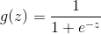 | 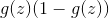 |
| tanh | 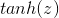 | 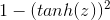 |
|  |  | 如果为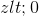，则为 0 |
| ReLU | 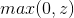 | 如果 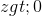 则为 1 |
|  |  | 如果 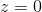 则未定义 |
|  |  | 如果  则 0.01 |
| LReLU | 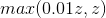 | 如果  则为 1 |
|  |  | 如果  则未定义 |

### 梯度下降

梯度下降是找到目标函数（例如损失函数）的局部最小值的一种迭代方法。


```
Repeat{    W := W - learning_rate * dJ(W)/dW}
```


符号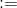表示更新操作。 显然，我们正在更新参数的值。

通常，我们用表示学习率。 训练神经网络时，它是超参数之一（我们将在另一部分介绍更多的超参数）。 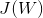是我们模型的损失函数。 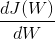是参数的梯度。 如果是参数（权重）的矩阵，则将是每个参数（即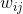）的梯度矩阵。

**问题**： **为什么在最小化损失函数时减去梯度而不加梯度？**

答案：

例如，我们的损失函数为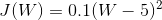，可能看起来像：

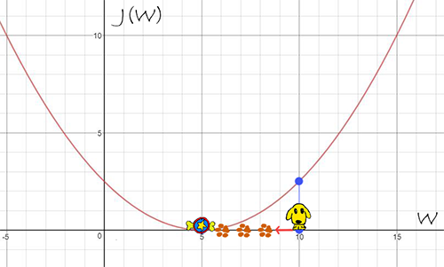

当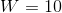时，梯度为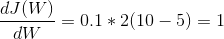。 显然，如果我们要找到的最小值，则梯度的相反方向（例如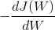）是找到局部最低点（即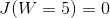）的正确方向。

但是有时，梯度下降法可能会遇到局部最优问题。


#### 计算图

该计算图示例是从[DeepLearningAI](https://www.deeplearning.ai/) 的第一门课程中学到的。

假设我们有 3 个可学习的参数，和。 成本函数为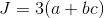。 接下来，我们需要计算参数的梯度：，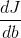和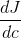。 我们还定义：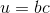，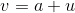和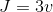。 该计算可以转换成下面的计算图：

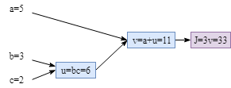


#### 反向传播

从上图可以明显看出，参数的梯度为：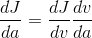，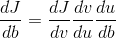和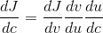。

计算每个节点的梯度很容易，如下所示。 （提示：实际上，如果您正在实现自己的算法，则可以在正向过程中计算梯度以节省计算资源和训练时间。因此，在进行反向传播时，无需再次计算每个节点的梯度 。）


现在，我们可以通过简单地组合节点梯度来计算每个参数的梯度：

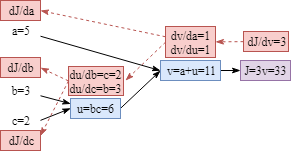

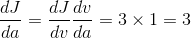

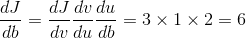

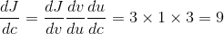

#### L2 正则化的梯度（权重衰减）

通过添加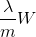可以稍微改变梯度。


```
Repeat{    W := W - (lambda/m) * W - learning_rate * dJ(W)/dW}
```


#### 梯度消失/爆炸

如果我们有一个非常深的神经网络并且未正确初始化权重，则可能会遇到梯度消失或爆炸的问题。 （有关参数初始化的更多详细信息：[参数初始化](https://createmomo.github.io/2018/01/23/Super-Machine-Learning-Revision-Notes/#parameters_initialization)）

为了解释什么是消失或爆炸梯度问题，将以一个简单的深度神经网络架构为例。 （同样，很棒的例子来自在线课程[DeepLearningAI](https://www.deeplearning.ai/) ）

神经网络具有层。 为简单起见，每层的参数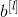为 0，所有激活函数均为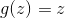。 此外，每个参数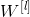具有相同的值。

根据上面的简单模型，最终输出将是：
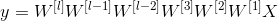

因为权重值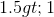，我们将在某些易爆元素中获得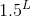。 同样，如果权重值小于 1.0（例如 0.5），则某处会有一些消失的梯度（例如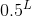）。

**这些消失/爆炸的梯度会使训练变得非常困难。 因此，仔细初始化深度神经网络的权重很重要。**


#### 小批量梯度下降

如果我们拥有庞大的训练数据集，那么在单个周期训练模型将花费很长时间。 对于我们而言，跟踪训练过程将非常困难。 在小批量梯度下降中，基于当前批量中的训练示例计算成本和梯度。

代表整个训练集，分为以下几批。 是训练示例的数量。


小批量的过程如下：


```
For t= (1, ... , #Batches):  
    Do forward propagation on the t-th batch examples;  
    Compute the cost on the t-th batch examples;  
    Do backward propagation on the t-th batch examples to compute gradients and update parameters.
```

在训练过程中，当我们不应用小批量梯度下降时，与使用小批量训练模型相比，成本趋势更加平滑。

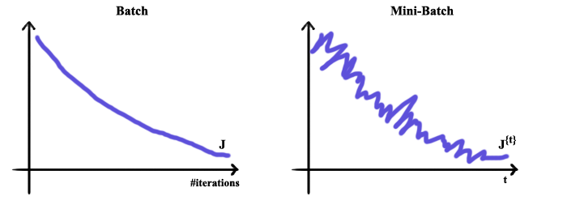

#### 随机梯度下降

当批量大小为 1 时，称为随机梯度下降。

#### 选择小批量

批量大小：

1）如果大小为，即整个训练集中的示例数，则梯度下降就恰好是“批量梯度下降”。

2）如果大小为 1，则称为随机梯度下降。

实际上，大小是在 1 到 M 之间选择的。当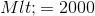时，该数据集应该是较小的数据集，使用“批量梯度下降”是可以接受的。 当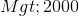时，可能小批量梯度下降是训练模型的更好方法。 通常，小批量大小可以是 64、128、256 等。

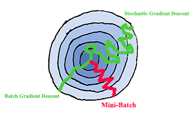


#### 具有动量的梯度下降（总是比 SGD 更快）

在每个小批量迭代上：

1）在当前小批量上计算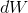和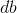

2）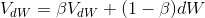

3）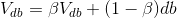

4）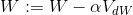

5）

动量的超参数是（学习率）和。 动量方面，是先前梯度的历史信息。 如果设置，则意味着我们要考虑最近 10 次迭代的梯度来更新参数。

原始的来自[指数加权平均值](https://www.youtube.com/watch?v=NxTFlzBjS-4)的参数。例如 表示我们要取最后 10 个值作为平均值。 表示考虑最后 1000 个值等。

#### RMSprop 的梯度下降

在每个小批量迭代上：

1）在当前小批量上计算和 

2）

3）

4）

5）

#### Adam（将动量和 RMSprop 放在一起）

，，，

在每个小批量迭代中：

1）在当前小批量上计算和。

2）

3）

4）

5）

6）

7） 

 

 

 

 

 

 


“校正”是指数加权平均值中的[“偏差校正”](https://www.youtube.com/watch?v=lWzo8CajF5s) 的概念。 该校正可以使平均值的计算更加准确。 是的权重。

通常，默认的超参数值为：，和。

学习率需要调整。 或者，应用学习率衰减方法也可以很好地工作。


#### 学习速率衰减方法

如果在训练期间固定学习率，则损失/成本可能会波动，如下图所示。 寻找一种使学习速率具有适应性的方法可能是一个好主意。


##### 基于周期数的衰减


根据周期数降低学习率是一种直接的方法。 以下是速率衰减公式。

例如，初始和衰减率是 1.0。 每个周期的学习率是：

| 周期 |  |
| --- | --- |
| 1 | 0.1 |
| 2 | 0.67 |
| 3 | 0.5 |
| 4 | 0.4 |
| 5 | … |

当然，还有其他一些学习率衰减方法。

| 其他方法 | 公式 |
| --- | --- |
| 指数衰减 |  |
| 周期相关 |  |
| 小批量相关 |  |
| 离散阶梯 |  |
| 手动衰减 | 逐日手动或逐小时降低学习率等。 |


#### 批量规范化

##### 训练时的批量规范化

使用批量规范化可以加快训练速度。

步骤如下。


每层中的批量规范化的详细信息是：


和是此处可学习的参数。

##### 测试时的批量规范化

在测试时，我们没有实例来计算
和，因为每次可能只有一个测试实例。

在这种情况下，最好使用跨小批量的指数加权平均值来估计和的合理值。


### 参数

#### 可学习的参数和超参数

| 可学习的参数 |
| --- |
|  |

| 超参数 |
| --- |
| 学习率 |
| 迭代次数 |
| 隐藏层数 |
| 每一层的隐藏单元的数量 |
| 选择激活函数 |
| 动量参数 |
| 小批量 |
| 正则化参数 |


#### 参数初始化

（**注意**：实际上，机器学习框架（例如 tensorflow，chainer 等）已经提供了强大的参数初始化功能。）

##### 小初始值

例如，当我们初始化参数时，我们设置一个小的值（即 0.01）以确保初始参数很小：


```
W = numpy.random.randn(shape) * 0.01
```

这样做的原因是，如果您使用的是 Sigmoid 且初始参数较大，则梯度将非常小。

##### 隐藏单元更多，权重更小

同样，我们将使用伪代码来显示各种初始化方法的工作方式。 我们的想法是，如果隐藏单元的数量较大，我们更愿意为参数分配较小的值，以防止训练阶段的消失或爆炸。下图可能会为您提供一些了解该想法的见解。


基于上述思想，我们可以使用与隐藏单元数有关的项对权重进行设置。


```
W = numpy.random.randn(shape) * numpy.sqrt(1/n[l-1])
```


相乘项的公式为。 是上一层中隐藏单元的数量。

如果您正在使用 Relu 激活函数，则使用项可能会更好。

##### Xavier 初始化

如果您的激活函数是，那么 Xavier 初始化（或）将是一个不错的选择。


#### 超参数调整

调整超参数时，有必要尝试各种可能的值。 如果计算资源足够，最简单的方法是训练具有各种参数值的并行模型。 但是，最有可能的资源非常稀少。 在这种情况下，我们只能照顾一个模型，并在不同周期尝试不同的值。


除了上述方面，如何明智地选择超参数值也很重要。

如您所知，神经网络架构中有各种超参数：学习率，动量和 RMSprop 参数（，和），层数，每层的单元数，学习速率衰减参数和小批量大小。

Ng 推荐以下超参数优先级：

| 优先级 | 超参数 |
| --- | --- |
| 1 | 学习率 |
| 2 | ，和（动量和 RMSprop 的参数） |
| 2 | 隐藏单元数 |
| 2 | 批量大小 |
| 3 | 层数 |
| 3 | 学习率衰减数 |

（通常，动量和 RMSprop 的默认值为：，和）

##### 隐藏单元和层的均匀样本

例如，如果层数的范围是 2-6，我们可以统一尝试使用 2、3、4、5、6 来训练模型。 同样，对于 50-100 的隐藏单元，在这种比例下选择值是一个很好的策略。

例：


##### 对数刻度上的样本

您可能已经意识到，对于所有参数而言，均匀采样通常不是一个好主意。

例如，让我们说学习率的合适范围是。 显然，均匀选择值是不明智的。 更好的方法是在对数刻度（，，，和）上进行采样。

至于参数和，我们可以使用类似的策略。

例如

因此，


下表可能有助于您更好地了解该策略。

|  |  |  |  |
| --- | --- | --- | --- |
|  | 0.9 | 0.99 | 0.999 |
|  | 0.1 | 0.01 | 0.001 |
|  | -1 | -2 | -3 |

例：


### 正则化

正则化是防止机器学习出现过拟合问题的一种方法。 附加的正则项将添加到损失函数中。

#### L2 正则化（权重衰减）


在新的损失函数中，是正则项，是正则参数（超参数）。 L2 正则化也称为权重衰减。

对于逻辑回归模型，是一个向量（即的维数与特征向量相同），正则项应为：

。

对于具有多层（例如层）的神经网络模型，层之间存在多个参数矩阵。 每个矩阵的形状是。 在等式中，是层，是层中的隐藏单元数。 因此，L2 正则化项将是：


（也称为 Frobenius 范数）。

#### L1 正则化


。

如果我们使用 L1 正则化，则参数将是稀疏的。


#### Dropout（反向 Dropout）

为了直观地了解 Dropout，Dropout 正则化的目的是使受监督的模型更加健壮。 在训练短语中，激活函数的某些输出值将被忽略。 因此，在进行预测时，模型将不依赖任何一项特征。

在 Dropout 正则化中，超参数“保持概率”描述了激活隐藏单元的几率。 因此，如果隐藏层具有个单元，并且概率为，则将激活左右的单元，并关闭左右的单元。

**示例**：


如上所示，丢弃了第二层的 2 个单元。 因此，第三层的线性组合值（即）将减小。 为了不降低的期望值，应通过除以保持概率来调整的值。 也就是说：

**注意**：在测试时进行预测时，不需要进行 Dropout 正则化。


#### 提前停止

使用提前停止以防止模型过拟合。


### 模型

#### Logistic 回归

给定实例的特征向量，逻辑回归模型的输出为。 因此，概率为。 在逻辑回归中，可学习的参数为和。

x 轴是的值，y 轴是。

（图片从[维基百科](https://en.wikipedia.org/wiki/Sigmoid_function)下载）


**一个训练实例的损失函数**：

是预测，是真实答案。 整个训练数据集的
**成本函数**（是训练数据集中的示例数）：

**最小化成本函数实际上是最大化数据的似然。**


#### 多类别分类（Softmax 回归）


softmax 回归将 logistic 回归（二元分类）概括为多个类（多类分类）。

如上图所示，它是 3 类分类神经网络。 在最后一层，使用 softmax 激活函数。 输出是每个类别的概率。

softmax 激活如下。

1）

2）


##### 损失函数


是训练实例的数量。 是第 j 类。


#### 迁移学习

如果我们有大量的训练数据或者我们的神经网络很大，那么训练这样的模型会很费时（例如几天或几周）。 幸运的是，有一些模型已发布并公开可用。 通常，这些模型是在大量数据上训练的。

迁移学习的思想是，我们可以下载这些经过预先训练的模型，并根据自己的问题调整模型，如下所示。


如果我们有很多数据，我们可以重新训练整个神经网络。 另一方面，如果我们的训练小，则可以重新训练最后几层或最后几层（例如，最后两层）。

**在哪种情况下我们可以使用迁移学习？**

假设：

预先训练的模型用于任务 A，而我们自己的模型用于任务 B。

*   这两个任务应具有相同的输入格式
*   对于任务 A，我们有很多训练数据。 但是对于任务 B，数据的大小要小得多
*   从任务 A 中学到的低级特征可能有助于训练任务 B 的模型。


#### 多任务学习

在分类任务中，通常每个实例只有一个正确的标签，如下所示。 第 i 个实例仅对应于第二类。

但是，在多任务学习中，一个实例可能具有多个标签。

在任务中，损失函数为：


是训练实例的数量。 是第 j 类。

**多任务学习提示**：

*   多任务学习模型可以共享较低级别的特征
*   我们可以尝试一个足够大的神经网络以在所有任务上正常工作
*   在训练集中，每个任务的实例数量相似


#### 卷积神经网络（CNN）

##### 滤波器/内核

例如，我们有一个滤波器（也称为内核），下图描述了滤波器/内核如何在 2D 输入上工作。 输入的大小为，应用滤波器/内核时的输出大小为。

滤波器/内核中的参数（例如）是可学习的。


而且，我们可以同时具有多个滤波器，如下所示。


同样，如果输入是一个 3 维的体积，我们也可以使用 3D 滤波器。 在此滤波器中，有 27 个可学习的参数。


通常，滤波器的宽度是奇数（例如，，…）

滤波器的想法是，如果它在输入的一部分中有用，那么也许对输入的另一部分也有用。 而且，卷积层输出值的每个输出值仅取决于少量的输入。


#### 步幅

步幅描述了滤波器的步长。 它将影响输出大小。


应当注意，一些输入元素被忽略。 这个问题可以通过填充来解决。


#### 填充（有效和相同卷积）

如上所述，有效卷积是我们不使用填充时的卷积。

相同卷积是我们可以使用填充通过填充零来扩展原始输入，以便输出大小与输入大小相同。

例如，输入大小为，滤波器为。 如果我们设置`stride = 1`和`padding = 1`，我们可以获得与输入相同大小的输出。


通常，如果滤波器大小为`f * f`，输入为`n * n`，步幅为`s`，则最终输出大小为：


#### 卷积层

实际上，我们还在卷积层上应用了激活函数，例如 Relu 激活函数。


至于参数的数量，对于一个滤波器，总共有 27 个（滤波器的参数）+1（偏置）= 28 个参数。


#### `1 * 1`卷积

如果不使用 1X1 转换层，则计算成本存在问题：


使用 1X1 转换层，参数数量大大减少：


#### 池化层（最大和平均池化）

池化层（例如最大池化层或平均池化层）可以被认为是一种特殊的滤波器。

最大池化层返回滤波器当前覆盖区域的最大值。 同样，平均池层将返回该区域中所有数字的平均值。


在图片中，是滤波器的宽度，是步长的值。

**注意：在池化层中，没有可学习的参数。**


#### LeNet-5


（模型中有约 60k 参数）

#### AlexNet


（模型中有约 60m 的参数；使用 Relu 激活函数；）

#### VGG-16


（模型中有大约 138m 的参数；所有滤波器中，并使用相同的填充；在最大池化层中和）


#### ResNet（功能更强大）


#### Inception


#### 对象检测

##### 本地化分类


**损失函数**：


##### 地标检测


##### 滑动窗口检测算法


首先，使用训练集来训练分类器。 然后将其逐步应用于目标图片：


问题是计算成本（按顺序计算）。 为了解决这个问题，我们可以使用滑动窗口的卷积实现（即将最后的完全连接层变成卷积层）。


使用卷积实现，我们不需要按顺序计算结果。 现在我们可以一次计算结果。


##### 区域提议（R-CNN，仅在几个窗口上运行检测）

实际上，在某些图片中，只有几个窗口具有我们感兴趣的对象。在区域提议（R-CNN）方法中，我们仅在提出的区域上运行分类器。

**R-CNN** ：

*   使用一些算法来提出区域
*   一次对这些提出的区域进行分类
*   预测标签和边界框

**Fast R-CNN** ：

*   使用聚类方法提出区域
*   使用滑动窗口的卷积实现对提出的区域进行分类
*   预测标签和边界框

另一种更快的 R-CNN 使用卷积网络来提出区域。


##### YOLO 算法

###### 边界框预测（YOLO 的基础）

每张图片均分为多个单元。


对于每个单元格：

*   指示单元格中是否存在对象
*   和是中点（0 到 1 之间）
*   和是相对的高和宽（该值可以大于 1.0）。
*   ，和表示对象所属的类别。


###### IOU


按照惯例，通常将 0.5 用作阈值，以判断预测的边界框是否正确。 例如，如果 IOU 大于 0.5，则可以说该预测是正确的答案。

也可以用作一种方法来衡量两个边界框彼此之间的相似程度。


###### 非最大抑制


该算法可以找到对同一物体的多次检测。 例如，在上图中，它为猫找到 2 个边界框，为狗找到 3 个边界框。 非最大抑制算法可确保每个对象仅被检测一次。

步骤：

1）丢弃所有带有的框

2）对于任何剩下的框：

a）选择具有最大的框作为预测输出

b）在最后一步中，将所有带有的剩余框与选中的框一起丢弃，然后从 a 开始重复。


##### 锚定框

先前的方法只能在一个单元格中检测到一个对象。 但是在某些情况下，一个单元中有多个对象。 为了解决这个问题，我们可以定义不同形状的边界框。


因此，训练图像中的每个对象都分配给：

*   包含对象中点的网格单元
*   具有最高的网格单元的锚定框


**做出预测**：

*   对于每个网格单元，我们可以获得 2 个（锚定框的数量）预测边界框。
*   摆脱低概率预测
*   对于每个类别（，和），都使用非最大抑制来生成最终预测。


#### 人脸验证

##### 一次性学习（学习“相似性”函数）

在这种情况下，一次性学习就是：从一个例子中学习以再次认识这个人。

函数表示 img1 和 img2 之间的差异程度。


###### Siamese 网络（学习差异/相似程度）


如果我们相信编码函数可以很好地表示图片，则可以定义距离，如上图底部所示。

**学习**：

可学习的参数：定义编码的神经网络参数

学习这些参数，以便：

*   如果和是同​​一个人，则较小
*   如果和是不同的人，则很大


###### 三重损失（一次查看三张图片）


这三张图片是：

*   锚图片
*   正图片：锚图片中同一个人的另一张图片
*   负图片：锚图片中另一张不同人的图片。

但是，仅学习上述损失函数将存在问题。 该损失函数可能导致学习。

为避免出现此问题，我们可以添加一个小于零的项，即。

要对其进行重组：


汇总**损失函数**：


**选择 A，P，N 的三元组**：
在训练期间，如果随机选择 A，P，N，则很容易满足。 学习算法（即梯度下降）不会做任何事情。

我们应该选择难以训练的三元组。


当使用困难三元组进行训练时，梯度下降过程必须做一些工作以尝试将这些量推离。


##### 人脸识别/验证和二元分类


我们可以学习一个 Sigmoid 二元分类函数：


我们还可以使用其他变量，例如卡方相似度：


#### 神经风格转换


内容图像来自电影 Bolt。

样式图像是“百马图”的一部分，这是中国最著名的古代绘画之一。

[https://deepart.io](https://deepart.io) 支持生成的图像。

损失函数包含两部分：和。 为了得到生成的图像：

1.  随机初始化图像
2.  使用梯度下降来最大程度地降低

**内容成本函数，** ：
内容成本函数可确保不会丢失原始图像的内容。

1）使用隐藏层（不太深也不太浅）来计算内容成本。 （我们可以使用来自预训练的卷积神经网络的层）


2）


3）


**样式成本函数，** ：

1）假设我们正在使用层激活来衡量样式。


2）将图片样式定义为跨通道激活之间的相关性


矩阵中的元素反映了跨不同通道的激活之间的相关性（例如，高级纹理成分是否倾向于同时出现或不出现）。

对于样式图片：


对于生成的图像：


**样式函数**：


您也可以考虑合并不同层的样式损失。


#### 1D 和 3D 卷积概括


### 序列模型

#### 循环神经网络模型

**前向**：


在此图中，红色参数是可学习的变量和。 在每个步骤的最后，将计算该步骤的损失。

最后，将每个步骤的所有损失汇总为整个序列的总损失。

这是每个步骤的公式：


总损失：


**时间上的反向传播**：


#### 门控循环单元（GRU）

##### GRU（简化）


##### GRU（完整）


#### 长期短期记忆（LSTM）


*   ：更新门
*   ：遗忘门
*   ：输出门


#### 双向 RNN


#### 深度 RNN 示例


#### 词嵌入

##### 单热


##### 嵌入矩阵（）


是代表未知词的特殊符号。 所有未见过的单词将被强制转换为。

矩阵由表示。 如果我们想获取单词嵌入，可以按如下所示使用单词的单热向量：


通常，可以将其公式化为：


##### 学习单词嵌入


在该模型中，可以像其他参数（即和）一样学习嵌入矩阵（即）。 所有可学习的参数均以蓝色突出显示。

该模型的总体思想是在给定上下文的情况下预测目标单词。 在上图中，上下文是最后 4 个单词（即 a，玻璃，of，橙色），目标单词是“ to”。

另外，有多种方法可以定义目标词的上下文，例如：

*   最后个字
*   目标词周围个
*   附近的一个字（Skip-gram 的思路）
*   …


##### Word2Vec & SkipGram

**句子**：

```
I want a glass of orange juice to go along with my cereal.
```

在此词嵌入学习模型中，**上下文**是从句子中随机选择的词。 **目标**是用上下文词的窗口随机拾取的词。

例如：

让我们说上下文词为`orange`，我们可能会得到以下训练示例。


**模型**：


softmax 函数定义为：


是与输出关联的参数，是上下文字的当前嵌入。

使用 softmax 函数的**问题**是分母的计算成本太大，因为我们的词汇量可能很大。 为了减少计算量，负采样是不错的解决方案。


##### 负采样

**句子**：

```
I want a glass of orange juice to go along with my cereal.
```

给定一对单词（即上下文单词和另一个单词）和标签（即第二个单词是否为目标单词）。 如下图所示，（`orange`）是一个正例，因为单词`juice`是橙色的真正目标单词。 由于所有其他单词都是从词典中随机选择的，因此这些单词被视为错误的目标单词。 因此，这些对是负例（如果偶然将真实的目标单词选作负例，也可以）。


至于每个上下文词的负面词数，如果数据集很小，则为；如果数据集很大，则为。

**模型**：


我们仅训练 softmax 函数的 logistic 回归模型。 因此，计算量低得多且便宜。

**如何选择负例？** ：


是单词频率。

如果使用第一个样本分布，则可能总是选择诸如`the, of`等之类的词。但是，如果使用第三个分布，则所选词将是非代表性的。 因此，第二分布可以被认为是用于采样的更好的分布。 这种分布在第一个和第三个之间。


##### GloVe 向量

**表示法**：单词在单词的上下文中出现的次数

**模型**：


测量这两个词之间的关联程度以及这两个词在一起出现的频率。 是权重项。 它给高频对带来了不太高的权重，也给了不太常见的对带来了不太小的权重。

如果我们检查和的数学运算，实际上它们起着相同的作用。 因此，词的最终词嵌入为：


##### 深度上下文化的词表示形式（ELMo，语言模型的嵌入）

预训练双向语言模型

正向语言模型：给定个符号的序列，正向语言模型计算序列概率，通过建模给定历史的的概率，即，


反向语言模型：类似地，


双向语言模型：它结合了正向和反向语言模型。 共同最大化正向和后向的似然：


LSTM 用于建模前向和后向语言模型。


就输入嵌入而言，我们可以只初始化这些嵌入或使用预先训练的嵌入。 对于 ELMo，通过使用字符嵌入和卷积层，会更加复杂，如下所示。


训练了语言模型之后，我们可以得到句子中单词的 ELMo 嵌入：


在 ELMo 中，是 softmax 归一化的权重，而是标量参数，允许任务模型缩放整个 ELMo 向量。 可以在任务特定模型的训练过程中学习这些参数。

参考：

[1] [https://www.slideshare.net/shuntaroy/a-review-of-deep-contextualized-word-representations-peters-2018](https://www.slideshare.net/shuntaroy/a-review-of-deep-contextualized-word-representations-peters-2018)

[2] [http://jalammar.github.io/illustrated-bert/](http://jalammar.github.io/illustrated-bert/)

[3] [https://www.mihaileric.com/posts/deep-contextualized-word-representations-elmo/](https://www.mihaileric.com/posts/deep-contextualized-word-representations-elmo/)


#### 序列到序列模型示例：翻译

任务是将一个序列转换为另一个序列。 这两个序列可以具有不同的长度。


##### 选择最可能的句子（集束搜索）

###### 集束搜索

使用序列对模型进行序列化在机器翻译中很流行。 如图所示，翻译是逐个标记地生成的。 问题之一是如何挑选最可能的整个句子？ 贪婪搜索不起作用（即在每个步骤中选择最佳单词）。 集束搜索是一种更好的解决方案。


让我们假设集束搜索宽度为 3。因此，在每一步中，我们只保留了前 3 个最佳预测序列。

例如（如上图所示），

*   在第 1 步中，我们保留` in, June, September`
*   在第 2 步中，我们保留以下顺序：` (in, September), (June is), (June visits)`
*   …

至于集束搜索宽度，如果我们有一个较大的宽度，我们可以获得更好的结果，但是这会使模型变慢。 另一方面，如果宽度较小，则模型会更快，但可能会损害其性能。 集束搜索宽度是一个超参数，最佳值可能是领域特定的。


###### 长度标准化

翻译模型的学习将最大化：


在对数空间中，即：


上述目标函数的问题在于对数空间中的分数为 始终为负，因此使用此函数将使模型偏向一个很短的句子。 我们不希望翻译实际上太短。

我们可以在开头添加一个长度标准化项：


###### 集束搜索中的错误分析（启发式搜索算法）

在调整模型的参数时，我们需要确定它们的优先级（即，更应该归咎于 RNN 或集束搜索部分）。 （通常增加集束搜索宽度不会损害性能）。

**示例**

从开发集中选择一个句子并检查我们的模型：

**句子**：`Jane visite l’Afrique en septembre.`

**来自人类的翻译**：`Jane visits Africa in September. `（）

**算法的输出（我们的模型）**：`Jane visited Africa last September. ` （）

为了弄清楚应该归咎于哪个，我们需要根据 RNN 神经网络计算并比较和。

如果：

获得更高的概率，则可以得出结论，集束搜索存在故障。

如果 ：

RNN 预测，但实际上比更好，因为它来自真实的人。 因此，RNN 模型应该有问题。

通过在开发集中的多个实例上重复上述错误分析过程，我们可以得到下表：


根据该表，我们可以找出是由于集束搜索/ RNN。

如果大多数错误是由于集束搜索造成的，请尝试增加集束搜索宽度。 否则，我们可能会尝试使 RNN 更深入/添加正则化/获取更多训练数据/尝试不同的架构。


##### Bleu 得分

如果一个句子有多个出色的答案/推荐，我们可以使用 Bleu 得分来衡量模型的准确性。

**示例（二元组的 Bleu 得分）**：

**法语**：` Le chat est sur le tapis.`

**参考 1**：`The cat is on the mat.`

**参考 2**：`There is a cat on the mat.`

**我们模型的输出**：`The cat the cat on the cat.`


**计数**是输出中出现的当前二元组的数量。 **截断计数**是二元组出现在参考 1 或参考 2 中的最大次数。

然后可以将二元组的 Bleu 分数计算为：


上面的等式可以用来计算 unigram，bigram 或 any-gram Bleu 分数。


##### 组合 Bleu

合并的 Bleu 分数合并了不同 Gram 的分数。 仅表示 n-gram 的 Bleu 分数。 如果我们具有，，和，则可以组合为以下内容：


简短的惩罚会惩罚简短的翻译。 （我们不希望翻译得太短，因为简短的翻译会带来很高的精度。


##### 注意力模型

RNN（例如 lstm）的一个问题是很难记住超长句子。 模型翻译质量将随着原始句子长度的增加而降低。


有多种计算注意力的方法。 一种方法是：


在这种方法中，我们使用小型神经网络将之前和当前的信息映射到注意力权重。

已经证明注意力模型可以很好地工作，例如归一化。


### 转换器（“Attention Is All You Need”）

**架构**：


**详细信息**：

输入嵌入：

模型的输入嵌入是单词嵌入及其每个单词的位置编码的总和。 例如，对于输入句子。 是句子中每个单词的单词嵌入（可以是预训练的嵌入）。 输入嵌入应为。

是每个单词的位置编码。 有许多方法可以对单词位置进行编码。 在本文中，使用的编码方法是：


是单词在句子中的位置。 是位置编码的元素位置。 是模型中编码器的输出尺寸大小。

解码器

*   顶部编码器的输出将转换为注意力向量和。 这些用于多头注意力子层（也称为编解码器注意力）。 注意力向量可以帮助解码器专注于输入句子的有用位置。
*   掩码的自注意只允许专注于输出句子的较早位置。 因此，通过在 softmax 步骤之前将它们设置为-inf。
*   “多头注意”层类似于编码器中的“自注意”层，除了：
    *   它从顶部编码器的输出中获取和
    *   它从其下一层创建

参考： [https://jalammar.github.io/illustrated-transformer/](https://jalammar.github.io/illustrated-transformer/)


### 转换器的双向编码器表示（BERT）

BERT 是通过堆叠转换器编码器构建的。


对未标记的大文本进行预训练（预测被掩盖的单词）


“带掩码的语言模型会随机掩盖输入中的某些标记，目的是为了 仅根据上下文来预测被屏蔽单词的原始词汇 ID。” [2]

使用受监督的训练对特定任务（例如， 分类任务，NER 等


BERT 论文的下图显示了如何将模型用于不同的任务。


如果特定任务不是分类任务，则可以忽略[CLS]。

参考：

[1] http://jalammar.github.io/illustrated-bert/

[2] Devlin, J., Chang, M.W., Lee, K. and Toutanova, K., 2018. Bert: Pre-training of deep bidirectional transformers for language understanding. arXiv preprint arXiv:1810.04805.


### 实用提示

#### 训练/开发/测试数据集

*   通常，我们将数据集的 **70%** 用作训练数据，将 30%用作测试集； 或 **60%**（训练）/ **20%**（开发）/ **20%**（测试）。 但是，如果我们有一个大数据集，则可以将大多数实例用作训练数据（例如 1,000,000， **98%**），并使开发和测试集的大小相等（例如 10,000（ **1% 用于开发**），测试集使用 10,000（ **1%**）。 由于我们的数据集很大，因此开发和测试集中的 10,000 个示例绰绰有余。
*   确保开发和测试集来自同一分布

**我们可能遇到的另一种情况**：

1）我们要为特定域构建系统，但是在该域中我们只有几个标记数据集（例如 10,000）

2）我们 可以从类似的任务中获得更大的数据集（例如 200,000 个实例）。

在这种情况下，如何构建训练，开发和测试集？

最简单的方法是将两个数据集组合在一起并对其进行随机排序。 然后，我们可以将合并的数据集分为三个部分（训练，开发和测试集）。 但是，这不是一个好主意。 因为我们的目标是为我们自己的特定领域构建系统。 将没有来自我们自己域的一些实例添加到开发/测试数据集中以评估我们的系统是没有意义的。

合理的方法是：

1）将所有更容易使用的实例（例如 200,000）添加到训练集中

2）从特定域数据集中选择一些实例并将它们添加到训练集中

3）将我们自己领域的其余实例分为开发和测试集


#### 过拟合/欠拟合，偏差/方差，与人类水平的表现比较，解决方案

##### 过拟合/欠拟合，偏差/方差

对于分类任务，人类分类误差应该在 0%左右。 监督模型在训练和开发集上的各种可能的表现分析如下所示。

|  |  |  |  |  |
| --- | --- | --- | --- | --- |
| 人为错误 | 0.9% | 0.9% | 0.9% | 0.9% |
| 训练集错误 | 1% | 15% | 15% | 0.5% |
| 测试集错误 | 11% | 16% | 30% | 1% |
| 评价 | 过拟合 | 欠拟合 | 欠拟合 | 良好 |
|  | 高方差 | 高偏差 | 高偏差和方差 | 低偏差和方差 |

**解决方案**：


##### 与人类水平的表现比较

您可能已经注意到，在上表中，人为水平的误差设置为 0.9%，如果人为水平的表现不同但训练/开发误差相同，该怎么办？

|  |  |  |
| --- | --- | --- |
| 人为错误 | **1%** | **7.5%** |
| 训练集错误 | 8% | 8% |
| 测试集错误 | 10% | 10% |
| 评价 | 高偏差 | 高方差 |

尽管模型误差相同，但在左图中人为误差为 1%时，我们有高偏差问题，而在右图中有高方差问题。

至于模型的性能，有时它可能比人类的模型更好。 但是只要模型的性能不如人类，我们就可以：

1）从人类获得更多的标记数据

2）从手动误差分析中获得见解

3）从偏差/方差分析中获得见解


#### 数据分布不匹配

当我们为自己的特定领域构建系统时，针对我们自己的问题，我们只有几个带标签的实例（例如 10,000 个）。 但是我们很容易从另一个类似的领域中收集很多实例（例如 200,000 个）。 此外，大量容易获得的实例可能有助于训练一个好的模型。 数据集可能看起来像这样：


但是在这种情况下，训练集的数据分布与开发/测试集不同。 这可能会导致副作用-数据不匹配问题。

为了检查我们是否存在数据不匹配问题，我们应该随机选择训练集的一个子集作为名为训练-开发数据集的验证集。 该集合具有相同的训练集分布，但不会用于训练。


|  |  |  |  |  |
| --- | --- | --- | --- | --- |
| 人为误差 | 0% | 0% | 0% | 0% |
| 训练误差 | 1% | 1% | 10% | 10% |
| 训练-开发误差 | 9% | 1.5% | 11% | 11% |
| 开发误差 | 10% | 10% | 12% | 20% |
| 问题 | 高方差 | 数据不匹配 | 高偏差 | 高偏差+数据不匹配 |

总结一下：


##### 解决了数据分布不匹配的问题

首先，进行手动错误分析以尝试了解我们的训练集和开发/测试集之间的区别。

其次，根据分析结果，我们可以尝试使训练实例与开发/测试实例更相似。 我们还可以尝试收集更多与开发/测试集的数据分布相似的训练数据。


#### 输入标准化

我们有一个包含示例的训练集。 代表示例。 输入标准化如下。

，
，


**注意**：必须使用相同的和训练数据来标准化测试数据集。

使用输入标准化可以使训练更快。

假设输入是二维。 范围分别是和的[1-1000]和[1-10]。 损失函数可能看起来像这样（左）：


#### 使用单一数字模型评估指标

如果我们不仅关心模型的表现（例如准确性，F 分数等），还关心运行时间，则可以设计一个数字评估指标来评估我们的模型。

例如，我们可以结合表现指标和运行时间，例如。

另外，我们还可以指定可以接受的最大运行时间：


#### 错误分析（优先考虑后续步骤）

进行错误分析对于确定改善模型性能的后续步骤的优先级非常有帮助。

##### 执行错误分析

例如，为了找出模型为什么错误标记某些实例的原因，我们可以从开发集中获取大约 100 个**错误标记的**示例并进行错误分析（手动逐个检查）。

| 图片 | 狗 | 猫 | 模糊 | 评价 |
| --- | --- | --- | --- | --- |
| 1 |  |  |  |  |
| 2 |  |  |  |  |
| 3 |  |  |  |  |
| … | … | … | … | … |
| 百分比 | 8% | 43% | 61% |  |

通过手动检查这些标签错误的实例，我们可以估计错误的出处。 例如，在上述表格中，我们发现 61%的图像模糊，因此在下一步中，我们可以集中精力改善模糊图像的识别性能。

##### 清除标签错误的数据

有时，我们的数据集很嘈杂。 换句话说，数据集中存在一些不正确的标签。 同样，我们可以从开发/测试集中选取约 100 个实例，然后手动逐个检查它们。

例如，当前开发/测试集上的模型错误为 10%。 然后，我们手动检查从开发/测试集中随机选择的 100 个实例。

| 图片 | 标签不正确 |
| --- | --- |
| 1 个 |  |
| 2 |  |
| 3 |  |
| 4 |  |
| 5 |  |
| … | … |
| 百分比 | 6% |

假设，最后我们发现 6%实例的标签错误。 基于此，我们可以猜测由于标签错误而导致的错误以及由于其他原因而导致的错误。

因此，如果我们下一步专注于纠正标签，那么可能不是一个好主意。

