# 决策树

> 原文： [https://machine-learning-course.readthedocs.io/en/latest/content/supervised/decisiontrees.html](https://machine-learning-course.readthedocs.io/en/latest/content/supervised/decisiontrees.html)

## 介绍

决策树是机器学习中的一个分类器，它使我们能够根据先前的数据进行预测。 它们就像一系列连续的“ if…then”语句，您将新数据馈入它们以获得结果。

为了演示决策树，让我们看一个例子。 想象一下，我们要预测麦克是否会在任何一天去杂货店购物。 我们可以看看导致 Mike 前往商店的先前因素：

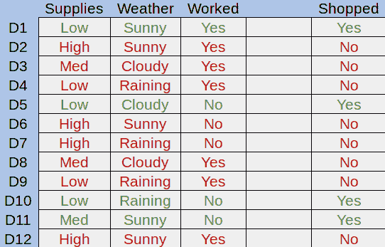

**图 1.示例数据集**

在这里，我们可以查看 Mike 的杂货供应量，天气以及 Mike 每天是否工作。 绿色的行是他去商店的日子，红色的行是他没有去的日子。 决策树的目标是尝试了解为什么 Mike 会去商店，然后将其应用于新数据。

让我们将第一个属性分成一棵树。 迈克的补给量可能少，中或大：

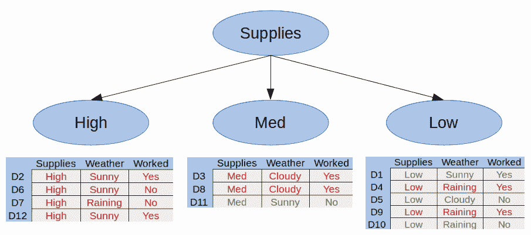

**图 2.我们的第一个拆分**

在这里，我们可以看到 Mike 的补给量很高，就永远不会去商店。 这称为**纯子集**，即仅包含正例或仅负例的子集。 使用决策树，无需进一步分解纯子集。

让我们将 Med Supplies 类别划分为 Mike 那天是否工作：

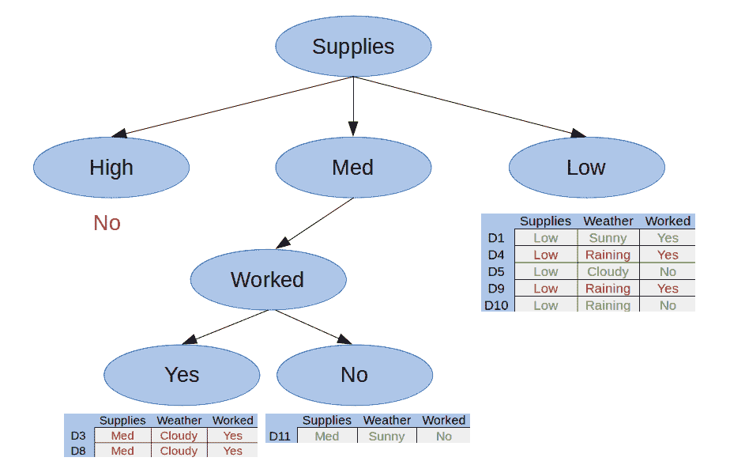

**图 3.我们的第二个拆分**

在这里我们可以看到我们还有两个纯子集，因此这棵树是完整的。 我们可以用它们各自的答案替换任何纯子集-在这种情况下，是或否。

最后，让我们按“天气”属性划分“供应不足”类别：

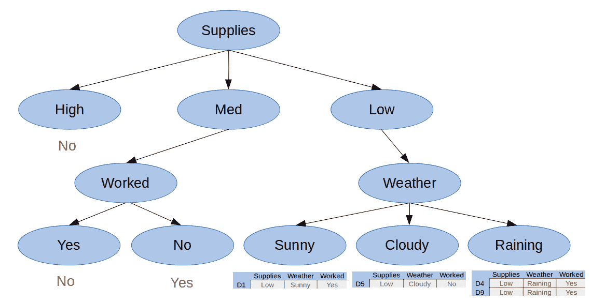

**图 4.我们的第三个拆分**

现在我们有了所有纯子集，我们可以创建最终决策树：

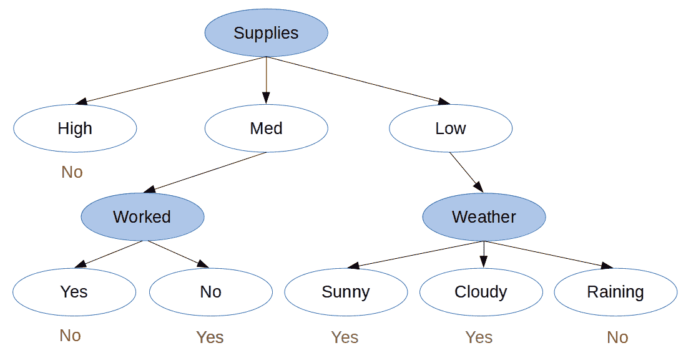

**图 5.最终决策树**

## 动机

决策树易于创建，可视化和解释。 因此，它们通常是用于对数据集建模的第一种方法。 决策树的层次结构和分类性质使其实现起来非常直观。 决策树根据您拥有的数据点数对数展开，这意味着较大的数据集对树的创建过程的影响将小于其他分类器。 由于树结构，对新数据点的分类也可以对数地执行。

## 分类和回归树

决策树算法也称为 CART 或分类和回归树。 与上面显示的树一样，**分类树**用于从一组可能的值中获取结果。 **回归树**是决策树，其中结果是连续值，例如汽车价格。

## 分裂（归纳）

决策树是通过称为**归纳**的拆分过程创建的，但是我们如何知道何时拆分？ 我们需要一种递归算法，该算法确定要拆分的最佳属性。 一种这样的算法是**贪婪算法**：

1.  从根开始，我们为每个属性创建一个拆分。
2.  对于每个创建的拆分，请计算拆分成本。
3.  选择成本最低的拆分。
4.  递归到子树，然后从步骤 1 继续。

重复此过程，直到所有节点都具有与目标结果相同的值，或者拆分不会为预测增加任何值。 该算法将根节点作为最佳分类器。

## 分裂成本

分裂的成本由**成本函数**确定。 使用成本函数的目的是以一种可以计算的方式拆分数据，并提供最大的信息收益。

对于提供答案而不是提供值的分类树，我们可以使用基尼不纯度计算信息增益：

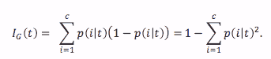

**公式 1.基尼不纯度函数**

Ref: [https://sebastianraschka.com/faq/docs/decision-tree-binary.html](https://sebastianraschka.com/faq/docs/decision-tree-binary.html)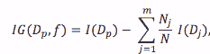

**公式 2。基尼信息增益公式**

Ref: [https://sebastianraschka.com/faq/docs/decision-tree-binary.html](https://sebastianraschka.com/faq/docs/decision-tree-binary.html)

为了计算信息增益，我们首先开始计算根节点的基尼不纯度。 让我们看一下我们之前使用的数据：

|  | 供应量 | 天气 | 工作 | 购物？ |
| --- | --- | --- | --- | --- |
| D1 | 低 | 晴 | 是 | 是 |
| D2 | 高 | 晴 | 是 | 否 |
| D3 | 中 | 多云 | 是 | 否 |
| D4 | 低 | 下雨 | 是 | 否 |
| D5 | 低 | 多云 | 否 | 是 |
| D6 | 高 | 晴 | 否 | 否 |
| D7 | 高 | 下雨 | 否 | 否 |
| D8 | 中 | 多云 | 是 | 否 |
| D9 | 低 | 下雨 | 是 | 否 |
| D10 | 低 | 下雨 | 否 | 是 |
| D11 | 中 | 晴 | 否 | 是 |
| D12 | 高 | 晴 | 是 | 否 |

我们的根节点是目标变量，无论迈克是否打算去购物。 要计算其基尼不纯度，我们需要找到每个结果的概率平方和，然后从一个结果中减去该结果：


如果我们在第一个属性“供应量”上划分，我们来计算基尼信息增益。 我们可以分为三个不同的类别-低，中和高。 对于这些，我们计算其基尼不纯度：

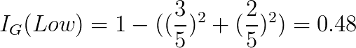

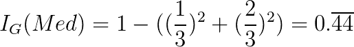

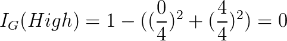

如您所见，高电源的不纯度为 0。这意味着如果我们分裂电源并接收高输入，我们将立即知道结果是什么。 为了确定此拆分的基尼信息增益，我们计算根的不纯度减去每个孩子的不纯度的加权平均值：

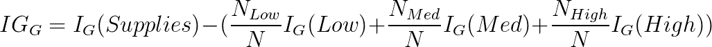


对于每个可能的分裂，我们都会继续使用此模式，然后选择能够为我们提供最高信息增益值的分裂。 最大化信息增益使我们可以进行最极化的分裂，从而降低了新输入被错误分类的可能性。

## 修剪

通过足够大的数据集创建的决策树最终可能会产生过多的拆分，每个拆分的有用性都会降低。 高度详细的决策树甚至可能导致过拟合，如上一模块中所述。 因此，删除决策树中不重要的部分是有益的。 修剪涉及计算每个结束子树（叶节点及其父节点）的信息增益，然后删除信息增益最小的子树：

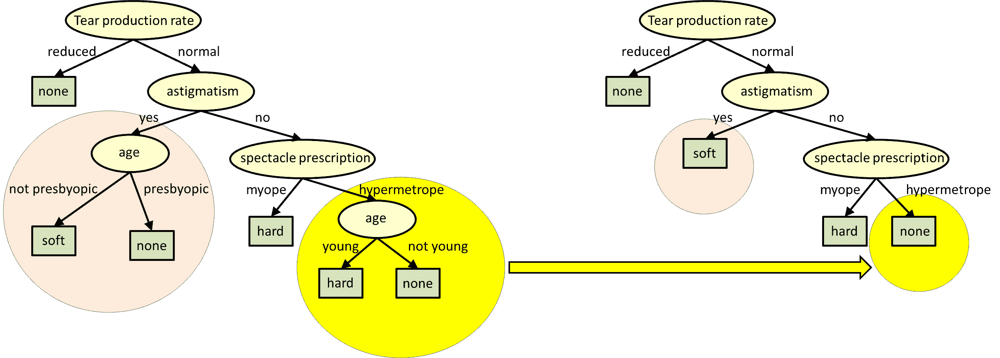

参考： [http://www.cs.cmu.edu/~bhiksha/courses/10-601/decisiontrees/](http://www.cs.cmu.edu/~bhiksha/courses/10-601/decisiontrees/)

如您所见，子树被更突出的结果所取代，成为新的叶子。 可以重复此过程，直到达到所需的复杂性级别，树高或信息获取量。 由于树是为了节省修剪时间而构建的，因此可以跟踪和存储信息增益。 每个模型都应使用自己的修剪算法来满足其需求。

## 总结

决策树使您可以快速有效地对数据进行分类。 因为它们将数据塑造为决策的层次结构，所以即使非专家也可以很好地理解它们。 决策树是通过两步过程创建和完善的：归纳和修剪。 归纳法涉及挑选最佳属性进行拆分，而修剪则有助于过滤掉认为无用的结果。 由于决策树非常易于创建和理解，因此通常是用于建模和预测数据集结果的第一种方法。

## 代码示例

提供的代码 [Decisiontrees.py](https://github.com/machinelearningmindset/machine-learning-course/blob/master/code/supervised/DecisionTree/decisiontrees.py) 以本文档中讨论的示例为基础，并从中创建决策树。 首先，定义每个类的每个可能选项。 稍后将其用于适应和显示我们的决策树：

```py
# The possible values for each class
classes = {
    'supplies': ['low', 'med', 'high'],
    'weather':  ['raining', 'cloudy', 'sunny'],
    'worked?':  ['yes', 'no']
}

```

接下来，我们创建了上面显示的数据集的矩阵，并定义了每行的结果：

```py
# Our example data from the documentation
data = [
    ['low',  'sunny',   'yes'],
    ['high', 'sunny',   'yes'],
    ['med',  'cloudy',  'yes'],
    ['low',  'raining', 'yes'],
    ['low',  'cloudy',  'no' ],
    ['high', 'sunny',   'no' ],
    ['high', 'raining', 'no' ],
    ['med',  'cloudy',  'yes'],
    ['low',  'raining', 'yes'],
    ['low',  'raining', 'no' ],
    ['med',  'sunny',   'no' ],
    ['high', 'sunny',   'yes']
]

# Our target variable, whether someone went shopping
target = ['yes', 'no', 'no', 'no', 'yes', 'no', 'no', 'no', 'no', 'yes', 'yes', 'no']

```

不幸的是，sklearn 机器学习包无法根据分类数据创建决策树。 有正在进行的工作允许这样做，但是现在我们需要另一种方法来用库在决策树中表示数据。 幼稚的方法是仅枚举每个类别-例如，将晴天/阴天/阴天转换为 0、1 和 2 之类的值。但是这样做有一些不幸的副作用，例如这些值是可比较的（晴天 &lt;正在下雨）且连续。 为了解决这个问题，我们对数据进行“一次热编码”：

```py
categories = [classes['supplies'], classes['weather'], classes['worked?']]
encoder = OneHotEncoder(categories=categories)

x_data = encoder.fit_transform(data)

```

一种热编码使我们能够将分类数据转换为期望连续数据的 ML 算法可识别的值。 它通过选择一个类并将其划分为每个选项来工作，其中一点代表该选项是否存在。

现在我们有了适合 sklearn 决策树模型的数据，我们只需将分类器拟合到数据即可：

```py
# Form and fit our decision tree to the now-encoded data
classifier = DecisionTreeClassifier()
tree = classifier.fit(x_data, target)

```

其余代码涉及创建一些随机预测输入，以显示如何使用树。 我们以与上述数据相同的格式创建了一组随机数据，然后将其传递到 DecisionTreeClassifier 的预测方法中。 这为我们提供了一系列预测目标变量-在这种情况下，对 Mike 是否会购物的答案是或否：

```py
# Use our tree to predict the outcome of the random values
prediction_results = tree.predict(encoder.transform(prediction_data))

```

## 参考文献

1.  <https://towardsdatascience.com/decision-trees-in-machine-learning-641b9c4e8052>
1.  <https://heartbeat.fritz.ai/introduction-to-decision-tree-learning-cd604f85e23>
1.  <https://machinelearningmastery.com/implement-decision-tree-algorithm-scratch-python/>
1.  <https://sebastianraschka.com/faq/docs/decision-tree-binary.html>
1.  <https://www.cs.cmu.edu/~bhiksha/courses/10-601/decisiontrees/>