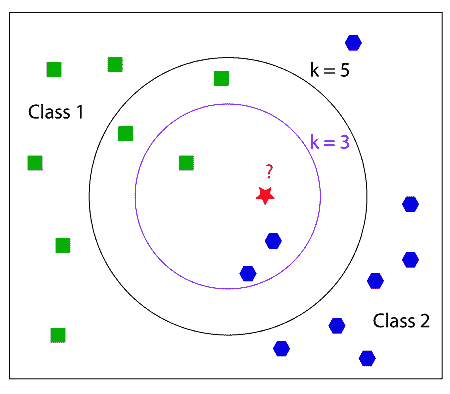
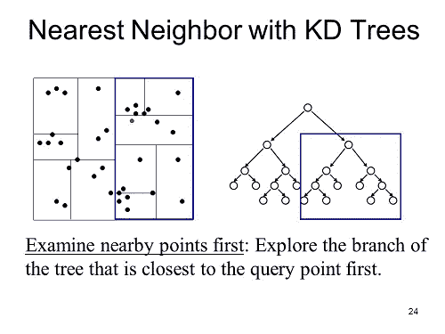
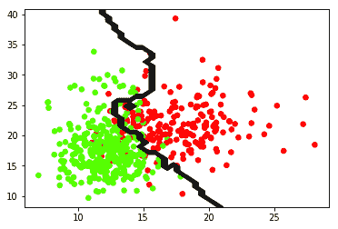
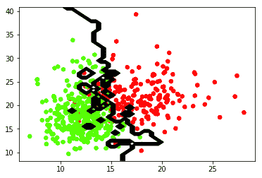

# k 最近邻

> 原文： [https://machine-learning-course.readthedocs.io/en/latest/content/supervised/knn.html](https://machine-learning-course.readthedocs.io/en/latest/content/supervised/knn.html)

## 介绍

K 最近邻（KNN）是机器学习的基本分类器。 **分类器**采用已经标记的数据集，然后尝试将新数据点标记到这些分类之一中。 因此，我们正在尝试确定对象所在的类。为此，我们查看与对象最接近的点（邻居），并且拥有最多邻居的类将成为我们确定对象所属的类。 k 是与对象最近的邻居数。 因此，如果 k = 1，则该对象将属于的类是最近邻的类。 让我们看一个例子。



参考： [https://coxdocs.org](https://coxdocs.org)

在此示例中，我们尝试将红色星形分类为绿色正方形或蓝色八边形。 首先，如果我们看 k = 3 的内圆，我们可以看到有 2 个蓝色八边形和 1 个绿色正方形。 因此，蓝色八角形占大多数，因此红色星号将被分类为蓝色八角形。 现在我们看 k = 5，即外圆。 在这一个中，有 2 个蓝色八边形和 3 个绿色正方形。 然后，红星将被分类为绿色方块。

## 它是如何工作的？

我们将研究两种不同的解决方法。 两种方式是暴力法和 K-D 树法。

## 暴力法

这是最简单的方法。 基本上，它只是计算从要分类的对象到集合中每个点的**欧几里德距离**。 欧几里得距离就是连接两个点的线段的长度。 当点的尺寸较小或点数较小时，“暴力”方法很有用。 随着点数的增加，该方法必须计算欧几里得距离的次数也增加，因此该方法的表现下降。 幸运的是，K-D 树方法可以更好地处理更大的数据集。

## K-D 树法

该方法试图通过减少计算欧几里得距离的次数来改善运行时间。 此方法背后的思想是，如果我们知道两个数据点彼此靠近，并且计算到其中一个的欧几里得距离，那么我们就知道该距离大致接近另一个点。 这是 K-D 树的外观示例。



参考： [https://slideplayer.com/slide/3273367/](https://slideplayer.com/slide/3273367/)

K-D 树的工作方式是树中的一个节点表示并保存 n 维图中的数据。 每个节点代表图中的一个框。 首先，我们可以根据一组数据构建一个 KD 树，然后当需要对一个点进行分类时，我们只需查看该点将落在树中的位置，然后仅计算它所接近的点之间的欧几里得距离，直到我们 达到 k 个邻居。

如果数据集较大，建议使用此方法。 这是因为，如果数据集较大，则创建 K-D 树的成本相对较低，并且随着数据变大，对点进行分类的成本不变。

## 选择 k

选择 k 通常取决于您要查看的数据集。 您永远不要选择 k = 2，因为它极有可能不会出现多数类，因此在上面的示例中将每个中都有一个，因此我们无法对红星进行分类。 通常，您希望 k 的值较小。 当 k 趋于无穷大时，所有未识别的数据点将始终归为一类或另一类，具体取决于哪一类具有更多数据点。 您不希望发生这种情况，因此明智的选择一个相对较小的 k。

## 总结

以下是一些要带走的东西：

*   KNN 的不同方法只会影响表现，而不会影响输出
*   当点的尺寸或点数较小时，最好使用暴力法
*   当您拥有更大的数据集时，K-D 树方法是最好的
*   SKLearn KNN 分类器具有一种自动方法，该方法可以根据所训练的数据来决定使用哪种方法。

选择 k 的值将大大改变数据的分类方式。 较高的 k 值将忽略数据的异常值，而较低的 k 值将赋予它们更大的权重。 如果 k 值太高，将无法对数据进行分类，因此 k 需要相对较小。

## 动机

那么为什么有人会在另一个分类器上使用这个分类器呢？ 这是最好的分类器吗？ 这些问题的答案取决于它。 没有最好的分类器，这完全取决于给出分类器的数据。 对于一个数据集，KNN 可能是最好的，但对于另一个数据集，则不是。 最好了解[支持向量机](https://machine-learning-course.readthedocs.io/en/latest/content/supervised/linear_SVM.html)等其他分类器，然后确定哪个分类器可以最好地对给定的数据集进行分类。

## 代码示例

请查看我们的代码 [knn.py](https://github.com/machinelearningmindset/machine-learning-course/blob/master/code/supervised/KNN/knn.py) ，以了解如何使用 Python 的 Scikit-learn 库实现 k 最近邻分类器。 有关 Scikit-Learn 的更多信息，请在中找到[。](https://scikit-learn.org)

[knn.py](https://github.com/machinelearningmindset/machine-learning-course/blob/master/code/supervised/KNN/knn.py) ，对从 Scikit-Learn 的数据集库加载的一组乳腺癌数据进行分类。 该程序将获取数据并将其绘制在图形上，然后使用 KNN 算法来最好地分离数据。 输出应如下所示：



绿点被分类为良性。 红点归类为恶性。 边界线是分类器做出的预测。 该边界线由 k 值确定，在这种情况下，k = 9。

这将从 Scikit-Learn 的数据集库中加载数据。 您可以将数据更改为所需的任何数据。 只要确保您有数据点和一系列目标即可对这些数据点进行分类。

```py
dataCancer = load_breast_cancer()
data = dataCancer.data[:, :2]
target = dataCancer.target

```

您还可以更改将更改算法的 k 值或 n_neighbors 值。 建议您选择一个相对较小的 k。

您还可以更改使用的算法，选项为{'auto'，'ball_tree'，'kd_tree'，'brute'}。 这些不会更改预测的输出，只会更改预测数据所需的时间。

尝试在下面的代码中将 n_neighbors 的值更改为 1。

```py
model = KNeighborsClassifier(n_neighbors = 9, algorithm = 'auto')
model.fit(data, target)

```

如果将 n_neighbors 的值更改为 1，则将按最接近该点的点进行分类。 输出应如下所示：



将该输出与 k = 9 进行比较，您会发现如何对数据进行分类有很大的不同。 因此，如果您想忽略离群值，则需要较高的 k 值，否则请选择较小的 k（例如 1、3 或 5）。您可以通过选择大于 100 的非常高的 k 进行试验。最终，算法会将所有数据分类为 1 类，并且没有行可以拆分数据。

## 参考文献

1.  <https://medium.com/machine-learning-101/k-nearest-neighbors-classifier-1c1ff404d265>
1.  <https://www.analyticsvidhya.com/blog/2018/03/introduction-k-neighbours-algorithm-clustering/>
1.  <https://scikit-learn.org/stable/modules/generated/sklearn.neighbors.KNeighborsClassifier.html>
1.  <https://turi.com/learn/userguide/supervised-learning/knn_classifier.html>