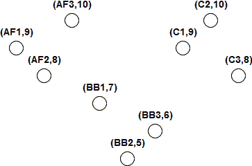
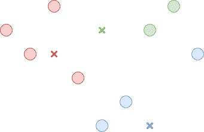
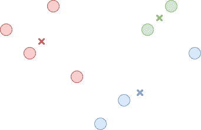
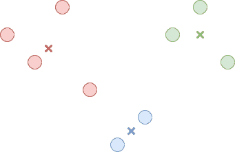
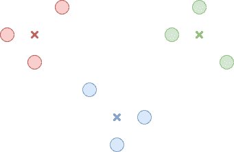
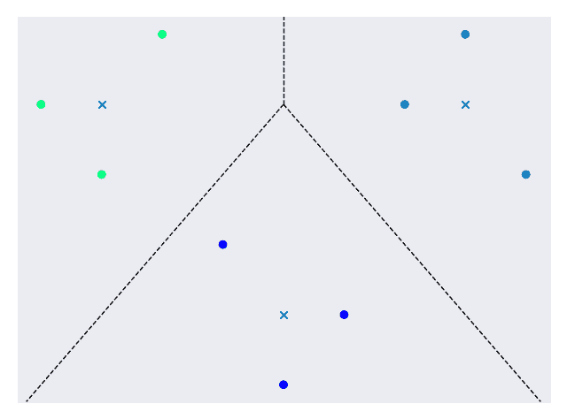
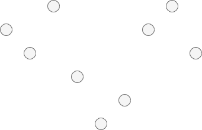
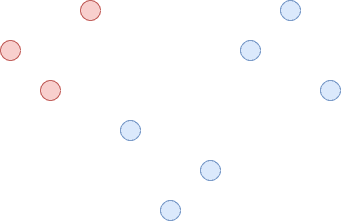
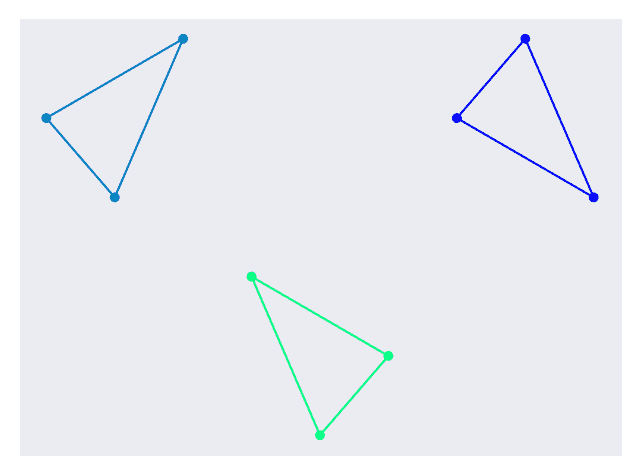

# 聚类

> 原文： [https://machine-learning-course.readthedocs.io/en/latest/content/unsupervised/clustering.html](https://machine-learning-course.readthedocs.io/en/latest/content/unsupervised/clustering.html)

## 概述

在先前的模块中，我们讨论了监督学习主题。 我们现在准备继续进行**无监督学习**，我们的目标将有很大的不同。 在监督学习中，我们尝试将输入与某些现有模式进行匹配。 对于无监督学习，我们将尝试在未标记的原始数据集中发现模式。 我们看到有监督学习中经常出现分类问题，现在我们将研究无监督学习中的类似问题**：聚类**。

## 聚类

聚类是将相似数据分组并隔离不相似数据的过程。 我们希望我们提出的聚类中的数据点共享一些公共属性，以将它们与其他聚类中的数据点分开。 最终，我们将得到一些满足这些要求的小组。 这听起来似乎很熟悉，因为表面上听起来很像分类。 但是请注意，聚类和分类解决了两个非常不同的问题。 聚类用于识别数据集中的潜在组，而分类用于将输入与现有组进行匹配。

## 动机

聚类是解决无监督学习中常见问题的非常有用的技术。 通过聚类，我们可以通过对相似的数据点进行分组来找到数据集中的基础模式。 考虑玩具制造商的情况。 玩具制造商生产许多产品，并且碰巧拥有多样化的消费群。 对于制造商来说，识别购买特定产品的群体可能很有用，以便可以个性化广告。 有针对性的广告是行销中的普遍愿望，而聚类有助于确定受众特征。 当我们想识别原始数据集中潜在的群体结构时，聚类是一个很好的使用工具。

## 方法

由于群集只是提供了对数据集的解释，因此有许多方法可以实现它。 在决定群集时，我们可能会考虑数据点之间的距离。 我们还可以考虑一个区域中的数据点密度以确定聚类。 对于此模块，我们将分析两种较常见且流行的方法： **K-均值**和**层次**。 在这两种情况下，我们都将使用图 1 中的数据集进行分析。



**图 1.用于聚类** 的数据集

此数据集表示玩具制造商的产品数据。 该制造商向 5 至 10 岁的幼儿出售 3 种产品，每种产品有 3 种变体。这些产品是可动人偶，积木和汽车。 制造商还指出，哪个年龄段的人群购买每种产品的比例最高。 数据集中的每个点代表购买最多玩具的玩具和年龄组之一。

### K 均值

K-均值聚类尝试使用迭代过程将数据集划分为 K 个聚类。 第一步是为每个群集选择一个中心点。 该中心点不需要与实际数据点相对应。 中心点可以随机选择，或者如果我们对它们应该在哪里有很好的猜测，可以选择它们。 在下面的代码中，中心点是使用 k-means ++方法选择的，该方法旨在加快收敛速度​​。 此方法的分析超出了本模块的范围，但是对于 sklearn 中的其他初始选项，请在此处选中[。](https://scikit-learn.org/stable/modules/generated/sklearn.cluster.KMeans.html)

第二步是将每个数据点分配给一个群集。 我们通过测量数据点与每个中心点之间的距离并选择中心点最接近的聚类来做到这一点。 图 2 中说明了此步骤。



**图 2.将每个点与一个群集关联**

现在，所有数据点都属于一个群集，第三步是重新计算每个群集的中心点。 这只是属于该群集的所有数据点的平均值。 图 3 中说明了此步骤。



**图 3.找到每个群集的新中心**

现在，我们只重复第二和第三步，直到中心在迭代之间停止变化或仅略微变化为止。 结果是 K 个群集，其中数据点比任何其他群集的中心更靠近其群集的中心。 这在图 4 中进行了说明。



**图 4.最终簇**

K-Means 聚类要求我们输入并非总是容易确定的期望聚类数。 取决于我们在第一步中选择起点的位置，它也可能不一致。 在整个过程中，我们最终可能会看到聚类已被优化，但可能不是最佳的整体解决方案。 在图 4 中，我们以一个红色数据点结束，该数据点与红色中心和蓝色中心的距离相等。 这源于我们最初的中心选择。 相比之下，图 5 显示了在给定不同起始中心的情况下可能达到的另一个结果，并且看起来更好。



**图 5.一组替代聚类**

另一方面，K-Means 非常强大，因为它在每个步骤都考虑了整个数据集。 由于我们只计算距离，因此速度也很快。 因此，如果我们需要一种考虑整个数据集的快速技术，并且对底层组的外观有所了解，那么 K-Means 是一个不错的选择。

相关代码可在 [clustering_kmeans.py](https://github.com/machinelearningmindset/machine-learning-course/blob/master/code/unsupervised/Clustering/clustering_kmeans.py) 文件中找到。

在代码中，我们创建了用于分析的简单数据集。 设置聚类非常简单，需要一行代码：

```py
kmeans = KMeans(n_clusters=3, random_state=0).fit(x)

```

选择`n_clusters`参数为 3，因为输出数据集中似乎有 3 个簇。 每次运行代码时，`random_state`参数都可提供一致的结果。 其余代码将显示图 6 中显示的最终图。



**图 6.最终的群集数据集**

群集用颜色编码，“ x”表示群集中心，虚线表示群集边界。

### 层次

层次聚类将数据集想象为聚类的层次结构。 我们可以从所有数据点中建立一个巨型群集开始。 这在图 7 中进行了说明。



**图 7.数据集中的一个巨型群集***

在此群集内，我们找到两个最不相似的子群集并将其拆分。 这可以通过使用一种算法来实现，以使聚类间距离最大化。 这只是一个群集中的节点与另一群集中的节点之间的最小距离。 这在图 8 中进行了说明。



**图 8.巨型群集分为 2 个群集**

我们将继续拆分子聚类，直到每个数据点都属于其自己的聚类，或者直到我们决定停止为止。 如果我们从一个巨型群集开始，然后将其分解为较小的群集，则称为**自上而下**或**分裂**群集。 或者，我们可以从考虑每个数据点的群集开始。 下一步是将两个最接近的群集合并为一个较大的群集。 这可以通过找到每个群集之间的距离并选择它们之间距离最小的一对来完成。 我们将继续此过程，直到只有一个聚类。 这种组合群集的方法称为**自下而上**或**聚集**群集。 在这两种方法的任何时候，我们都可以在聚类看起来合适时停止。

与 K-Means 不同，层次聚类相对较慢，因此无法很好地扩展到大型数据集。 从好的方面来说，当您多次运行层次聚类时，它会更加一致，并且不需要您知道预期的聚类数量。

相关代码可在 [clustering_hierarchical.py](https://github.com/machinelearningmindset/machine-learning-course/blob/master/code/unsupervised/Clustering/clustering_hierarchical.py) 文件中找到。

在代码中，我们创建了用于分析的简单数据集。 设置聚类非常简单，需要一行代码：

```py
hierarchical = AgglomerativeClustering(n_clusters=3).fit(x)

```

选择`n_clusters`参数为 3，因为输出数据集中似乎有 3 个簇。 如果我们还不了解这一点，我们可以尝试不同的值，然后看看哪个值效果最好。 其余代码将显示图 9 中显示的最终图。



**图 9.最终的群集数据集**

群集使用颜色编码，大型群集周围有边框，以显示哪些数据点属于它们。

## 总结

在本模块中，我们了解了聚类。 聚类允许我们通过对相似数据点进行分组来发现原始数据集中的模式。 这是无监督学习中的普遍愿望，而聚类是一种流行的技术。 您可能已经注意到，与以前的模块中一些数学上比较繁重的描述相比，上面讨论的方法相对简单。 这些方法简单但功能强大。 例如，我们能够确定玩具制造商示例中可用于定向广告的聚类。 对于企业而言，这是非常有用的结果，并且只花了几行代码。 通过对聚类的深入了解，您将为在机器学习领域取得成功做好准备。

## 参考文献

1.  <https://www.analyticsvidhya.com/blog/2016/11/an-introduction-to-clustering-and-different-methods-of-clustering/>
1.  <https://medium.com/datadriveninvestor/an-introduction-to-clustering-61f6930e3e0b>
1.  <https://medium.com/predict/three-popular-clustering-methods-and-when-to-use-each-4227c80ba2b6>
1.  <https://towardsdatascience.com/the-5-clustering-algorithms-data-scientists-need-to-know-a36d136ef68>
1.  <https://scikit-learn.org/stable/modules/generated/sklearn.cluster.KMeans.html>