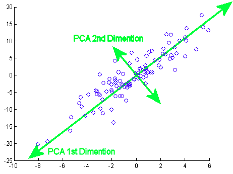
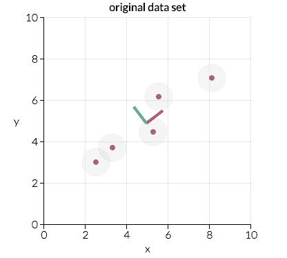
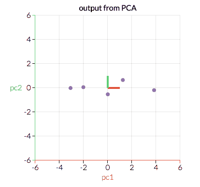
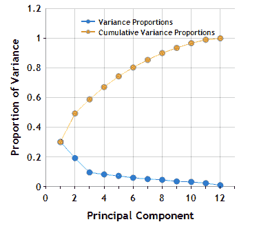
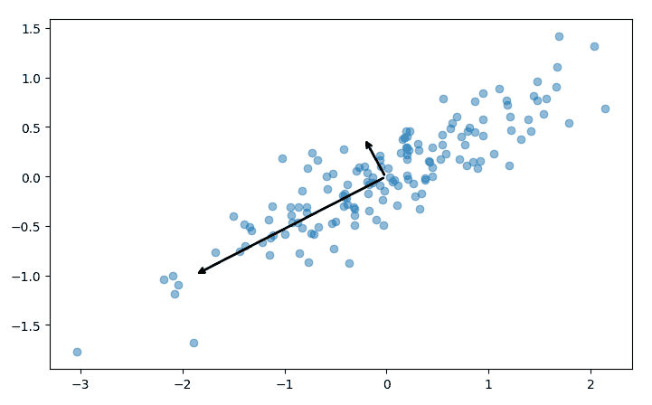
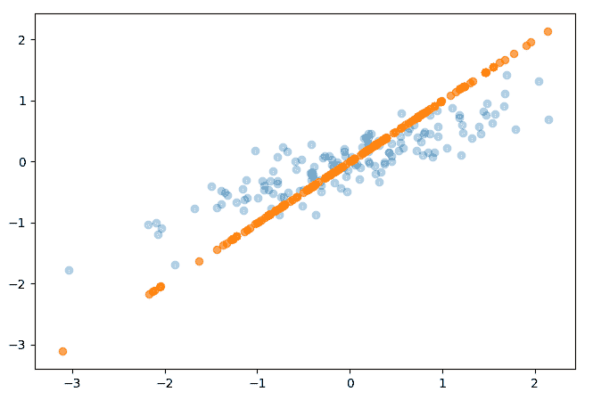

# 主成分分析

> 原文： [https://machine-learning-course.readthedocs.io/en/latest/content/unsupervised/pca.html](https://machine-learning-course.readthedocs.io/en/latest/content/unsupervised/pca.html)

## 介绍

主成分分析是一种用于获取大量互连变量并选择最适合模型的技术。 仅关注几个变量的过程称为**降维**，有助于降低数据集的复杂度。 从根本上讲，主成分分析总结了数据。



参考： [https://stats.stackexchange.com/questions/2691/making-sense-of-principal-component-analysis-eigenvectors-特征值](https://stats.stackexchange.com/questions/2691/making-sense-of-principal-component-analysis-eigenvectors-eigenvalues)

## 动机

主成分分析对于得出具有多个变量的给定数据集的整体线性独立趋势非常有用。 它使您可以从可能相关或不相关的变量中提取重要的关系。 主成分分析的另一种应用是显示-您可以仅代表几个主成分并绘制它们，而不是代表多个不同的变量。

## 降维

降维有两种类型：特征消除和特征提取。

**特征消除**仅涉及从我们认为不必要的数据集中修剪特征。特征消除的缺点是，我们会失去从删除的特征中获得的任何潜在信息。

**特征提取**但是，通过组合现有特征来创建新变量。 以某些简单性或可解释性为代价，特征提取使您可以维护特征中保存的所有重要信息。

主成分分析通过创建一组称为主成分的自变量来处理特征提取（而不是消除）。

## PCA 示例

主成分分析是通过考虑所有变量并计算一组表示它们的方向和幅度对（向量）来进行的。 例如，让我们考虑下面绘制的一个小的示例数据集：



参考： [https://towardsdatascience.com/a-one-stop-shop-for-principal-component-analysis-5582fb7e0a9c](https://towardsdatascience.com/a-one-stop-shop-for-principal-component-analysis-5582fb7e0a9c)

在这里我们可以看到两个方向对，分别由红线和绿线表示。 在这种情况下，红点的幅度更大，因为与绿色方向相比，这些点在更大的距离上更聚集。 主成分分析将使用幅值较大的向量将数据转换为较小的特征空间，从而降低维数。 例如，上面的图将转换为以下内容：



参考： [https://towardsdatascience.com/a-one-stop-shop-for-principal-component-analysis-5582fb7e0a9c](https://towardsdatascience.com/a-one-stop-shop-for-principal-component-analysis-5582fb7e0a9c)

通过以这种方式转换数据，我们已经忽略了对模型不那么重要的特征-也就是说，沿绿色方向的较大变化比沿红色方向的变化对结果的影响更大。

为简洁起见，本次讨论不包括主成分分析背后的数学，但是如果您有兴趣学习它们，我们强烈建议您访问本页底部列出的参考文献。

## 成分数

在上面的示例中，我们采用了二维特征空间并将其缩减为一维。 但是，在大多数情况下，您将使用两个以上的变量。 主成分分析可用于仅删除单个特征，但减少多个特征通常很有用。 您可以采用几种策略来决定要执行多少次特征缩减：

1.  **任意**

    这仅涉及选择许多特征以保留给定模型。 此方法高度依赖于您的数据集和要传达的内容。 例如，将您的高阶数据表示在 2D 空间进行可视化可能会有所帮助。 在这种情况下，您将执行特征简化，直到拥有两个特征。

2.  **累积变异性的百分比**

    主成分分析计算的一部分涉及寻找方差的比例，该方差在每轮 PCA 执行中接近 1。 选择特征减少步骤数的这种方法涉及选择目标方差百分比。 例如，让我们看一下理论数据集在 PCA 各个级别上的累积方差图：

    

    参考： [https://www.centerspace.net/clustering-analysis-part-i-principal-component-analysis-pca](https://www.centerspace.net/clustering-analysis-part-i-principal-component-analysis-pca)

    上面的图像称为碎石图，它表示每个主成分的累积和当前方差比例。 如果我们希望至少有 80% 的累积方差，我们将根据此 scree 图使用至少 6 个主成分。 通常不建议针对 100% 的差异，因为达到这意味着您的数据集具有冗余数据。

3.  **个体变异性的百分比**

    在达到累积的可变性百分比之前，不使用主成分，而可以使用主成分，直到新成分不会增加太多可变性为止。 在上图中，我们可能选择使用 3 个主要成分，因为下一个成分的变异性没有那么大的下降。

## 总结

主成分分析是一种汇总数据的技术，并且根据您的用例具有很高的灵活性。 在显示和分析大量可能的因变量方面，它可能很有价值。 执行主成分分析的技术范围从任意选择主成分到自动找到它们直到达到差异为止。

## 代码示例

我们的示例代码 [pca.py](https://github.com/machinelearningmindset/machine-learning-course/blob/master/code/unsupervised/PCA/pca.py) 展示了如何对随机 x，y 对的数据集执行主成分分析。 该脚本经过很短的生成这些数据的过程，然后调用 sklearn 的 PCA 模块：

```py
# Find two principal components from our given dataset
pca = PCA(n_components = 2)
pca.fit(points)

```

该过程的每个步骤都包含使用 matplotlib 的有用可视化。 例如，上面拟合的主成分被绘制为数据集上的两个向量：



该脚本还显示了如何执行上述降维。 在 sklearn 中，这是通过在安装 PCA 之后简单地调用 transform 方法来完成的，或者使用 fit_transform 同时执行两个步骤：

```py
# Reduce the dimensionality of our data using a PCA transformation
pca = PCA(n_components = 1)
transformed_points = pca.fit_transform(points)

```

转换的最终结果只是一系列 X 值，尽管该代码示例执行了逆向转换以在下图中绘制结果：



## 参考文献

1.  <http://www.cs.otago.ac.nz/cosc453/student_tutorials/principal_components.pdf>
1.  <https://towardsdatascience.com/a-one-stop-shop-for-principal-component-analysis-5582fb7e0a9c>
1.  <https://towardsdatascience.com/pca-using-python-scikit-learn-e653f8989e60>
1.  <https://en.wikipedia.org/wiki/Principal_component_analysis>
1.  <https://stats.stackexchange.com/questions/2691/making-sense-of-principal-component-analysis-eigenvectors-eigenvalues>
1.  <https://www.centerspace.net/clustering-analysis-part-i-principal-component-analysis-pca>