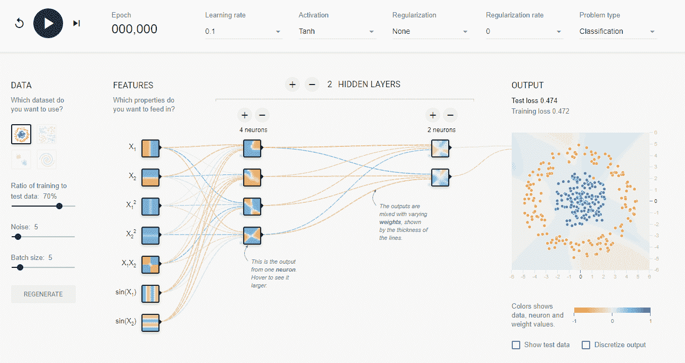
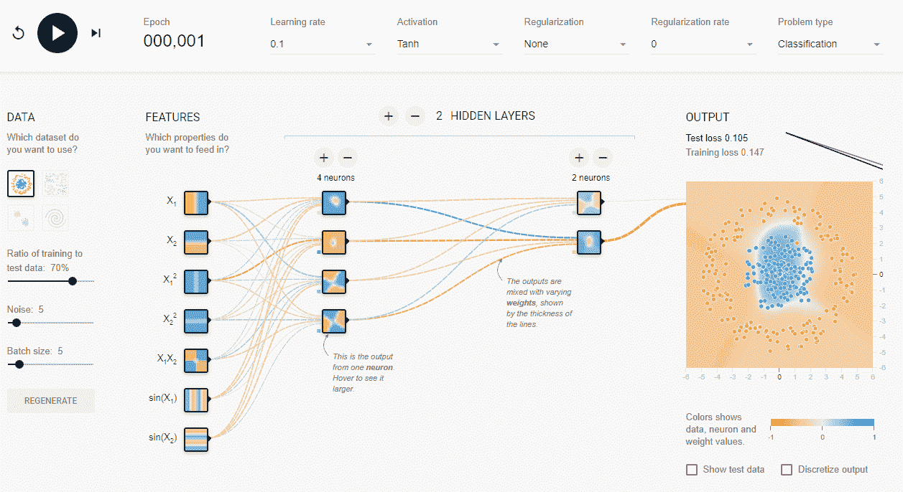
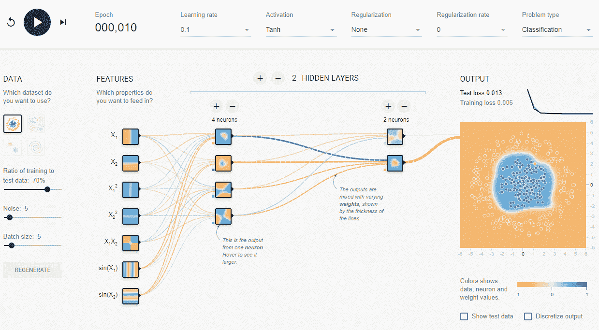

# 多层感知机

> 原文： [https://machine-learning-course.readthedocs.io/en/latest/content/deep_learning/mlp.html](https://machine-learning-course.readthedocs.io/en/latest/content/deep_learning/mlp.html)

## 概述

多层感知机（MLP）是深层的人工**神经网络**。 神经网络由节点层组成，这些节点根据先前层的节点在不同级别上激活。 在考虑神经网络时，将您的思想隔离到网络中的单个节点可能会有所帮助。

多层感知机是指具有至少三层节点，一个输入层，一些中间层和一个输出层的神经网络。 给定层中的每个节点都连接到相邻层中的每个节点。 输入层就是它，它是网络接收数据的方式。 中间层是网络的计算机，它们实际上将输入转换为输出。 输出层是从神经网络获得结果的方式。 在一个响应为二进制的简单网络中，输出层中可能只有一个节点，该节点输出的概率类似于 [logistic 回归](https://machine-learning-course.readthedocs.io/en/latest/content/supervised/logistic_regression.html)。

要直观地查看正在运行的神经网络，请使用此[网站](https://playground.tensorflow.org/)，您可以在其中看到数字识别神经网络。 在本节中，想法集中在“完全连接”的层上，因此请尝试从这些角度进行思考。

他们需要标记的样本数据，因此他们进行**有监督的学习**。 对于每个训练样本，节点根据上一层的存储权重激活。 在训练期间（以及以后），权重将不会完全准确，因此需要稍作调整才能达到理想的效果。 MLP 使用一种称为反向传播的方法来从训练数据中学习，我们将在这里对此进行简要介绍。

## 动机

多层感知机是神经网络的基本类型，在进入更高级的模型之前应充分理解。 通过检查 MLP，我们应该能够避免深度学习中更高级的主题中出现的一些复杂情况，并建立知识基线。

这并不是要低估主题，因为即使是简单的网络也可以取得很好的效果。 [被证明](https://en.wikipedia.org/wiki/Universal_approximation_theorem)，具有单个隐藏层的网络可以近似任何连续函数。

## 什么是节点？

节点是神经网络中的单个单元。 节点**在不同级别上激活**，具体取决于上一层节点的加权总和。 实际上，实际激活是将 **S 型函数**应用于此结果的结果，但为简单起见，我们将在此处跳过该细节。 以这种方式考虑输出不会丢失任何神经网络的魔力，同时避免了一些痛苦的细节。 在 MLP 中，节点根据**激活上一层中所有节点的**。

在此示例中，我们将重点放在单节点层上，这是出于示例目的。 每行代表上一层中节点的权重。 每个连接的权重之和乘以连接的节点的激活数，就可以激活我们的节点。 这里的关键是权重，因为权重决定了节点的输出。 请记住，节点仅从上一层获取输入，因此权重是同一层中节点的唯一区别。

## 什么定义了多层感知机？

多层感知机（MLP）是**前馈**神经网络的一种，其特征在于输入层，一些中间层和输出层是**完全连接的**。 MLP 使用**反向传播**进行训练。 术语**前馈**是指网络中的分层架构，特别是网络中没有周期。 层结构可确保不存在循环，因为仅允许层具有来自直接上一层的权重。 术语**完全连接**是指以下事实：在 MLP 中，给定层中的所有节点都具有前一层中所有节点的权重。

## 什么是反向传播？

训练神经网络时，预期输出是输出层中每个节点的激活级别。 从该信息和实际激活，我们可以找到每个节点的成本，并相应地调整权重。 反向传播的想法是调整权重，以根据成本确定每个节点的激活状态。

为了使这个想法更深入，我们将避免有关精确数学如何工作的细节，而是着眼于大局。 如果您想看数学，请查看[这篇文章](http://neuralnetworksanddeeplearning.com/chap2.html)。

看一下从先前链接的[张量流](https://playground.tensorflow.org/)测试站点获取的屏幕截图。 在这里，我们正在训练一个神经网络，对蓝色点和橙色点进行分类。 此处为节点所做的选择是任意的，我们鼓励您弄乱它们。

要讨论反向传播，让我们考虑一下该网络第一步。 网络将测试网络中的一些训练数据，期望在（隐藏）正确的输出节点上看到完全激活，而在错误的输出节点上没有看到激活。 当模型不正确时，它将从输出向后看，以找出错误之处。 然后，它将相应地改变权重，因此偏离的权重将比接近的权重改变更多。 在这些早期步骤中，它将具有较高的**学习率**，从而使权重更加不稳定。 经过几次迭代后，它将更加稳定，因为它需要进行较小的调整。 考虑到这一点，让我们前进一步。

现在，网络对如何对数据进行分类有一个模糊的想法。 它有一个松散的圆圈，随着我们的进行，它将变得更加清晰。 让我们向前走几步。

如您所见，该模型具有更好的表现，可以对大多数点进行准确分类。 在这一点上，网络减慢了**学习率**，因为它已经经历了足够的迭代才能获得成功。

## 总结

在本节中，我们了解了神经网络的多层感知机（MLP）类，以及有关整个神经网络的一些知识。 我们谈到了节点是什么，以及它对周围发生的事情有什么了解。 我们讨论了网络如何从训练数据中学习，特别是使用反向传播。 我们还研究了定义 MLP 网络的内容以及它们与其他神经网络的区别。

## 更多资源

如果您想了解有关神经网络的更多信息，我们推荐 YouTube 上 3Blue1Brown 的[播放列表](https://www.youtube.com/playlist?list=PLZHQObOWTQDNU6R1_67000Dx_ZCJB-3pi)。

播放列表涵盖了一种更直观的神经网络方法，可以帮助您填写神经网络的一些细节。

## 参考文献

1.  <https://playground.tensorflow.org/>
1.  <https://en.wikipedia.org/wiki/Universal_approximation_theorem>
1.  <https://www.techopedia.com/definition/20879/multilayer-perceptron-mlp>
1.  <http://neuralnetworksanddeeplearning.com/chap2.html>
1.  <https://www.youtube.com/playlist?list=PLZHQObOWTQDNU6R1_67000Dx_ZCJB-3pi>
1.  <http://cs231n.stanford.edu/>