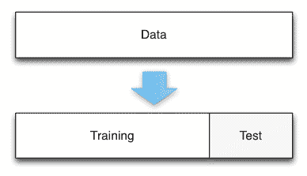
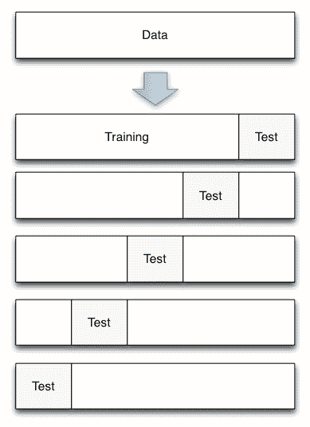
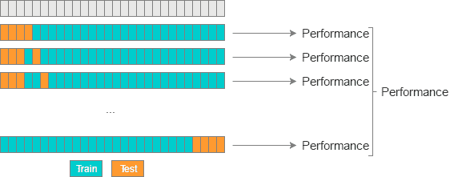
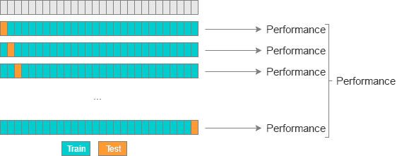

# 交叉验证

> 原文： [https://machine-learning-course.readthedocs.io/en/latest/content/overview/crossvalidation.html](https://machine-learning-course.readthedocs.io/en/latest/content/overview/crossvalidation.html)

## 动机

针对特定数据集训练模型很容易，但是在引入新数据后该模型的表现如何？ 您如何知道要使用哪种机器学习模型？ 交叉验证通过确保模型产生准确的结果并将这些结果与其他模型进行比较来回答这些问题。 交叉验证超越了常规验证，即通过评估模型如何对新数据进行分析来分析模型如何在其自身的训练数据上进行的过程。 以下各节讨论了几种不同的交叉验证方法：

## Holdout 方法

Holdout 交叉验证方法涉及删除训练数据的特定部分并将其用作测试数据。 首先针对训练集对模型进行训练，然后要求对测试集的输出进行预测。 这是交叉验证技术的最简单形式，如果您有大量数据或需要快速，轻松地实现验证，则此方法很有用。



通常，Holdout 方法涉及将数据集分为 20-30% 的测试数据，其余作为训练数据。 这些数字可能会有所不同-较大的测试数据百分比会减少模型的训练经验，从而使您的模型更容易出错，而较小比例的测试数据可能会使模型对训练数据产生不必要的偏差。 缺乏训练或偏置会导致我们模型的[欠拟合/过拟合](https://machine-learning-course.readthedocs.io/en/latest/content/overview/overfitting.html)。

## K 折交叉验证

K 折交叉验证可通过对数据集的 k 个子集重复 Holdout 方法来帮助消除模型中的这些偏差。 借助 K 折交叉验证，数据集可分为多个独特的测试和训练数据折叠。 使用数据的每种组合执行 Holdout 方法，并对结果求平均值以找到总误差估计。



这里的“折叠”是测试数据的唯一部分。 例如，如果您有 100 个数据点并使用 10 折，则每折包含 10 个测试点。 K 折叠交叉验证很重要，因为它允许您将完整的数据集用于训练和测试。 当使用较小或有限的数据集评估模型时，此功能特别有用。

## Leave-P-Out/留一法交叉验证

Leave-P-Out 交叉验证（LPOCV）通过使用模型上 P 个测试数据点的所有可能组合来测试模型。 举一个简单的例子，如果您有 4 个数据点并使用 2 个测试点，则将按照以下方式训练和测试模型：

```py
1: [ T T - - ]
2: [ T - T - ]
3: [ T - - T ]
4: [ - T T - ]
5: [ - T - T ]
6: [ - - T T ]

```

其中“ T”是测试点，“-”是训练点。 以下是 LPOCV 的另一种可视化效果：



参考： [http://www.ebc.cat/2017/01/31/cross-validation-strategies/](http://www.ebc.cat/2017/01/31/cross-validation-strategies/)

LPOCV 可以提供极其准确的误差估计，但是对于大型数据集，它很快就会变得面面俱到。 可以使用数学[组合](https://en.wikipedia.org/wiki/Combination) n C P 来计算使用 LPOCV 模型必须经历的测试迭代次数，其中 n 是我们的数据点总数。 例如，我们可以看到，使用 10 个点的数据集和 3 个测试点运行 LPOCV，将需要 10 C 3 = 120 次迭代。

因此，留一法交叉验证（LOOCV）是一种常用的交叉验证方法。 它只是 LPOCV 的子集，P 为 1。这使我们能够以与数据点相同的步骤数评估模型。 LOOCV 也可以看作是 K 折交叉验证，其中折的数量等于数据点的数量。



参考： [http://www.ebc.cat/2017/01/31/cross-validation-strategies/](http://www.ebc.cat/2017/01/31/cross-validation-strategies/)

与 K 折交叉验证相似，LPOCV 和 LOOCV 使用完整数据集训练模型。 当您使用小型数据集时，它们特别有用，但会影响表现。

## 总结

交叉验证是一种针对新数据验证模型的方法。 交叉验证的最有效形式包括针对数据集重复测试模型，直到使用每个点或点的组合来验证模型为止，尽管这需要进行表现折衷。 我们讨论了分割数据集以进行交叉验证的几种方法：

*   Holdout 方法：将一部分数据拆分为测试数据
*   K 折法：将数据划分为多个部分，将每个部分用作测试/训练拆分
*   LPOCV 方法：使用多个点（P）的每一个组合作为测试数据

## 动机

机器学习模型有很多不同的类型，包括线性/逻辑回归，K 最近邻和支持向量机-但是我们如何知道哪种类型的模型最适合我们的数据集？ 使用不适合我们的数据的模型将导致预测的准确率降低，并可能导致财务，自然或其他形式的损害。 个人和公司应确保对使用的任何模型进行交叉验证。

## 代码示例

提供的代码显示了如何使用 [Scikit-Learn](https://scikit-learn.org) （一种 Python 机器学习库），使用三种讨论的交叉验证方法来拆分一组数据。

[holdout.py](https://github.com/machinelearningmindset/machine-learning-course/tree/master/code/overview/cross-validation/holdout.py) 使用 Holdout 方法拆分一组样本糖尿病数据。 在 scikit-learn 中，这是使用称为`train_test_split()`的函数完成的，该函数将一组数据随机分为两部分：

```py
TRAIN_SPLIT = 0.7
...

dataset = datasets.load_diabetes()
...

x_train, x_test, y_train, y_test = train_test_split(...)

```

请注意，您可以通过更改顶部的`TRAIN_SPLIT`值来更改用于训练的数据部分。 该数字应为 0 到 1 之间的一个数字。此文件的输出显示用于拆分的训练和测试点的数量。 查看实际的数据点可能会有所帮助-如果您想查看这些数据点，请取消注释脚本中的最后两个打印语句。

* * *

[k-fold.py](https://github.com/machinelearningmindset/machine-learning-course/tree/master/code/overview/cross-validation/k-fold.py) 使用 K 折方法拆分一组数据。 这是通过创建一个 KFold 对象完成的，该对象初始化为要使用的拆分数。 通过 Scikit-learn，可以轻松调用 KFold 的`split()`方法来拆分数据：

```py
NUM_SPLITS = 3
data = numpy.array([[1, 2], [3, 4], [5, 6], [7, 8], [9, 10], [11, 12]])

kfold = KFold(n_splits=NUM_SPLITS)
split_data = kfold.split(data)

```

它的返回值是一个训练和测试点的数组。 请注意，您可以通过更改脚本顶部的关联值来使用分割数。 该脚本不仅输出训练/测试数据，还输出一个漂亮的栏，您可以在其中跟踪当前折叠的进度：

```py
[ T T - - - - ]
Train: (2: [5 6]) (3: [7 8]) (4: [ 9 10]) (5: [11 12])
Test:  (0: [1 2]) (1: [3 4])
...

```

* * *

[Leave-p-out.py](https://github.com/machinelearningmindset/machine-learning-course/tree/master/code/overview/cross-validation/leave-p-out.py) 使用 Leave-P-Out 和 Leave-One-Out 方法拆分一组数据。 这是通过创建 LeavePOut / LeaveOneOut 对象来完成的，该对象使用要使用的拆分数量初始化的 LPO。 与 KFold 相似，训练测试数据拆分是使用`split()`方法创建的：

```py
P_VAL = 2
data = numpy.array([[1, 2], [3, 4], [5, 6], [7, 8]])

loocv = LeaveOneOut()
lpocv = LeavePOut(p=P_VAL)

split_loocv = loocv.split(data)
split_lpocv = lpocv.split(data)

```

请注意，您可以在脚本顶部更改 P 值，以查看不同值如何工作。

## 参考文献

1.  <https://towardsdatascience.com/cross-validation-in-machine-learning-72924a69872f>
1.  <https://machinelearningmastery.com/k-fold-cross-validation/>
1.  <https://www.quora.com/What-is-cross-validation-in-machine-learning>
1.  <http://www.ebc.cat/2017/01/31/cross-validation-strategies/>