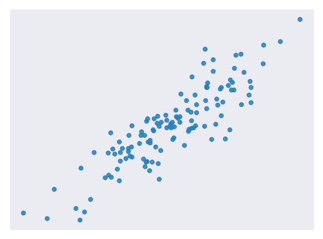
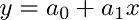
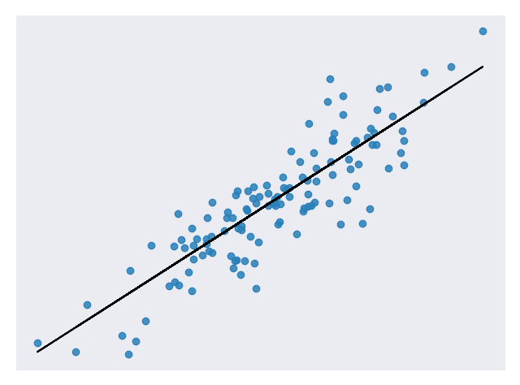
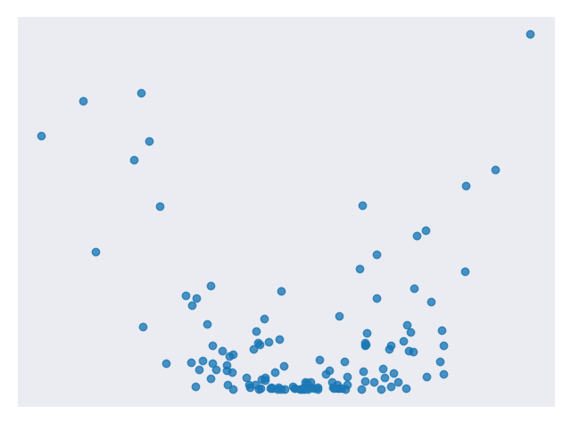
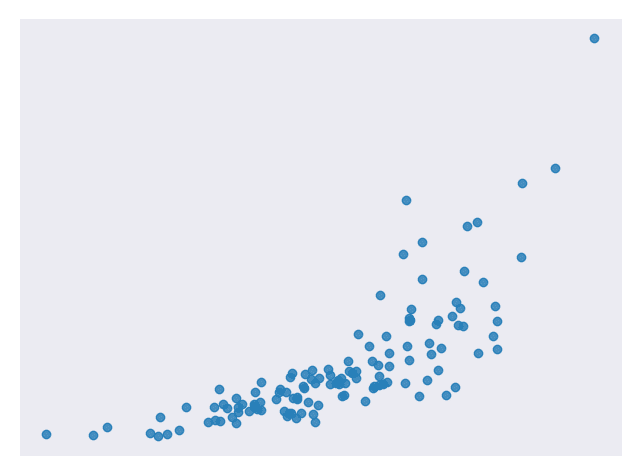
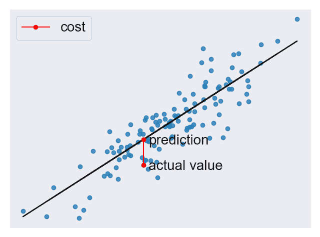
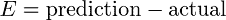
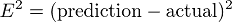
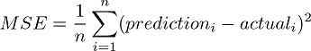

# 线性回归

> 原文： [https://machine-learning-course.readthedocs.io/en/latest/content/overview/linear-regression.html](https://machine-learning-course.readthedocs.io/en/latest/content/overview/linear-regression.html)

## 动机

当我们看到一个数据集时，我们尝试找出它的含义。 我们在数据点之间寻找连接，看看是否可以找到任何模式。 有时很难看到这些模式，因此我们使用代码来帮助我们找到它们。 数据可以遵循很多不同的模式，因此如果我们可以缩小选择范围并减少编写代码来分析它们的话，将很有帮助。 这些模式之一是线性关系。 如果我们可以在数据中找到这种模式，则可以使用线性回归技术对其进行分析。

## 概述

**线性回归**是一种用于分析**输入**变量和单个**输出**变量之间的**线性关系**的技术。 **线性关系**表示数据点趋向于直线。 **简单线性回归**仅涉及单个输入变量。 图 1 显示了具有线性关系的数据集。



**图 1.具有线性关系的示例数据集** [[代码](https://github.com/machinelearningmindset/machine-learning-course/blob/master/code/overview/linear_regression/linear_regression.py)]

我们的目标是找到最能模拟数据点路径的线，称为最佳拟合线。 公式 1 中的公式是线性公式的示例。



**方程 1。线性方程**

图 2 显示了我们在图 1 中使用的数据集，并通过了最合适的一行。



**图 2.来自图 1 的数据集，具有最佳拟合线** [[代码](https://github.com/machinelearningmindset/machine-learning-course/blob/master/code/overview/linear_regression/linear_regression_lobf.py)]

让我们分解一下。 我们已经知道 x 是输入值，y 是我们的预测输出。 a₀和 a₁描述我们线的形状。 a₀被称为**偏置**，而 a₁被称为**权重**。 更改 a₀将在绘图上向上或向下移动线，更改 a₁会更改线的斜率。 线性回归有助于我们为 a₀和 a₁选择合适的值。

请注意，我们可以有多个输入变量。 在这种情况下，我们称其为**多元线性回归**。 添加额外的输入变量仅意味着我们需要找到更多权重。 对于本练习，我们将仅考虑简单的线性回归。

## 何时使用

线性回归是一种有用的技术，但并非总是适合您的数据的正确选择。 当自变量和因变量之间存在线性关系并且您要预测连续值时，线性回归是一个不错的选择[图 1 ]。

当自变量和因变量之间的关系更复杂或输出为离散值时，这不是一个好选择。 例如，图 3 显示的数据集不具有线性关系，因此线性回归将不是一个好选择。



**图 3。 没有线性关系的样本数据集** [[代码](https://github.com/machinelearningmindset/machine-learning-course/blob/master/code/overview/linear_regression/not_linear_regression.py)]

值得注意的是，有时您可以将转换应用于数据，使其看起来是线性的。 例如，您可以将对数应用于指数数据以使其平坦化。 然后，您可以对转换后的数据使用线性回归。 [在此处](https://scikit-learn.org/stable/modules/generated/sklearn.compose.TransformedTargetRegressor.html)记录了一种在`sklearn`中转换数据的方法。

图 4 是看起来不是线性的但可以转换为具有线性关系的数据的示例。



**图 4.遵循指数曲线** [[代码](https://github.com/machinelearningmindset/machine-learning-course/blob/master/code/overview/linear_regression/exponential_regression.py)] 的样本数据集

图 5 是对数转换输出变量后的相同数据。


**图 5.将对数应用到输出变量** [[代码](https://github.com/machinelearningmindset/machine-learning-course/blob/master/code/overview/linear_regression/exponential_regression_transformed.py)] 后，图 4 中的数据集

## 成本函数

有了预测后，我们需要某种方法来判断它是否合理。 **成本函数**可帮助我们完成此任务。 成本函数将所有预测与它们的实际值进行比较，并为我们提供一个可用来对预测函数评分的单一数字。 图 6 显示了一个这样的预测的成本。



**图 6.来自图 2 的图，其中强调了一个预测的成本** [[代码](https://github.com/machinelearningmindset/machine-learning-course/blob/master/code/overview/linear_regression/linear_regression_cost.py)]

成本函数中出现的两个常用术语是**误差**和**平方误差**。 误差[公式 2 ]离我们的预测的实际值有多远。



**公式 2。示例误差函数**

平方该值为我们提供了一个通用误差距离的有用表达式，如公式 3 所示。



**公式 3。平方误差函数示例**

我们知道，实际值之上的误差 2 和实际值之下的误差 2 应该彼此差不多。 平方误差使这一点很清楚，因为这两个值都导致平方误差为 4。

我们将使用公式 4 中所示的均方误差（MSE）函数作为我们的成本函数。 此函数查找我们所有数据点的平均平方误差值。



**公式 4。均方误差（MSE）函数**

因为他们衡量我们的模型如何准确的对目标值成本函数对我们非常重要。 确保我们的模型是准确的将始终保持后模块的一个关键主题。

## 方法

成本较低的函数意味着数据点之间的平均误差较低。 换句话说，较低的成本意味着数据集的模型更准确。 我们将简要介绍一些使成本函数最小化的方法。

### 普通最小二乘

普通最小二乘法是使成本函数最小化的常用方法。 在这种方法中，我们将数据视为一个大矩阵，并使用线性代数来估计线性方程式中系数的最佳值。 幸运的是，您不必担心做任何线性代数，因为 Python 代码会为您处理它。 这也恰好是用于此模块代码的方法。

以下是此模块中与普通最小二乘法有关的 Python 代码的相关行。

```py
# Create a linear regression object
regr = linear_model.LinearRegression()

```

### 梯度下降

梯度下降法是一种猜测线性方程式系数的迭代方法，以最小化成本函数。 该名称来自微积分中的梯度概念。 基本上，此方法将稍微移动系数的值并监视成本是否降低。 如果成本在多次迭代中持续增加，我们会停止，因为我们可能已经达到了最低要求。 可以选择停止前的迭代次数和公差来微调该方法。

以下是此模块经过修改以使用梯度下降的 Python 代码的相关行。

```py
# Create a linear regression object
regr = linear_model.SGDRegressor(max_iter=10000, tol=0.001)

```

## 代码

该模块的主要代码位于 [linear_regression_lobf.py](https://github.com/machinelearningmindset/machine-learning-course/blob/master/code/overview/linear_regression/linear_regression_lobf.py) 文件中。

该模块中的所有图形都是通过 [linear_regression.py](https://github.com/machinelearningmindset/machine-learning-course/blob/master/code/overview/linear_regression/linear_regression.py) 代码的简单修改而创建的。

在代码中，我们分析具有线性关系的数据集。 我们将数据分为训练集以训练我们的模型和测试集以测试其准确率。 您可能已经猜到所使用的模型是基于线性回归的。 我们还将显示一条最佳拟合的数据图。

## 总结

在本模块中，我们学习了线性回归。 此技术可帮助我们使用线性关系对数据进行建模。 线性关系非常简单，但是仍然显示在许多数据集中，因此这是一个很好的技术。 学习线性回归是学习更复杂的分析技术的良好第一步。 在以后的模块中，我们将基于此处介绍的许多概念。

## 参考文献

1.  <https://towardsdatascience.com/introduction-to-machine-learning-algorithms-linear-regression-14c4e325882a>
1.  <https://machinelearningmastery.com/linear-regression-for-machine-learning/>
1.  <https://ml-cheatsheet.readthedocs.io/en/latest/linear_regression.html>
1.  <https://machinelearningmastery.com/implement-simple-linear-regression-scratch-python/>
1.  <https://medium.com/analytics-vidhya/linear-regression-in-python-from-scratch-24db98184276>
1.  <https://scikit-learn.org/stable/auto_examples/linear_model/plot_ols.html>
1.  <https://scikit-learn.org/stable/modules/generated/sklearn.compose.TransformedTargetRegressor.html>