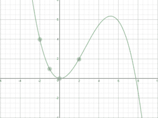
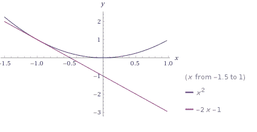
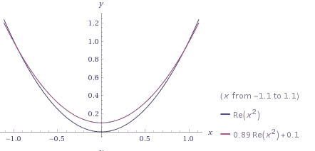

# 过拟合和欠拟合

> 原文： [https://machine-learning-course.readthedocs.io/en/latest/content/overview/overfitting.html](https://machine-learning-course.readthedocs.io/en/latest/content/overview/overfitting.html)

## 概述

使用机器学习时，有很多方法出错。 机器学习中最常见的一些问题是**过拟合**和**过拟合**。 为了理解这些概念，我们假设一个机器学习模型正在尝试学习对数字进行分类，并且可以访问一组训练数据和一组测试数据。

## 过拟合

当模型从训练数据中学到太多时，就会出现**过拟合**的情况，结果在实践中表现不佳。 这通常是由于模型过多地暴露于训练数据引起的。 对于数字分类示例，如果模型以这种方式过拟合，则可能是在误导的微小细节上出现，例如流浪标记表示特定数字。

当您查看图表中间时，估计值看起来不错，但是边缘的误差很大。 实际上，此误差并不总是出现在极端情况下，并且可能在任何地方弹出。 训练中的噪音可能会导致错误，如下图所示。

（使用 [https://www.desmos.com/calculator/dffnj2jbow](https://www.desmos.com/calculator/dffnj2jbow) 创建）

在此示例中，数据过拟合多项式。 所示的点对函数 y = x ^ 2 是正确的，但在这些点之外不能很好地近似函数。

## 欠拟合

如果模型没有从训练数据中学到足够的知识，则会遭受**欠拟合**的折磨，结果在实践中表现不佳。 与先前的想法形成直接对比，此问题是由于没有让模型从训练数据中学到足够的知识而引起的。 在数字分类示例中，如果训练集太小或模型没有足够的尝试从中学习，则训练集将无法挑选出数字的关键特征。

该估计的问题在人眼中很明显，该模型应该是非线性的，而只是一条简单的线。 在机器学习中，这可能是欠拟合的结果，该模型没有足够的训练数据来适应它，并且目前处于简单状态。

（使用 Wolfram Alpha 创建）

## 动机

找到合适的机器是机器学习中的核心问题之一。 甚至在担心特定方法之前都可以很好地掌握如何避免拟合问题，从而使模型步入正轨。 拥有合适的猎物心态，而不是花费更多的学习时间在模型上，是非常重要的。

## 代码

过拟合的示例代码显示了一些基于多项式插值的基本示例，试图找到图的方程。 在 [overfitting.py](https://github.com/machinelearningmindset/machine-learning-course/blob/master/code/overview/overfitting/overfitting.py) 文件中，您可以看到正在建模一个真实的函数，以及一些估计不准确的估计。

估计值代表过拟合和欠拟合。 对于过拟合，使用了更高次的多项式（x 求立方而不是平方）。 尽管所选点的数据相对接近，但它们之外还存在一些伪像。 但是，欠拟合的示例在许多方面甚至都无法达到精度。 欠拟合类似于在对二次函数建模时具有线性模型。 该模型在训练的点上效果很好，在这种情况下，该点用于线性估计，但在其他方面效果不佳。

## 总结

查看交叉验证和正则化部分，以获取有关如何避免机器学习模型过拟合的信息。 理想情况下，合适的外观如下所示：

（使用 Wolfram Alpha 创建）

当以任何能力使用机器学习时，经常会出现诸如过拟合之类的问题，并且掌握这一概念非常重要。 本节中的模块是整个仓库中最重要的模块之一，因为无论采用哪种实现，机器学习始终包括这些基础知识。

## 参考文献

1.  <https://machinelearningmastery.com/overfitting-and-underfitting-with-machine-learning-algorithms/>
1.  <https://medium.com/greyatom/what-is-underfitting-and-overfitting-in-machine-learning-and-how-to-deal-with-it-6803a989c76>
1.  <https://towardsdatascience.com/overfitting-vs-underfitting-a-conceptual-explanation-d94ee20ca7f9>