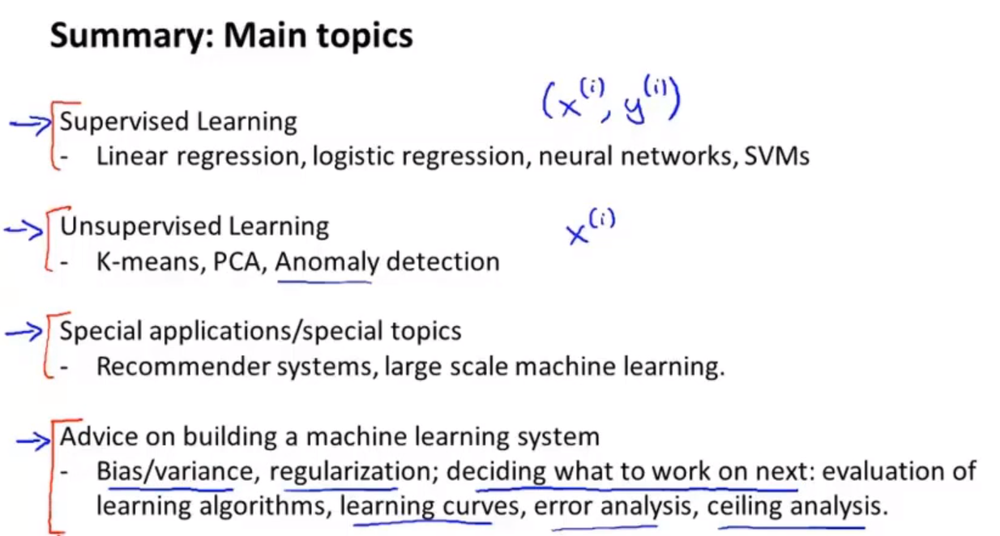

## 机器学习分类
* 有监督的学习：给出了正确答案
  * 回归问题：预测连续的数值输出。（输出是连续的，一条曲线）
  * 分类问题：预测离散的值输出。（输出局限于几个类别，有界离散的输出）
  * 影响分类问题的可能有多个特征多个属性

* 无监督的学习：只给出了数据集，没给出数据的特征和属性，也没给用这些数据来做什么，没给出数据的正确答案。目的是发现数据的内部结构。
  * 聚类问题：将相同主体的新闻聚集到一块。社交网络划分为不同的圈子。结果不是事先给出的，通过机器学习，发现数据的内部结构。

## 典型问题

* 房屋面积-房屋价格：回归问题
* 肿瘤大小、肿瘤年龄-肿瘤良性、肿瘤恶性：分类问题
* 谷歌新闻-相同主题：聚类问题。

用事件发生的频率 作为 事件发生的概率。本质上是一种机器学习。通过计算在此大小、年龄下恶性的概率，可以得到某些年龄段的的概率分布。与概率一一对应。

但机器学习，是不需要直接计算概率的。

## 涉及到的数学知识
<ul>
  <li><b>线性代数</b>：矩阵/张量乘法、求逆，奇异值分解/特征值分解，行列式，范数等</li>
  <li><b>统计与概率</b>：概率分布，独立性与贝叶斯，最大似然(MLE)和最大后验估计(MAP)等</li>
  <li><b>信息论</b>：基尼系数，熵(Entropy)等</li>
  <li><b>优化</b>：线性优化，非线性优化(凸优化/非凸优化)以及其衍生的求解方法如梯度下降、牛顿法、基因算法和模拟退火等</li>
  <li><b>数值计算</b>：上溢与下溢，平滑处理，计算稳定性(如矩阵求逆过程)</li>
  <li><b>微积分</b>：偏微分，链式法则，矩阵求导等</li>
</ul>

## 课程总结

