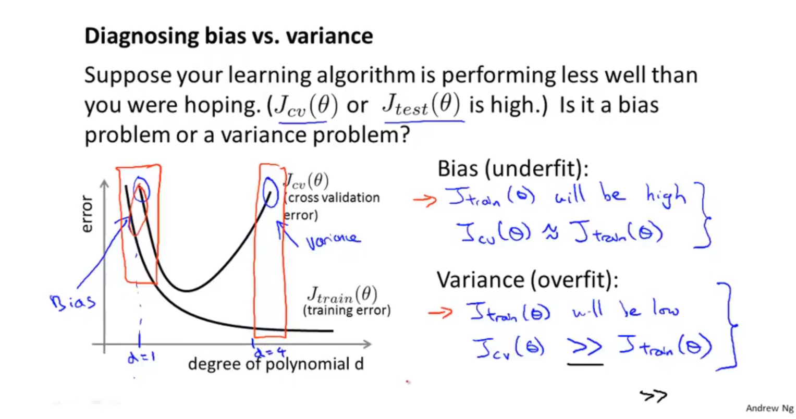
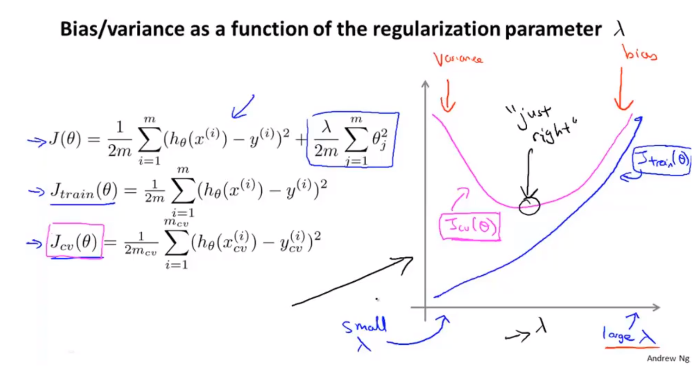
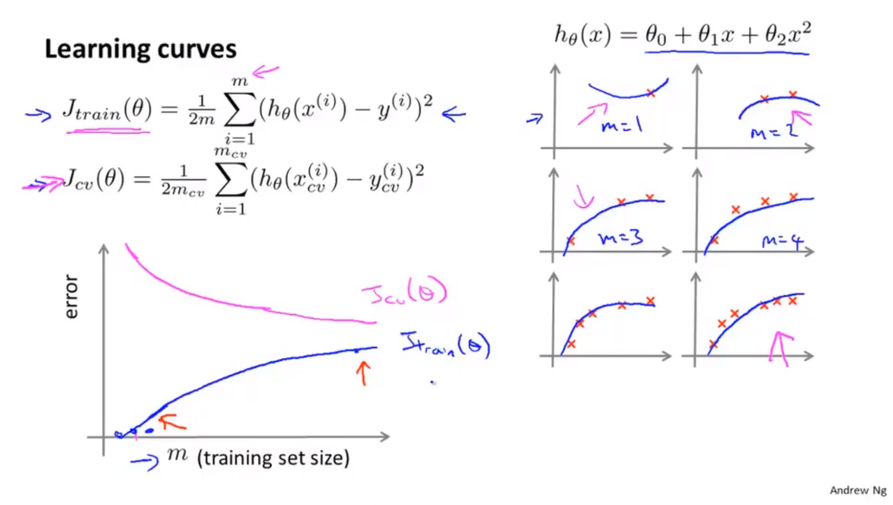
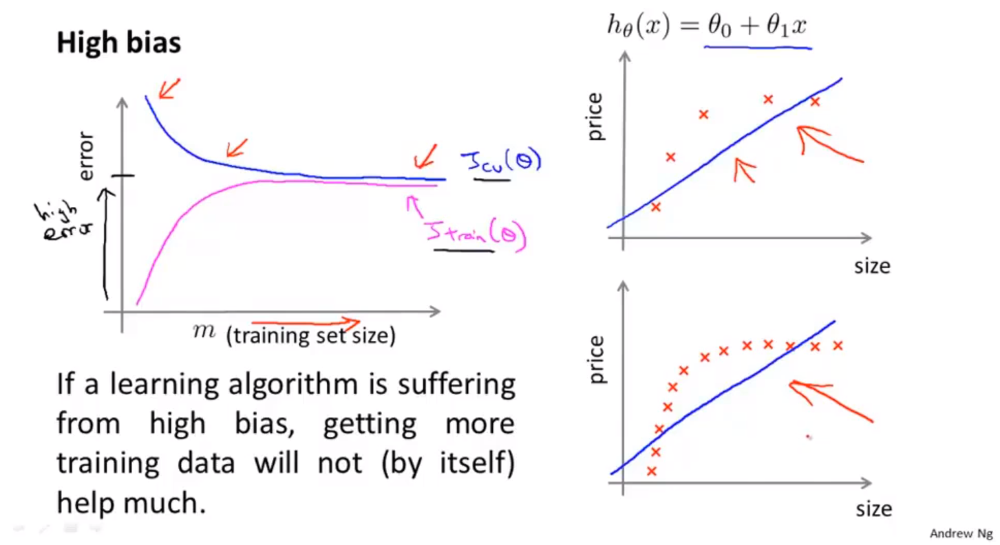
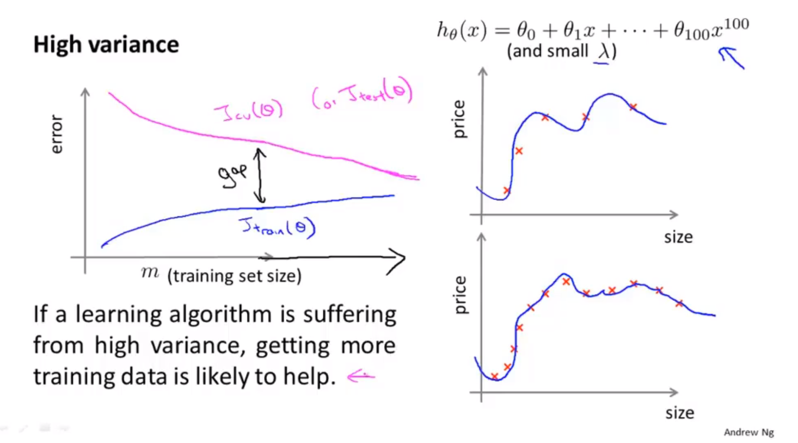
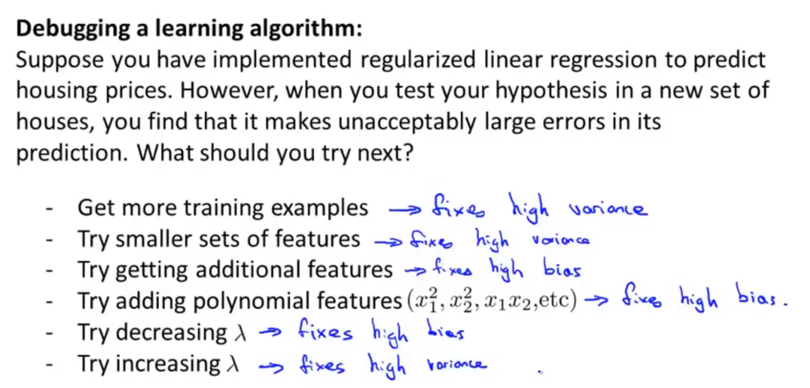

# 算法改进

## 提高算法的性能

* 使用测试集后，模型训练的效果比较差。
* 解决办法：
  * 使用更多的数据集进行训练。大部分情况下没有用。
  * 尝试选用更少的特征。
  * 添加更多的数据特征。
  * 添加多项式数据特征（交叉数据特征）
  * 修改正则化参数lambda的值。

## 评估假设

* 数据集分为训练集和测试集。7:3。
* 需要提前对数据进行随机化排列，然后进行训练集和测试集的划分。
* 然后计算测试集的均方误差。
* 对于分类问题可以，直接定义测试误差。

## 模型选择

* 数据集分为训练集、交叉验证集、测试集。6:2:2
* 假定多个不同的假设函数，使用交叉验证集，评估每一个假设函数训练出 的模型。选择效果最好的假设函数。
* 然后使用测试集对机器学习算法进行评估。
* 能够达到泛化误差的效果。

## 诊断偏差与方差

* 偏差较大，欠拟合。方差过大，过拟合。
* 当训练集与交叉验证集的误差都很高时，误差主要由偏差引起。
* 当训练集与交叉验证集的误差相差很大时，误差主要由方差引起，出现过拟合现象。

## 正则化与偏差和方差的关系

* 当正则化参数$\lambda$非常大时，会出现欠拟合的现象，此时代价函数的主要由参数引起，导致拟合过程中，训练参数无限制变小。
* 当正则参数$\lambda$非常小时，会出现过拟合的现象。此时代价函数的参数无法很好的缩小。导致拟合过程中，训练参数过大。
* 选择合适的正则化参数$\lambda$
  * 选取不同的$\lambda$进行尝试。
* $\lambda$对代价函数的影响

## 学习曲线

* 正常学习曲线。随着训练样本数量的增多，训练集的代价函数会逐渐增大，并存在一个近似的上界；交叉验证集的代价函数会逐渐减小，并存在一个近似的下界，因为模型本身的拟合程度会越来越好，由于模型本身引起的系统性偏差会逐渐变小。

* 高偏差学习曲线。随着样本数量的增多。训练集代价函数会增加，验证集代价函数会减小。二者的上下界都处于较高的位置。并且非常快的接近

* 高方差学习曲线。随着样本数量的增多。训练集代价函数会增加，验证集代价函数会减小。二者的上下界，随着样本数量的增加不会迅速接近。

## 算法改进的总结

* 对于神经网络。较少的隐藏层和隐藏层单元容易导致欠拟合。较多的隐藏层和隐藏层单元容易出现过拟合，并且计算量较大。
* 使用较多的隐藏层，并使用正则化方法来解决过拟合问题，可以得到更好的训练模型。