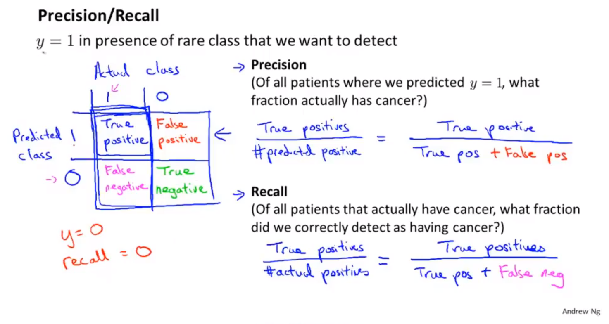

## 垃圾邮件分类系统

## 误差分析

### 机器学习实现的步骤

* 用最简单的算法快速实现机器学习过程。然后通过交叉验证数据集对模型进行测试。
* 画出学习曲线，通过检验误差，找出算法存在的高偏差、高方差问题。决定是否使用更多的数据和更多的特征。（不要过早的选择模型进行优化，应该首先对数据的特征进行分析。）
* 误差分析。通过分析错误数据，找到错误的原因，然后对机器学习算法进行改进。
* 数值估计。可以有效的改进机器学习算法。数值评估指标，来改进算法执行的效果。对数据进行特殊处理，例如只取邮件单词向量中单词前五个字母来训练数据。使用交叉验证错误率，来判断是否采取某项特殊处理。尝试各种不同的对算法的改进，然后使用交叉验证的方法，分析错误率的变化。

> 词干提取算法。
### 对算法的选择和改进
* 算法评估
* 误差分析

## 不对称分类的误差评估

### 偏斜类

* 一个类别中的数据与另外一个类别中的数据量相差很大。
* 使用不同的方法，衡量偏斜类分类问题的准确率。

### 查准率和召回率

* 查准率：预测真实真值/预测真值。
* 召回率：预测真实真值/真实真值

在数理统计中使用第一类错误和第二类错误来描述查准率和召回率。只有增加样本的数量才会同时降低第一类错误和第二类错误犯错的概率。
* 第一类错误，错误的拒绝，对应召回率。真实真值中，被拒绝的真值概率，是犯第一类错误的概率。
* 第二类错误，错误的接受，对应查准率。预测真值中，被接受的假值概率，是犯第二类错误的概率。

> 很多地方都可以使用数理统计中的相关知识，对模型的好坏进行评估。概率论与数理统计，本质上就是通过样本来评估总体的特征，与机器学习非常像，但是是通过统计学的方法实现了对总体特征的描述。

## 查准率和召回率的权衡
### F值来决定选择哪一个模型

$$
F = 2\frac{PR}{P+R}
$$

## 训练数据

* 大量数据能够有效的改善模型的准确度。
* 设计有大量隐藏层单元的神经网络（能够拟合十分复杂的模型，模型本身的偏差较小），然后用大量数据进行训练拟合。

