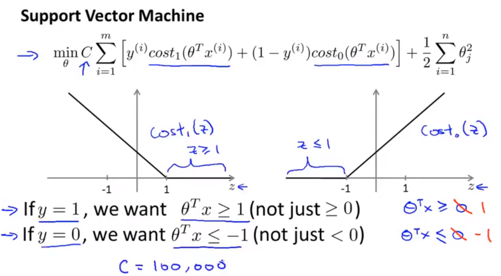
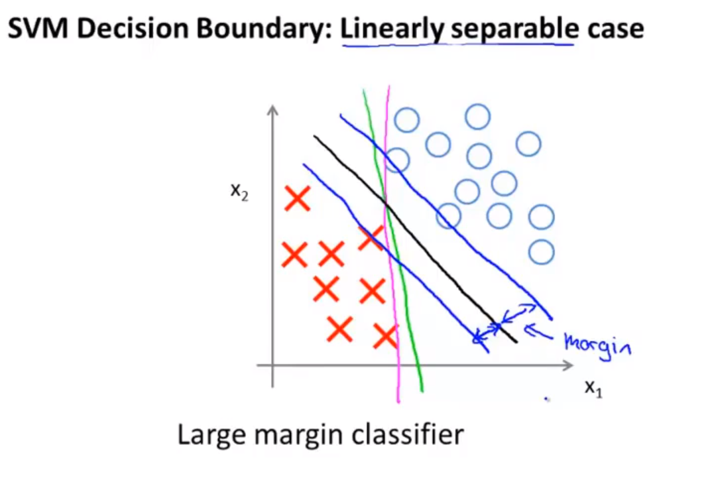
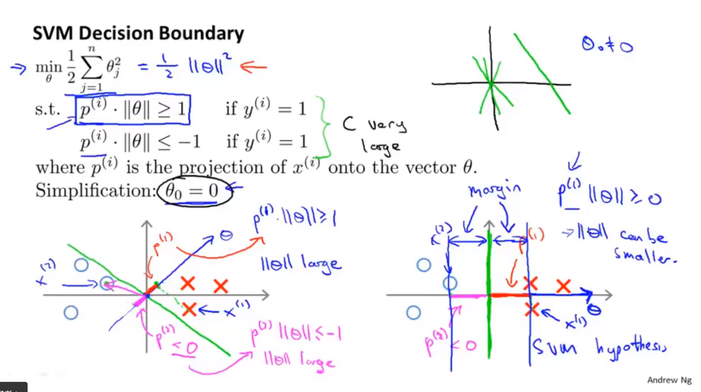
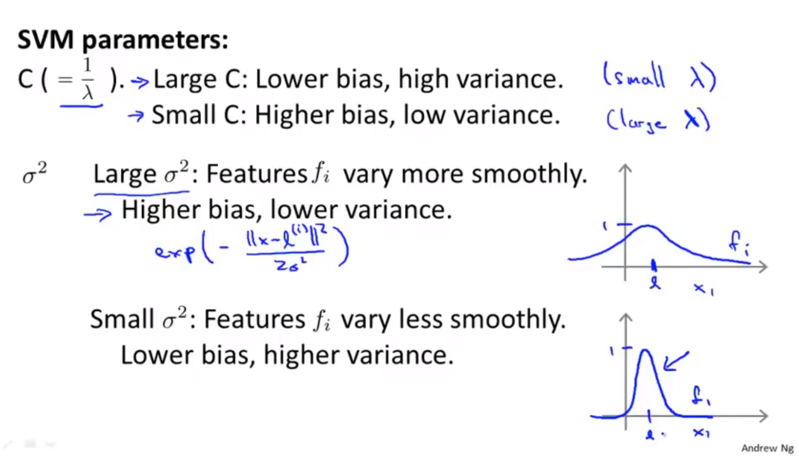
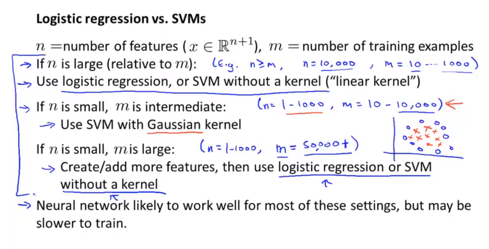

# 支持向量机

## 支持向量机的定义

* 逻辑回归的假设函数（sigmod）函数，将离散的分类，变成了连续的输出。建立与连续特征的函数关系。
* 支持向量机的假设函数，将sigmod非线性函数改为分段的线性函数。用来简化运算。

### 假设函数
* 支持向量机本身并没有给出假设函数。其本质上并不需要拟合出假设函数？不不不，支持向量机的假设函数
$$
h(\theta)=\theta^T * x
$$

## 代价函数
* 支持向量机的代价函数

$$
J(\theta) =C \sum_1^m(y^{(i)}cost_1(\theta^T*x)+(1-y^{(i)})cost_0(\theta^T*x))+\frac{1}{2}\sum_1^n\theta_j^2
\\
min (J(\theta))
$$

## 支持向量机的原理

* 大间距分类器。支持向量机会使得两个类别之间保持更大的安全距离。

* 参数C能够决定假设函数对数据的敏感程度。

## 大间距分类器的数学原理

* $\theta^T*x$可以看做两个向量的內积
* 这个值越大，说明x在$\theta$方向的投影p越大，这个值越小，说明x在$\theta$方向的投影越小（为赋值）。为了能找到最大投影差，一般会选择类别差距最大的$\theta$值，此时，决策边界，为$\theta$向量的垂直线。

## 核函数与支持向量机算法

> 主要介绍了核函数。高斯函数

* 目标：训练复杂的非线性判别边界。
* 主要包括两部分：参数向量和特征向量。
* 特征向量使用核函数来描述。

### 假设函数
$$
h(\theta)=\theta_0+\theta_1*f_1+\theta_2*f_2+\theta_3*f_3+\dots
$$
* f用来代理数据集的某个特征，这个特征可能是多项式一个项，也可能是更复杂的函数。
* f描述的特征可能是没有必要的，此时$\theta$可能是0

### 高斯核函数描述特征向量

* 选取三个点，作为特征的核。
* 然后以样本点为中心的高斯核函数作为新的特征。
* 定义相似度函数=高斯核函数（也可以等于其他的函数）
$$
f_i = similarity(x,l^{(i)}) \\= \exp(-\frac{||x-l||^2}{2\sigma^2})
$$

* 选取样本点作为相似度函数的中心。

### 使用核函数的支持向量机算法
> 支持向量机算法应该也可以不使用核函数。

* 给定样本
* 选取样本中的部分点，作为核函数的核心
* 最小化代价函数

$$
J(\theta) =C \sum_1^m(y^{(i)}cost_1(\theta^Tf)+(1-y^{(i)})cost_0(\theta^Tf))+\frac{1}{2}\sum_1^n\theta_j^2
\\
min (J(\theta))
$$

### 支持向量机的参数选择

## 使用SVM

使用SVM软件包解决SVM向量机的参数求解问题

* 选择合适的参数C
* 选择相似函数（内核函数）
  * 线性核函数（没有核函数）$\theta^T*x$
  * 高斯核函数（选择$\sigma$的值）$f_i= \exp(-\frac{||x-l||^2}{2\sigma^2})$(l是选择的特征点)
  * 多项式核函数$(x^T*l+constan)^degree$
  * string kernel，chi-square kernel，intersection kernel

### 逻辑回归与SVM选择

* 当n>m时，特征个数>训练样本数，使用逻辑回归或者线性内核的SVM

