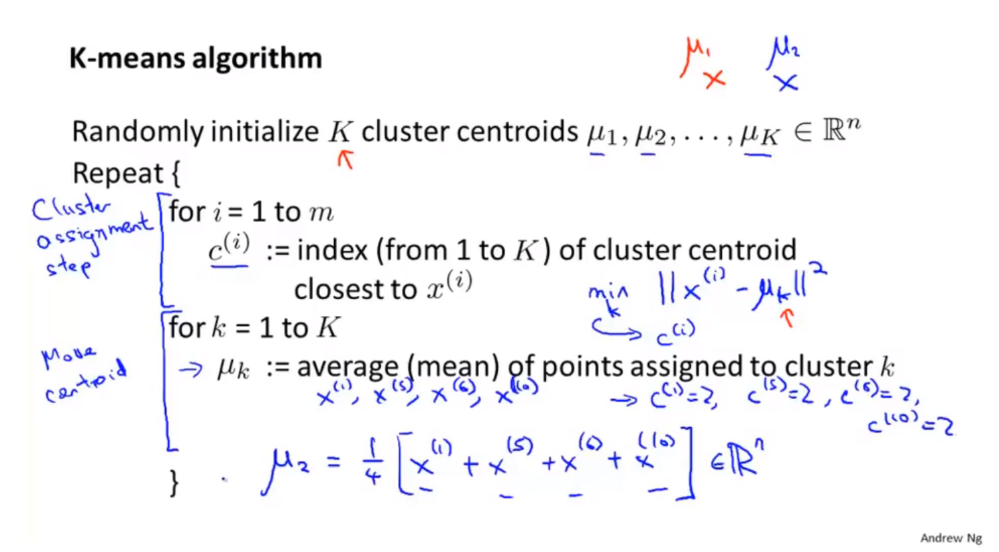
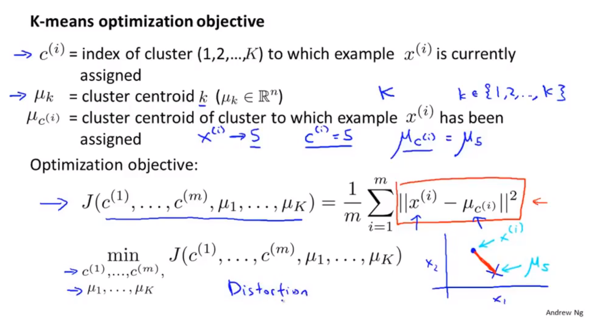

## 无监督学习

* 数据集只给出了特征没有给出标签
* 找到隐含在数据中的结构

### 聚类算法的用途

* 市场分割
* 社交网络分析
* 组织计算簇
* 了解银河系的构成

## kmeans聚簇

* 簇分配
* 移动聚类中心，到簇均值处（此时簇代价函数最小）

### kmeans算法的步骤

## 优化目标

* kmeans的代价函数

* $c^{(i)}$，第i个样本所属的簇
* $u_k$，第k簇的簇均值
* $u_{c^{(i)}}$，第i个样本所属的簇的簇均值

* 代价函数：所有样本到簇中心的距离均值。
$$
J = \frac{1}{m}\sum_i^m||x^{(i)}-\mu_{c^{(i)}}||^2\\
min J
$$

## 随机初始化

> 学习课程的算法演示，全部可以是自己构造的合适的数据，进行算法流程的模拟训练。具体的机器学习算法实践，专门开一个部分吧。

* 多次随机初始化，多次运行kmeans算法
* 对多次运行结果的聚类中心和代价函数进行保留，对比选取最小的结果。

## 聚类的数量

* 一般画出聚类样本的散点分布图，然后通过观察，手动决定聚类的数量。
* 肘部法则：尝试不同的K值，代价函数的变化，选取代价函数趋于平缓前的K值。
* 哪个聚类的数量能够更好的应用于后续目的。

