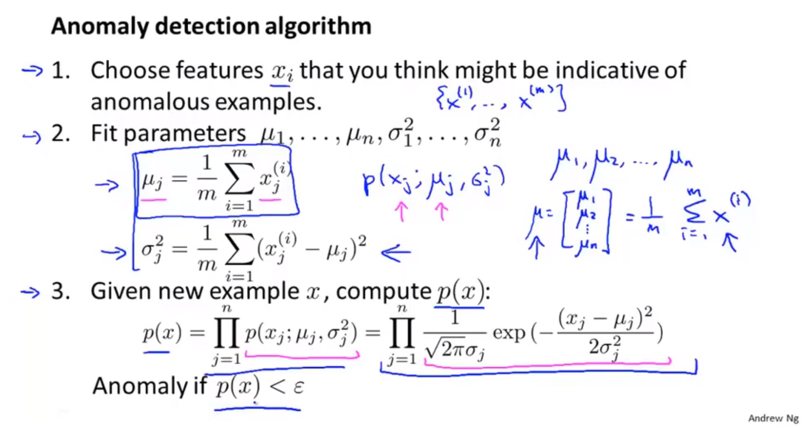
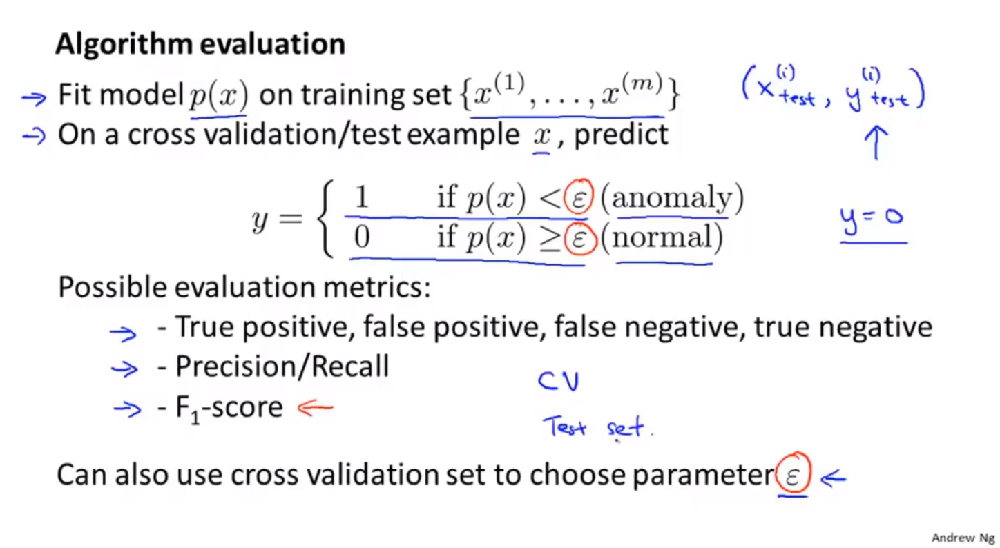
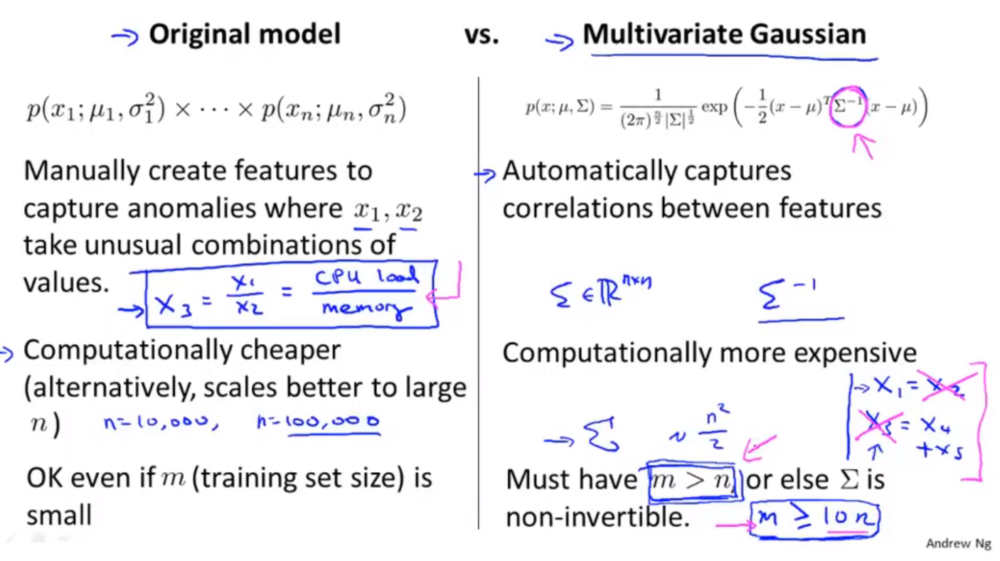

# 异常检测

## 异常检测动机

* 定义一个描述事件的特征向量
* 当事件发生的特征向量偏离正常事件的特征向量时，被认为是异常事件。

* 飞机引擎的各个参数，判断飞机引擎是否正常。
* 优点类似有监督学习，但是只给出了单侧数据集的标签。

## 高斯分布-正态分布

## 异常检测算法

* 首先使用极大似然法，假定样本的每一个参数符合正太分布，给出正太分布的模型。
* 然后将样本代入概率模型，计算每一个特征的分布概率，然后连乘。
* 设定以个边界值，当概率小于某个边界值的时候，表示样本数据不正常。
* 在这里假定样本的各个特征之间相互独立，连乘表示其联合概率密度。
> 并不是一种极其学习算法，而是一种简单的数据预处理算法，或者说统计学方法，通过统计学的计算，确定新给的样本是否存在问题，完成异常检测。

## 开发和评估异常检测系统

在开发机器学习系统的过程中，关键是做选择，而不是实现机器学习系统。应该学会选择特征、选择训练算法、选择预处理、选择错误检测算法的方法，通过组合现有的方法，达到一个比较好的效果。

使用高斯分布进行异常检测的过程中，只考虑了单个特征变量的分布，而没有考虑各个特征变量之间可能存在的关系。

1. 使用训练集，计算高维高斯分布模型。统计学方法。
2. 使用交叉验证集和测试集对模型进行验证和评估，评估的方法，使用犯第一类和第二类错误的概率。
3. 使用交叉验证集选择合适的参数。

## 异常检测VS监督学习

* 异常检测中通常具有很少量的正样本。大量的负样本。可以通过异常检测模型，描述正样本的特征。
* 监督学习中，通常包含大量的正样本和负样本，可以用来学习正负样本的特征。

## 选择异常检测算法要是用的特征

* 绘制数据的分布，通过对数据的处理，转换为高斯分布。
* 可以通过构造新的特征，来描述可能存在的异常值。

## 多变量高斯分布

* 当多个变量之间相互独立的时候，联合概率密度，即各个独立变量的概率密度的乘积。

$$
p(x;\mu;\Sigma)=\frac{1}{(2\pi)^{n/2}|\Sigma|^{1/2}} \exp{-\frac{1}{2}(x-\mu)^T\Sigma^{-1}(x-\mu)}
$$

* 当多个变量之间不独立的时候，使用协方差矩阵，表示各个变量之间的关系。
## 使用多变量高斯分布的异常检测

* 相比于之前的高斯分布异常检测，添加了随机变量之间的相关性，主要考虑线性相关性。协方差矩阵主要显示了随机变量之间的线性相关性
* 独立高斯分布与多元高斯分布进行一场检测的选择如下。

